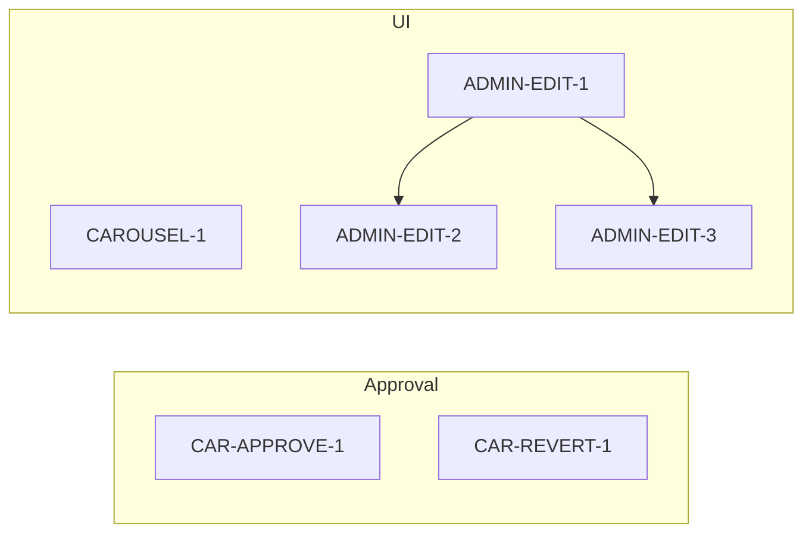

# Car Approval, Carousel Display, and Admin Edit Car

## Scope

- **Epic:** Car listing approval and admin tooling  
- **Stories:** 4 (car approval flow, one-time data revert, carousel display fix, admin edit-car access)

### Execution status (March 22, 2026)

✅ Admin approval enforcement shipped:

- **CAR-APPROVE-1**: new listings now default to `is_available: false` (commit `578dd3c`)
- **CAR-REVERT-1**: DB default set to `is_available=false` and existing pending-but-live cars disabled via migrations (commits `2b8c8a9`, `aded85e` merged via `f77b39a`)

Remaining:

- **CAROUSEL-1** (carousel letterboxing/full image) — pending
- **ADMIN-EDIT-1–3** (Edit Car access + navigation) — pending

---

## 1. New listings require admin approval

**Goal:** New cars created by hosts enter the Car Verification Queue and stay unavailable until an admin approves.

| Task              | Description                           | Acceptance criteria                                                                                                                         |
| ----------------- | ------------------------------------- | ------------------------------------------------------------------------------------------------------------------------------------------- |
| **CAR-APPROVE-1** | Set new listings to pending on create | In [src/pages/AddCar.tsx](src/pages/AddCar.tsx), change the `cars` insert so `is_available` is `false` instead of `true` (around line 192). |

**Implementation:** Single change in the `.insert({ ... })` call: `is_available: false`.

---

## 2. Revert 2026 auto-approved listings to pending

**Goal:** All cars created in 2026 that are currently available are set back to pending so they can be reviewed in the queue.

| Task             | Description                                  | Acceptance criteria                                                                                                                                                                                                  |
| ---------------- | -------------------------------------------- | -------------------------------------------------------------------------------------------------------------------------------------------------------------------------------------------------------------------- |
| **CAR-REVERT-1** | One-time migration: set 2026 cars to pending | Add a new Supabase migration (e.g. `supabase/migrations/YYYYMMDDHHMMSS_revert_2026_cars_to_pending.sql`) that runs: `UPDATE cars SET is_available = false WHERE created_at >= '2026-01-01' AND is_available = true;` |

**Implementation:** New SQL file in `supabase/migrations/`; use a timestamp prefix consistent with existing migrations (e.g. `20260216120000_revert_2026_cars_to_pending.sql`). Optional: add a short comment in the migration describing the one-time revert.

---

## 3. Carousel: full image with letterboxing (no crop)

**Goal:** Carousel shows the full image; when aspect ratio does not match the container, show letterboxing (e.g. black or theme bars) instead of cropping.

| Task           | Description                           | Acceptance criteria                                                                                                                                                                                                                                                                                                                                                                                                               |
| -------------- | ------------------------------------- | --------------------------------------------------------------------------------------------------------------------------------------------------------------------------------------------------------------------------------------------------------------------------------------------------------------------------------------------------------------------------------------------------------------------------------- |
| **CAROUSEL-1** | Use contain and letterbox in carousel | In [src/components/car-details/CarImageCarousel.tsx](src/components/car-details/CarImageCarousel.tsx): (1) Wrap each carousel image in a fixed-height container (e.g. `h-64`) with a background for letterboxing (e.g. `bg-muted` or `bg-black`), centered content. (2) Change the `` from `object-cover` to `object-contain` and constrain size (e.g. `max-w-full max-h-full object-contain`) so the full image is visible. |

**Implementation:** Replace the current `` with a wrapper div (fixed height, background, flex center) and an img with `object-contain` and max dimensions so the image scales inside the box.

---

## 4. Admin can open Edit Car page (Option A)

**Goal:** Admins can open the same Edit Car page as hosts to replace or manage images (CarForm + CarImageManager), without new UI. Access must be restricted to car owner or admin.

| Task             | Description                                    | Acceptance criteria                                                                                                                                                                                                                                                                                                                                                                                           |
| ---------------- | ---------------------------------------------- | ------------------------------------------------------------------------------------------------------------------------------------------------------------------------------------------------------------------------------------------------------------------------------------------------------------------------------------------------------------------------------------------------------------- |
| **ADMIN-EDIT-1** | Allow owner or admin on Edit Car page          | In [src/pages/EditCar.tsx](src/pages/EditCar.tsx): After loading the car (existing query), check that the current user is either the car’s `owner_id` or an admin (e.g. `useIsAdmin()`). If neither, redirect (e.g. to `/` or `/profile`) and optionally show a toast. Do not block owners; admins can edit any car.                                                                                          |
| **ADMIN-EDIT-2** | Add “Edit listing” from Car Verification Queue | In [src/components/admin/CarVerificationTable.tsx](src/components/admin/CarVerificationTable.tsx): Add an “Edit” (or “Edit listing”) button per row that navigates to `/edit-car/${car.id}` (e.g. using `useNavigate` from react-router-dom). Place it next to the existing Eye, Approve, Reject actions.                                                                                                     |
| **ADMIN-EDIT-3** | Add “Edit listing” from Car Management         | In [src/components/admin/CarManagementTable.tsx](src/components/admin/CarManagementTable.tsx): Add a second action (e.g. “Edit listing” link or button) that navigates to `/edit-car/${car.id}`. Keep the existing Edit icon that opens `CarEditDialog` for quick edits (metadata/availability). Use a clear label or tooltip so “Quick edit” (modal) vs “Edit listing” (full page with images) are distinct. |

**Implementation notes:**

- **EditCar access:** Use `useAuth().user?.id`, `useIsAdmin().isAdmin`, and the car query’s `owner_id`. Guard after car is loaded; show loading until then.
- **CarVerificationTable:** The Eye button currently has no `onClick`; optionally wire Eye to car details or leave as-is and only add Edit → `/edit-car/:id`.
- **CarManagementTable:** Table already has Edit (opens modal). Add a separate control (e.g. “Edit listing” or icon with tooltip) that calls `navigate(\`/edit-car/${car.id})`.

---

## 5. Optional follow-up (out of scope for this plan)

- **Duplicate AddCar/CreateCar:** Resolving the duplicate route/component (CreateCar stub vs AddCar) is separate; not required for approval or admin edit.
- **Cover image bug:** If a specific “wrong cover” issue is observed (e.g. wrong first slide), the fix may be ensuring `mainImageUrl` passed from [CarDetails](src/pages/CarDetails.tsx) matches `car.image_url` and that the first element in the carousel array is the intended main image; no change to CarImageCarousel logic beyond the display fix above.

---

## Dependency and order

- **CAR-APPROVE-1** and **CAR-REVERT-1** can be done in any order; run migration after deploying the AddCar change if you want new listings to be pending before reverting 2026 data.
- **CAROUSEL-1** is independent.
- **ADMIN-EDIT-1** should be done before or with **ADMIN-EDIT-2** and **ADMIN-EDIT-3** so that when admins use the new links, access control is already in place.

---

## Files to touch

| File                                                                                               | Changes                                      |
| -------------------------------------------------------------------------------------------------- | -------------------------------------------- |
| [src/pages/AddCar.tsx](src/pages/AddCar.tsx)                                                       | `is_available: false` on insert              |
| `supabase/migrations/YYYYMMDDHHMMSS_revert_2026_cars_to_pending.sql`                               | New migration: UPDATE cars for 2026          |
| [src/components/car-details/CarImageCarousel.tsx](src/components/car-details/CarImageCarousel.tsx) | Letterbox container + `object-contain`       |
| [src/pages/EditCar.tsx](src/pages/EditCar.tsx)                                                     | Owner or admin check; redirect otherwise     |
| [src/components/admin/CarVerificationTable.tsx](src/components/admin/CarVerificationTable.tsx)     | Edit button → navigate to `/edit-car/:id`    |
| [src/components/admin/CarManagementTable.tsx](src/components/admin/CarManagementTable.tsx)         | “Edit listing” → navigate to `/edit-car/:id` |

