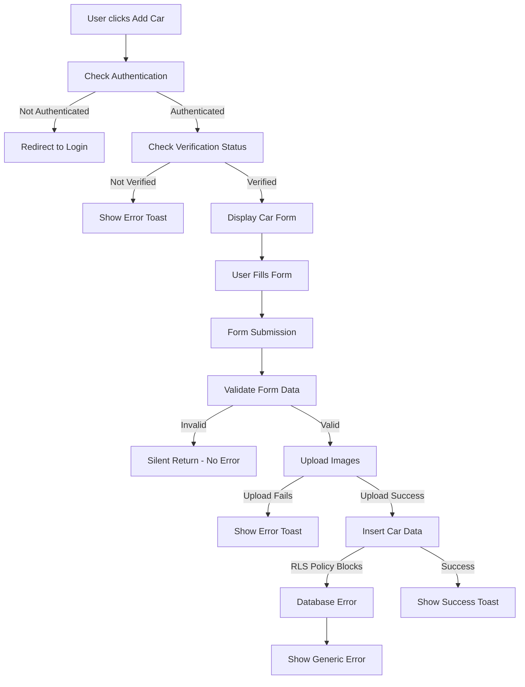

# Car Addition Failure Analysis Report

## 1. Executive Summary

The MobiRides platform is experiencing critical failures when users attempt to add cars to the system. Through comprehensive codebase analysis, the primary root cause has been identified as a **missing INSERT RLS (Row Level Security) policy** for the `cars` table in Supabase. This prevents authenticated users from successfully inserting car records, resulting in database permission errors and failed car submissions.

## 2. Technical Analysis

### 2.1 Car Addition Workflow

The car addition process follows this sequence:

1. **User Authentication Check** (`AddCar.tsx:47-52`)
   - Verifies user is authenticated via `supabase.auth.getUser()`
   - Redirects to login if not authenticated

2. **User Verification Status Check** (`AddCar.tsx:54-61`)
   - Queries user profile verification status
   - Blocks unverified users from adding cars

3. **Form Submission Process** (`AddCar.tsx:63-108`)
   - Validates form data (seats range 2-15)
   - Uploads images to `car-images` storage bucket
   - Inserts car data into `cars` table
   - Handles success/error notifications

### 2.2 Database Schema Requirements

The `cars` table schema (from `20230101000000_create_base_schema.sql:85-128`) requires:

```sql
CREATE TABLE IF NOT EXISTS public.cars (
    id UUID PRIMARY KEY DEFAULT uuid_generate_v4(),
    owner_id UUID NOT NULL REFERENCES public.profiles(id) ON DELETE CASCADE,
    brand TEXT NOT NULL,
    model TEXT NOT NULL,
    year INTEGER NOT NULL,
    vehicle_type vehicle_type NOT NULL,
    price_per_day DECIMAL(10,2) NOT NULL,
    location TEXT NOT NULL,
    latitude DECIMAL(10,6),
    longitude DECIMAL(10,6),
    transmission TEXT NOT NULL,
    fuel TEXT NOT NULL,
    seats INTEGER NOT NULL,
    description TEXT,
    image_url TEXT,
    is_available BOOLEAN DEFAULT true,
    features TEXT[] DEFAULT '{}',
    created_at TIMESTAMP WITH TIME ZONE DEFAULT NOW(),
    updated_at TIMESTAMP WITH TIME ZONE DEFAULT NOW()
);
```

### 2.3 Current RLS Policies Analysis

Existing RLS policies for `cars` table:

```sql
-- SELECT policies
CREATE POLICY "Anyone can view available cars"
ON public.cars FOR SELECT
USING (is_available = true);

CREATE POLICY "Hosts can manage their own cars"
ON public.cars FOR ALL
USING (auth.uid() = owner_id);

-- Admin policies (added later)
CREATE POLICY "Admins can view all cars" 
ON public.cars FOR SELECT 
USING (public.is_admin(auth.uid()));

CREATE POLICY "Admins can update all cars" 
ON public.cars FOR UPDATE 
USING (public.is_admin(auth.uid()));
```

**CRITICAL FINDING**: No specific INSERT policy exists for regular users to create cars.

## 3. Identified Error Points

### 3.1 Primary Error Point: Missing INSERT RLS Policy

**Issue**: The `cars` table lacks a dedicated INSERT policy for authenticated users.

**Impact**: 
- `supabase.from("cars").insert(carData)` calls fail with permission denied errors
- Users cannot add cars despite being authenticated and verified
- Error occurs at database level before reaching application logic

**Evidence**: Regex search for `CREATE POLICY.*cars.*INSERT` returned no results, confirming missing INSERT policy.

### 3.2 Secondary Error Points

#### 3.2.1 Form Validation Failures
- **Location**: `CarForm.tsx:95-98`
- **Issue**: Seats validation (2-15 range) may silently fail without user feedback
- **Code**: 
```typescript
if (formData.seats < 2 || formData.seats > 15) {
  return; // Silent failure - no error message
}
```

#### 3.2.2 Image Upload Dependencies
- **Location**: `AddCar.tsx:78-87`
- **Issue**: Car insertion depends on successful image upload to `car-images` bucket
- **Risk**: Storage permission issues could cascade to car creation failures

#### 3.2.3 User Verification Blocking
- **Location**: `AddCar.tsx:54-61`
- **Issue**: Unverified users are blocked from car addition
- **Behavior**: Shows toast notification but may not clearly indicate verification requirement

## 4. System Behavior Documentation

### 4.1 Current Car Addition Flow



### 4.2 Error Handling Mechanisms

1. **Authentication Errors**: Handled via redirect to login page
2. **Verification Errors**: Toast notification with verification requirement
3. **Upload Errors**: Caught and displayed via toast system
4. **Database Errors**: Generic error handling in catch block
5. **Validation Errors**: Silent failures (problematic)

### 4.3 User Feedback System

The application uses a toast notification system for user feedback:
- Success: "Car added successfully!"
- Error: "Failed to add car. Please try again."
- Verification: Custom verification requirement message

## 5. Root Cause Analysis

### 5.1 Primary Root Cause

**Missing INSERT RLS Policy for Cars Table**

- **Severity**: Critical
- **Impact**: Complete failure of car addition functionality
- **Cause**: Database security configuration oversight
- **Solution Required**: Create appropriate INSERT policy

### 5.2 Secondary Contributing Factors

1. **Inadequate Error Logging**
   - Generic error messages don't reveal RLS policy issues
   - Difficult to diagnose permission problems

2. **Silent Form Validation Failures**
   - Seats validation fails silently
   - Users receive no feedback on validation errors

3. **Storage Dependency Chain**
   - Car creation tightly coupled to image upload success
   - Single point of failure in the workflow

## 6. Potential Solutions

### 6.1 Immediate Fixes Required

#### 6.1.1 Create INSERT RLS Policy

```sql
-- Allow authenticated users to insert cars they own
CREATE POLICY "Users can create their own cars"
ON public.cars FOR INSERT
WITH CHECK (auth.uid() = owner_id);
```

#### 6.1.2 Enhance Form Validation Feedback

```typescript
// Replace silent validation failure
if (formData.seats < 2 || formData.seats > 15) {
  toast({
    title: "Validation Error",
    description: "Number of seats must be between 2 and 15",
    variant: "destructive"
  });
  return;
}
```

#### 6.1.3 Improve Error Logging

```typescript
// Enhanced error handling
catch (error) {
  console.error('Car addition failed:', error);
  toast({
    title: "Error",
    description: error.message || "Failed to add car. Please try again.",
    variant: "destructive"
  });
}
```

### 6.2 Storage Bucket Verification

Ensure `car-images` storage bucket has proper permissions:

```sql
-- Verify bucket policies
SELECT * FROM storage.buckets WHERE name = 'car-images';
SELECT * FROM storage.policies WHERE bucket_id = 'car-images';
```

## 7. Implementation Recommendations

### 7.1 Immediate Actions (Priority 1)

1. **Deploy INSERT RLS Policy**
   - Create and test the missing INSERT policy
   - Verify policy allows authenticated users to create cars
   - Test with different user roles

2. **Fix Silent Validation Failures**
   - Add proper error messages for all validation failures
   - Ensure user receives clear feedback

3. **Enhance Error Logging**
   - Log detailed error information for debugging
   - Implement structured error reporting

### 7.2 Short-term Improvements (Priority 2)

1. **Decouple Image Upload**
   - Allow car creation without immediate image requirement
   - Implement image upload as separate step

2. **Add Comprehensive Testing**
   - Unit tests for form validation
   - Integration tests for car creation workflow
   - RLS policy testing

3. **Improve User Experience**
   - Better loading states during submission
   - Progress indicators for multi-step process
   - Clear error recovery guidance

### 7.3 Testing Procedures

1. **RLS Policy Testing**
   ```sql
   -- Test as authenticated user
   SET ROLE authenticated;
   INSERT INTO cars (owner_id, brand, model, year, vehicle_type, price_per_day, location, transmission, fuel, seats)
   VALUES (auth.uid(), 'Toyota', 'Camry', 2020, 'sedan', 50.00, 'Gaborone', 'automatic', 'petrol', 5);
   ```

2. **Frontend Integration Testing**
   - Test complete car addition workflow
   - Verify error handling for each failure point
   - Confirm success path functionality

3. **User Acceptance Testing**
   - Test with verified and unverified users
   - Validate error messages are user-friendly
   - Ensure successful car creation flow

### 7.4 Monitoring and Logging

1. **Database Monitoring**
   - Track INSERT failures on cars table
   - Monitor RLS policy performance
   - Alert on permission denied errors

2. **Application Monitoring**
   - Log car creation attempts and outcomes
   - Track user verification status issues
   - Monitor image upload success rates

3. **User Experience Metrics**
   - Measure car addition completion rates
   - Track user drop-off points
   - Monitor error recovery success

## 8. Conclusion

The car addition failure is primarily caused by a missing INSERT RLS policy for the `cars` table, preventing authenticated users from creating car records. This critical database security oversight, combined with inadequate error handling and silent validation failures, creates a poor user experience and complete functionality breakdown.

Immediate implementation of the recommended INSERT RLS policy will resolve the primary issue, while the additional improvements will enhance overall system reliability and user experience. The proposed solutions address both the immediate technical problem and the underlying system design issues that contributed to the failure.