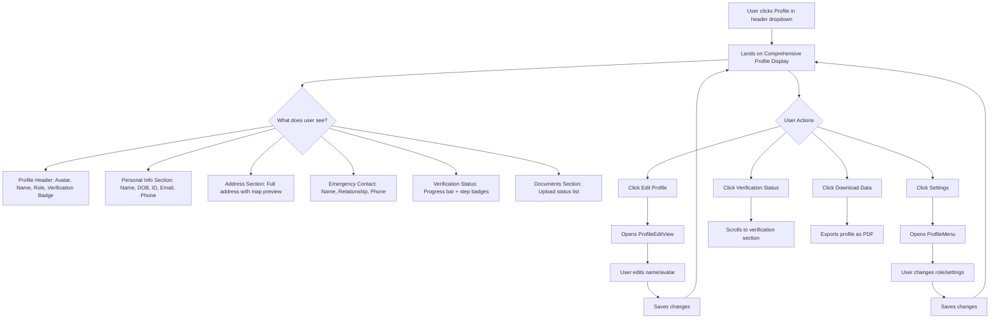

# EPIC 1 Enhancement: Comprehensive Profile Display
## Full User Verification Data Integration

**Document Version:** 1.0  
**Date Created:** October 15, 2025  
**Status:** 📋 Planning  
**Priority:** High  
**Epic:** EPIC 1 - User Authentication & Profile Management  
**Related EPICs:** EPIC 2 - Identity Verification System

---

## Executive Summary

### Problem Statement
The MobiRides platform currently has a **transparency gap** between the extensive personal data collected during the KYC verification process and what is actually displayed to users on their profile page.

**Current Profile Display:**
- Avatar/Profile Picture ✓
- Full Name (editable) ✓
- Phone Number (display only) ✓
- User Role (renter/host) ✓

**Missing from Profile (but collected during verification):**
- Date of Birth ✗
- National ID Number ✗
- Email Address ✗
- Complete Address (Street, Area, City, Postal Code) ✗
- Emergency Contact Details (Name, Relationship, Phone) ✗
- Document Upload Status ✗
- Verification Progress Status ✗

### Business Impact
- **User Trust:** Users cannot see what data the platform has collected from them
- **Compliance Risk:** GDPR and data privacy regulations require transparency
- **User Experience:** Incomplete profile view after extensive verification process
- **Support Burden:** Users contact support to verify what information is stored

### Proposed Solution
Transform the `/profile` page from a simple settings menu into a **comprehensive profile display** that shows all user information collected during verification, organized into logical, privacy-respecting sections.

### Expected Benefits
1. **Transparency:** Users see all their stored information in one place
2. **Trust Building:** Clear verification status displays build platform confidence
3. **Self-Service:** Users can verify their own data without contacting support
4. **Compliance:** Meets GDPR right-to-access requirements
5. **Professional UX:** Modern, organized profile presentation

---

## Current State Analysis

### Data Architecture

#### Profiles Table (Basic Information)
```sql
-- Stored in public.profiles
- id (uuid) - References auth.users
- full_name (text)
- phone_number (text)
- avatar_url (text)
- role (text) - 'renter' or 'host'
- emergency_contact_name (text) - NOT displayed
- emergency_contact_phone (text) - NOT displayed
- created_at (timestamp)
- updated_at (timestamp)
```

#### User Verifications Table (Detailed Personal Info)
```sql
-- Stored in public.user_verifications
- id (uuid)
- user_id (uuid)
- personal_info (jsonb) - Contains:
  {
    fullName: string,
    dateOfBirth: string,
    nationalIdNumber: string,
    phoneNumber: string,
    email: string,
    address: {
      street: string,
      area: string,
      city: string,
      postalCode: string
    },
    emergencyContact: {
      name: string,
      relationship: string,
      phoneNumber: string
    }
  }
- current_step (text)
- overall_status (text)
- personal_info_completed (boolean)
- documents_completed (boolean)
- selfie_completed (boolean)
- phone_verified (boolean)
- address_confirmed (boolean)
- completed_at (timestamp)
```

#### Document Storage
```
Supabase Storage Buckets:
- avatars/ (public)
- verification-documents/ (private)
  - national_id_front
  - national_id_back
  - driving_license_front
  - driving_license_back
  - proof_of_address
  - proof_of_income
  - selfie_photo
```

### Current User Experience Gap

**User Journey Problem:**
1. User completes extensive KYC verification (15-20 minutes)
2. Provides: DOB, National ID, Address, Emergency Contact, 7+ documents
3. Navigates to profile page
4. Sees: Only name, phone, and avatar
5. **Confusion:** "Where is all my information? Was it saved?"

**Support Impact:**
- Users contact support asking "Did my verification work?"
- Users request data deletion without knowing what's stored
- Trust issues when information isn't visible

---

## Implementation Strategy

### Architecture Overview

```
/profile Route
├── ProfileDisplay.tsx (NEW - Default View)
│   ├── ProfileHeader
│   ├── PersonalInfoSection
│   ├── AddressSection
│   ├── EmergencyContactSection
│   ├── VerificationStatusSection
│   ├── DocumentsSection
│   └── QuickActionsBar
│
├── ProfileEditView.tsx (EXISTING - Edit Mode)
├── RoleEditView.tsx (EXISTING - Role Management)
└── ProfileMenu.tsx (EXISTING - Settings Menu)
```

### Phase 1: Core Components (Week 1)

#### 1.1 Create useFullProfile Hook
**File:** `src/hooks/useFullProfile.ts`

```typescript
export const useFullProfile = () => {
  const { user } = useAuth();
  
  return useQuery({
    queryKey: ['full-profile', user?.id],
    queryFn: async () => {
      // Fetch from multiple sources
      const [profileData, verificationData] = await Promise.all([
        supabase.from('profiles').select('*').eq('id', user.id).single(),
        supabase.from('user_verifications').select('*').eq('user_id', user.id).single()
      ]);
      
      // Combine and return FullProfileData
      return {
        email: user.email,
        userId: user.id,
        fullName: profileData.full_name,
        phoneNumber: profileData.phone_number,
        avatarUrl: profileData.avatar_url,
        role: profileData.role,
        emergencyContactName: profileData.emergency_contact_name,
        emergencyContactPhone: profileData.emergency_contact_phone,
        // Parse JSONB personal_info
        dateOfBirth: verificationData.personal_info?.dateOfBirth,
        nationalIdNumber: verificationData.personal_info?.nationalIdNumber,
        address: verificationData.personal_info?.address,
        emergencyContactRelationship: verificationData.personal_info?.emergencyContact?.relationship,
        verificationStatus: verificationData.overall_status,
        verificationSteps: {
          personalInfo: verificationData.personal_info_completed,
          documents: verificationData.documents_completed,
          selfie: verificationData.selfie_completed,
          phone: verificationData.phone_verified,
          address: verificationData.address_confirmed
        },
        completedAt: verificationData.completed_at
      };
    },
    enabled: !!user?.id
  });
};
```

#### 1.2 Create Main ProfileDisplay Component
**File:** `src/components/profile/ProfileDisplay.tsx`

**Responsibilities:**
- Layout orchestration
- View state management (display vs. edit modes)
- Quick actions bar
- Responsive grid layout

**Key Features:**
- Mobile-first responsive design
- Card-based section layout
- Collapsible sections on mobile
- Sticky header with avatar and name

#### 1.3 Update Profile.tsx Router
**File:** `src/pages/Profile.tsx`

```typescript
const [activeView, setActiveView] = useState<'display' | 'edit' | 'role' | 'menu'>('display');

return (
  <div className="container mx-auto px-4 py-8 pb-20">
    {activeView === 'display' && (
      <ProfileDisplay onEdit={() => setActiveView('edit')} />
    )}
    {activeView === 'edit' && (
      <ProfileEditView onBack={() => setActiveView('display')} />
    )}
    {activeView === 'role' && (
      <RoleEditView onBack={() => setActiveView('display')} />
    )}
    {activeView === 'menu' && (
      <ProfileMenu onBack={() => setActiveView('display')} />
    )}
  </div>
);
```

### Phase 2: Section Components (Week 2)

#### 2.1 Personal Information Section
**File:** `src/components/profile/sections/PersonalInfoSection.tsx`

**Displays:**
- Full Name (with edit icon)
- Date of Birth (formatted: "January 15, 1990")
- National ID (masked: "****5678")
- Email Address
- Phone Number (with country code)

**Design:**
- Card component with icon header
- Two-column grid on desktop
- Single column on mobile
- Subtle background for verified fields

#### 2.2 Address Section
**File:** `src/components/profile/sections/AddressSection.tsx`

**Displays:**
- Street Address
- Area/Neighborhood
- City
- Postal Code (optional)
- Map preview (if coordinates available)

**Features:**
- Formatted as readable address
- "View on Map" link
- Copy address button

#### 2.3 Emergency Contact Section
**File:** `src/components/profile/sections/EmergencyContactSection.tsx`

**Displays:**
- Contact Name
- Relationship (e.g., "Spouse", "Parent", "Sibling")
- Phone Number (with call button)

**Privacy:**
- Masked by default
- "Show Details" button to reveal

#### 2.4 Verification Status Section
**File:** `src/components/profile/sections/VerificationStatusSection.tsx`

**Displays:**
- Overall verification status badge
- Progress bar (e.g., "4/5 steps completed")
- Status badges for each step:
  - ✅ Personal Information - Verified
  - ✅ Documents Uploaded - Verified
  - ✅ Selfie Verification - Verified
  - ✅ Phone Verified - Verified
  - ⏳ Address Confirmation - Pending

**Features:**
- Color-coded status (green=verified, yellow=pending, red=rejected)
- "Complete Verification" CTA if incomplete
- Completion date display

#### 2.5 Documents Section
**File:** `src/components/profile/sections/DocumentsSection.tsx`

**Displays:**
- List of uploaded documents:
  - National ID (Front) - Verified ✅
  - National ID (Back) - Verified ✅
  - Driving License (Front) - Verified ✅
  - Driving License (Back) - Verified ✅
  - Proof of Address - Pending ⏳
  - Proof of Income - Verified ✅
  - Selfie Photo - Verified ✅

**Features:**
- Status badge for each document
- Upload date
- "Re-upload" option for rejected documents
- NO document preview (privacy)

### Phase 3: Quick Actions & Polish (Week 3)

#### 3.1 Quick Actions Bar
**Component:** `QuickActionsBar` (inside ProfileDisplay.tsx)

**Actions:**
- Edit Profile (pencil icon) → Opens ProfileEditView
- Settings (gear icon) → Opens ProfileMenu
- Verification Status (shield icon) → Scrolls to verification section
- Download Data (download icon) → Exports profile data as PDF

**Design:**
- Floating action bar on mobile
- Button row on desktop
- Tooltips on hover

#### 3.2 Data Privacy Features

**Sensitive Data Masking:**
```typescript
const maskNationalId = (id: string) => {
  if (!id) return 'Not provided';
  return `****${id.slice(-4)}`;
};

const maskEmergencyContact = (show: boolean, data: string) => {
  return show ? data : '••••••••••';
};
```

**Verification Badge Component:**
```typescript
<Badge variant={status === 'verified' ? 'success' : 'warning'}>
  {status === 'verified' && <CheckCircle className="w-4 h-4 mr-1" />}
  {status === 'pending' && <Clock className="w-4 h-4 mr-1" />}
  {status === 'rejected' && <XCircle className="w-4 h-4 mr-1" />}
  {statusLabel}
</Badge>
```

#### 3.3 Responsive Design Specifications

**Mobile (< 768px):**
- Single column layout
- Collapsible sections with accordion
- Sticky header with avatar
- Floating action button for quick actions
- Bottom navigation bar

**Tablet (768px - 1024px):**
- Two-column grid for sections
- Expanded header with stats
- Side-by-side action buttons

**Desktop (> 1024px):**
- Three-column grid option
- Sidebar navigation
- Full-width header with profile banner
- Inline editing capabilities

### Phase 4: Integration & Testing (Week 4)

#### 4.1 RLS Policy Verification
Ensure users can access their own verification data:

```sql
-- Verify policy allows user to read their own verification data
CREATE POLICY "Users can view their own verification data"
ON user_verifications
FOR SELECT
USING (user_id = auth.uid());
```

#### 4.2 Error Handling
- Loading states for each section
- Empty states for incomplete verification
- Error boundaries for failed data fetches
- Retry mechanisms

#### 4.3 Performance Optimization
- Lazy load document status
- Cache verification data with React Query
- Optimize JSONB queries
- Image lazy loading for avatar

---

## Technical Specifications

### TypeScript Interfaces

```typescript
interface FullProfileData {
  // Authentication
  email: string;
  userId: string;
  
  // Basic Profile (from profiles table)
  fullName: string;
  phoneNumber: string;
  avatarUrl: string;
  role: 'renter' | 'host';
  emergencyContactName: string;
  emergencyContactPhone: string;
  
  // Verification Data (from user_verifications.personal_info JSONB)
  dateOfBirth?: string;
  nationalIdNumber?: string;
  address?: {
    street: string;
    area: string;
    city: string;
    postalCode?: string;
  };
  emergencyContactRelationship?: string;
  
  // Verification Status
  verificationStatus: 'not_started' | 'in_progress' | 'completed' | 'rejected';
  verificationSteps: {
    personalInfo: boolean;
    documents: boolean;
    selfie: boolean;
    phone: boolean;
    address: boolean;
  };
  completedAt?: string;
}

interface DocumentStatus {
  type: DocumentType;
  status: 'pending' | 'verified' | 'rejected';
  uploadedAt?: string;
  rejectionReason?: string;
}

interface VerificationBadgeProps {
  status: 'verified' | 'pending' | 'rejected';
  label: string;
  completedAt?: string;
}
```

### Component File Structure

```
src/
├── components/
│   └── profile/
│       ├── ProfileDisplay.tsx           (Main display component)
│       ├── sections/
│       │   ├── PersonalInfoSection.tsx
│       │   ├── AddressSection.tsx
│       │   ├── EmergencyContactSection.tsx
│       │   ├── VerificationStatusSection.tsx
│       │   └── DocumentsSection.tsx
│       ├── ProfileEditView.tsx          (EXISTING)
│       ├── RoleEditView.tsx             (EXISTING)
│       └── ProfileMenu.tsx              (EXISTING)
│
├── hooks/
│   └── useFullProfile.ts                (Data fetching hook)
│
└── pages/
    └── Profile.tsx                      (Router component)
```

### Styling Guidelines

**Design Tokens (from index.css):**
```css
/* Use semantic tokens, not direct colors */
--background: /* Main background */
--card: /* Card backgrounds */
--border: /* Border colors */
--muted: /* Muted text */
--accent: /* Accent highlights */

/* Verification status colors */
--success: /* Green for verified */
--warning: /* Yellow for pending */
--destructive: /* Red for rejected */
```

**Component Styling:**
- Use `bg-card` for section cards
- Use `border-border` for borders
- Use `text-muted-foreground` for secondary text
- Use `bg-accent` for highlighted items

---

## Security & Privacy Considerations

### Data Masking Rules

1. **National ID Number:**
   - Show: Last 4 digits only
   - Format: `****5678`
   - Full number: Never display in UI

2. **Emergency Contact (Optional Masking):**
   - Default: Hidden behind "Show Details" button
   - Reason: Privacy when sharing screen

3. **Date of Birth:**
   - Show: Full date
   - Format: "January 15, 1990" (readable format)

4. **Documents:**
   - Show: Upload status only
   - Never: Display actual document images
   - Action: "View in Secure Portal" (future feature)

### RLS Policy Requirements

```sql
-- Users must only access their own data
CREATE POLICY "Users view own profile"
ON profiles FOR SELECT
USING (id = auth.uid());

CREATE POLICY "Users view own verification"
ON user_verifications FOR SELECT
USING (user_id = auth.uid());

-- Admin access for support (separate policy)
CREATE POLICY "Admins view all verifications"
ON user_verifications FOR SELECT
USING (is_admin(auth.uid()));
```

### GDPR Compliance

**Right to Access:**
- ✅ Users can view all collected personal data
- ✅ Clear display of verification status
- ✅ Document upload history visible

**Right to Rectification:**
- ✅ Edit Profile button for basic info
- 🔄 Document re-upload for corrections

**Right to Erasure:**
- 🔄 "Delete Account" option (future feature)
- Must handle verification data deletion

---

## User Experience Flow

### Primary User Journey



### Mobile Navigation Flow

```
Header Dropdown → Profile
    ↓
[Sticky Header: Avatar + Name]
    ↓
[Personal Info Card]
[Address Card]
[Emergency Contact Card]
[Verification Status Card]
[Documents Card]
    ↓
[Floating Action Button: Edit/Settings]
    ↓
[Bottom Navigation Bar]
```

### Edit Mode Flow

```
Profile Display → Click "Edit Profile" button
    ↓
ProfileEditView (existing component)
    ↓
User edits: Name, Avatar, Phone
    ↓
Click "Save Changes"
    ↓
Returns to Profile Display (updated data)
```

---

## Benefits & Success Metrics

### User Benefits

1. **Transparency**
   - See all collected personal data
   - Understand what the platform stores
   - Verify information accuracy

2. **Trust Building**
   - Verification status clearly displayed
   - Progress tracking for incomplete verifications
   - Professional, organized presentation

3. **Self-Service**
   - No need to contact support to verify stored data
   - Easy access to edit basic information
   - Clear path to complete verification

4. **Control**
   - Quick access to settings
   - Edit profile functionality
   - Future: Data export capability

5. **Compliance**
   - GDPR right-to-access fulfilled
   - Clear audit trail of verification status
   - Document upload history visible

### Business Benefits

1. **Reduced Support Load**
   - Fewer "Is my data saved?" inquiries
   - Self-service verification status checks
   - Clear error messages for failed verifications

2. **Increased Trust**
   - Professional profile display
   - Verification transparency
   - Clear data handling practices

3. **Compliance**
   - GDPR compliance for right-to-access
   - Audit-ready verification records
   - Clear consent tracking

4. **User Retention**
   - Better user experience post-verification
   - Reduced confusion and frustration
   - Higher platform confidence

### Success Metrics (Post-Implementation)

**Quantitative:**
- 📊 50% reduction in support tickets about "stored data"
- 📊 80% of verified users view their profile within first week
- 📊 30% increase in verification completion rate (due to clear progress tracking)
- 📊 Average time on profile page: 2+ minutes (vs. current <30 seconds)

**Qualitative:**
- ⭐ User feedback: "I can see all my information"
- ⭐ Support team: "Fewer basic data verification questions"
- ⭐ Trust metrics: Increased user confidence scores

---

## Implementation Timeline

### Week 1: Foundation (October 15-21, 2025)
**Focus:** Core infrastructure and data layer

- [ ] Day 1-2: Create `useFullProfile.ts` hook
- [ ] Day 2-3: Build `ProfileDisplay.tsx` shell
- [ ] Day 3-4: Update `Profile.tsx` router with view states
- [ ] Day 4-5: Integration testing of data fetching
- [ ] Day 5: Code review and refactoring

**Deliverable:** Working profile display with data from both tables

### Week 2: Section Components (October 22-28, 2025)
**Focus:** Individual section components

- [ ] Day 1: `PersonalInfoSection.tsx`
- [ ] Day 2: `AddressSection.tsx`
- [ ] Day 3: `EmergencyContactSection.tsx`
- [ ] Day 4: `VerificationStatusSection.tsx`
- [ ] Day 5: `DocumentsSection.tsx`

**Deliverable:** All sections rendering with real data

### Week 3: Polish & Features (October 29 - November 4, 2025)
**Focus:** UX enhancements and edge cases

- [ ] Day 1-2: Quick Actions Bar implementation
- [ ] Day 2-3: Responsive design (mobile/tablet/desktop)
- [ ] Day 3-4: Data masking and privacy features
- [ ] Day 4-5: Loading/error states
- [ ] Day 5: Accessibility audit (WCAG 2.1 AA)

**Deliverable:** Fully polished, responsive profile display

### Week 4: Testing & Deployment (November 5-11, 2025)
**Focus:** Quality assurance and launch

- [ ] Day 1-2: Unit testing (Jest + React Testing Library)
- [ ] Day 2-3: Integration testing
- [ ] Day 3-4: User acceptance testing (UAT)
- [ ] Day 4: Bug fixes and final polish
- [ ] Day 5: Production deployment

**Deliverable:** Live, tested comprehensive profile display

---

## Dependencies & Risks

### Technical Dependencies

1. **Existing Components**
   - ✅ `ProfileEditView.tsx` - Must remain compatible
   - ✅ `RoleEditView.tsx` - Must remain compatible
   - ✅ `ProfileMenu.tsx` - Must remain compatible

2. **Database Access**
   - ⚠️ `profiles` table - READ access verified
   - ⚠️ `user_verifications` table - Requires RLS policy check
   - ⚠️ `user_verifications.personal_info` JSONB - Requires parsing logic

3. **Authentication**
   - ✅ `useAuth()` hook - Currently working
   - ✅ User session management - Verified

4. **UI Components**
   - ✅ shadcn/ui components (Card, Badge, Avatar, etc.) - Available
   - ✅ Lucide icons - Available
   - ✅ React Query - Already in use

### Risks & Mitigation

#### Risk 1: RLS Policy Gaps
**Risk:** Users cannot access their own verification data via RLS
**Impact:** High - Feature won't work
**Mitigation:**
- Audit RLS policies on `user_verifications` table before development
- Create policy if missing: `CREATE POLICY "Users view own verification"`
- Test with multiple user accounts

#### Risk 2: JSONB Parsing Complexity
**Risk:** `personal_info` JSONB structure varies or is malformed
**Impact:** Medium - Missing data in profile display
**Mitigation:**
- Add type guards and null checks
- Graceful fallbacks for missing fields
- Schema validation on write (in verification process)

#### Risk 3: Performance with Large Documents
**Risk:** Fetching document status slows down profile load
**Impact:** Low-Medium - Slow page load
**Mitigation:**
- Lazy load document section
- Separate query for documents
- Cache with React Query (5-minute stale time)

#### Risk 4: Breaking Existing Edit Flows
**Risk:** New profile display breaks existing edit functionality
**Impact:** High - Users can't edit profiles
**Mitigation:**
- Keep existing components intact
- Add new view as separate component
- Thorough regression testing
- Feature flag for gradual rollout

#### Risk 5: Mobile Responsiveness
**Risk:** Complex layout doesn't work well on mobile
**Impact:** Medium - Poor UX on 60%+ of traffic
**Mitigation:**
- Mobile-first design approach
- Test on actual devices (iOS/Android)
- Collapsible sections for small screens
- Touch-friendly interaction targets (min 44px)

#### Risk 6: Privacy Concerns
**Risk:** Displaying too much sensitive data (National ID, etc.)
**Impact:** High - Privacy violation, user distrust
**Mitigation:**
- Mask National ID (show last 4 digits only)
- Optional "Show Details" for emergency contacts
- No document image previews
- Security review before launch

---

## Testing Strategy

### Unit Testing (Jest + React Testing Library)

**Coverage Target:** 80%+

```typescript
// Example: useFullProfile.test.ts
describe('useFullProfile', () => {
  it('should fetch and combine profile and verification data', async () => {
    // Mock Supabase queries
    // Assert combined data structure
  });
  
  it('should handle missing verification data gracefully', async () => {
    // Mock empty verification data
    // Assert graceful fallbacks
  });
});

// Example: PersonalInfoSection.test.tsx
describe('PersonalInfoSection', () => {
  it('should mask national ID correctly', () => {
    render(<PersonalInfoSection nationalId="123456789" />);
    expect(screen.getByText('****6789')).toBeInTheDocument();
  });
  
  it('should show "Not provided" for missing date of birth', () => {
    render(<PersonalInfoSection dateOfBirth={null} />);
    expect(screen.getByText('Not provided')).toBeInTheDocument();
  });
});
```

### Integration Testing

**Scenarios:**
1. Full profile load with complete verification
2. Partial profile with incomplete verification
3. Profile load with missing verification data
4. Edit profile flow (display → edit → save → display)
5. Role change flow (display → role edit → save → display)

**Tools:**
- Playwright or Cypress for E2E tests
- Mock Supabase with `msw` (Mock Service Worker)

### Visual Regression Testing

**Tools:** Percy or Chromatic

**Scenarios:**
- Desktop layout (1920x1080)
- Tablet layout (768x1024)
- Mobile layout (375x667)
- Dark mode vs. light mode
- Loading states
- Error states

### Accessibility Testing

**Tools:** 
- axe DevTools
- WAVE browser extension
- Keyboard navigation testing

**Requirements:**
- ✅ All interactive elements keyboard accessible
- ✅ ARIA labels for icons and buttons
- ✅ Color contrast ratio ≥ 4.5:1 (WCAG AA)
- ✅ Screen reader friendly (tested with NVDA/JAWS)
- ✅ Focus indicators visible

### User Acceptance Testing (UAT)

**Test Users:**
- 3 renters with complete verification
- 3 hosts with incomplete verification
- 2 admins (view other profiles)

**Scenarios:**
1. View profile after just completing verification
2. Edit profile name and avatar
3. Check verification progress (incomplete)
4. View profile on mobile device
5. Access profile from header dropdown

**Success Criteria:**
- ✅ All users can view their complete information
- ✅ No confusion about missing data
- ✅ Edit flow works smoothly
- ✅ Mobile experience is satisfactory
- ✅ No accessibility blockers

### Performance Testing

**Metrics:**
- Initial page load: <2 seconds
- Section render time: <500ms
- Data fetch time: <1 second
- Lighthouse performance score: >90

**Tools:**
- Chrome DevTools Performance tab
- Lighthouse CI
- React DevTools Profiler

---

## Future Enhancements (Post-V1)

### Phase 2 Features
1. **Data Export**
   - "Download My Data" button
   - Generates PDF with all profile information
   - GDPR right-to-portability compliance

2. **Document Preview (Secure)**
   - Admin-only document viewing in separate portal
   - Watermarked previews
   - Audit logging

3. **Profile Sharing**
   - Generate shareable profile link (for hosts)
   - Privacy controls (what to show/hide)
   - Time-limited links

4. **Edit Verification Data**
   - Allow users to update address without re-verification
   - Trigger re-verification for critical changes (ID, DOB)
   - Admin approval workflow

5. **Profile Completion Score**
   - Gamification: "Your profile is 85% complete"
   - Suggestions for missing information
   - Incentives for complete profiles

---

## Appendix

### Related Documentation
- **EPIC 1:** User Authentication & Profile Management
- **EPIC 2:** Identity Verification System (95% complete)
- **Week 2 Status Report:** October 2025 Progress
- **Conversation Visibility Fix:** October 8, 2025

### Stakeholder Sign-Off

| Role | Name | Date | Status |
|------|------|------|--------|
| Product Owner | TBD | TBD | ⏳ Pending |
| Tech Lead | TBD | TBD | ⏳ Pending |
| UX Designer | TBD | TBD | ⏳ Pending |
| Security Lead | TBD | TBD | ⏳ Pending |

### Version History

| Version | Date | Author | Changes |
|---------|------|--------|---------|
| 1.0 | October 15, 2025 | System | Initial document creation |

---

## Conclusion

The Comprehensive Profile Display enhancement addresses a critical transparency gap in the MobiRides platform. By displaying all user verification data in an organized, privacy-respecting manner, we build trust, improve user experience, and meet regulatory compliance requirements.

**Key Takeaways:**
- ✅ 15+ fields currently hidden from users will now be visible
- ✅ 4-week implementation timeline
- ✅ Leverages existing components and data structures
- ✅ Privacy-first approach with data masking
- ✅ GDPR compliant right-to-access fulfillment

**Next Steps:**
1. Stakeholder review and approval
2. Add to sprint backlog (Priority: High)
3. Assign development team
4. Begin Week 1 implementation

**Success Definition:**
When users complete verification, they can immediately view all their submitted information in a clear, organized profile display, building trust and transparency in the MobiRides platform.

---

**Document Status:** 📋 Ready for Review  
**Estimated Effort:** 4 developer-weeks  
**Business Value:** High (Trust, Compliance, UX)  
**Technical Risk:** Medium (RLS policies, JSONB parsing)
