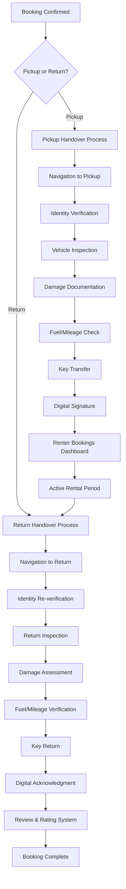

# Car Rental Handover System - Product Requirements Document

## 1. Product Overview

The Car Rental Handover System is a comprehensive mobile-first solution that facilitates seamless vehicle pickup and return processes between car owners (hosts) and renters. The system ensures proper documentation, verification, and condition assessment through a structured 9-step handover process.

The system addresses the critical need for standardized vehicle handover procedures, reducing disputes, ensuring proper documentation, and providing a smooth user experience for both parties. It serves the growing car-sharing market in Botswana and similar emerging markets where peer-to-peer vehicle rentals are becoming increasingly popular.

Target market value: Streamlining car rental operations to reduce handover time by 40% and decrease post-rental disputes by 60% through comprehensive digital documentation.

## 2. Core Features

### 2.1 User Roles

| Role             | Registration Method                        | Core Permissions                                                             |
| ---------------- | ------------------------------------------ | ---------------------------------------------------------------------------- |
| Car Owner (Host) | Email registration + vehicle verification  | Can list vehicles, manage bookings, conduct handovers, access host dashboard |
| Renter           | Email registration + identity verification | Can browse and book vehicles, participate in handovers, leave reviews        |
| System Admin     | Internal invitation only                   | Full system access, user management, dispute resolution                      |

### 2.2 Feature Module

Our car rental handover system consists of the following main pages:

1. **Handover Interface**: Real-time handover process management, step-by-step guidance, photo capture and documentation.
2. **Host Dashboard**: Booking management, handover session monitoring, vehicle condition tracking.
3. **Renter Bookings**: Active and past rentals, handover status, review submission.
4. **Vehicle Condition Reports**: Comprehensive damage documentation, photo galleries, condition history.
5. **Review and Rating System**: Post-handover feedback, dispute resolution, user ratings.

### 2.3 Page Details

| Page Name                 | Module Name           | Feature description                                                                                   |
| ------------------------- | --------------------- | ----------------------------------------------------------------------------------------------------- |
| Handover Interface        | Navigation Step       | GPS-guided navigation to pickup/return location with real-time tracking and arrival confirmation      |
| Handover Interface        | Identity Verification | Digital ID verification with photo capture, document scanning, and identity confirmation              |
| Handover Interface        | Vehicle Inspection    | Comprehensive exterior and interior photo documentation (minimum 4 photos each), condition assessment |
| Handover Interface        | Damage Documentation  | Detailed damage reporting with severity classification, photo evidence, and cost estimation           |
| Handover Interface        | Fuel & Mileage Check  | Fuel level recording, odometer reading, consumption tracking and validation                           |
| Handover Interface        | Key Transfer          | Physical key handover confirmation with digital acknowledgment and security protocols                 |
| Handover Interface        | Digital Signature     | Electronic signature capture for legal agreement confirmation and handover completion                 |
| Handover Interface        | Real-time Sync        | Live progress updates, cross-device synchronization, and participant status tracking                  |
| Host Dashboard            | Session Management    | Active handover monitoring, participant readiness status, session history and analytics               |
| Host Dashboard            | Vehicle Portfolio     | Car listing management, availability calendar, condition report history                               |
| Host Dashboard            | Booking Overview      | Upcoming handovers, revenue tracking, renter communication tools                                      |
| Renter Bookings           | Active Rentals        | Current booking status, handover scheduling, emergency contact information                            |
| Renter Bookings           | Rental History        | Past bookings, condition reports, payment history, and dispute records                                |
| Renter Bookings           | Review System         | Post-rental feedback submission, host rating, experience documentation                                |
| Vehicle Condition Reports | Photo Gallery         | High-resolution vehicle photos organized by handover session and inspection type                      |
| Vehicle Condition Reports | Damage Timeline       | Chronological damage history, repair tracking, cost analysis                                          |
| Vehicle Condition Reports | Condition Comparison  | Before/after condition analysis, damage progression tracking                                          |
| Review System             | Feedback Collection   | Structured review forms, rating systems, photo/video testimonials                                     |
| Review System             | Dispute Resolution    | Automated dispute detection, evidence collection, resolution workflow                                 |

## 3. Core Process

### Vehicle Pickup Process (Renter Flow)

1. Renter initiates pickup from booking confirmation
2. System creates handover session and notifies host
3. Both parties navigate to pickup location using GPS guidance
4. Identity verification ensures correct participants
5. Comprehensive vehicle inspection with photo documentation
6. Damage assessment and reporting if issues found
7. Fuel and mileage recording for baseline establishment
8. Physical key transfer with digital confirmation
9. Digital signature completion and handover finalization
10. Renter redirected to active bookings dashboard

### Vehicle Return Process (Renter Flow)

1. Renter initiates return process before rental end time
2. System creates return handover session and notifies host
3. Navigation to designated return location
4. Identity re-verification for security
5. Return condition inspection comparing to pickup state
6. New damage assessment and documentation
7. Fuel and mileage verification against initial readings
8. Key return with digital acknowledgment
9. Digital signature for return completion
10. Automatic redirect to review and rating system

### Host Management Flow

1. Host receives real-time notifications for handover requests
2. Host dashboard shows all active and pending handovers
3. Host participates in verification and inspection processes
4. Host reviews and approves condition reports
5. Host manages vehicle availability and booking calendar
6. Host accesses comprehensive analytics and reporting

## 4. User Interface Design

### 4.1 Design Style

* **Primary Colors**:

  * Primary Blue: #3B82F6 (trust and reliability)

  * Secondary Green: #10B981 (success and completion)

  * Accent Orange: #F59E0B (attention and warnings)

  * Error Red: #EF4444 (alerts and critical actions)

* **Button Style**:

  * Rounded corners (8px border-radius)

  * Elevated shadow for primary actions

  * Flat design for secondary actions

  * Loading states with spinner animations

* **Typography**:

  * Primary Font

