# Car Rental Handover Process - UML Diagrams

This document provides comprehensive UML diagrams for the car rental system's pickup and return processes, based on the existing handover system implementation.

## 1. State Diagrams

### 1.1 Vehicle Pickup Process State Diagram

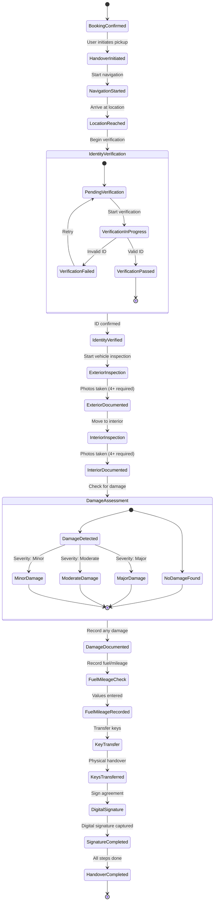

### 1.2 Vehicle Return Process State Diagram

```mermaid
stateDiagram-v2
    [*] --> RentalActive
    RentalActive --> ReturnInitiated : User initiates return
    ReturnInitiated --> NavigationStarted : Start navigation to return location
    NavigationStarted --> LocationReached : Arrive at return location
    LocationReached --> IdentityVerification : Verify identity
    IdentityVerification --> IdentityVerified : ID confirmed
    IdentityVerified --> VehicleInspection : Begin return inspection
    VehicleInspection --> ExteriorInspected : Exterior condition checked
    ExteriorInspected --> InteriorInspected : Interior condition checked
    InteriorInspected --> DamageAssessment : Assess any new damage
    DamageAssessment --> DamageEvaluated : Damage severity determined
    DamageEvaluated --> FuelMileageVerification : Check fuel/mileage
    FuelMileageVerification --> FuelMileageVerified : Values recorded
    FuelMileageVerified --> KeyReturn : Return keys
    KeyReturn --> KeysReturned : Physical return completed
    KeysReturned --> DigitalAcknowledgment : Sign return agreement
    DigitalAcknowledgment --> AcknowledgmentSigned : Digital signature captured
    AcknowledgmentSigned --> ReturnCompleted : All steps completed
    ReturnCompleted --> ReviewProcess : Redirect to review
    ReviewProcess --> [*]
    
    state DamageAssessment {
        [*] --> InspectionStarted
        InspectionStarted --> NoDamageFound : No new damage
        InspectionStarted --> NewDamageFound : New damage detected
        NewDamageFound --> DamageDocumentation : Document damage
        DamageDocumentation --> DamagePhotos : Take photos
        DamagePhotos --> DamageReported : Report created
        DamageReported --> [*]
        NoDamageFound --> [*]
    }
```

### 1.3 Handover Session State Diagram

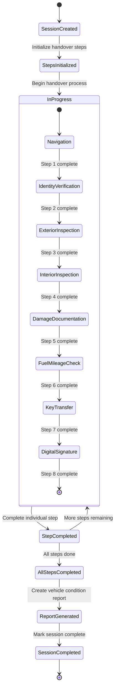

## 2. Sequence Diagrams

### 2.1 Vehicle Pickup Sequence Diagram

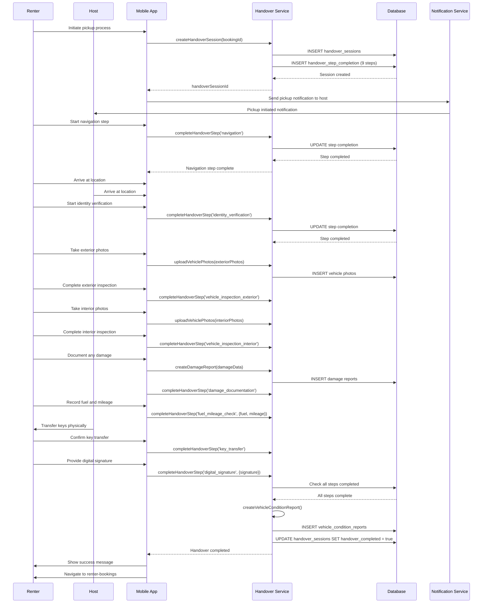

### 2.2 Vehicle Return Sequence Diagram

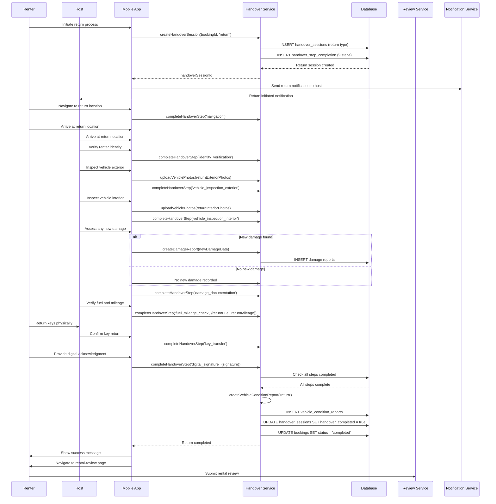

### 2.3 Error Handling Sequence Diagram

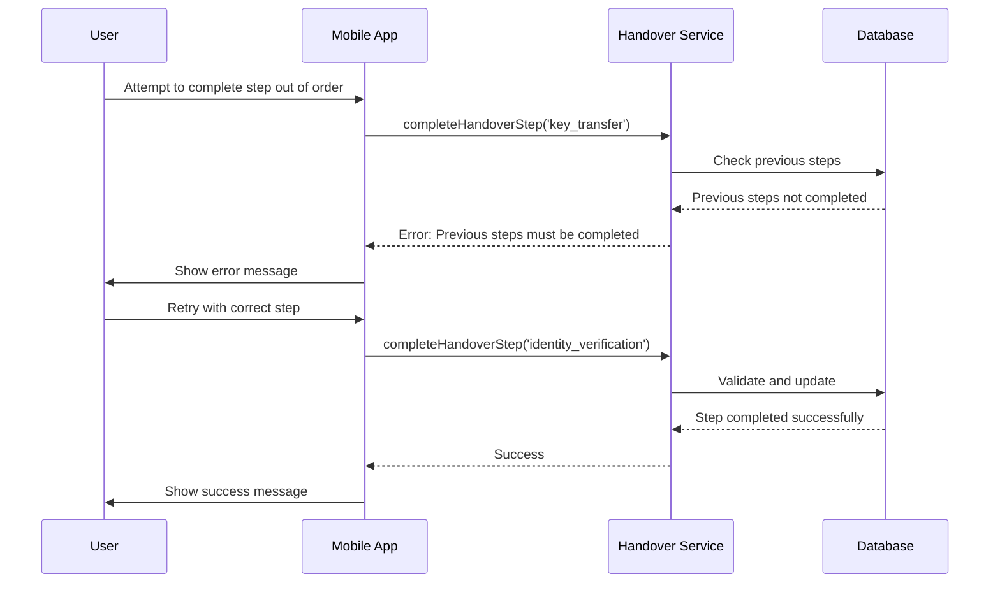

## 3. Flow Charts

### 3.1 Complete Pickup Process Flow Chart

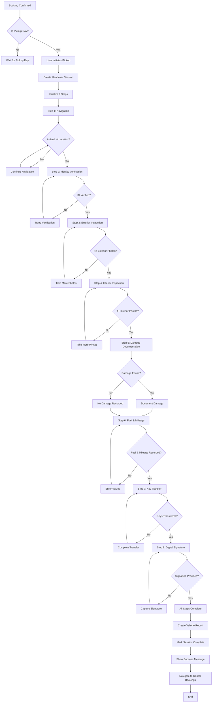

### 3.2 Complete Return Process Flow Chart

```mermaid
flowchart TD
    A[Rental Period Active] --> B{Is Return Day?}
    B -->|No| C[Continue Rental]
    B -->|Yes| D[User Initiates Return]
    D --> E[Create Return Handover Session]
    E --> F[Initialize Return Steps]
    F --> G[Step 1: Navigation to Return Location]
    G --> H{Arrived at Return Location?}
    H -->|No| I[Continue Navigation]
    I --> H
    H -->|Yes| J[Step 2: Identity Verification]
    J --> K{ID Verified?}
    K -->|No| L[Retry Verification]
    L --> J
    K -->|Yes| M[Step 3: Return Exterior Inspection]
    M --> N{Exterior Condition OK?}
    N -->|Issues Found| O[Document Issues]
    N -->|OK| P[Step 4: Return Interior Inspection]
    O --> P
    P --> Q{Interior Condition OK?}
    Q -->|Issues Found| R[Document Issues]
    Q -->|OK| S[Step 5: Damage Assessment]
    R --> S
    S --> T{New Damage Found?}
    T -->|Yes| U[Create Damage Report]
    T -->|No| V[No New Damage]
    U --> W[Determine Severity]
    W --> X{Major Damage?}
    X -->|Yes| Y[Flag for Review]
    X -->|No| Z[Continue Process]
    V --> Z
    Y --> Z
    Z --> AA[Step 6: Fuel & Mileage Verification]
    AA --> BB{Values Acceptable?}
    BB -->|No| CC[Note Discrepancies]
    BB -->|Yes| DD[Step 7: Key Return]
    CC --> DD
    DD --> EE{Keys Returned?}
    EE -->|No| FF[Complete Return]
    FF --> DD
    EE -->|Yes| GG[Step 8: Digital Acknowledgment]
    GG --> HH{Acknowledgment Signed?}
    HH -->|No| II[Capture Signature]
    II --> GG
    HH -->|Yes| JJ[All Return Steps Complete]
    JJ --> KK[Create Return Report]
    KK --> LL[Mark Return Session Complete]
    LL --> MM[Update Booking Status]
    MM --> NN[Show Success Message]
    NN --> OO[Navigate to Review Page]
    OO --> PP[End]
```

### 3.3 Handover Type Detection Flow Chart

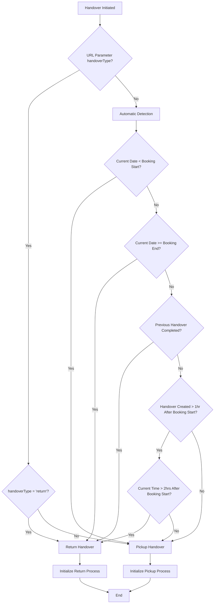

### 3.4 Step Validation Flow Chart

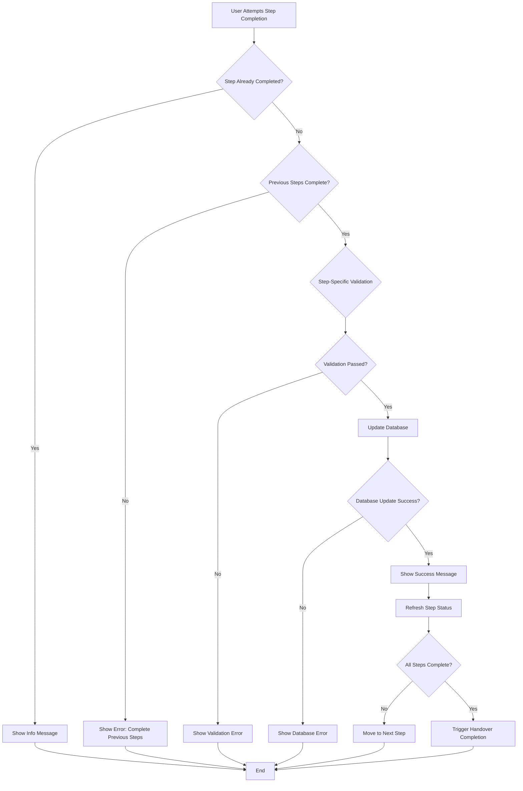

## 4. System Architecture Overview

### 4.1 Component Interaction Diagram

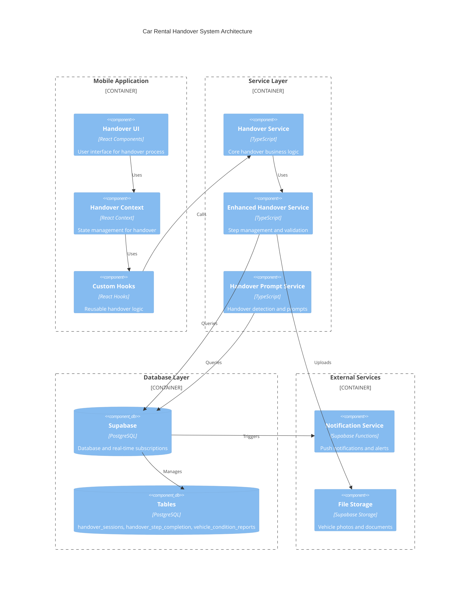

## 5. Database Schema Relationships

### 5.1 Handover Entity Relationship Diagram

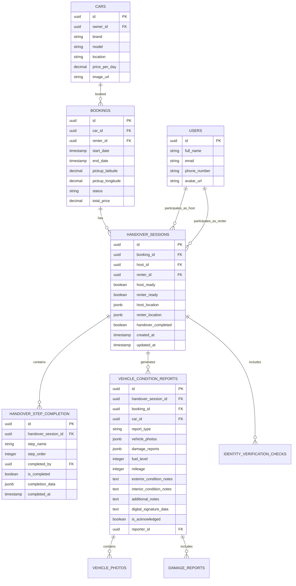

## 6. Key Design Patterns and Principles

### 6.1 State Management Pattern
- **Context Provider Pattern**: Centralized handover state management
- **Step Completion Pattern**: Sequential step validation and completion
- **Real-time Updates**: Supabase subscriptions for live progress updates

### 6.2 Validation Patterns
- **Dependency Validation**: Steps must be completed in order
- **Data Validation**: Each step has specific completion criteria
- **Business Rule Validation**: Handover type detection and routing

### 6.3 Error Handling Patterns
- **Graceful Degradation**: Continue process despite non-critical errors
- **Retry Mechanisms**: Allow users to retry failed steps
- **User Feedback**: Clear error messages and guidance

### 6.4 Navigation Patterns
- **Conditional Routing**: Different paths for pickup vs return
- **State-based Navigation**: Route based on handover completion status
- **URL Parameter Handling**: Support for deep linking and state restoration

This comprehensive UML documentation provides a complete view of the car rental handover system, covering all states, transitions, interactions, and workflows for both pickup and return processes.