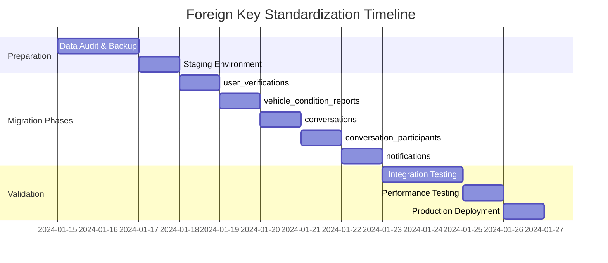

# Foreign Key Standardization Impact Assessment

## Executive Summary

This document provides a comprehensive impact assessment for standardizing foreign key references from `auth.users(id)` to `profiles(id)` across all modules in the MobiRides system. The goal is to ensure all tables follow the standard Supabase pattern where only the `profiles` table directly references `auth.users(id)`, while all other tables reference `profiles(id)` for consistency and proper data relationships.

## 1. Current State Analysis

### 1.1 Tables Currently Referencing auth.users(id)

Based on the codebase analysis, the following tables currently have direct foreign key references to `auth.users(id)`:

| Table | Column | Current Reference | Migration Required |
|-------|--------|-------------------|--------------------|
| `profiles` | `id` | `auth.users(id)` | ❌ No (Correct) |
| `user_verifications` | `user_id` | `auth.users(id)` | ✅ Yes |
| `vehicle_condition_reports` | `reporter_id` | `auth.users(id)` | ✅ Yes |
| `conversations` | `created_by` | `auth.users(id)` | ✅ Yes |
| `conversation_participants` | `user_id` | `auth.users(id)` | ✅ Yes |
| `notifications` | `user_id` | `auth.users(id)` | ✅ Yes |
| `conversation_messages` | `sender_id` | `profiles(id)` | ❌ No (Already Fixed) |

### 1.2 Current Foreign Key Constraints

#### user_verifications
```sql
CREATE TABLE public.user_verifications (
    id UUID PRIMARY KEY DEFAULT gen_random_uuid(),
    user_id UUID NOT NULL REFERENCES auth.users(id),
    -- other columns
);
```

#### vehicle_condition_reports
```sql
CREATE TABLE public.vehicle_condition_reports (
    id UUID PRIMARY KEY DEFAULT gen_random_uuid(),
    reporter_id UUID NOT NULL REFERENCES auth.users(id),
    -- other columns
);
```

#### conversations
```sql
CREATE TABLE public.conversations (
    id UUID PRIMARY KEY DEFAULT gen_random_uuid(),
    created_by UUID NOT NULL REFERENCES auth.users(id),
    -- other columns
);
```

#### conversation_participants
```sql
CREATE TABLE public.conversation_participants (
    id UUID PRIMARY KEY DEFAULT gen_random_uuid(),
    user_id UUID NOT NULL REFERENCES auth.users(id),
    -- other columns
);
```

### 1.3 Current RLS Policies

Each table has RLS policies that use `auth.uid()` to match against the foreign key columns:

- **user_verifications**: `auth.uid() = user_id`
- **vehicle_condition_reports**: Complex policies involving booking relationships
- **conversations**: `auth.uid() = created_by`
- **conversation_participants**: `auth.uid() = user_id`
- **notifications**: `auth.uid() = user_id`

### 1.4 Frontend Dependencies

Frontend queries currently expect these foreign key relationships and may need updates to handle the new `profiles(id)` references.

## 2. Migration Strategy

### 2.1 Overall Approach

**Zero-Downtime Migration Strategy:**
1. Add new foreign key constraints to `profiles(id)` alongside existing ones
2. Update application code to use new references
3. Migrate data integrity checks
4. Remove old foreign key constraints
5. Update RLS policies

### 2.2 Phase-by-Phase Migration Plan

#### Phase 1: Preparation and Validation
**Duration: 1-2 days**

1. **Data Integrity Audit**
   ```sql
   -- Verify all auth.users have corresponding profiles
   SELECT COUNT(*) FROM auth.users u 
   LEFT JOIN public.profiles p ON u.id = p.id 
   WHERE p.id IS NULL;
   
   -- Verify all foreign key references are valid
   SELECT table_name, column_name, COUNT(*) as orphaned_records
   FROM (
       SELECT 'user_verifications' as table_name, 'user_id' as column_name, user_id
       FROM user_verifications uv
       LEFT JOIN auth.users u ON uv.user_id = u.id
       WHERE u.id IS NULL
       -- Repeat for other tables
   ) orphaned_data
   GROUP BY table_name, column_name;
   ```

2. **Backup Strategy**
   - Create full database backup
   - Export affected table schemas
   - Document current RLS policies

#### Phase 2: user_verifications Migration
**Duration: 1 day**

1. **Add New Foreign Key Constraint**
   ```sql
   -- Add new column temporarily
   ALTER TABLE public.user_verifications 
   ADD COLUMN profile_id UUID REFERENCES public.profiles(id);
   
   -- Populate new column
   UPDATE public.user_verifications 
   SET profile_id = user_id;
   
   -- Make it NOT NULL
   ALTER TABLE public.user_verifications 
   ALTER COLUMN profile_id SET NOT NULL;
   ```

2. **Update RLS Policies**
   ```sql
   -- Drop existing policies
   DROP POLICY IF EXISTS "Users can view own verifications" ON user_verifications;
   DROP POLICY IF EXISTS "Users can insert own verifications" ON user_verifications;
   DROP POLICY IF EXISTS "Users can update own verifications" ON user_verifications;
   
   -- Create new policies using profile_id
   CREATE POLICY "Users can view own verifications" ON user_verifications
   FOR SELECT USING (profile_id = auth.uid());
   
   CREATE POLICY "Users can insert own verifications" ON user_verifications
   FOR INSERT WITH CHECK (profile_id = auth.uid());
   
   CREATE POLICY "Users can update own verifications" ON user_verifications
   FOR UPDATE USING (profile_id = auth.uid());
   ```

3. **Remove Old Constraint**
   ```sql
   -- Drop old foreign key constraint
   ALTER TABLE public.user_verifications 
   DROP CONSTRAINT user_verifications_user_id_fkey;
   
   -- Rename columns
   ALTER TABLE public.user_verifications 
   DROP COLUMN user_id;
   
   ALTER TABLE public.user_verifications 
   RENAME COLUMN profile_id TO user_id;
   ```

#### Phase 3: vehicle_condition_reports Migration
**Duration: 1 day**

Similar approach to Phase 2, but with more complex RLS policies:

```sql
-- New RLS policy example
CREATE POLICY "Users can view reports for their bookings" ON vehicle_condition_reports
FOR SELECT USING (
    EXISTS (
        SELECT 1 FROM bookings b
        JOIN profiles p ON (b.renter_id = p.id OR b.car_id IN (
            SELECT id FROM cars WHERE owner_id = p.id
        ))
        WHERE b.id = vehicle_condition_reports.booking_id
        AND p.id = auth.uid()
    )
    OR reporter_id = auth.uid()
);
```

#### Phase 4: conversations Migration
**Duration: 1 day**

```sql
-- Migration for conversations.created_by
ALTER TABLE public.conversations 
ADD COLUMN creator_profile_id UUID REFERENCES public.profiles(id);

UPDATE public.conversations 
SET creator_profile_id = created_by;

ALTER TABLE public.conversations 
ALTER COLUMN creator_profile_id SET NOT NULL;

-- Update RLS policies
CREATE POLICY "Users can view conversations they created" ON conversations
FOR SELECT USING (creator_profile_id = auth.uid());
```

#### Phase 5: conversation_participants Migration
**Duration: 1 day**

Similar to previous phases, ensuring participant queries work correctly.

#### Phase 6: notifications Migration
**Duration: 1 day**

Critical for user experience - requires careful testing of notification delivery.

### 2.3 Data Migration Scripts

```sql
-- Master migration script template
BEGIN;

-- 1. Add new foreign key column
ALTER TABLE {table_name} 
ADD COLUMN {new_column_name} UUID REFERENCES public.profiles(id);

-- 2. Populate new column
UPDATE {table_name} 
SET {new_column_name} = {old_column_name};

-- 3. Add NOT NULL constraint
ALTER TABLE {table_name} 
ALTER COLUMN {new_column_name} SET NOT NULL;

-- 4. Update RLS policies
-- (Table-specific policies)

-- 5. Drop old constraint and rename
ALTER TABLE {table_name} 
DROP CONSTRAINT {old_constraint_name};

ALTER TABLE {table_name} 
DROP COLUMN {old_column_name};

ALTER TABLE {table_name} 
RENAME COLUMN {new_column_name} TO {old_column_name};

COMMIT;
```

## 3. Risk Assessment

### 3.1 High-Risk Areas

| Risk Category | Impact | Probability | Mitigation Strategy |
|---------------|--------|-------------|--------------------|
| **Data Loss** | Critical | Low | Full backup + transaction rollback |
| **RLS Policy Failures** | High | Medium | Staged policy updates + testing |
| **Frontend Query Breaks** | High | Medium | Gradual deployment + feature flags |
| **Notification System Downtime** | Medium | Low | Parallel system during migration |
| **Authentication Issues** | Critical | Low | Preserve auth.users relationships |

### 3.2 Potential Breaking Changes

1. **TypeScript Type Definitions**
   - Foreign key type changes in `types.ts`
   - Query result type mismatches
   - Component prop type updates

2. **Frontend Queries**
   - Join conditions may need updates
   - Filter conditions using foreign keys
   - Real-time subscription filters

3. **RLS Policy Logic**
   - Policy conditions using `auth.uid()`
   - Complex multi-table policies
   - Performance implications of new joins

### 3.3 Performance Implications

1. **Query Performance**
   - Additional join to profiles table
   - Index optimization needed
   - Query plan analysis required

2. **Index Strategy**
   ```sql
   -- Recommended indexes for new foreign keys
   CREATE INDEX idx_user_verifications_user_id ON user_verifications(user_id);
   CREATE INDEX idx_vehicle_condition_reports_reporter_id ON vehicle_condition_reports(reporter_id);
   CREATE INDEX idx_conversations_created_by ON conversations(created_by);
   CREATE INDEX idx_conversation_participants_user_id ON conversation_participants(user_id);
   CREATE INDEX idx_notifications_user_id ON notifications(user_id);
   ```

## 4. Testing Strategy

### 4.1 Pre-Migration Validation

1. **Data Integrity Checks**
   ```sql
   -- Verify no orphaned records
   SELECT 'user_verifications' as table_name, COUNT(*) as orphaned
   FROM user_verifications uv
   LEFT JOIN profiles p ON uv.user_id = p.id
   WHERE p.id IS NULL;
   ```

2. **Performance Baseline**
   - Query execution time measurements
   - Database load testing
   - Memory usage analysis

3. **Functional Testing**
   - User authentication flows
   - Data access permissions
   - Real-time updates

### 4.2 Migration Testing

1. **Staging Environment**
   - Full production data copy
   - Complete migration rehearsal
   - Performance impact measurement

2. **Rollback Testing**
   - Rollback script validation
   - Data consistency verification
   - System recovery time measurement

### 4.3 Post-Migration Verification

1. **Data Consistency**
   ```sql
   -- Verify all foreign keys are valid
   SELECT table_name, COUNT(*) as total_records
   FROM (
       SELECT 'user_verifications' as table_name FROM user_verifications
       UNION ALL
       SELECT 'vehicle_condition_reports' FROM vehicle_condition_reports
       -- Add other tables
   ) all_records
   GROUP BY table_name;
   ```

2. **Functional Verification**
   - User login and profile access
   - Data creation and modification
   - Permission enforcement
   - Real-time functionality

3. **Performance Verification**
   - Query execution time comparison
   - System resource usage
   - User experience metrics

## 5. Implementation Timeline

### 5.1 Phased Approach



### 5.2 Critical Path Analysis

**Dependencies:**
1. `profiles` table must remain stable (foundation)
2. `user_verifications` → `vehicle_condition_reports` (user identity)
3. `conversations` → `conversation_participants` (messaging system)
4. `notifications` (depends on all user-related tables)

**Estimated Total Duration: 10-12 days**
- Preparation: 3 days
- Migration: 5 days
- Testing & Validation: 3 days
- Buffer: 1-2 days

### 5.3 Resource Requirements

**Team Requirements:**
- Database Administrator (full-time)
- Backend Developer (full-time)
- Frontend Developer (part-time)
- QA Engineer (part-time)
- DevOps Engineer (on-call)

**Infrastructure:**
- Staging environment with production data
- Database backup storage
- Monitoring and alerting systems
- Rollback automation tools

## 6. Rollback Procedures

### 6.1 Immediate Rollback (During Migration)

```sql
-- Emergency rollback script
BEGIN;

-- Restore original foreign key constraint
ALTER TABLE {table_name} 
ADD CONSTRAINT {original_constraint_name} 
FOREIGN KEY ({column_name}) REFERENCES auth.users(id);

-- Restore original RLS policies
-- (Table-specific policy restoration)

-- Remove new constraints
ALTER TABLE {table_name} 
DROP CONSTRAINT {new_constraint_name};

COMMIT;
```

### 6.2 Post-Migration Rollback

1. **Data Backup Restoration**
   - Full database restore from pre-migration backup
   - Selective table restoration if needed
   - Data loss assessment and recovery

2. **Application Rollback**
   - Frontend code reversion
   - API endpoint rollback
   - Configuration restoration

## 7. Success Criteria

### 7.1 Technical Success Metrics

- ✅ All tables reference `profiles(id)` instead of `auth.users(id)`
- ✅ Zero data loss during migration
- ✅ All RLS policies function correctly
- ✅ Query performance within 10% of baseline
- ✅ No authentication or authorization issues

### 7.2 Business Success Metrics

- ✅ Zero user-facing downtime
- ✅ No user complaints about functionality
- ✅ All features work as expected
- ✅ System stability maintained
- ✅ Data consistency preserved

## 8. Monitoring and Alerting

### 8.1 Migration Monitoring

```sql
-- Real-time migration progress tracking
SELECT 
    schemaname,
    tablename,
    n_tup_ins as inserts,
    n_tup_upd as updates,
    n_tup_del as deletes
FROM pg_stat_user_tables 
WHERE tablename IN (
    'user_verifications',
    'vehicle_condition_reports', 
    'conversations',
    'conversation_participants',
    'notifications'
);
```

### 8.2 Post-Migration Monitoring

- Database connection pool usage
- Query execution time trends
- Error rate monitoring
- User session success rates
- Real-time subscription health

## 9. Conclusion

This migration will standardize the foreign key structure across the MobiRides system, improving data consistency and following Supabase best practices. The phased approach minimizes risk while ensuring zero downtime. Success depends on thorough testing, careful monitoring, and having robust rollback procedures in place.

**Next Steps:**
1. Review and approve this impact assessment
2. Set up staging environment for migration testing
3. Begin Phase 1 preparation activities
4. Schedule migration windows with stakeholders
5. Execute migration according to the timeline

**Key Contacts:**
- Database Team: [Contact Info]
- Backend Team: [Contact Info]
- Frontend Team: [Contact Info]
- DevOps Team: [Contact Info]
- Project Manager: [Contact Info]