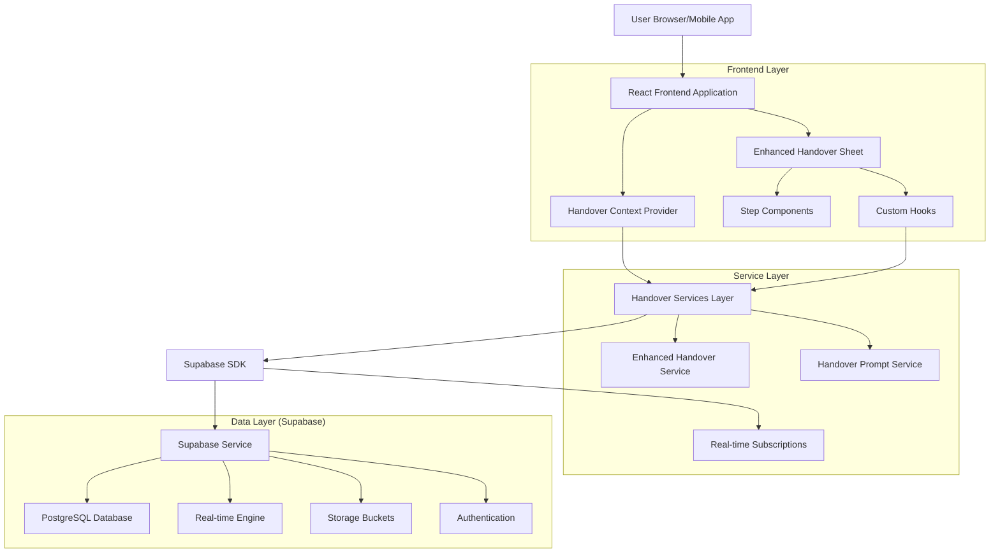
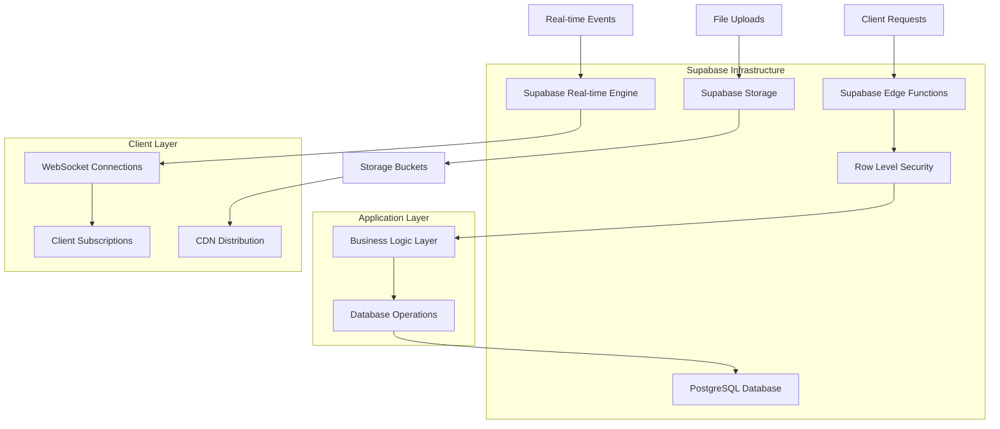
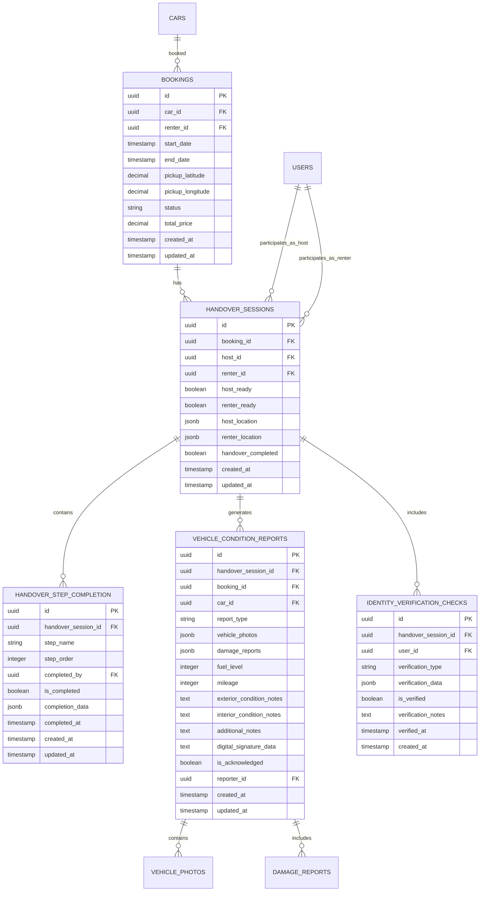

# Car Rental Handover System - Technical Architecture Document

This document provides the technical architecture for the car rental handover system, detailing the implementation approach for both pickup and return processes.

## 1. Architecture Design



## 2. Technology Description

- **Frontend**: React@18 + TypeScript + Tailwind CSS + Vite
- **Backend**: Supabase (PostgreSQL + Real-time + Storage + Auth)
- **State Management**: React Context + Custom Hooks
- **Real-time**: Supabase Real-time subscriptions
- **File Storage**: Supabase Storage for vehicle photos
- **Authentication**: Supabase Auth

## 3. Route Definitions

| Route | Purpose | Handover Context |
|-------|---------|------------------|
| /handover/:bookingId | Main handover interface | Determines pickup vs return automatically |
| /handover/:bookingId?type=pickup | Explicit pickup handover | Forces pickup mode |
| /handover/:bookingId?type=return | Explicit return handover | Forces return mode |
| /renter-bookings | Renter's booking list | Redirect destination after pickup |
| /rental-review/:bookingId | Rental review page | Redirect destination after return |
| /host-dashboard | Host dashboard | Host's main interface |

## 4. API Definitions

### 4.1 Core Handover APIs

#### Create Handover Session
```typescript
POST /rest/v1/handover_sessions
```

**Request:**
| Param Name | Param Type | Required | Description |
|------------|------------|----------|-------------|
| booking_id | uuid | true | The booking ID for this handover |
| host_id | uuid | true | Host user ID |
| renter_id | uuid | true | Renter user ID |
| host_ready | boolean | false | Host readiness status |
| renter_ready | boolean | false | Renter readiness status |

**Response:**
| Param Name | Param Type | Description |
|------------|------------|-------------|
| id | uuid | Created handover session ID |
| booking_id | uuid | Associated booking ID |
| created_at | timestamp | Session creation time |
| handover_completed | boolean | Completion status |

**Example:**
```json
{
  "booking_id": "123e4567-e89b-12d3-a456-426614174000",
  "host_id": "987fcdeb-51a2-43d1-b789-123456789abc",
  "renter_id": "456789ab-cdef-1234-5678-9abcdef01234",
  "host_ready": false,
  "renter_ready": true
}
```

#### Complete Handover Step
```typescript
POST /rest/v1/rpc/complete_handover_step
```

**Request:**
| Param Name | Param Type | Required | Description |
|------------|------------|----------|-------------|
| handover_session_id | uuid | true | Handover session ID |
| step_name | string | true | Name of the step to complete |
| completion_data | jsonb | false | Step-specific completion data |
| completed_by | uuid | true | User ID who completed the step |

**Response:**
| Param Name | Param Type | Description |
|------------|------------|-------------|
| success | boolean | Operation success status |
| step_completed | boolean | Whether step was marked complete |
| all_steps_completed | boolean | Whether all steps are now complete |

#### Upload Vehicle Photos
```typescript
POST /storage/v1/object/vehicle-photos
```

**Request:**
| Param Name | Param Type | Required | Description |
|------------|------------|----------|-------------|
| file | File | true | Image file (JPEG/PNG) |
| path | string | true | Storage path: {handover_session_id}/{photo_type}/{filename} |

**Response:**
| Param Name | Param Type | Description |
|------------|------------|-------------|
| path | string | Stored file path |
| fullPath | string | Complete storage path |

### 4.2 Real-time Subscriptions

#### Handover Session Updates
```typescript
supabase
  .channel('handover-session')
  .on('postgres_changes', {
    event: 'UPDATE',
    schema: 'public',
    table: 'handover_sessions',
    filter: `id=eq.${handoverSessionId}`
  }, handleHandoverUpdate)
  .subscribe()
```

#### Step Completion Updates
```typescript
supabase
  .channel('step-completion')
  .on('postgres_changes', {
    event: 'UPDATE',
    schema: 'public',
    table: 'handover_step_completion',
    filter: `handover_session_id=eq.${handoverSessionId}`
  }, handleStepUpdate)
  .subscribe()
```

## 5. Server Architecture Diagram



## 6. Data Model

### 6.1 Data Model Definition



### 6.2 Data Definition Language

#### Handover Sessions Table
```sql
-- Create handover_sessions table
CREATE TABLE handover_sessions (
    id UUID PRIMARY KEY DEFAULT gen_random_uuid(),
    booking_id UUID NOT NULL REFERENCES bookings(id) ON DELETE CASCADE,
    host_id UUID NOT NULL REFERENCES auth.users(id),
    renter_id UUID NOT NULL REFERENCES auth.users(id),
    host_ready BOOLEAN DEFAULT false,
    renter_ready BOOLEAN DEFAULT false,
    host_location JSONB,
    renter_location JSONB,
    handover_completed BOOLEAN DEFAULT false,
    created_at TIMESTAMP WITH TIME ZONE DEFAULT NOW(),
    updated_at TIMESTAMP WITH TIME ZONE DEFAULT NOW()
);

-- Create indexes
CREATE INDEX idx_handover_sessions_booking_id ON handover_sessions(booking_id);
CREATE INDEX idx_handover_sessions_host_id ON handover_sessions(host_id);
CREATE INDEX idx_handover_sessions_renter_id ON handover_sessions(renter_id);
CREATE INDEX idx_handover_sessions_created_at ON handover_sessions(created_at DESC);

-- Row Level Security
ALTER TABLE handover_sessions ENABLE ROW LEVEL SECURITY;

-- Policies
CREATE POLICY "Users can view their own handover sessions" ON handover_sessions
    FOR SELECT USING (auth.uid() = host_id OR auth.uid() = renter_id);

CREATE POLICY "Users can update their own handover sessions" ON handover_sessions
    FOR UPDATE USING (auth.uid() = host_id OR auth.uid() = renter_id);

CREATE POLICY "Users can insert handover sessions for their bookings" ON handover_sessions
    FOR INSERT WITH CHECK (auth.uid() = host_id OR auth.uid() = renter_id);
```

#### Handover Step Completion Table
```sql
-- Create handover_step_completion table
CREATE TABLE handover_step_completion (
    id UUID PRIMARY KEY DEFAULT gen_random_uuid(),
    handover_session_id UUID NOT NULL REFERENCES handover_sessions(id) ON DELETE CASCADE,
    step_name VARCHAR(100) NOT NULL,
    step_order INTEGER NOT NULL,
    completed_by UUID REFERENCES auth.users(id),
    is_completed BOOLEAN DEFAULT false,
    completion_data JSONB,
    completed_at TIMESTAMP WITH TIME ZONE,
    created_at TIMESTAMP WITH TIME ZONE DEFAULT NOW(),
    updated_at TIMESTAMP WITH TIME ZONE DEFAULT NOW(),
    UNIQUE(handover_session_id, step_name)
);

-- Create indexes
CREATE INDEX idx_handover_step_completion_session_id ON handover_step_completion(handover_session_id);
CREATE INDEX idx_handover_step_completion_step_order ON handover_step_completion(step_order);
CREATE INDEX idx_handover_step_completion_completed ON handover_step_completion(is_completed);

-- Row Level Security
ALTER TABLE handover_step_completion ENABLE ROW LEVEL SECURITY;

-- Policies
CREATE POLICY "Users can view steps for their handover sessions" ON handover_step_completion
    FOR SELECT USING (
        EXISTS (
            SELECT 1 FROM handover_sessions hs 
            WHERE hs.id = handover_session_id 
            AND (hs.host_id = auth.uid() OR hs.renter_id = auth.uid())
        )
    );

CREATE POLICY "Users can update steps for their handover sessions" ON handover_step_completion
    FOR UPDATE USING (
        EXISTS (
            SELECT 1 FROM handover_sessions hs 
            WHERE hs.id = handover_session_id 
            AND (hs.host_id = auth.uid() OR hs.renter_id = auth.uid())
        )
    );
```

#### Vehicle Condition Reports Table
```sql
-- Create vehicle_condition_reports table
CREATE TABLE vehicle_condition_reports (
    id UUID PRIMARY KEY DEFAULT gen_random_uuid(),
    handover_session_id UUID NOT NULL REFERENCES handover_sessions(id) ON DELETE CASCADE,
    booking_id UUID NOT NULL REFERENCES bookings(id),
    car_id UUID NOT NULL REFERENCES cars(id),
    report_type VARCHAR(20) NOT NULL CHECK (report_type IN ('pickup', 'return')),
    vehicle_photos JSONB,
    damage_reports JSONB,
    fuel_level INTEGER CHECK (fuel_level >= 0 AND fuel_level <= 100),
    mileage INTEGER CHECK (mileage >= 0),
    exterior_condition_notes TEXT,
    interior_condition_notes TEXT,
    additional_notes TEXT,
    digital_signature_data TEXT,
    is_acknowledged BOOLEAN DEFAULT false,
    reporter_id UUID NOT NULL REFERENCES auth.users(id),
    created_at TIMESTAMP WITH TIME ZONE DEFAULT NOW(),
    updated_at TIMESTAMP WITH TIME ZONE DEFAULT NOW()
);

-- Create indexes
CREATE INDEX idx_vehicle_condition_reports_handover_session_id ON vehicle_condition_reports(handover_session_id);
CREATE INDEX idx_vehicle_condition_reports_booking_id ON vehicle_condition_reports(booking_id);
CREATE INDEX idx_vehicle_condition_reports_car_id ON vehicle_condition_reports(car_id);
CREATE INDEX idx_vehicle_condition_reports_report_type ON vehicle_condition_reports(report_type);

-- Row Level Security
ALTER TABLE vehicle_condition_reports ENABLE ROW LEVEL SECURITY;

-- Policies
CREATE POLICY "Users can view reports for their handover sessions" ON vehicle_condition_reports
    FOR SELECT USING (
        EXISTS (
            SELECT 1 FROM handover_sessions hs 
            WHERE hs.id = handover_session_id 
            AND (hs.host_id = auth.uid() OR hs.renter_id = auth.uid())
        )
    );
```

#### Database Functions
```sql
-- Function to complete a handover step
CREATE OR REPLACE FUNCTION complete_handover_step(
    p_handover_session_id UUID,
    p_step_name VARCHAR,
    p_completion_data JSONB DEFAULT NULL,
    p_completed_by UUID DEFAULT auth.uid()
)
RETURNS JSON
LANGUAGE plpgsql
SECURITY DEFINER
AS $$
DECLARE
    v_step_exists BOOLEAN;
    v_previous_steps_complete BOOLEAN;
    v_all_steps_complete BOOLEAN;
    v_result JSON;
BEGIN
    -- Check if step exists
    SELECT EXISTS(
        SELECT 1 FROM handover_step_completion 
        WHERE handover_session_id = p_handover_session_id 
        AND step_name = p_step_name
    ) INTO v_step_exists;
    
    IF NOT v_step_exists THEN
        RETURN json_build_object('success', false, 'error', 'Step not found');
    END IF;
    
    -- Check if previous steps are completed
    SELECT NOT EXISTS(
        SELECT 1 FROM handover_step_completion 
        WHERE handover_session_id = p_handover_session_id 
        AND step_order < (SELECT step_order FROM handover_step_completion WHERE handover_session_id = p_handover_session_id AND step_name = p_step_name)
        AND is_completed = false
    ) INTO v_previous_steps_complete;
    
    IF NOT v_previous_steps_complete THEN
        RETURN json_build_object('success', false, 'error', 'Previous steps must be completed first');
    END IF;
    
    -- Update the step
    UPDATE handover_step_completion 
    SET 
        is_completed = true,
        completed_by = p_completed_by,
        completion_data = p_completion_data,
        completed_at = NOW(),
        updated_at = NOW()
    WHERE handover_session_id = p_handover_session_id 
    AND step_name = p_step_name;
    
    -- Check if all steps are complete
    SELECT NOT EXISTS(
        SELECT 1 FROM handover_step_completion 
        WHERE handover_session_id = p_handover_session_id 
        AND is_completed = false
    ) INTO v_all_steps_complete;
    
    -- If all steps complete, mark handover as completed
    IF v_all_steps_complete THEN
        UPDATE handover_sessions 
        SET handover_completed = true, updated_at = NOW()
        WHERE id = p_handover_session_id;
    END IF;
    
    RETURN json_build_object(
        'success', true,
        'step_completed', true,
        'all_steps_completed', v_all_steps_complete
    );
END;
$$;
```

#### Initial Data
```sql
-- Insert default handover steps for each session
CREATE OR REPLACE FUNCTION initialize_handover_steps(p_handover_session_id UUID)
RETURNS VOID
LANGUAGE plpgsql
AS $$
BEGIN
    INSERT INTO handover_step_completion (handover_session_id, step_name, step_order)
    VALUES 
        (p_handover_session_id, 'navigation', 1),
        (p_handover_session_id, 'identity_verification', 2),
        (p_handover_session_id, 'vehicle_inspection_exterior', 3),
        (p_handover_session_id, 'vehicle_inspection_interior', 4),
        (p_handover_session_id, 'damage_documentation', 5),
        (p_handover_session_id, 'fuel_mileage_check', 6),
        (p_handover_session_id, 'key_transfer', 7),
        (p_handover_session_id, 'digital_signature', 8),
        (p_handover_session_id, 'completion', 9);
END;
$$;
```

## 7. TypeScript Type Definitions

```typescript
// Core handover types
export interface HandoverSession {
  id: string;
  booking_id: string;
  host_id: string;
  renter_id: string;
  host_ready: boolean;
  renter_ready: boolean;
  host_location?: LocationData;
  renter_location?: LocationData;
  handover_completed: boolean;
  created_at: string;
  updated_at: string;
}

export interface HandoverStepCompletion {
  id: string;
  handover_session_id: string;
  step_name: string;
  step_order: number;
  completed_by?: string;
  is_completed: boolean;
  completion_data?: any;
  completed_at?: string;
  created_at: string;
  updated_at: string;
}

export interface VehicleConditionReport {
  id: string;
  handover_session_id: string;
  booking_id: string;
  car_id: string;
  report_type: 'pickup' | 'return';
  vehicle_photos?: VehiclePhoto[];
  damage_reports?: DamageReport[];
  fuel_level?: number;
  mileage?: number;
  exterior_condition_notes?: string;
  interior_condition_notes?: string;
  additional_notes?: string;
  digital_signature_data?: string;
  is_acknowledged: boolean;
  reporter_id: string;
  created_at: string;
  updated_at: string;
}

export interface VehiclePhoto {
  id: string;
  photo_type: 'exterior' | 'interior' | 'damage';
  photo_url: string;
  description?: string;
  timestamp: string;
}

export interface DamageReport {
  id: string;
  damage_type: string;
  severity: 'minor' | 'moderate' | 'major';
  description: string;
  photo_urls: string[];
  location: string;
  estimated_cost?: number;
  timestamp: string;
}

export interface LocationData {
  latitude: number;
  longitude: number;
  accuracy?: number;
  timestamp: string;
}

// Handover step names enum
export enum HandoverStepName {
  NAVIGATION = 'navigation',
  IDENTITY_VERIFICATION = 'identity_verification',
  VEHICLE_INSPECTION_EXTERIOR = 'vehicle_inspection_exterior',
  VEHICLE_INSPECTION_INTERIOR = 'vehicle_inspection_interior',
  DAMAGE_DOCUMENTATION = 'damage_documentation',
  FUEL_MILEAGE_CHECK = 'fuel_mileage_check',
  KEY_TRANSFER = 'key_transfer',
  DIGITAL_SIGNATURE = 'digital_signature',
  COMPLETION = 'completion'
}

// Service response types
export interface HandoverStepCompletionResponse {
  success: boolean;
  step_completed: boolean;
  all_steps_completed: boolean;
  error?: string;
}

export interface HandoverSessionWithSteps extends HandoverSession {
  handover_step_completion: HandoverStepCompletion[];
  vehicle_condition_reports?: VehicleConditionReport[];
}
```

This technical architecture document provides a comprehensive foundation for implementing the car rental handover system with proper separation of concerns, type safety, and scalable database design.