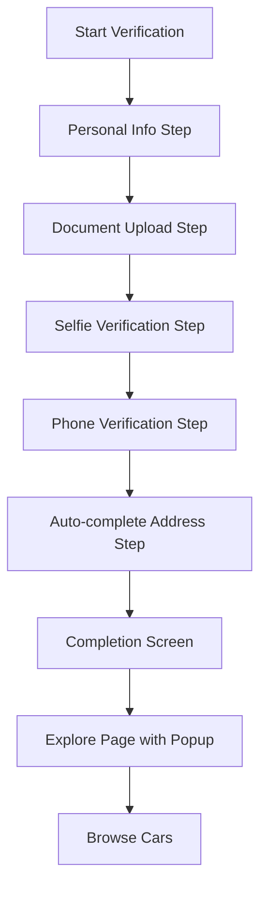

# User Verification Flow Revision - Product Requirements Document

## 1. Product Overview

This document outlines the revision of the user verification flow for the Mobirides car-sharing platform, simplifying the process by removing the proof of address verification step and implementing an improved user experience with immediate access to core functionality.

The revision aims to reduce user friction during onboarding while maintaining security standards, ultimately increasing verification completion rates and user engagement with the platform.

## 2. Core Features

### 2.1 User Roles

| Role | Registration Method | Core Permissions |
|------|---------------------|------------------|
| Renter | Email/Phone registration | Can browse cars, complete verification, make bookings |
| Host | Email/Phone registration | Can list cars, complete verification, manage bookings |
| Admin | Internal invitation | Can manage all verifications, view analytics |

### 2.2 Feature Module

Our revised verification flow consists of the following main pages:

1. **Verification Hub**: Progress tracking, step navigation, completion status display
2. **Personal Information Step**: User details collection, form validation
3. **Document Upload Step**: ID document capture, file validation
4. **Selfie Verification Step**: Live photo capture, face matching
5. **Phone Verification Step**: SMS code verification, number confirmation
6. **Completion Step**: Success confirmation, next steps guidance
7. **Explore Page**: Car browsing with verification success popup

### 2.3 Page Details

| Page Name | Module Name | Feature Description |
|-----------|-------------|---------------------|
| Verification Hub | Progress Stepper | Display 7 steps instead of 8, remove address confirmation step, show current progress |
| Verification Hub | Step Navigation | Allow navigation between completed steps, prevent skipping incomplete steps |
| Personal Information Step | Form Fields | Collect name, email, phone, date of birth with validation |
| Document Upload Step | File Upload | Capture/upload ID documents, validate file format and size |
| Selfie Verification Step | Camera Integration | Live photo capture, face detection, quality validation |
| Phone Verification Step | SMS Verification | Send verification code, validate input, confirm phone number |
| Completion Step | Success Display | Show verification complete message, redirect to explore after 3 seconds |
| Explore Page | Success Popup | Display "Verification completed! You can now proceed to rent your favorite car." message |
| Explore Page | Auto-close Popup | Close popup after 5 seconds or on user click anywhere |

## 3. Core Process

### User Verification Flow

1. User starts verification process from dashboard or prompted flow
2. Complete Personal Information (Step 1)
3. Upload required documents (Step 2)
4. Complete selfie verification (Step 3)
5. Verify phone number via SMS (Step 4)
6. System automatically marks address verification as completed (Step 5 - hidden)
7. Show completion screen with success message (Step 6)
8. Redirect to explore page after 3 seconds
9. Display success popup on explore page
10. User can browse and rent cars immediately

### Admin Flow

1. Admin can view all user verifications in management dashboard
2. Review and approve/reject verification submissions
3. Add notes and rejection reasons if needed
4. Monitor verification completion rates and analytics

## 4. User Interface Design

### 4.1 Design Style

- **Primary Colors**: Blue (#3B82F6), Green (#10B981) for success states
- **Secondary Colors**: Gray (#6B7280) for inactive states, Red (#EF4444) for errors
- **Button Style**: Rounded corners (8px), solid fills with hover states
- **Font**: Inter font family, 16px base size, 14px for secondary text
- **Layout Style**: Card-based design with clean spacing, mobile-first responsive
- **Icons**: Heroicons outline style, consistent 24px size
- **Animations**: Smooth transitions (300ms), fade-in effects for popups

### 4.2 Page Design Overview

| Page Name | Module Name | UI Elements |
|-----------|-------------|-------------|
| Verification Hub | Progress Stepper | 7 circular step indicators, blue for active/completed, gray for pending |
| Completion Step | Success Message | Large checkmark icon, "Verification Complete!" heading, countdown timer |
| Explore Page | Success Popup | Modal overlay with semi-transparent background, centered card with message |
| Explore Page | Popup Animation | Fade-in animation on appear, fade-out on close, smooth transitions |

### 4.3 Responsiveness

The application is mobile-first with responsive breakpoints:
- Mobile: 320px - 768px (primary focus)
- Tablet: 768px - 1024px (adaptive layout)
- Desktop: 1024px+ (enhanced experience)
- Touch interaction optimized for mobile devices
- Popup sizing adapts to screen dimensions