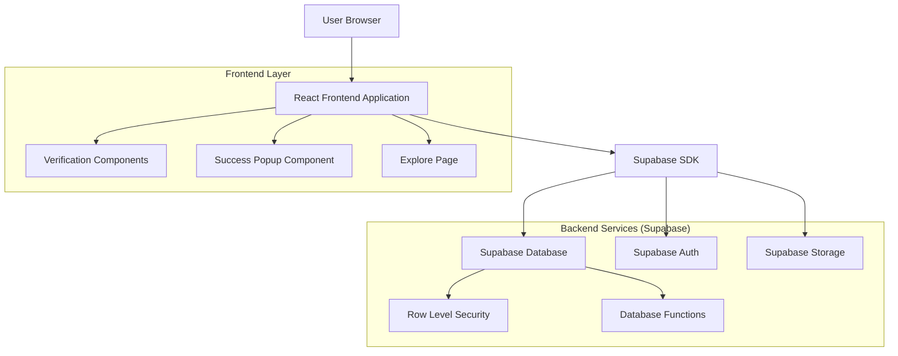
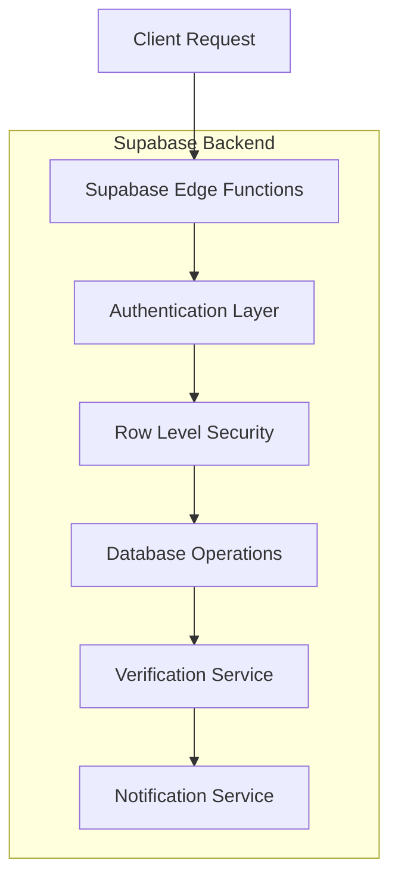
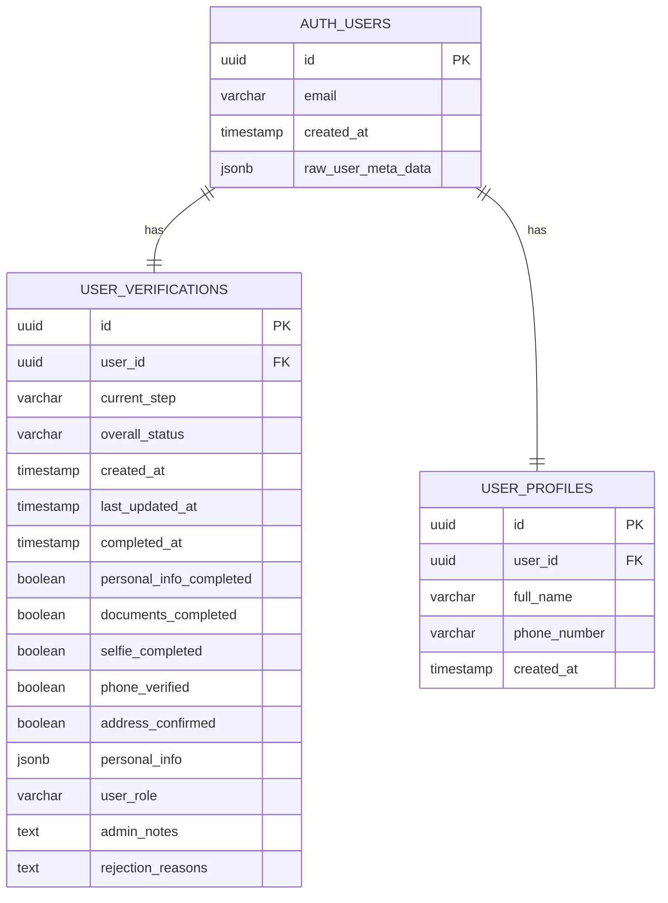

# User Verification Flow Revision - Technical Architecture Document

## 1. Architecture Design



## 2. Technology Description

- **Frontend**: React@18 + TypeScript + Tailwind CSS + Vite
- **Backend**: Supabase (PostgreSQL + Auth + Storage)
- **State Management**: React Context + Custom Hooks
- **Routing**: React Router v6
- **UI Components**: Custom components with Heroicons
- **Notifications**: Custom popup system

## 3. Route Definitions

| Route | Purpose |
|-------|---------|
| /verification | Main verification hub with step navigation |
| /verification/personal-info | Personal information collection step |
| /verification/documents | Document upload and validation step |
| /verification/selfie | Selfie capture and verification step |
| /verification/phone | Phone number verification step |
| /verification/complete | Verification completion confirmation |
| /explore | Car browsing page with success popup |
| /admin/verifications | Admin verification management dashboard |

## 4. API Definitions

### 4.1 Core API Endpoints

**Update User Verification Status**
```
POST /api/verification/update-step
```

Request:
| Param Name | Param Type | isRequired | Description |
|------------|------------|------------|-------------|
| user_id | string | true | User UUID |
| step | string | true | Verification step name |
| data | object | false | Step-specific data |
| completed | boolean | true | Step completion status |

Response:
| Param Name | Param Type | Description |
|------------|------------|-------------|
| success | boolean | Operation success status |
| verification | object | Updated verification data |

**Bulk Update Address Verification**
```
POST /api/verification/bulk-update-address
```

Request:
| Param Name | Param Type | isRequired | Description |
|------------|------------|------------|-------------|
| admin_key | string | true | Admin authorization key |

Response:
| Param Name | Param Type | Description |
|------------|------------|-------------|
| success | boolean | Operation success status |
| updated_count | number | Number of users updated |

## 5. Server Architecture Diagram



## 6. Data Model

### 6.1 Data Model Definition



### 6.2 Data Definition Language

**Migration: Update existing users' address verification status**
```sql
-- Update all existing users to have address_confirmed = true
UPDATE user_verifications 
SET 
    address_confirmed = true,
    last_updated_at = NOW()
WHERE 
    address_confirmed = false 
    OR address_confirmed IS NULL;

-- Update current_step for users who were stuck on address confirmation
UPDATE user_verifications 
SET 
    current_step = CASE 
        WHEN current_step = 'ADDRESS_CONFIRMATION' THEN 'COMPLETION'
        ELSE current_step
    END,
    last_updated_at = NOW()
WHERE 
    current_step = 'ADDRESS_CONFIRMATION';

-- Update overall_status for completed verifications
UPDATE user_verifications 
SET 
    overall_status = 'completed',
    completed_at = NOW(),
    last_updated_at = NOW()
WHERE 
    personal_info_completed = true 
    AND documents_completed = true 
    AND selfie_completed = true 
    AND phone_verified = true 
    AND address_confirmed = true 
    AND overall_status != 'completed';
```

**Database Function: Check verification completion**
```sql
CREATE OR REPLACE FUNCTION check_verification_completion()
RETURNS TRIGGER AS $$
BEGIN
    -- Auto-complete address verification for new records
    IF NEW.address_confirmed IS NULL THEN
        NEW.address_confirmed := true;
    END IF;
    
    -- Check if all steps are completed
    IF NEW.personal_info_completed = true 
       AND NEW.documents_completed = true 
       AND NEW.selfie_completed = true 
       AND NEW.phone_verified = true 
       AND NEW.address_confirmed = true 
       AND NEW.overall_status != 'completed' THEN
        
        NEW.overall_status := 'completed';
        NEW.completed_at := NOW();
        NEW.current_step := 'COMPLETION';
    END IF;
    
    NEW.last_updated_at := NOW();
    RETURN NEW;
END;
$$ LANGUAGE plpgsql;

-- Create trigger
DROP TRIGGER IF EXISTS verification_completion_trigger ON user_verifications;
CREATE TRIGGER verification_completion_trigger
    BEFORE UPDATE ON user_verifications
    FOR EACH ROW
    EXECUTE FUNCTION check_verification_completion();
```

**Row Level Security Policies**
```sql
-- Allow users to read their own verification data
CREATE POLICY "Users can view own verification" ON user_verifications
    FOR SELECT USING (auth.uid() = user_id);

-- Allow users to update their own verification data
CREATE POLICY "Users can update own verification" ON user_verifications
    FOR UPDATE USING (auth.uid() = user_id);

-- Allow admins to view all verifications
CREATE POLICY "Admins can view all verifications" ON user_verifications
    FOR SELECT USING (
        EXISTS (
            SELECT 1 FROM user_profiles 
            WHERE user_id = auth.uid() 
            AND role = 'admin'
        )
    );
```

## 7. Frontend Component Architecture

### 7.1 Component Structure

```
src/
├── components/
│   ├── verification/
│   │   ├── VerificationHub.tsx (updated)
│   │   ├── steps/
│   │   │   ├── PersonalInfoStep.tsx
│   │   │   ├── DocumentUploadStep.tsx
│   │   │   ├── SelfieVerificationStep.tsx
│   │   │   ├── PhoneVerificationStep.tsx
│   │   │   └── CompletionStep.tsx (updated)
│   │   └── ProgressStepper.tsx (updated)
│   ├── ui/
│   │   ├── SuccessPopup.tsx (new)
│   │   └── Modal.tsx
│   └── explore/
│       └── ExplorePage.tsx (updated)
├── contexts/
│   └── VerificationContext.tsx (updated)
├── hooks/
│   ├── useVerification.ts (updated)
│   └── useSuccessPopup.ts (new)
└── services/
    └── verificationService.ts (updated)
```

### 7.2 Key Component Updates

**VerificationHub.tsx Changes:**
- Remove ADDRESS_CONFIRMATION from STEP_CONFIG
- Update step numbering (7 steps instead of 8)
- Modify progress calculation logic

**CompletionStep.tsx Changes:**
- Update redirect logic to go to /explore
- Remove role-specific navigation
- Add 3-second countdown before redirect

**ExplorePage.tsx Changes:**
- Add SuccessPopup integration
- Check for verification completion status
- Handle popup display and auto-close logic

**New SuccessPopup.tsx Component:**
- Modal overlay with success message
- Auto-close after 5 seconds
- Click-anywhere-to-close functionality
- Smooth fade animations

## 8. Implementation Timeline

### Phase 1: Backend Updates (1 day)
- [ ] Create database migration for existing users
- [ ] Update verification completion logic
- [ ] Test bulk address verification update
- [ ] Deploy database changes

### Phase 2: Frontend Core Changes (2 days)
- [ ] Update VerificationHub component
- [ ] Modify step configuration
- [ ] Update CompletionStep redirect logic
- [ ] Test verification flow end-to-end

### Phase 3: Success Popup Implementation (1 day)
- [ ] Create SuccessPopup component
- [ ] Integrate with ExplorePage
- [ ] Implement auto-close functionality
- [ ] Add smooth animations

### Phase 4: Testing & QA (2 days)
- [ ] Unit tests for updated components
- [ ] Integration testing for full flow
- [ ] Cross-browser compatibility testing
- [ ] Mobile responsiveness testing

### Phase 5: Deployment & Monitoring (1 day)
- [ ] Production deployment
- [ ] Monitor verification completion rates
- [ ] Track popup interaction metrics
- [ ] User feedback collection

**Total Estimated Time: 7 days**