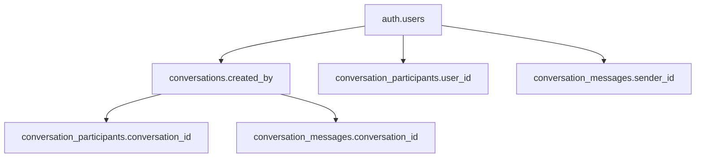

# **Comprehensive Action Plan: Conversation Creation Authentication Fix**

## **Current System Analysis**

### **✅ Authentication Status**
- User is successfully authenticated (ID: `cc4c3714-5579-4cf7-8063-7bab35b3651e`)
- Network requests show valid JWT tokens and proper authorization headers
- Session is active with proper role (`authenticated`)

### **🔍 Identified Issues from Previous Analysis**
1. **Primary Issue**: Authentication state mismatch between frontend (`getUser()`) and backend RLS (`auth.uid()`)
2. **Secondary Issue**: Potential timing issues with session establishment
3. **Tertiary Issue**: PostgreSQL errors showing "invalid input syntax for type uuid: 'never'"

---

## **Phase 1: Database Schema & RLS Policy Validation**

### **Objectives**
- Verify conversation-related table integrity
- Validate RLS policies for conversation creation
- Check for any constraint violations

### **Impact Assessment**
- **Dependencies Affected**: `conversations`, `conversation_participants`, `conversation_messages` tables
- **Foreign Key Relationships**: 
  - `conversation_participants.conversation_id → conversations.id`
  - `conversation_messages.conversation_id → conversations.id`
  - `conversations.created_by → auth.users.id`

### **Testing Protocol**
1. **Pre-Step Verification**:
   - Run database linter to check RLS policies
   - Verify table constraints and foreign key relationships
   - Check for any policy recursion issues

2. **Post-Step Validation**:
   - Confirm all RLS policies are functioning correctly
   - Test basic database operations with current authentication
   - Verify no constraint violations exist

### **Success Criteria**
- [ ] All RLS policies pass validation
- [ ] No database constraint errors
- [ ] Foreign key relationships are intact

---

## **Phase 2: Frontend Authentication State Consistency**

### **Objectives**
- Ensure consistent session handling across all conversation operations
- Implement proper error handling for authentication failures
- Add comprehensive logging for debugging

### **Impact Assessment**
- **Files Affected**: `useOptimizedConversations.ts`, potentially `useAuth.tsx`
- **Components Dependent**: All messaging components, car detail contact buttons
- **User Flows Affected**: New conversation creation, message sending, conversation loading

### **Testing Protocol**
1. **Pre-Step Verification**:
   - Document current authentication flow
   - Test conversation creation attempt (expect failure)
   - Capture detailed error logs

2. **Post-Step Validation**:
   - Test conversation creation with new session handling
   - Verify error messages are user-friendly
   - Confirm logging provides sufficient debugging info

### **Success Criteria**
- [ ] Session-based authentication implemented
- [ ] Proper error handling for auth failures
- [ ] Comprehensive logging in place

---

## **Phase 3: Database Function Implementation (Fallback)**

### **Objectives**
- Create secure database function as fallback for conversation creation
- Ensure proper authentication context in database operations

### **Impact Assessment**
- **Database Changes**: New security definer function
- **API Changes**: Potential new RPC call implementation
- **Security Impact**: Enhanced security through database-level authentication

### **Testing Protocol**
1. **Pre-Step Verification**:
   - Test if frontend fixes resolved the issue
   - Document remaining authentication problems

2. **Post-Step Validation**:
   - Test database function execution
   - Verify RLS policies work with new function
   - Confirm no security vulnerabilities introduced

### **Success Criteria**
- [ ] Database function executes successfully
- [ ] Authentication context properly maintained
- [ ] No security issues introduced

---

## **Phase 4: End-to-End Integration Testing**

### **Objectives**
- Validate complete conversation creation flow
- Test all conversation-related operations
- Ensure robust error handling

### **Impact Assessment**
- **User Experience**: Complete messaging functionality
- **System Performance**: No degradation in response times
- **Error Recovery**: Proper handling of edge cases

### **Testing Protocol**
1. **Comprehensive Test Suite**:
   - Test conversation creation from car details
   - Test message sending and receiving
   - Test conversation loading and history
   - Test error scenarios (network failures, auth expiry)

2. **Cross-Browser/Device Testing**:
   - Test on different browsers
   - Test with session refresh scenarios
   - Test with network interruptions

### **Success Criteria**
- [ ] All conversation operations work correctly
- [ ] Error handling is robust and user-friendly
- [ ] Performance is acceptable
- [ ] Cross-platform compatibility confirmed

---

## **Critical Dependencies & Foreign Key Analysis**

### **Database Schema Dependencies**

### **Code Dependencies**
- **Primary**: `useOptimizedConversations.ts` → All messaging components
- **Secondary**: `useAuth.tsx` → Authentication state management
- **Tertiary**: Car detail components → Contact button functionality

### **API Dependencies**
- Supabase Auth API
- Supabase Database REST API
- Real-time subscriptions for message updates

---

## **Risk Assessment & Mitigation**

### **High Risk Items**
1. **Session Timing Issues**: Mitigate with retry logic and session validation
2. **RLS Policy Failures**: Mitigate with database function fallback
3. **User Experience Disruption**: Mitigate with graceful error handling

### **Medium Risk Items**
1. **Performance Degradation**: Monitor with detailed logging
2. **Cross-Browser Compatibility**: Test thoroughly across platforms

### **Low Risk Items**
1. **Database Schema Changes**: Minimal impact with proper foreign key handling

---

## **Success Metrics**

### **Technical Metrics**
- [ ] 0% conversation creation failure rate
- [ ] <500ms response time for conversation operations  
- [ ] 100% RLS policy compliance
- [ ] 0 authentication-related errors in logs

### **User Experience Metrics**
- [ ] Contact buttons create conversations successfully
- [ ] Error messages are clear and actionable
- [ ] No user workflow interruptions
- [ ] Seamless authentication handling

---

## **Rollback Plan**

### **If Phase 1 Fails**
- Revert to previous database state
- Document specific RLS policy issues
- Consider alternative authentication approach

### **If Phase 2 Fails**
- Revert `useOptimizedConversations.ts` changes
- Maintain current authentication flow
- Implement minimal logging for continued debugging

### **If Phase 3 Fails**
- Remove database function
- Document security concerns
- Focus on frontend-only solutions

### **If Phase 4 Fails**
- Implement progressive rollback of working phases
- Maintain partial functionality where possible
- Plan iterative improvement approach

---

## **Implementation Checklist**

### **Phase 1: Database Validation**
- [ ] Run Supabase linter on conversation tables
- [ ] Verify RLS policies syntax and logic
- [ ] Test database constraints
- [ ] Check for recursive policy issues
- [ ] Validate foreign key relationships

### **Phase 2: Frontend Authentication**
- [ ] Replace `getUser()` with `getSession()` in conversation hooks
- [ ] Add session validation before mutations
- [ ] Implement retry logic for failed operations
- [ ] Add comprehensive error handling
- [ ] Include detailed logging for debugging

### **Phase 3: Database Function (If Needed)**
- [ ] Create `create_conversation_secure` function
- [ ] Implement proper authentication context
- [ ] Test function execution permissions
- [ ] Update frontend to use RPC calls if needed
- [ ] Verify security definer functionality

### **Phase 4: Integration Testing**
- [ ] Test conversation creation from car details
- [ ] Test message sending and receiving
- [ ] Test real-time message updates
- [ ] Test error scenarios and recovery
- [ ] Verify cross-platform compatibility
- [ ] Performance testing and optimization

---

This action plan provides a structured approach to systematically resolve the conversation creation authentication issues while maintaining system integrity and user experience.