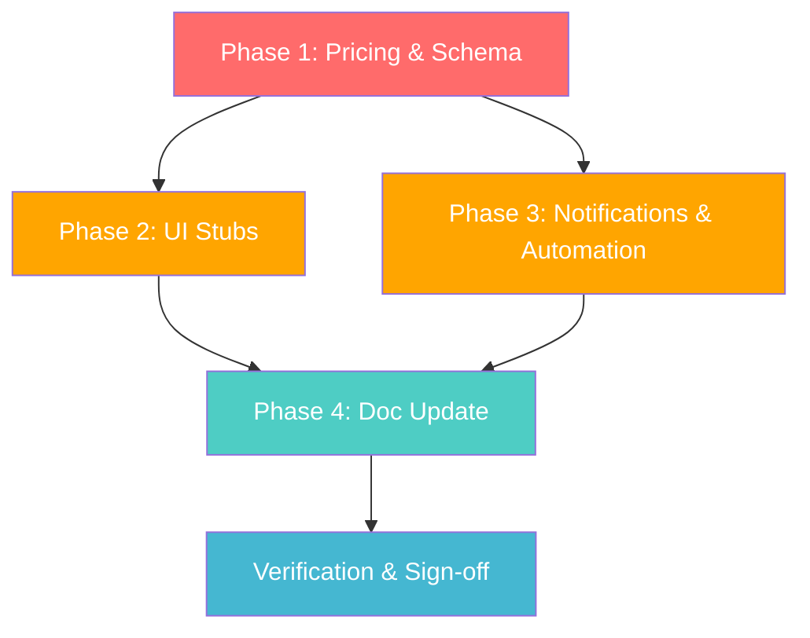

# Insurance Module — Production Readiness Implementation Plan

**Date:** 23 March 2026  
**Sprint:** Sprint 8 Candidate (March 24–30, 2026)  
**Status:** DRAFT — Awaiting Review  
**Objective:** Close all remaining gaps to bring the Damage Protection module to production-ready status.

---

## Background & Context

The insurance / Damage Protection module was initially built over Oct–Dec 2025 and declared "100% complete" in [INSURANCE_README.md](file:///c:/Users/Administrator/.cursor/Mobi%20Rides%20v1/docs/INSURANCE_README.md). A March 2026 audit revealed that while the core happy-path is wired end-to-end, key components are stubs, critical DB tables are missing from migrations, the pricing model has diverged from the Pay-U SLA, and several features have never been tested in production.

### Related Documentation

| Document | Path | Relevance |
|---|---|---|
| Damage Protection Overview | [20260305_DAMAGE_PROTECTION_OVERVIEW.md](file:///c:/Users/Administrator/.cursor/Mobi%20Rides%20v1/docs/20260305_DAMAGE_PROTECTION_OVERVIEW.md) | Section 12 lists known gaps; Section 13 has the roadmap |
| Pay-U SLA | [20260319_DAMAGE_PROTECTION_SLA_PAYU.md](file:///c:/Users/Administrator/.cursor/Mobi%20Rides%20v1/docs/20260319_DAMAGE_PROTECTION_SLA_PAYU.md) | Defines the agreed pricing model, excess rates, and SLAs |
| Insurance README | [INSURANCE_README.md](file:///c:/Users/Administrator/.cursor/Mobi%20Rides%20v1/docs/INSURANCE_README.md) | Original build documentation (Dec 2025) |
| Insurance Integration Plan (v2) | [insurance-integration-plan-2025-11-12.md](file:///c:/Users/Administrator/.cursor/Mobi%20Rides%20v1/docs/insurance-integration-plan-2025-11-12.md) | Original technical plan |
| Admin Settings Plan | [20260322_ADMIN_SETTINGS_IMPLEMENTATION_PLAN.md](file:///c:/Users/Administrator/.cursor/Mobi%20Rides%20v1/docs/20260322_ADMIN_SETTINGS_IMPLEMENTATION_PLAN.md) | Dependent — Insurance Settings section depends on `platform_settings` table |
| Migration Protocol | [MIGRATION_PROTOCOL.md](file:///c:/Users/Administrator/.cursor/Mobi%20Rides%20v1/docs/conventions/MIGRATION_PROTOCOL.md) | 5-point migration impact checklist |
| Privacy Policy | [PRIVACY_POLICY.md](file:///c:/Users/Administrator/.cursor/Mobi%20Rides%20v1/docs/PRIVACY_POLICY.md) | Data retention requirements for claim evidence |
| GTM Plan | [20260206_MobiRides_Commercialization_GTM_Plan.md](file:///c:/Users/Administrator/.cursor/Mobi%20Rides%20v1/docs/20260206_MobiRides_Commercialization_GTM_Plan.md) | Revenue-per-booking targets that insurance feeds into |

---

## Gap Analysis Summary

### 🔴 Critical (Blocks Production Launch)

| # | Gap | Current State | Impact |
|---|---|---|---|
| G1 | **Pricing model mismatch** | Code uses % of rental (0.25/0.50/1.00 seeded). SLA defines flat daily rates: Basic P80, Standard P150, Premium P250 | Renters are overcharged or undercharged vs SLA terms |
| G2 | **Excess model mismatch** | Code uses fixed Pula amounts (P300/P500/P1,000). SLA defines percentages: Basic 20%, Standard 15%, Premium 10% | Claim payouts do not match contractual obligations |
| G3 | **Missing DB tables** | `insurance_commission_rates` and `premium_remittance_batches` are documented in the overview but never migrated | Remittance tracking and commission management have no storage |
| G4 | **Excess payment is simulated** | `ExcessPaymentModal.tsx` uses `setTimeout(2000)` and is not connected to any real payment gateway or integrated into the claim flow | Excess cannot be collected from renters |

### 🟡 Important (Degrades Quality / Trust)

| # | Gap | Current State | Impact |
|---|---|---|---|
| G5 | **`InsuranceComparison.tsx` is a stub** | 19-line placeholder: "Compare total with and without insurance in the summary." | Users cannot compare tier benefits side-by-side during booking |
| G6 | **`PolicyDetailsCard.tsx` is a stub** | 19-line minimal card; not used anywhere in the app | Policy detail views are incomplete |
| G7 | **Notification type workaround** | Host claim notifications use `booking_request_received` enum instead of a proper `insurance_claim_filed` type | Misleading notification categories; may confuse notification filtering |
| G8 | **Email templates not deployed** | 4 Resend templates referenced but not created: `insurance-policy-confirmation`, `insurance-claim-received`, `insurance-claim-update`, `insurance-host-claim-notification` | Email notifications fail silently |
| G9 | **pg_cron not verified** | `expire-policies-hourly` job depends on pg_cron extension; not confirmed enabled in production Supabase project | Policies may never auto-expire |

### 🟢 Nice-to-Have (Polish / Future)

| # | Gap | Current State | Impact |
|---|---|---|---|
| G10 | **No integration / E2E tests** | Referenced `__tests__/insuranceClaims.test.tsx` does not exist; `test_insurance_features.ts` is non-functional | No automated safety net for regressions |
| G11 | **Underwriter uses simulated data** | Driver age factor uses placeholder logic; loyalty data uses `Math.random()` | Risk scoring is non-deterministic in edge cases |
| G12 | **INSURANCE_README.md is stale** | Claims 100% complete, last updated Dec 2025 | Misleads new engineers about true module status |

---

## Proposed Changes

### Phase 1 — Pricing & Schema Alignment (Critical)

> [!CAUTION]
> The SLA pricing model (flat daily rates + percentage-based excess) differs significantly from the current code implementation (percentage of rental + fixed Pula excess). **This must be resolved before production launch** to avoid contractual non-compliance with Pay-U.

> [!IMPORTANT]
> **Decision required from product/business**: Which pricing model is canonical — the SLA flat-rate model or the percentage-based model? The migration below assumes the SLA is authoritative and converts the code to match.

---

#### [NEW] [20260323000100_align_insurance_pricing_with_sla.sql](file:///c:/Users/Administrator/.cursor/Mobi%20Rides%20v1/supabase/migrations/20260323000100_align_insurance_pricing_with_sla.sql)

```sql
-- Consumers: src/services/insuranceService.ts, src/components/insurance/InsurancePackageSelector.tsx
-- Impact: UPDATE existing insurance_packages rows to match Pay-U SLA pricing
-- Rollback: Re-run with original values (0.00/0.25/0.50/1.00 percentages, P300/P500/P1000 excess)
```

Changes to `insurance_packages` table:

| Column | Current (Seeded) | Updated (SLA-Aligned) | Notes |
|---|---|---|---|
| Add `daily_premium_amount` | *(does not exist)* | P0 / P80 / P150 / P250 | New column for flat daily rate |
| `premium_percentage` | 0.00 / 0.25 / 0.50 / 1.00 | 0.00 / 0.10 / 0.15 / 0.20 | Recalibrated per overview doc roadmap |
| `excess_amount` | P0 / P300 / P1,000 / P500 | Kept as-is OR converted to `excess_percentage` | Depends on business decision |
| Add `excess_percentage` | *(does not exist)* | 0 / 0.20 / 0.15 / 0.10 | New column per SLA |
| `coverage_cap` | P0 / P15,000 / P50,000 / P50,000 | P0 / P8,000 / P20,000 / P50,000 | Aligned with SLA Section 3.1 |

**Migration also adds two new tables:**

**`insurance_commission_rates`** — stores the 90/10 revenue split configuration:

| Column | Type | Description |
|---|---|---|
| `id` | uuid PK | |
| `rate` | decimal | Commission rate (0.10 for 10%) |
| `effective_from` | timestamptz | Start date |
| `effective_until` | timestamptz | Null = current rate |
| `min_premium_amount` | decimal | Minimum premium for commission |
| `max_commission_amount` | decimal | Cap per policy |
| `created_at` | timestamptz | Auto |

**`premium_remittance_batches`** — tracks Pay-U remittances:

| Column | Type | Description |
|---|---|---|
| `id` | uuid PK | |
| `batch_number` | text UNIQUE | Auto-generated batch reference |
| `batch_date` | date NOT NULL | Remittance date |
| `period_start` / `period_end` | date | Coverage period for the batch |
| `total_premium_amount` | decimal | Gross premiums |
| `commission_amount` | decimal | MobiRides 10% share |
| `remittance_amount` | decimal | Pay-U 90% share |
| `policy_count` | integer | Number of policies in batch |
| `status` | text | `pending`, `remitted`, `confirmed` |
| `payment_reference` | text | Bank transfer reference |
| `remitted_at` | timestamptz | When payment was made |
| `confirmed_at` | timestamptz | When Pay-U confirmed receipt |
| `created_by` | uuid FK | Admin who created the batch |
| `notes` | text | |
| `created_at` | timestamptz | Auto |

Seed default commission rate: `{ rate: 0.10, effective_from: '2026-03-23' }`.

RLS: `SELECT` for authenticated, `INSERT/UPDATE/DELETE` for super_admin.

---

#### [MODIFY] [insuranceService.ts](file:///c:/Users/Administrator/.cursor/Mobi%20Rides%20v1/src/services/insuranceService.ts)

- **`calculatePremium()`** (line 74): Add dual-mode pricing logic.
  - If package has `daily_premium_amount > 0`, use flat rate: `Premium = daily_premium_amount × numberOfDays × riskMultiplier`
  - Otherwise fall back to percentage mode: `Premium = dailyRentalAmount × premium_percentage × numberOfDays × riskMultiplier`
  - This ensures backward compatibility while supporting the SLA model.
- **`calculateClaimPayout()`** (line 343): Add percentage-based excess support.
  - If `excess_percentage` is present on the package, calculate: `excess = approvedAmount × excess_percentage`
  - Otherwise fall back to the fixed `excess_amount` value.
  - Read `admin_fee` from `platform_settings` table (dependency on [Admin Settings plan](file:///c:/Users/Administrator/.cursor/Mobi%20Rides%20v1/docs/20260322_ADMIN_SETTINGS_IMPLEMENTATION_PLAN.md)) with P150 hardcoded fallback.

#### [MODIFY] [InsurancePackageSelector.tsx](file:///c:/Users/Administrator/.cursor/Mobi%20Rides%20v1/src/components/insurance/InsurancePackageSelector.tsx)

- Update premium display to show the flat daily rate when `daily_premium_amount` is present.
- Show excess as percentage (e.g., "20% of approved claim") instead of fixed Pula when `excess_percentage` is available.

#### [MODIFY] [insurance-schema.ts](file:///c:/Users/Administrator/.cursor/Mobi%20Rides%20v1/src/types/insurance-schema.ts)

- Add `daily_premium_amount?: number` and `excess_percentage?: number` to the `InsurancePackage` type.

---

### Phase 2 — Stub Components & UI Completion

#### [MODIFY] [InsuranceComparison.tsx](file:///c:/Users/Administrator/.cursor/Mobi%20Rides%20v1/src/components/insurance/InsuranceComparison.tsx)

Replace 19-line stub with a full comparison table/modal:
- Fetch all active packages via `InsuranceService.getInsurancePackages()`.
- Render a side-by-side comparison grid: tier name, daily premium, coverage cap, excess rate, covered incidents, exclusions.
- Visually highlight the currently selected tier.
- Include a "Select" button per tier that calls back to the booking flow.

#### [MODIFY] [PolicyDetailsCard.tsx](file:///c:/Users/Administrator/.cursor/Mobi%20Rides%20v1/src/components/insurance/PolicyDetailsCard.tsx)

Replace 19-line stub with a comprehensive policy detail card:
- Accept an `InsurancePolicy` object (with joined package data).
- Display: policy number, status badge, coverage period, tier name, premium paid, coverage cap, excess, claim eligibility.
- Include a "Download PDF" button linking to `policy_document_url`.
- Include a "File a Claim" button (conditionally shown if policy is active).
- Wire into `PolicyDocumentsView.tsx` to replace the current minimal display.

#### [MODIFY] [ExcessPaymentModal.tsx](file:///c:/Users/Administrator/.cursor/Mobi%20Rides%20v1/src/components/insurance/ExcessPaymentModal.tsx)

- Remove the simulated `setTimeout(2000)` payment.
- Wire to the real payment service (DPO/Paygate via the existing `PaymentMethodSelector` flow that `RenterPaymentModal` uses).
- Add error handling and proper loading states.

#### Wire `ExcessPaymentModal` into the claim approval flow

- In `AdminClaimsDashboard.tsx` or `UserClaimsList.tsx`: after a claim status changes to `approved`, trigger the modal for the renter to pay excess before payout is processed.

---

### Phase 3 — Notification & Automation Fixes

#### [NEW] [20260323000200_add_insurance_notification_type.sql](file:///c:/Users/Administrator/.cursor/Mobi%20Rides%20v1/supabase/migrations/20260323000200_add_insurance_notification_type.sql)

```sql
-- Consumers: src/services/insuranceService.ts (line 673)
-- Impact: Adds 'insurance_claim_filed' to the notification_type enum
-- Rollback: ALTER TYPE notification_type DROP VALUE is not possible in PG; use a comment-out approach
```

- Add `insurance_claim_filed` and `insurance_claim_update` to the notification type enum.
- Update the workaround in `insuranceService.ts:673` to use the proper type.

#### Email Template Deployment

Not a code task — requires Resend dashboard configuration:

| Template ID | Subject Pattern | Template Needed |
|---|---|---|
| `insurance-policy-confirmation` | Insurance Policy Confirmation - INS-YYYY-XXXXXX | ✅ |
| `insurance-claim-received` | Claim Received - CLM-YYYY-XXXXX | ✅ |
| `insurance-claim-update` | Claim Status Update - CLM-YYYY-XXXXX: STATUS | ✅ |
| `insurance-host-claim-notification` | Insurance Claim Filed for Your Vehicle - CLM-YYYY-XXXXX | ✅ |

#### pg_cron Verification

- Verify pg_cron extension is enabled in the production Supabase project.
- Verify the `expire-policies-hourly` job is scheduled: `SELECT * FROM cron.job WHERE jobname = 'expire-policies-hourly'`.
- If not present, re-run migration `20251224010000_insurance_expiration_job.sql`.
- Test by manually calling `SELECT expire_insurance_policies()`.

---

### Phase 4 — Documentation Update

#### [MODIFY] [INSURANCE_README.md](file:///c:/Users/Administrator/.cursor/Mobi%20Rides%20v1/docs/INSURANCE_README.md)

- Update status from "100% COMPLETE" to reflect actual state.
- Update completion date.
- Add pricing model section reflecting the SLA-aligned values.
- Remove references to non-existent test files.

#### [MODIFY] [20260305_DAMAGE_PROTECTION_OVERVIEW.md](file:///c:/Users/Administrator/.cursor/Mobi%20Rides%20v1/docs/20260305_DAMAGE_PROTECTION_OVERVIEW.md)

- Update Section 12 (Current Status & Known Gaps) to mark completed items.
- Update Section 3 (Coverage Tiers & Pricing) with the final aligned model once the business decision on pricing is confirmed.

---

## Implementation Sequencing



| Phase | Est. Effort | Dependencies |
|---|---|---|
| Phase 1 — Pricing & Schema | ~4–6 hours | **Business decision on pricing model** |
| Phase 2 — UI Stubs | ~4–6 hours | Phase 1 (schema changes) |
| Phase 3 — Notifications | ~2–3 hours | None (can run in parallel with Phase 2) |
| Phase 4 — Doc Update | ~1 hour | Phases 1–3 complete |
| **Total** | **~11–16 hours** | |

---

## Impact Assessment

### Risk Matrix

| Area | Risk | Mitigation |
|---|---|---|
| `insurance_packages` data update | 🔴 High — changes premium values for all future bookings | Migration is additive (new columns); existing `premium_percentage` column retained for fallback |
| `coverage_cap` reduction (P50K → P20K for Standard) | 🔴 High — existing policies issued at P50K cap still apply | Only affects *new* policies; existing policies keep their snapshot values |
| Excess model change (fixed → percentage) | 🟡 Medium — changes payout calculations | Dual-mode logic: if `excess_percentage` exists use it, else use `excess_amount` |
| New DB tables | 🟢 Low — additive only | No existing tables modified |
| Notification enum addition | 🟢 Low — enum additions are non-breaking | Old `booking_request_received` workaround still works |
| Email template deployment | 🟢 Low — failure is already handled silently | Service already has try/catch; templates failing is non-blocking |

### Breaking Changes

**None for existing bookings/policies.** All changes are:
- Additive columns with defaults
- New tables
- Dual-mode logic that falls back to existing behaviour

**For new bookings after migration:** premiums and excess amounts will change to match the SLA. This is intentional and required.

---

## Verification Plan

### Automated Tests

1. **Build verification**:
   ```bash
   npm run build
   ```
   Must complete with zero TypeScript errors after all code changes.

2. **Type check**:
   ```bash
   npx tsc --noEmit
   ```

### Browser Tests

3. **Booking flow with insurance** — Log in as a renter, initiate a booking:
   - Navigate to Step 3 (Damage Protection) in the booking wizard.
   - Verify premiums display the new flat daily rate amounts (P80/P150/P250) if the SLA model is chosen, or the recalibrated percentages.
   - Select Standard tier and verify the premium calculation updates correctly.
   - Complete booking and verify the insurance policy is created.

4. **Insurance comparison** — On Step 3 of booking:
   - Verify the `InsuranceComparison` component renders a full side-by-side comparison (not placeholder text).
   - Verify each tier shows: daily rate, coverage cap, excess %, covered incidents.

5. **Policy details** — Navigate to `/insurance-policies`:
   - Verify `PolicyDetailsCard` renders full policy details (not a minimal stub).
   - Verify "Download PDF" button works.

6. **Claims flow** — Navigate to `/claims`:
   - Submit a test claim on an active policy.
   - Verify the correct notification type appears (not `booking_request_received`).

7. **Admin claims dashboard** — Navigate to `/admin/claims`:
   - Approve a claim.
   - Verify excess is calculated using the percentage model if applicable.
   - Verify payout is credited to the renter's wallet.

### Manual Verification

8. **Remittance table** — Query Supabase:
   ```sql
   SELECT * FROM insurance_commission_rates;
   SELECT * FROM premium_remittance_batches;
   ```
   Verify both tables exist and the default commission rate (0.10) is seeded.

9. **pg_cron verification** — In Supabase SQL Editor:
   ```sql
   SELECT * FROM cron.job WHERE jobname = 'expire-policies-hourly';
   SELECT expire_insurance_policies();
   ```
   Verify the job exists and the function executes without error.

10. **Resend email template check** — Verify all 4 templates exist in the Resend dashboard (manual check by team member with Resend access).

11. **Pricing alignment spot-check** — Query seeded packages after migration:
    ```sql
    SELECT name, premium_percentage, daily_premium_amount, coverage_cap, excess_amount, excess_percentage
    FROM insurance_packages
    ORDER BY sort_order;
    ```
    Verify values match the Pay-U SLA Section 3.1.

> [!NOTE]
> There are no existing automated tests for the insurance module (the referenced `insuranceClaims.test.tsx` does not exist). Writing integration tests is recommended as a follow-up task but is not gated for this production readiness push.
