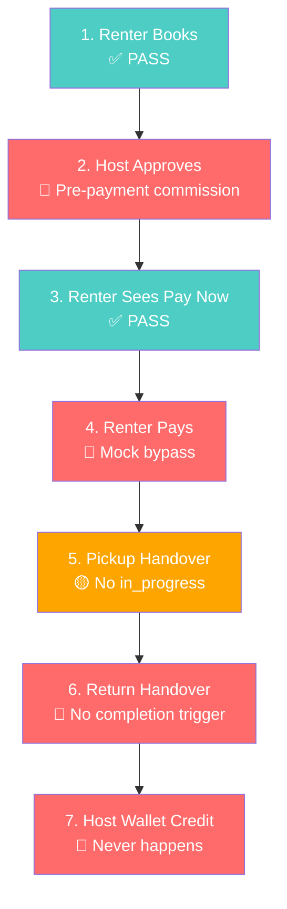
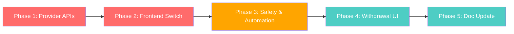

# Payment Module — Production Readiness Implementation Plan

**Date:** 23 March 2026  
**Sprint:** Sprint 8+ Candidate  
**Status:** DRAFT — Awaiting Review  
**Objective:** Map all gaps between the current mock-based payment system and production-ready PayGate/Ooze integration, providing a phased plan to close them.

---

## Prerequisites

> [!IMPORTANT]
> The following must be obtained **before** any sandbox testing can begin. None are needed for the mock flow fixes (Phase 0).

| Prerequisite | Provider | Status | Owner |
|---|---|---|---|
| PayGate Merchant ID (`PAYGATE_ID`) | PayGate (DVLP/FNB Botswana) | ❓ Not obtained | Business team |
| PayGate Encryption Key (`PAYGATE_SECRET`) | PayGate | ❓ Not obtained | Business team |
| PayGate Sandbox/Test credentials | PayGate | ❓ Not obtained | Business team |
| Ooze Botswana API key (`OOZE_API_KEY`) | Ooze Botswana | ❓ Not obtained | Business team |
| Ooze Merchant ID (`OOZE_MERCHANT_ID`) | Ooze Botswana | ❓ Not obtained | Business team |
| Ooze Webhook Secret (`OOZE_WEBHOOK_SECRET`) | Ooze Botswana | ❓ Not obtained | Business team |
| Ooze API documentation | Ooze Botswana | ❓ Not obtained | Business team |
| PayGate API documentation (PayWeb3) | PayGate | ✅ Available at `paygate.co.za/docs` | Engineering |

---

## Background & Context

The payment module was architecturally designed in a [3,000-line implementation document](file:///c:/Users/Administrator/.cursor/Mobi%20Rides%20v1/docs/PAYMENT_INTEGRATION_IMPLEMENTATION.md) (v1.3, Feb 2026) covering a 5-phase custodial payment model. The **UI layer** and **database schema** are largely complete. However, all payment processing currently runs through **mock services** (`mockPaymentService.ts`, `mockBookingPaymentService.ts`) with simulated delays, and edge functions contain placeholder provider integration. This is an intentional development-mode approach that has allowed the team to iterate on payment flow sequencing and trigger bugs without real money movement.

### Related Documentation

| Document | Path | Relevance |
|---|---|---|
| Payment Integration Implementation | [PAYMENT_INTEGRATION_IMPLEMENTATION.md](file:///c:/Users/Administrator/.cursor/Mobi%20Rides%20v1/docs/PAYMENT_INTEGRATION_IMPLEMENTATION.md) | Master technical spec (3,000 lines); defines all flows, schemas, edge functions |
| Admin Settings Plan | [20260322_ADMIN_SETTINGS_IMPLEMENTATION_PLAN.md](file:///c:/Users/Administrator/.cursor/Mobi%20Rides%20v1/docs/20260322_ADMIN_SETTINGS_IMPLEMENTATION_PLAN.md) | `platform_settings` table will house configurable payment params |
| Insurance Readiness Plan | [20260323_INSURANCE_PRODUCTION_READINESS_PLAN.md](file:///c:/Users/Administrator/.cursor/Mobi%20Rides%20v1/docs/20260323_INSURANCE_PRODUCTION_READINESS_PLAN.md) | Insurance excess payment and premium split depend on real payment flow |
| Damage Protection SLA | [20260319_DAMAGE_PROTECTION_SLA_PAYU.md](file:///c:/Users/Administrator/.cursor/Mobi%20Rides%20v1/docs/20260319_DAMAGE_PROTECTION_SLA_PAYU.md) | Premium remittance to Pay-U depends on payment collection |
| Migration Protocol | [MIGRATION_PROTOCOL.md](file:///c:/Users/Administrator/.cursor/Mobi%20Rides%20v1/docs/conventions/MIGRATION_PROTOCOL.md) | Migration naming and impact assessment conventions |
| Sprint Execution | [WEEK_3_MARCH_2026_SPRINT_EXECUTION.md](file:///c:/Users/Administrator/.cursor/Mobi%20Rides%20v1/docs/Product%20Status/WEEK_3_MARCH_2026_SPRINT_EXECUTION.md) | Payment flow fixes were a Sprint 7 focus (5 iterations) |

---

## Mock Payment Flow Trace & Analysis (Phase 0)

> [!CAUTION]
> This section maps the **expected** booking-to-payout lifecycle against the **actual code paths**. Five critical misalignments were found that must be resolved **before** sandbox testing, even while still using mock payments.

### Expected Flow

```
Renter books → Host confirms → Renter prompted to pay (24h deadline) → Renter pays
→ Booking confirmed → Pickup date → Handover → Vehicle returned → Host wallet credited
```

### Step-by-Step Code Trace

#### Step 1: Renter Creates Booking ✅ PASS

| Expected | Actual Code Path | Verdict |
|---|---|---|
| Renter creates booking request, status = `pending` | `BookingDialog.tsx` → Supabase insert with `status: 'pending'` | ✅ Correct |

#### Step 2: Host Approves Booking ⚠️ ISSUE — Pre-Payment Commission

| Expected | Actual Code Path | Verdict |
|---|---|---|
| Host clicks Approve → status changes to `awaiting_payment` | [BookingRequestDetails.tsx:153](file:///c:/Users/Administrator/.cursor/Mobi%20Rides%20v1/src/pages/BookingRequestDetails.tsx#L153) → calls `handleApprove()` → `updateBookingStatus.mutate({ status: 'awaiting_payment' })` | ✅ Status change correct |
| 24h payment deadline is set | [bookingLifecycle.ts:42](file:///c:/Users/Administrator/.cursor/Mobi%20Rides%20v1/src/services/bookingLifecycle.ts#L42) → `payment_deadline = now + 24h` | ✅ Deadline set |
| Renter is notified to pay | [bookingLifecycle.ts:72](file:///c:/Users/Administrator/.cursor/Mobi%20Rides%20v1/src/services/bookingLifecycle.ts#L72) → `pushNotificationService.sendBookingNotification(renter_id, { type: 'awaiting_payment' })` | ✅ Notification sent |
| **No money moves yet** | [BookingRequestDetails.tsx:107](file:///c:/Users/Administrator/.cursor/Mobi%20Rides%20v1/src/pages/BookingRequestDetails.tsx#L107) → `commissionService.processCommissionOnBookingConfirmation()` → [commissionDeduction.ts:44](file:///c:/Users/Administrator/.cursor/Mobi%20Rides%20v1/src/services/commission/commissionDeduction.ts#L44) → **deducts commission from host wallet** | 🔴 **WRONG: Commission deducted from host wallet BEFORE renter pays** |

> [!WARNING]
> **Double Commission Risk**: The host approval flow calls `deductCommissionFromEarnings()` which subtracts 15% commission from the host's wallet. Then, the `payment-webhook` edge function (line 49) also calculates `platform_commission = rental_portion * 0.15`. If both flows run, commission is charged twice. In the current mock flow, the webhook never fires (the mock bypasses it), so only the host-wallet deduction runs. But in production, **both** would execute.
>
> **Fix required**: Remove the pre-payment commission deduction from `BookingRequestDetails.tsx`. Commission should only be taken from the renter's payment via the webhook, not from the host wallet.

#### Step 3: Renter Sees Payment Prompt ✅ PASS

| Expected | Actual Code Path | Verdict |
|---|---|---|
| Renter sees "Pay Now" button with countdown | [RentalActions.tsx:63](file:///c:/Users/Administrator/.cursor/Mobi%20Rides%20v1/src/components/rental-details/RentalActions.tsx#L63) → Button shown when `status === 'awaiting_payment' && payment_status !== 'paid' && isRenter` | ✅ Correct |
| Payment deadline countdown visible | [RentalDetailsRefactored.tsx:196](file:///c:/Users/Administrator/.cursor/Mobi%20Rides%20v1/src/pages/RentalDetailsRefactored.tsx#L196) → `PaymentDeadlineTimer` with urgency states | ✅ Correct |
| Homepage banner shows unpaid booking | [PaymentRequiredBanner.tsx:30](file:///c:/Users/Administrator/.cursor/Mobi%20Rides%20v1/src/components/home/PaymentRequiredBanner.tsx#L30) → Queries `status = 'awaiting_payment'` | ✅ Correct |
| Deep link from banner to payment | `PaymentRequiredBanner.tsx:71` → navigates to `/rental-details/{id}?pay=true` → auto-opens modal | ✅ Correct |

#### Step 4: Renter Pays ⚠️ ISSUE — Mock Bypass

| Expected | Actual Code Path | Verdict |
|---|---|---|
| Payment modal opens | [RentalDetailsRefactored.tsx:222](file:///c:/Users/Administrator/.cursor/Mobi%20Rides%20v1/src/pages/RentalDetailsRefactored.tsx#L222) → `RenterPaymentModal` opens | ✅ Correct |
| Renter selects method and pays | [RenterPaymentModal.tsx:58](file:///c:/Users/Administrator/.cursor/Mobi%20Rides%20v1/src/components/booking/RenterPaymentModal.tsx#L58) → calls `initiatePayment()` from `useBookingPayment` hook | ✅ UI correct |
| Payment goes through gateway | [useBookingPayment.ts:38](file:///c:/Users/Administrator/.cursor/Mobi%20Rides%20v1/src/hooks/useBookingPayment.ts#L38) → calls `mockBookingPaymentService.processPayment()` → **setTimeout(2000)** | 🟡 **Mock: Simulated, not real** |
| Webhook updates DB | [useBookingPayment.ts:48](file:///c:/Users/Administrator/.cursor/Mobi%20Rides%20v1/src/hooks/useBookingPayment.ts#L48) → Bypasses webhook entirely; manually calls `bookingLifecycle.updateStatus(booking_id, 'confirmed')` | 🔴 **WRONG: Webhook flow completely bypassed. No `payment_transaction` record created. No `credit_pending_earnings()` called.** |
| Booking status → `confirmed`, payment_status → `paid` | [bookingLifecycle.ts:43-44](file:///c:/Users/Administrator/.cursor/Mobi%20Rides%20v1/src/services/bookingLifecycle.ts#L43) → Sets `payment_status: 'paid'` when status transitions to `confirmed` | ✅ Status change works |
| Host notified | [bookingLifecycle.ts:82-95](file:///c:/Users/Administrator/.cursor/Mobi%20Rides%20v1/src/services/bookingLifecycle.ts#L82) → Sends notifications to both host and renter | ✅ Notifications sent |

> [!WARNING]
> **Mock shortcut skips critical path**: The mock flow calls `bookingLifecycle.updateStatus('confirmed')` directly, which:
> - ✅ Sets `payment_status: 'paid'` (correct)
> - ❌ Does NOT create a `payment_transactions` record
> - ❌ Does NOT call `credit_pending_earnings()` to update `host_wallets.pending_balance`
> - ❌ Does NOT record `platform_commission` or `host_earnings`
>
> This means the **admin PaymentTransactionsTable will show NO transactions** and the **host wallet pending_balance is never updated**.

#### Step 5: Pickup Date → Handover ✅ MOSTLY PASS

| Expected | Actual Code Path | Verdict |
|---|---|---|
| Pickup only allowed when paid | [useRentalDetails.ts:122-127](file:///c:/Users/Administrator/.cursor/Mobi%20Rides%20v1/src/hooks/useRentalDetails.ts#L122) → `isPendingPickup` requires `status === 'confirmed' && payment_status === 'paid'` | ✅ Correct guard |
| "Initiate Pickup" button appears on start date | [RentalActions.tsx:130](file:///c:/Users/Administrator/.cursor/Mobi%20Rides%20v1/src/components/rental-details/RentalActions.tsx#L130) → `canHandover` button | ✅ Correct |
| Handover session created | [useRentalDetails.ts:184](file:///c:/Users/Administrator/.cursor/Mobi%20Rides%20v1/src/hooks/useRentalDetails.ts#L184) → `createHandoverSession()` | ✅ Correct |
| Booking status → `in_progress` | No code found that transitions booking from `confirmed` → `in_progress` after pickup handover completion | 🔴 **MISSING: No `in_progress` transition** |

> [!NOTE]
> The `bookingLifecycle.ts` type includes `in_progress` as a valid status, and `useRentalDetails.ts` checks for it (line 130), but no code ever sets it. The system works around this: `isInProgress` is true when `(status === 'confirmed' || status === 'in_progress') && pickupSession exists`. So the handover flow functionally works, but the booking status in the DB stays as `confirmed` throughout the rental.

#### Step 6: Vehicle Return → Booking Completed ⚠️ ISSUE — No Completion Trigger

| Expected | Actual Code Path | Verdict |
|---|---|---|
| Return handover completed | `useRentalDetails.ts` → checks `returnSession.handover_completed` or all steps completed | ✅ Detection works |
| Booking status → `completed` | **No code found** that transitions booking from `confirmed`/`in_progress` → `completed` after return handover | 🔴 **MISSING: No automatic completion** |
| `isCompleted` flag set | [useRentalDetails.ts:141](file:///c:/Users/Administrator/.cursor/Mobi%20Rides%20v1/src/hooks/useRentalDetails.ts#L141) → `isCompleted = booking.status === 'completed' || returnCompleted` → Frontend treats return handover completion as "completed" visually | 🟡 **UI workaround**: Frontend shows completed state but DB still says `confirmed` |

#### Step 7: Host Wallet Credited 🔴 FAIL — Never Happens

| Expected | Actual Code Path | Verdict |
|---|---|---|
| Host wallet `pending_balance` → `balance` | `release_pending_earnings()` DB function exists but is **never called from any frontend or service code** | 🔴 **MISSING: Earnings never release** |
| Wallet transaction of type `earnings_released` created | `WalletTransactionHistory.tsx` UI supports displaying `earnings_released` but no code creates such transactions | 🔴 **MISSING** |
| `release-earnings` edge function runs on schedule | Edge function directory exists but not verified to be scheduled or contain correct logic | ⚠️ **Unverified** |

### Flow Summary: 5 Critical Misalignments



| # | Issue | Where | Fix |
|---|---|---|---|
| **F1** | Commission deducted from host wallet before renter pays | [BookingRequestDetails.tsx:107](file:///c:/Users/Administrator/.cursor/Mobi%20Rides%20v1/src/pages/BookingRequestDetails.tsx#L107) | Remove pre-payment commission; commission comes from renter's payment |
| **F2** | Mock payment bypasses webhook — no `payment_transaction`, no `pending_balance` credit | [useBookingPayment.ts:48](file:///c:/Users/Administrator/.cursor/Mobi%20Rides%20v1/src/hooks/useBookingPayment.ts#L48) | Mock should create a `payment_transactions` record and call `credit_pending_earnings()` |
| **F3** | No `in_progress` status transition after pickup handover | Not implemented anywhere | Add `bookingLifecycle.updateStatus(bookingId, 'in_progress')` after pickup handover completion |
| **F4** | No `completed` status transition after return handover | Not implemented anywhere | Add `bookingLifecycle.updateStatus(bookingId, 'completed')` after return handover completion |
| **F5** | Host earnings never released (`pending_balance` → `balance`) | `release_pending_earnings()` RPC exists but never called | Call after booking status → `completed`, or via scheduled `release-earnings` edge function |

> [!IMPORTANT]
> **Fixes F1–F5 should be implemented BEFORE Phase 1 (provider integration)**. They represent sequencing bugs in the mock flow itself. Getting the mock flow correctly mirroring the production architecture is essential groundwork — otherwise we'll be debugging payment gateway issues and flow logic issues simultaneously.

---

## Current State Inventory

### ✅ What's Built

| Layer | Component | Status | Notes |
|---|---|---|---|
| **Database** | `payment_transactions` | ✅ Migrated | Created in `20260204000000_create_payment_tables.sql` |
| **Database** | `withdrawal_requests` | ✅ Migrated | + fix in `20260207000004_fix_withdrawal_function.sql` |
| **Database** | `payout_details` | ✅ Migrated | Host bank/mobile money storage |
| **Database** | `payment_config` | ✅ Migrated | Key-value config with seeded defaults |
| **Database** | `bookings` columns | ✅ Migrated | `payment_status`, `payment_deadline`, `payment_transaction_id` |
| **Database** | `host_wallets.pending_balance` | ✅ Migrated | Pending vs available balance tracking |
| **Database** | `booking_status` enum | ✅ Migrated | `awaiting_payment` value added in `20260205000003` |
| **Database** | DB Functions | ✅ Migrated | `credit_pending_earnings()`, `release_pending_earnings()`, `process_withdrawal_request()`, `wallet_topup()` |
| **Edge Functions** | `initiate-payment/` | ⚠️ Scaffolded | Creates transaction record; **no real PayGate/Ooze API call** |
| **Edge Functions** | `payment-webhook/` | ⚠️ Scaffolded | Has commission split logic; **receives mock payloads, no checksum validation** |
| **Edge Functions** | `query-payment/` | ⚠️ Scaffolded | Basic lookup; **no PayGate query API call** |
| **Edge Functions** | `process-withdrawal/` | ⚠️ Scaffolded | Approve/reject logic; **no bank/mobile payout API** |
| **Edge Functions** | `expire-bookings/` | ⚠️ Exists | Directory exists, needs verification |
| **Edge Functions** | `release-earnings/` | ⚠️ Exists | Directory exists, needs verification |
| **Frontend** | `RenterPaymentModal.tsx` | ✅ Built | Full UI with price summary, method selector, deadline timer |
| **Frontend** | `PaymentMethodSelector.tsx` | ✅ Built | Card + OrangeMoney options |
| **Frontend** | `PaymentDeadlineTimer.tsx` | ✅ Built | Live countdown with urgency states |
| **Frontend** | `PaymentRequiredBanner.tsx` | ✅ Built | Homepage banner for unpaid bookings |
| **Frontend** | `PaymentNotificationPreview.tsx` | ✅ Built | Notification card for payment events |
| **Frontend** | `RentalPaymentDetails.tsx` | ✅ Built | Booking detail payment breakdown |
| **Frontend** | `PaymentTransactionsTable.tsx` | ✅ Built | Admin table with search, journey dialog |
| **Frontend** | `WalletBalanceCard.tsx` | ✅ Built | Host wallet display |
| **Frontend** | `WalletTransactionHistory.tsx` | ✅ Built | Transaction log |
| **Frontend** | `WalletCommissionSection.tsx` | ✅ Built | Commission display in booking request view |
| **Service** | `walletTopUp.ts` | ✅ Real logic | Uses `wallet_topup` RPC (real DB update) |
| **Service** | `walletBalance.ts` | ✅ Real logic | Balance queries |
| **Service** | `walletOperations.ts` | ✅ Real logic | Wallet CRUD |
| **Mock** | `mockPaymentService.ts` | 🔴 In use | Host wallet top-ups (simulated, 95% random success) |
| **Mock** | `mockBookingPaymentService.ts` | 🔴 In use | Renter booking payments (deterministic error triggers via decimals) |
| **Hook** | `useBookingPayment.ts` | 🔴 Uses mock | Calls `mockBookingPaymentService` directly; simulates webhook via `bookingLifecycle.updateStatus()` |

---

## Gap Analysis

### 🔴 Critical (Blocks Real Money Movement)

| # | Gap | Current State | Production Requirement |
|---|---|---|---|
| P1 | **No PayGate API integration** | `initiate-payment` returns mock redirect URL | Implement PayGate PayWeb3 `initiate.trans` with MD5 checksum and redirect flow |
| P2 | **No Ooze API integration** | No OrangeMoney/MyZaka/Smega API calls anywhere | Implement Ooze Botswana API for mobile money initiation |
| P3 | **No webhook checksum validation** | `payment-webhook` accepts any payload | Validate PayGate MD5 checksum; validate Ooze webhook signature |
| P4 | **No payment return page** | User returns to generic URL after payment gateway | Create `/payment/return` route that queries transaction status and shows result |
| P5 | **Frontend uses mock service** | `useBookingPayment.ts` imports `mockBookingPaymentService` | Switch to calling `initiate-payment` edge function, then redirect to gateway |
| P6 | **No real payout/withdrawal API** | `process-withdrawal` line 97: "In real life, trigger bank API here" | Implement PayGate/Ooze payout disbursement API |
| P7 | **Host wallet top-up uses mock** | `mockPaymentService.ts` simulates payment with `setTimeout` | Wire `TopUpModal.tsx` to call `initiate-payment` or a dedicated top-up edge function |

### 🟡 Important (Flow Correctness & Safety)

| # | Gap | Current State | Impact |
|---|---|---|---|
| P8 | **No refund flow** | `payment_transactions.status` supports `refunded` but no code handles it | Cannot process refunds for cancelled bookings |
| P9 | **No idempotency guard on webhook** | Webhook checks `status === 'completed'` but no distributed lock | Duplicate webhooks could double-credit host earnings |
| P10 | **Commission rate hardcoded in webhook** | `payment-webhook` line 49: `rental_portion * 0.15` | Should read from `commission_rates` table (ties into Admin Settings plan) |
| P11 | **`@ts-expect-error` in all edge functions** | 6+ `@ts-expect-error` annotations suppressing type safety | Type definitions need updating to match DB schema |
| P12 | **Payment failure doesn't reset booking** | Failed payment sets `payment_status: 'failed'` but leaves booking in `awaiting_payment` | Renter gets stuck; needs retry logic or auto-expire |
| P13 | **No PayGate sandbox testing** | No test mode configuration | Need `PAYGATE_TEST_MODE` env var and test credentials for staging |
| P14 | **`expire-bookings` scheduling unverified** | Edge function directory exists but cron trigger unknown | Unpaid bookings may never expire |
| P15 | **`release-earnings` scheduling unverified** | Edge function directory exists but cron trigger unknown | Host earnings may never move from pending to available |

### 🟢 Nice-to-Have (Post-Launch)

| # | Gap | Current State | Notes |
|---|---|---|---|
| P16 | **No MyZaka/Smega support** | `PaymentMethodSelector` only shows Card + OrangeMoney | Planned for Q2 2026 per spec |
| P17 | **No payment history page for renters** | Spec calls for `/payments` page | Renters can't view past transactions |
| P18 | **No withdrawal UI for hosts** | `WithdrawalForm` and `PayoutDetailsForm` referenced in spec but not built | Hosts can't request withdrawals from the app |
| P19 | **GCash/Maya references in mock** | `mockPaymentService.ts` lists Philippine payment methods | Vestigial naming from early development |
| P20 | **No receipt/invoice generation** | No PDF receipt for completed payments | Professional receipts for renters and hosts |

---

## Proposed Changes

### Phase 0 — Mock Flow Fixes (Must pass before sandbox testing)

> [!IMPORTANT]
> These fixes ensure the mock payment flow correctly mirrors the production architecture. All 5 fixes below must pass before moving to Phase 1.

#### [MODIFY] [BookingRequestDetails.tsx](file:///c:/Users/Administrator/.cursor/Mobi%20Rides%20v1/src/pages/BookingRequestDetails.tsx)

**Fix F1: Remove pre-payment commission deduction**

- Remove lines 100-115: the `commissionService.processCommissionOnBookingConfirmation()` call.
- Host wallet should only require P50 minimum balance to accept (checked by `walletValidation.ts`), but no commission should be deducted.
- Commission will be taken from the renter's payment (via webhook in production, or via mock simulation for now).

#### [MODIFY] [useBookingPayment.ts](file:///c:/Users/Administrator/.cursor/Mobi%20Rides%20v1/src/hooks/useBookingPayment.ts)

**Fix F2: Mock should mirror the production data flow**

After mock payment succeeds (line 40-53), add the following before setting status to `confirmed`:
1. Create a `payment_transactions` record in the DB with the mock transaction data.
2. Calculate commission split: `platform_commission = rental_portion * 0.15`, `host_earnings = rental_portion * 0.85`.
3. Call `credit_pending_earnings()` RPC to update `host_wallets.pending_balance`.
4. Link the transaction to the booking via `bookings.payment_transaction_id`.

This ensures the admin `PaymentTransactionsTable` shows data and `WalletTransactionHistory` reflects real wallet movements.

#### [MODIFY] Handover Completion Logic (new)

**Fix F3 & F4: Add status transitions after handover**

In the handover completion callback (likely in the map/handover page after all steps are marked complete):
- After **pickup** handover completes: call `bookingLifecycle.updateStatus(bookingId, 'in_progress')`.
- After **return** handover completes: call `bookingLifecycle.updateStatus(bookingId, 'completed')`.

#### [MODIFY] [bookingLifecycle.ts](file:///c:/Users/Administrator/.cursor/Mobi%20Rides%20v1/src/services/bookingLifecycle.ts)

**Fix F5: Trigger earnings release when booking completes**

In the `handleSideEffects()` function, add a `completed` case that:
1. Calls `supabase.rpc('release_pending_earnings', { p_booking_id: bookingId })` to move funds from `pending_balance` to `balance`.
2. Sends a "Your earnings are now available" notification to the host.

---

### Phase 1 — Provider API Integration (Critical Path)

> [!CAUTION]
> This phase involves real money. All changes must be developed and tested against **PayGate sandbox** and **Ooze test environment** before any production deployment.

#### Environment Variables Required

| Variable | Purpose | Where |
|---|---|---|
| `PAYGATE_ID` | PayGate merchant ID | Supabase Edge Function secrets |
| `PAYGATE_SECRET` | PayGate encryption key | Supabase Edge Function secrets |
| `PAYGATE_TEST_MODE` | Toggle sandbox mode | Supabase Edge Function secrets |
| `OOZE_API_KEY` | Ooze Botswana API key | Supabase Edge Function secrets |
| `OOZE_MERCHANT_ID` | Ooze merchant identifier | Supabase Edge Function secrets |
| `OOZE_WEBHOOK_SECRET` | Ooze webhook signature key | Supabase Edge Function secrets |

---

#### [MODIFY] [initiate-payment/index.ts](file:///c:/Users/Administrator/.cursor/Mobi%20Rides%20v1/supabase/functions/initiate-payment/index.ts)

Current: Returns mock redirect URL (line 76).

Changes:
- **Add PayGate PayWeb3 integration**: Call `https://secure.paygate.co.za/payweb3/initiate.trans` with PAYGATE_ID, REFERENCE, AMOUNT (in cents), CURRENCY=BWP, RETURN_URL, NOTIFY_URL, and MD5 checksum.
- **Add Ooze OrangeMoney integration**: Call Ooze API with merchant credentials for mobile money payment initiation.
- **Add test mode support**: When `PAYGATE_TEST_MODE=true`, use PayGate test credentials.
- **Validate booking status** is exactly `awaiting_payment` before proceeding.
- **Return real redirect URL** from PayGate or Ooze payment reference.
- **Remove** mock `REF_${Date.now()}` reference generation.

#### [MODIFY] [payment-webhook/index.ts](file:///c:/Users/Administrator/.cursor/Mobi%20Rides%20v1/supabase/functions/payment-webhook/index.ts)

Current: Accepts mock JSON payload with `{ transaction_id, status, provider_ref }`.

Changes:
- **Parse PayGate form-encoded POST** body (PayGate sends form data, not JSON).
- **Validate MD5 checksum** using `PAYGATE_SECRET` to prevent spoofed webhooks.
- **Map PayGate TRANSACTION_STATUS** codes: `1`=Approved → completed, `2`=Declined → failed, `4`=Cancelled → cancelled.
- **Add Ooze webhook handler** with signature verification.
- **Read commission rate from `commission_rates` table** instead of hardcoded 0.15.
- **Add distributed idempotency**: Check `payment_transactions.completed_at` is null before processing.
- **Return 200 OK** with no body (PayGate requirement).

#### [MODIFY] [process-withdrawal/index.ts](file:///c:/Users/Administrator/.cursor/Mobi%20Rides%20v1/supabase/functions/process-withdrawal/index.ts)

Current: Line 97-98 says "In real life, trigger bank API here"; generates fake `PAYOUT_${Date.now()}` ref.

Changes:
- **Add PayGate payout disbursement** API call for bank transfers.
- **Add Ooze payout API** for OrangeMoney disbursements.
- **Store real provider reference** from the payout response.
- **Handle async payout confirmation** (some payouts settle T+1).

#### [MODIFY] [query-payment/index.ts](file:///c:/Users/Administrator/.cursor/Mobi%20Rides%20v1/supabase/functions/query-payment/index.ts)

Changes:
- **Add PayGate query API** call to `https://secure.paygate.co.za/payweb3/query.trans`.
- **Reconcile status**: If PayGate says completed but local says initiated, trigger the fund allocation flow.

---

### Phase 2 — Frontend Flow Switch

#### [MODIFY] [useBookingPayment.ts](file:///c:/Users/Administrator/.cursor/Mobi%20Rides%20v1/src/hooks/useBookingPayment.ts)

Current: Imports `mockBookingPaymentService` and simulates webhook via `bookingLifecycle.updateStatus()`.

Changes:
- **Replace mock service call** with `supabase.functions.invoke('initiate-payment', { body: { booking_id, payment_method, success_url, cancel_url } })`.
- **Handle redirect**: For card payments, redirect the user to the `paymentUrl` returned by the edge function. For OrangeMoney, show a "waiting for USSD confirmation" state.
- **Remove** the manual `bookingLifecycle.updateStatus('confirmed')` call — the webhook handles this now.
- **Add environment flag** (`USE_MOCK_PAYMENTS`) to preserve mock mode for development.

#### [NEW] PaymentReturnPage.tsx

Located at: `src/pages/PaymentReturnPage.tsx`

- Route: `/payment/return`
- On mount, reads `transaction_id` from URL query params.
- Calls `query-payment` edge function to get current status.
- Shows success/failure/pending UI.
- On success, navigates to booking details.

#### [MODIFY] [App.tsx](file:///c:/Users/Administrator/.cursor/Mobi%20Rides%20v1/src/App.tsx)

- Add route for `/payment/return` → `PaymentReturnPage`.

#### [MODIFY] [RenterPaymentModal.tsx](file:///c:/Users/Administrator/.cursor/Mobi%20Rides%20v1/src/components/booking/RenterPaymentModal.tsx)

- When `useBookingPayment` returns a redirect URL, open it (either in-app redirect or new tab for card).
- For OrangeMoney, show a polling/waiting state checking transaction status.

---

### Phase 3 — Flow Safety & Automation

#### Booking Expiration

Verify `expire-bookings/index.ts` contains logic to:
- Query bookings where `status = 'awaiting_payment' AND payment_deadline < NOW()`.
- Update to `status = 'expired'`.
- Send notification.
- Ensure a cron trigger is configured (pg_cron or Supabase scheduled function).

#### Earnings Release

Verify `release-earnings/index.ts` contains logic to:
- Query completed bookings where `end_date + 24h < NOW()` and pending earnings exist.
- Call `release_pending_earnings()` DB function.
- Send "Earnings available" notification to host.

#### Payment Failure Recovery

- In `useBookingPayment.ts` or `RenterPaymentModal.tsx`, if payment fails:
  - Keep booking as `awaiting_payment` (not `expired`).
  - Allow retry by re-initiating payment.
  - Show remaining time on deadline timer.
- In `payment-webhook`, on failure:
  - Update `payment_transactions.status = 'failed'` only (don't touch booking status).
  - Create a new `payment_transaction` if renter retries.

#### Refund Flow

Create new edge function or extend `process-withdrawal/:

- `refund-payment/index.ts`: Admin-triggered refund for cancelled bookings.
- Call PayGate refund API or Ooze reversal API.
- Create `payment_transactions` record with `status = 'refunded'`.
- Debit host `pending_balance` if earnings were already credited.

---

### Phase 4 — Host Withdrawal UI & Polish

#### [NEW] WithdrawalRequestForm.tsx

- `src/components/wallet/WithdrawalRequestForm.tsx`
- Form to request withdrawal: amount input, payout method selection.
- Validates against minimum withdrawal (P200) and available balance.
- Calls `process_withdrawal_request()` RPC.

#### [NEW] PayoutDetailsForm.tsx

- `src/components/wallet/PayoutDetailsForm.tsx`
- Add/edit bank account or mobile money details.
- Saves to `payout_details` table.

#### [MODIFY] Wallet.tsx

- Add withdrawal request form.
- Show pending_balance vs available_balance separately.
- Display withdrawal history.

#### Clean Up Mock Services

- **Add `USE_MOCK_PAYMENTS` feature flag** to `featureFlags.ts`.
- **Gate mock imports** in `useBookingPayment.ts`: if flag is on, use mock; if off, use edge functions.
- **Remove** Philippine payment method names (GCash, Maya) from `mockPaymentService.ts`.
- **Do NOT delete mock services** — retain for development and testing.

---

### Phase 5 — Documentation Update

#### [MODIFY] [PAYMENT_INTEGRATION_IMPLEMENTATION.md](file:///c:/Users/Administrator/.cursor/Mobi%20Rides%20v1/docs/PAYMENT_INTEGRATION_IMPLEMENTATION.md)

- Update Section 16 (Mock Renter Service) to reflect the feature flag approach.
- Add "Production Deployment Checklist" section.
- Mark completed items in the implementation timeline.

---

## Implementation Sequencing



| Phase | Est. Effort | Dependencies |
|---|---|---|
| Phase 1 — Provider APIs | ~8-12 hours | PayGate credentials, Ooze API docs, sandbox access |
| Phase 2 — Frontend Switch | ~4-6 hours | Phase 1 complete |
| Phase 3 — Safety & Automation | ~4-6 hours | Phase 2 complete |
| Phase 4 — Withdrawal UI | ~4-6 hours | Can start in parallel with Phase 3 |
| Phase 5 — Doc Update | ~1-2 hours | All phases complete |
| **Total** | **~21-32 hours** | |

---

## Impact Assessment

### Risk Matrix

| Area | Risk | Mitigation |
|---|---|---|
| Real money movement | 🔴 Critical — errors cause financial loss | PayGate sandbox testing; amount validation; idempotency guards |
| Edge function deployment | 🟡 Medium — functions must be deployed together | Deploy in order: `initiate-payment` → `payment-webhook` → `query-payment` |
| Frontend switchover | 🟡 Medium — users mid-payment during deploy | Feature flag (`USE_MOCK_PAYMENTS`) allows gradual rollout |
| Commission calculation | 🟢 Low — already computed correctly in webhook | Just changing source from hardcoded to DB lookup |

### Breaking Changes

- **`useBookingPayment.ts`** will change its internal flow from mock → edge function. The hook's public API stays the same — `RenterPaymentModal` should not need changes beyond handling redirects.
- **`initiate-payment` edge function** response shape changes: adds `redirect_url` instead of mock auto-success URL.
- **No DB schema changes required** — all tables are already in place.

### Security Considerations

| Concern | Mitigation |
|---|---|
| Webhook spoofing | MD5 checksum validation (PayGate); HMAC signature (Ooze) |
| Amount tampering | Re-validate total from DB in edge function, not from client |
| Replay attacks | Idempotency check via `completed_at` timestamp |
| Service role key exposure | Edge functions already use `SUPABASE_SERVICE_ROLE_KEY` server-side |
| PCI compliance | PayGate handles card data; MobiRides never sees card numbers |

---

## Pre-Production Checklist

Before flipping `USE_MOCK_PAYMENTS` to `false`:

- [ ] PayGate sandbox credentials obtained and tested
- [ ] Ooze sandbox credentials obtained and tested
- [ ] All edge functions deployed to staging
- [ ] MD5 checksum validation passing in webhook
- [ ] Payment → booking confirmation flow verified end-to-end
- [ ] Payment failure → retry flow verified
- [ ] Booking expiration (24h timeout) verified
- [ ] Earnings release (post-rental) verified
- [ ] Admin can view transactions in `PaymentTransactionsTable`
- [ ] Withdrawal approve/reject flow verified
- [ ] Refund flow verified (if implemented)
- [ ] Load testing: 10 concurrent payments with no double-credit
- [ ] Legal: Terms of Service updated for payment processing
- [ ] Legal: Refund policy documented

---

## Verification Plan

### Sandbox Testing (Phase 1)

1. **PayGate sandbox payment**:
   - Deploy updated `initiate-payment` edge function to staging.
   - Use PayGate test card numbers.
   - Verify redirect to PayGate hosted payment page.
   - Verify webhook callback received and transaction updated.

2. **Ooze sandbox payment**:
   - Deploy with Ooze test credentials.
   - Initiate OrangeMoney payment.
   - Verify USSD prompt sent (or simulate callback).

### Integration Testing (Phase 2)

3. **End-to-end booking payment**:
   - Create booking as renter → Host approves → Renter pays via PayGate sandbox.
   - Verify: `payment_transactions.status = 'completed'`, `bookings.status = 'confirmed'`, `bookings.payment_status = 'paid'`, `host_wallets.pending_balance` increased by 85%.
   - Verify: Commission recorded in `payment_transactions.platform_commission`.

4. **Payment failure and retry**:
   - Use PayGate test card that triggers decline.
   - Verify renter can retry without creating a new booking.
   - Verify booking stays in `awaiting_payment` status.

5. **Payment return page**:
   - Complete sandbox payment.
   - Verify redirect to `/payment/return?transaction_id=xxx`.
   - Verify page shows correct status (success/failure).

### Automation Testing (Phase 3)

6. **Booking expiration**:
   - Create a booking with a past `payment_deadline`.
   - Trigger `expire-bookings` edge function manually.
   - Verify booking status changes to `expired`.

7. **Earnings release**:
   - Complete a booking and mark as `completed`.
   - Set `end_date` to 25+ hours ago.
   - Trigger `release-earnings` edge function.
   - Verify `host_wallets.pending_balance` decreased and `balance` increased.

### Build Verification

8. **TypeScript build**:
   ```bash
   npm run build
   ```
   Must succeed with zero errors.

9. **Type check**:
   ```bash
   npx tsc --noEmit
   ```
