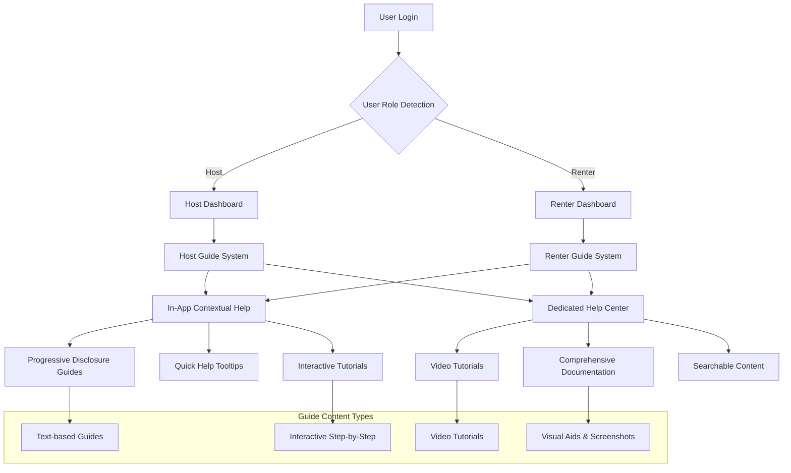
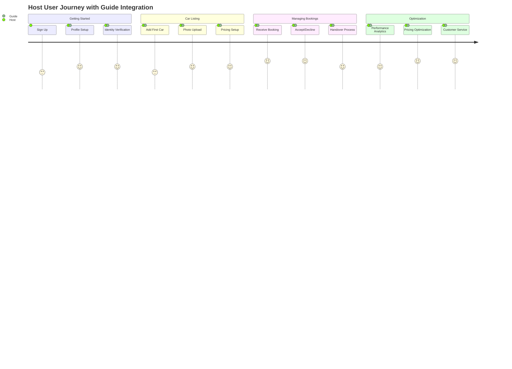
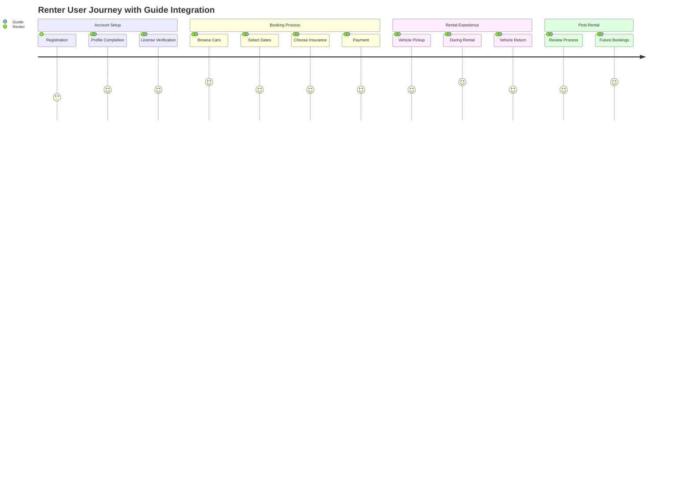
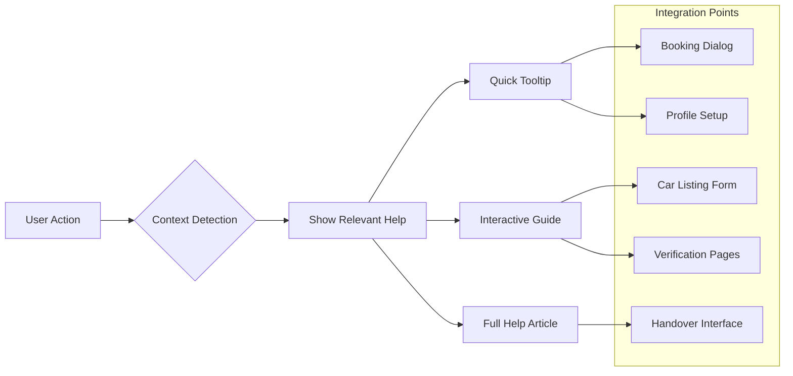
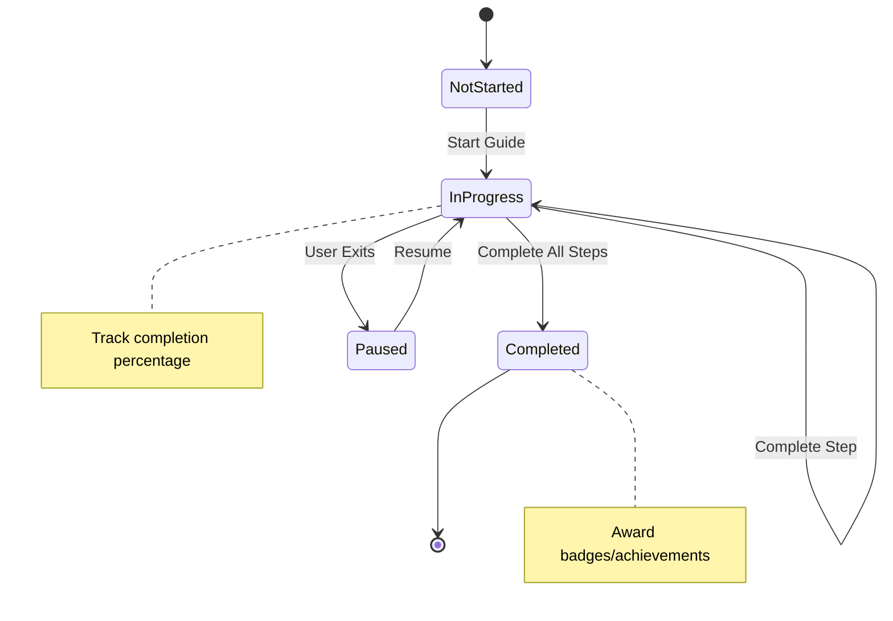

# Host & Renter Guide Development Recommendation

## Executive Summary

This document outlines the recommended approach for developing comprehensive hosting and renter guide documents for the MobiRides platform. The solution leverages a multi-modal guide system that combines in-app contextual help with a dedicated help center, ensuring users have access to relevant information at the right time in their journey.

## System Architecture Overview



## User Journey Integration





## Technical Implementation Plan

### Phase 1: Infrastructure Setup (20 minutes)

#### Database Schema
```sql
-- Guide content management
CREATE TABLE guides (
  id UUID PRIMARY KEY DEFAULT gen_random_uuid(),
  title TEXT NOT NULL,
  slug TEXT UNIQUE NOT NULL,
  content JSONB NOT NULL,
  guide_type TEXT NOT NULL, -- 'host', 'renter', 'shared'
  category TEXT NOT NULL,
  priority INTEGER DEFAULT 0,
  is_published BOOLEAN DEFAULT false,
  created_at TIMESTAMP WITH TIME ZONE DEFAULT now(),
  updated_at TIMESTAMP WITH TIME ZONE DEFAULT now()
);

-- User guide progress tracking
CREATE TABLE user_guide_progress (
  id UUID PRIMARY KEY DEFAULT gen_random_uuid(),
  user_id UUID REFERENCES auth.users(id),
  guide_id UUID REFERENCES guides(id),
  progress INTEGER DEFAULT 0, -- percentage completed
  completed_at TIMESTAMP WITH TIME ZONE,
  created_at TIMESTAMP WITH TIME ZONE DEFAULT now()
);
```

#### Core Components Structure
```
src/components/guides/
├── GuideLayout.tsx          # Common layout for all guides
├── GuideSection.tsx         # Individual guide sections
├── GuideNavigation.tsx      # Guide-specific navigation
├── InteractiveGuide.tsx     # Step-by-step interactive tutorials
├── ContextualHelp.tsx       # In-app help buttons/tooltips
└── GuideProgressTracker.tsx # Progress tracking component
```

### Phase 2: Help Center Pages (30 minutes)

#### Route Structure
```
/help                    # Main help center with role-based routing
├── /help/host          # Host-specific guides
│   ├── getting-started
│   ├── listing-cars
│   ├── managing-bookings
│   ├── handover-process
│   └── earnings-optimization
├── /help/renter        # Renter-specific guides
│   ├── account-setup
│   ├── booking-process
│   ├── verification
│   ├── pickup-return
│   └── safety-guidelines
└── /help/search        # Searchable help content
```

#### Content Structure for Host Guides

##### 1. Getting Started Guide
- **Platform Overview**: Understanding MobiRides ecosystem
- **Account Setup**: Profile completion, verification requirements
- **Host Dashboard**: Navigation and key features overview
- **First Steps Checklist**: Essential tasks for new hosts

##### 2. Listing Your Car Guide
- **Car Requirements**: Vehicle eligibility criteria
- **Photo Guidelines**: Professional photography tips
- **Description Writing**: Compelling car descriptions
- **Pricing Strategy**: Competitive pricing recommendations
- **Availability Management**: Calendar and scheduling best practices

##### 3. Managing Bookings Guide
- **Booking Requests**: How to evaluate and respond to requests
- **Communication**: Best practices for renter communication
- **Modification Handling**: Changes and cancellation policies
- **Performance Metrics**: Understanding your hosting stats

##### 4. Handover Process Guide
- **Pre-Handover Preparation**: Vehicle inspection checklist
- **Meeting Renters**: Professional handover protocols
- **Documentation**: Required paperwork and verification
- **Vehicle Condition Reports**: Damage assessment and reporting
- **Digital Signatures**: Using the handover system

##### 5. Earnings Optimization Guide
- **Revenue Analytics**: Understanding earnings reports
- **Pricing Optimization**: Dynamic pricing strategies
- **Seasonal Adjustments**: Peak and off-peak optimization
- **Fleet Management**: Scaling your car rental business
- **Tax Considerations**: Financial record keeping

#### Content Structure for Renter Guides

##### 1. Account Setup Guide
- **Registration Process**: Step-by-step account creation
- **Profile Completion**: Required information and verification
- **Payment Methods**: Adding and managing payment options
- **Communication Preferences**: Notification settings

##### 2. Booking Process Guide
- **Searching for Cars**: Filters and search optimization
- **Reading Listings**: Understanding car descriptions and reviews
- **Insurance Options**: Coverage types and recommendations
- **Booking Confirmation**: What happens after booking
- **Preparation Checklist**: Pre-rental preparation

##### 3. Verification Requirements Guide
- **Identity Verification**: KYC process explanation
- **License Verification**: Driver's license upload and validation
- **Additional Documents**: International driving permits, etc.
- **Verification Timeline**: Expected processing times

##### 4. Pickup and Return Guide
- **Pickup Process**: Meeting hosts and vehicle inspection
- **Vehicle Familiarization**: Safety features and operations
- **During Your Rental**: Best practices and responsibilities
- **Return Process**: End-of-rental procedures
- **Damage Reporting**: How to report issues

##### 5. Safety Guidelines
- **Driving Safely**: Road safety and local traffic rules
- **Emergency Procedures**: What to do in case of accidents
- **Contact Information**: Emergency contacts and support
- **Insurance Claims**: How to file claims when needed

### Phase 3: In-App Integration (25 minutes)

#### Contextual Help Integration Points



#### Progressive Disclosure System
- **Level 1**: Quick tooltips and hints
- **Level 2**: Contextual help panels
- **Level 3**: Interactive step-by-step guides
- **Level 4**: Full documentation links

### Phase 4: Interactive Features (15 minutes)

#### Progress Tracking System


#### Search and Discovery
- **Full-text search** across all guide content
- **Tag-based filtering** by category and user type
- **Popular articles** based on view counts
- **Related content** suggestions
- **Recently viewed** guides history

## Content Strategy

### Writing Guidelines
1. **User-Centric Language**: Write from the user's perspective
2. **Progressive Complexity**: Start simple, build to advanced topics
3. **Visual Learning**: Include screenshots and diagrams
4. **Actionable Steps**: Clear, numbered instructions
5. **Error Prevention**: Address common mistakes proactively

### Content Maintenance
- **Regular Updates**: Align with app feature changes
- **User Feedback Integration**: Continuous improvement based on user input
- **Performance Analytics**: Track guide effectiveness
- **Seasonal Content**: Update for peak periods and market changes

### Shared Resources
Both host and renter guides will share:
- **Platform Policies**: Terms of service, community guidelines
- **Safety Information**: General safety practices
- **Technical Support**: App troubleshooting and technical issues
- **Legal Information**: Insurance, liability, and legal requirements
- **Contact Information**: Customer support and emergency contacts

## Implementation Benefits

### For Users
- **Reduced Support Tickets**: Self-service problem resolution
- **Faster Onboarding**: Guided setup processes
- **Improved Success Rates**: Better understanding of platform features
- **Enhanced Confidence**: Clear expectations and procedures

### For Business
- **Scalable Support**: Reduced manual support burden
- **User Retention**: Better user experience leads to higher retention
- **Feature Adoption**: Guided discovery of advanced features
- **Quality Improvement**: Standardized best practices

### For Development Team
- **Maintainable Content**: Structured content management system
- **Analytics Integration**: Track guide usage and effectiveness
- **Iterative Improvement**: Data-driven content optimization
- **Consistent Experience**: Unified help system across the platform

## Success Metrics

### Usage Analytics
- Guide page views and time spent
- Search queries and success rates
- User progression through interactive guides
- Help-to-action conversion rates

### User Success Metrics
- Reduced support ticket volume
- Faster verification completion times
- Higher booking completion rates
- Improved user satisfaction scores

### Content Performance
- Most popular help articles
- Common search terms and gaps
- User feedback ratings
- Content update frequency and impact

## Technical Considerations

### Performance
- **Lazy Loading**: Load guide content on-demand
- **Caching Strategy**: Cache frequently accessed content
- **Mobile Optimization**: Responsive design for mobile users
- **Offline Access**: Critical guides available offline

### Accessibility
- **Screen Reader Support**: Proper semantic markup
- **Keyboard Navigation**: Full keyboard accessibility
- **High Contrast**: Support for accessibility themes
- **Text Size**: Scalable text for vision-impaired users

### Internationalization
- **Multi-language Support**: Prepare for localization
- **Cultural Adaptation**: Region-specific content considerations
- **RTL Support**: Right-to-left language compatibility

## Conclusion

This comprehensive guide system will significantly improve user onboarding, reduce support burden, and enhance overall platform usability. The multi-modal approach ensures that help is available when and where users need it most, leading to better user experiences and business outcomes.

The phased implementation approach allows for iterative development and testing, ensuring that each component works effectively before building on top of it. The system is designed to be scalable, maintainable, and aligned with the existing MobiRides platform architecture and design patterns.