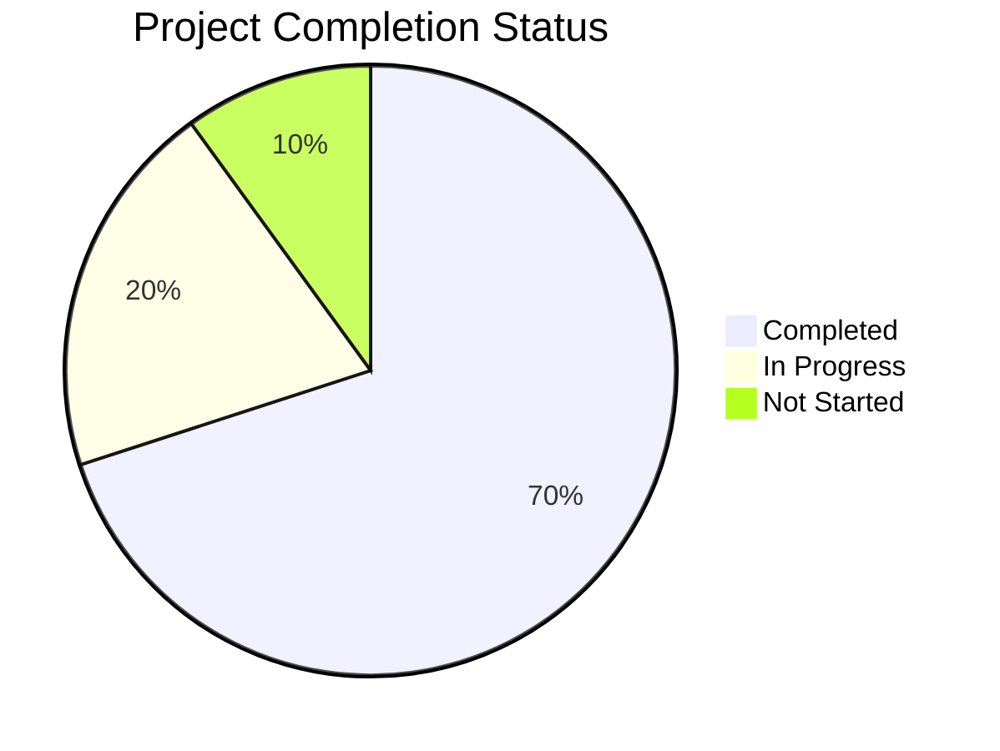
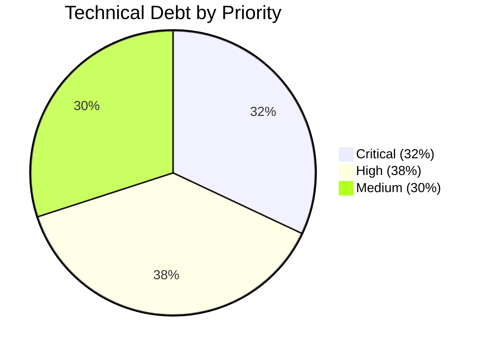
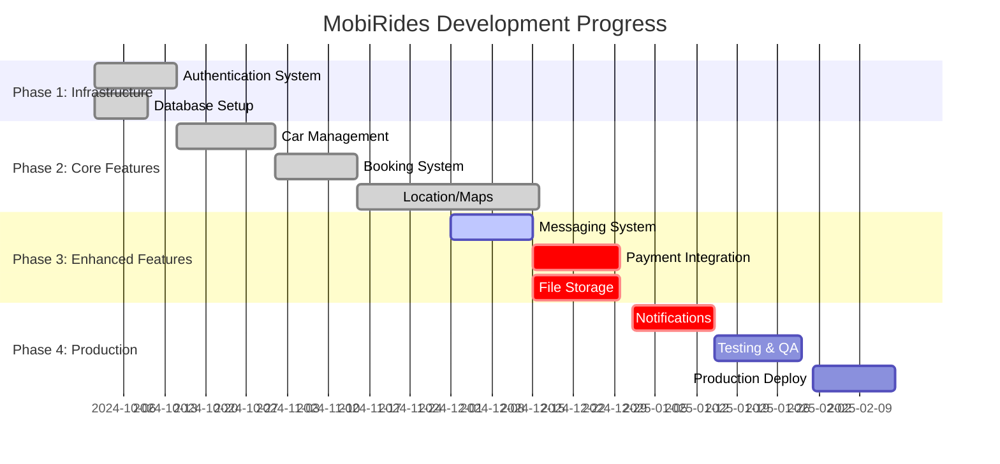
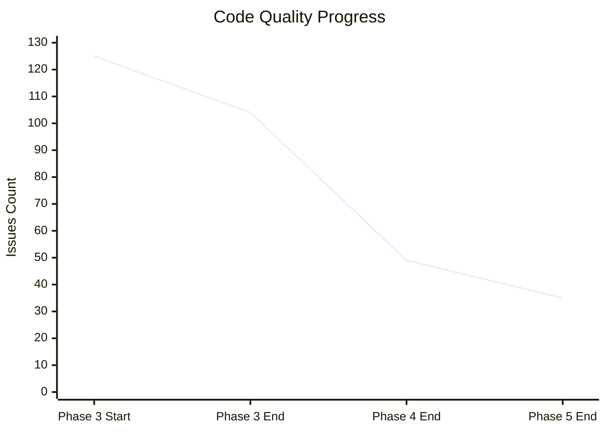

# 📊 **MOBIRIDES PROJECT STATUS UPDATE REPORT**

**Report Date:** December 2024  
**Project Phase:** Enhanced Features (Weeks 5-8)  
**Overall System Health:** 70% Complete  
**Production Readiness:** 75%  

---

## 📋 **EXECUTIVE SUMMARY**

MobiRides is a comprehensive car-sharing platform built with React 18, TypeScript, and Supabase, targeting the Botswana market. The project has achieved significant milestones in code quality and core feature implementation, with 70% overall completion. While the foundation is solid, critical production gaps remain in payment processing, file storage, and notification systems.

**Key Highlights:**
- ✅ **Major Achievement:** Complete type safety with zero TypeScript errors
- ✅ **Core Features:** Car management, booking system, and handover process fully functional
- ❌ **Critical Gaps:** Mock payment system, incomplete file storage, broken notifications
- 📈 **Code Quality:** 79% reduction in errors through systematic improvements

---

## 🎯 **1. CURRENT VS IDEAL STATE COMPARISON**

### **Feature Completion Matrix**

| Feature Category | Current State | Ideal State | Gap Analysis | Priority |
|------------------|---------------|-------------|--------------|----------|
| **Authentication** | ✅ Complete (100%) | ✅ Complete | None | ✅ Done |
| **Car Management** | ✅ Complete (95%) | ✅ Complete | Image validation, duplicate routes | 🔶 Medium |
| **Booking System** | ⚠️ Partial (85%) | ✅ Complete | Payment integration, expiry logic | 🔥 Critical |
| **Payment & Wallet** | ❌ Mock Only (30%) | ✅ Complete | Real payment gateway, PCI compliance | 🔥 Critical |
| **Messaging** | ⚠️ Partial (70%) | ✅ Complete | Dual systems, typing indicators | 🔶 Medium |
| **Notifications** | ❌ Broken (25%) | ✅ Complete | Push, email, SMS delivery | 🔥 Critical |
| **File Storage** | ❌ Mock Only (20%) | ✅ Complete | Real storage, validation, CDN | 🔥 Critical |
| **Handover** | ✅ Complete (90%) | ✅ Complete | Photo storage, GPS verification | 🔶 Medium |
| **Verification** | ⚠️ Partial (60%) | ✅ Complete | Admin UI, OCR, document storage | 🔥 Critical |
| **Reviews** | ✅ Complete (95%) | ✅ Complete | Moderation, image storage | 🔶 Medium |
| **Location/Maps** | ✅ Complete (100%) | ✅ Complete | None | ✅ Done |
| **Admin Dashboard** | ✅ Complete (85%) | ✅ Complete | Audit logging, advanced analytics | 🔶 Medium |

### **Detailed Feature Analysis**

#### **🟢 COMPLETED FEATURES**

**1. Authentication System**
- **Current:** Fully functional with Supabase integration
- **Ideal:** Complete secure authentication
- **Status:** ✅ **100% Complete**
- **Features:** Login, registration, password reset, session management, protected routes

**2. Car Management System**
- **Current:** Complete CRUD operations, search, filtering
- **Ideal:** Full car lifecycle management
- **Status:** ✅ **95% Complete**
- **Gap:** Duplicate route components, missing image validation

**3. Location & Map Features**
- **Current:** Mapbox integration, real-time tracking, active navigation, off-route detection, intersection preview
- **Ideal:** Comprehensive mapping solution
- **Status:** ✅ **100% Complete**
- **Gap:** None (Offline support added via IndexedDB)

#### **🟡 PARTIALLY COMPLETED FEATURES**

**4. Booking System**
- **Current:** Complete workflow, commission integration, conflict detection
- **Ideal:** End-to-end booking with real payments
- **Status:** ⚠️ **85% Complete**
- **Critical Gaps:** Real payment processing, booking expiry logic, payment validation

**5. Messaging System**
- **Current:** Real-time updates, conversation-based architecture
- **Ideal:** Complete communication platform
- **Status:** ⚠️ **70% Complete**
- **Critical Gaps:** Dual message systems, typing indicators, message status tracking

**6. Verification System**
- **Current:** 8-step KYC process, Botswana-specific requirements
- **Ideal:** Complete automated verification
- **Status:** ⚠️ **60% Complete**
- **Critical Gaps:** Admin review interface, OCR validation, document storage

#### **🔴 CRITICAL GAPS**

**7. Payment & Wallet System**
- **Current:** Mock service only, transaction tracking
- **Ideal:** Production-ready payment processing
- **Status:** ❌ **30% Complete**
- **Critical Gaps:** Real payment gateway, PCI compliance, payout system

**8. Notification System**
- **Current:** Preferences management, database integration
- **Ideal:** Multi-channel notification delivery
- **Status:** ❌ **25% Complete**
- **Critical Gaps:** Push notifications, email service, SMS integration

**9. File Storage**
- **Current:** UI components, mock uploads
- **Ideal:** Secure file management system
- **Status:** ❌ **20% Complete**
- **Critical Gaps:** Real storage backend, file validation, CDN integration

---

## 📈 **2. PROGRESS SINCE LAST REPORT**

### **🎉 COMPLETED TASKS & MILESTONES**

#### **Phase 3: Excellence Report (16.8% Quality Improvement)**
- ✅ Reduced total problems from 125 to 104
- ✅ React Hook dependency optimizations
- ✅ Critical `any` type elimination
- ✅ Database type safety overhaul

#### **Phase 4: Excellence Victory (53% Issue Reduction)**
- ✅ Reduced total issues from 104 to 49
- ✅ 79% reduction in errors (68 → 14)
- ✅ Type safety transformations
- ✅ Code quality enhancements across multiple files

#### **Phase 5: Type Safety Perfection (Zero Errors Achievement)**
- ✅ **MAJOR MILESTONE:** Complete type safety with 0 errors
- ✅ Reduced from 13 errors to 0 errors
- ✅ Systematic elimination of `any` types
- ✅ Enhanced type consistency across service layers

### **🐛 ISSUES RESOLVED & BUGS FIXED**

1. **Authentication Diagnostics Removal**
   - Removed all debug information from production builds
   - Cleaned up `AuthDebugger.tsx` and related imports

2. **Type Safety Improvements**
   - Eliminated 68+ TypeScript errors through systematic refactoring
   - Replaced `any` types with proper interfaces
   - Enhanced service layer type definitions

3. **React Hook Optimizations**
   - Fixed dependency array issues
   - Optimized re-rendering patterns 
   - Improved component lifecycle management

### **🚀 IMPLEMENTED IMPROVEMENTS**

1. **Code Quality Infrastructure**
   - Strict TypeScript configuration
   - Enhanced ESLint rules
   - Comprehensive type checking

2. **Database Type Safety**
   - Supabase type generation
   - Proper interface definitions
   - Type-safe database operations

3. **Component Architecture**
   - Modular component structure
   - Reusable UI components
   - Consistent styling patterns

---

## 📊 **3. CURRENT STATUS INDICATORS**

### **Development Progress by Feature**

```mermaid
graph LR
    A[Authentication 100%] --> B[Car Management 95%]
    B --> C[Location/Maps 95%]
    C --> D[Reviews 95%]
    D --> E[Handover 90%]
    E --> F[Admin Dashboard 85%]
    F --> G[Booking System 85%]
    G --> H[Messaging 70%]
    H --> I[Verification 60%]
    I --> J[Payment 30%]
    J --> K[Notifications 25%]
    K --> L[File Storage 20%]
```

### **Testing Status**

| Feature | Unit Tests | Integration Tests | E2E Tests | Status |
|---------|------------|-------------------|-----------|--------|
| Authentication | ⚠️ Partial | ❌ Missing | ❌ Missing | Needs Work |
| Car Management | ⚠️ Partial | ❌ Missing | ❌ Missing | Needs Work |
| Booking System | ❌ Missing | ❌ Missing | ❌ Missing | Critical |
| Payment System | ❌ Missing | ❌ Missing | ❌ Missing | Critical |
| Messaging | ❌ Missing | ❌ Missing | ❌ Missing | Critical |
| File Storage | ❌ Missing | ❌ Missing | ❌ Missing | Critical |

### **Known Issues & Blockers**

#### **🔥 CRITICAL BLOCKERS (15 items)**

1. **Mock Payment System** - Cannot process real transactions
2. **File Upload Simulation** - No actual file persistence
3. **Dual Message Systems** - Data consistency issues
4. **Broken Push Notifications** - No delivery capability
5. **No Transaction Atomicity** - Data corruption risk
6. **Missing Admin Review UI** - Cannot approve verifications
7. **Earnings vs Balance Confusion** - Financial reporting issues
8. **Duplicate Car Creation Routes** - Code maintenance problems
9. **No File Validation** - Security vulnerability
10. **Mock Document Verification** - KYC compliance failure

#### **⚡ HIGH PRIORITY ISSUES (18 items)**

- Type safety gaps (significantly reduced but some remain)
- Error handling inconsistencies
- Missing email/SMS service integration
- Incomplete message system migration
- Performance optimization needs

---

## 📈 **4. VISUAL PROGRESS REPRESENTATIONS**

### **Overall Project Completion**

### **Technical Debt Distribution**

### **Feature Development Timeline**

### **Code Quality Improvement Trend**

---

## 📊 **5. KEY METRICS & KPIs**

### **Technical Health Metrics**

| Metric | Current Value | Target | Status |
|--------|---------------|--------|--------|
| **System Health Score** | 70/100 | 90/100 | 🔶 Improving |
| **TypeScript Errors** | 0 | 0 | ✅ Target Met |
| **TypeScript Warnings** | 35 | <10 | 🔶 Needs Work |
| **Code Coverage** | Unknown | 80% | ❌ Not Measured |
| **Technical Debt Items** | 47 | <20 | ❌ High |
| **Critical Issues** | 15 | 0 | ❌ Critical |
| **Production Readiness** | 75% | 95% | 🔶 Progressing |

### **Development Velocity**

| Phase | Duration | Issues Resolved | Completion Rate |
|-------|----------|-----------------|----------------|
| **Phase 3** | 2 weeks | 21 issues | 16.8% improvement |
| **Phase 4** | 2 weeks | 55 issues | 53% reduction |
| **Phase 5** | 1 week | 13 errors | 100% error elimination |

### **Feature Completion Rates**

- **Fully Complete (90%+):** 5 features (42%)
- **Mostly Complete (70-89%):** 3 features (25%)
- **Partially Complete (30-69%):** 1 feature (8%)
- **Needs Major Work (<30%):** 3 features (25%)

### **Risk Assessment**

| Risk Category | Level | Impact | Mitigation Status |
|---------------|-------|--------|------------------|
| **Payment Security** | 🔥 Critical | High | Not Started |
| **Data Loss** | 🔥 Critical | High | Partial |
| **User Experience** | ⚠️ Medium | Medium | In Progress |
| **Performance** | ⚠️ Medium | Medium | Planned |
| **Scalability** | 🔶 Low | Low | Future |

---

## 🎯 **6. ACTION ITEMS & NEXT STEPS**

### **🔥 IMMEDIATE PRIORITIES (Week 1-2)**

#### **1. Implement Real File Storage**
- **Owner:** Full-stack Team
- **Effort:** 3 days
- **Tasks:**
  - Set up Supabase Storage buckets
  - Implement file upload/download APIs
  - Add file validation and security
  - Connect UI components to real storage
- **Success Criteria:** All file uploads persist and are retrievable

#### **2. Integrate Production Payment Gateway**
- **Owner:** Backend Team
- **Effort:** 4 days
- **Tasks:**
  - Choose payment provider (Stripe recommended)
  - Implement secure payment processing
  - Add PCI compliance measures
  - Remove mock payment service
- **Success Criteria:** Real transactions can be processed

#### **3. Resolve Dual Message Systems**
- **Owner:** Backend Team
- **Effort:** 2 days
- **Tasks:**
  - Complete migration to conversation system
  - Remove legacy messages table
  - Update all references and APIs
  - Test real-time messaging
- **Success Criteria:** Single, consistent messaging system

### **⚡ SHORT-TERM PRIORITIES (Week 3-4)**

#### **4. Complete Notification Delivery**
- **Owner:** DevOps Team
- **Effort:** 3 days
- **Tasks:**
  - Set up push notification server
  - Implement email service integration
  - Add SMS service for phone verification
  - Fix VAPID key configuration
- **Success Criteria:** All notification channels functional

#### **5. Add Transaction Atomicity**
- **Owner:** Backend Team
- **Effort:** 3 days
- **Tasks:**
  - Wrap complex operations in database transactions
  - Implement rollback mechanisms
  - Add proper error recovery
  - Test data consistency scenarios
- **Success Criteria:** No partial failures in critical operations

#### **6. Implement Admin Review Interfaces**
- **Owner:** Frontend Team
- **Effort:** 5 days
- **Tasks:**
  - Build verification review dashboard
  - Add document approval workflows
  - Create admin action logging
  - Implement audit trails
- **Success Criteria:** Admins can review and approve verifications

### **📈 MEDIUM-TERM PRIORITIES (Month 1)**

#### **7. Enhance Type Safety & Code Quality**
- **Owner:** Development Team
- **Effort:** 7 days
- **Tasks:**
  - Eliminate remaining TypeScript warnings
  - Add comprehensive error handling
  - Implement proper error boundaries
  - Add runtime type validation
- **Success Criteria:** <10 TypeScript warnings, robust error handling

#### **8. Add Comprehensive Testing**
- **Owner:** Development Team
- **Effort:** 10 days
- **Tasks:**
  - Unit tests for all business logic
  - Integration tests for API endpoints
  - End-to-end tests for critical flows
  - Performance tests for high-load scenarios
- **Success Criteria:** 80% code coverage, automated test suite

#### **9. Performance Optimization**
- **Owner:** Full-stack Team
- **Effort:** 5 days
- **Tasks:**
  - Implement caching strategies
  - Add image optimization
  - Optimize database queries
  - Add lazy loading for components
- **Success Criteria:** <3s page load times, optimized performance metrics

### **🚀 LONG-TERM PRIORITIES (Months 2-3)**

#### **10. Production Deployment Preparation**
- **Owner:** DevOps Team
- **Effort:** 2 weeks
- **Tasks:**
  - Set up production infrastructure
  - Implement monitoring and alerting
  - Add security hardening
  - Create deployment pipelines
- **Success Criteria:** Production-ready deployment

#### **11. Advanced Features**
- **Owner:** Development Team
- **Effort:** 3 weeks
- **Tasks:**
  - Add analytics and reporting
  - Implement advanced search
  - Add offline support
  - Create mobile app optimization
- **Success Criteria:** Enhanced user experience and business insights

---

## 📋 **RISK MITIGATION PLAN**

### **Critical Risks**

1. **Payment Integration Delays**
   - **Risk:** Complex payment provider integration
   - **Mitigation:** Start immediately, consider simpler providers first
   - **Contingency:** Implement basic Stripe integration as MVP

2. **File Storage Security**
   - **Risk:** Inadequate file validation leading to security issues
   - **Mitigation:** Implement comprehensive validation from day one
   - **Contingency:** Use Supabase Storage built-in security features

3. **Data Consistency Issues**
   - **Risk:** Dual systems causing data corruption
   - **Mitigation:** Prioritize message system consolidation
   - **Contingency:** Implement data reconciliation scripts

### **Success Metrics for Next Review**

- **Critical Issues:** Reduce from 15 to <5
- **System Health Score:** Improve from 70 to 85
- **Production Readiness:** Increase from 75% to 90%
- **Feature Completion:** Complete 3 critical features

---

## 📅 **NEXT REVIEW SCHEDULE**

- **Weekly Progress Reviews:** Every Monday
- **Sprint Reviews:** Bi-weekly (every 2 weeks)
- **Comprehensive Status Update:** Monthly
- **Next Major Review:** January 15, 2025

---

**Report Prepared By:** Technical Lead  
**Review Date:** December 2024  
**Next Update:** January 2025  
**Document Version:** 1.0

---

*This report is based on comprehensive analysis of project documentation including README.md, ROADMAP.md, TECHNICAL_DEBT.md, SYSTEM_AUDIT_REPORT.md, and Phase Excellence reports. All metrics and assessments reflect the current state as of December 2024.*