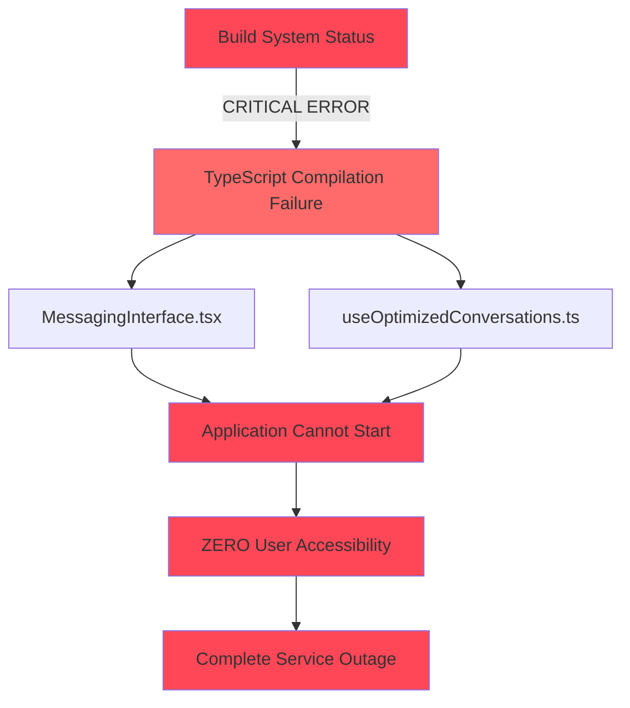
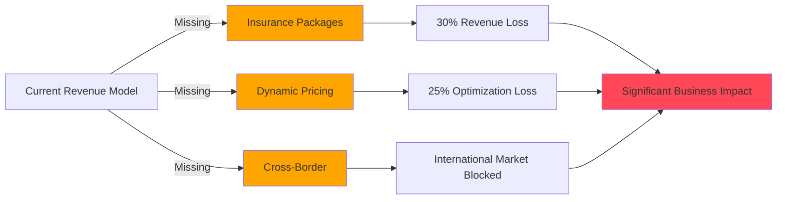
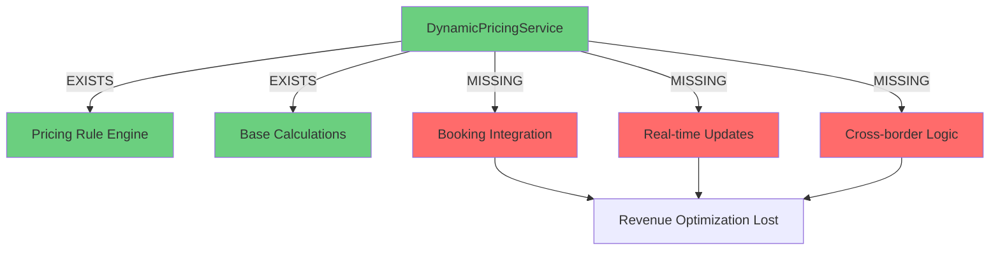
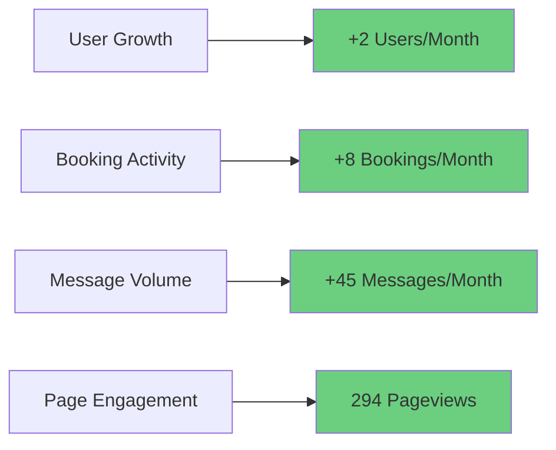
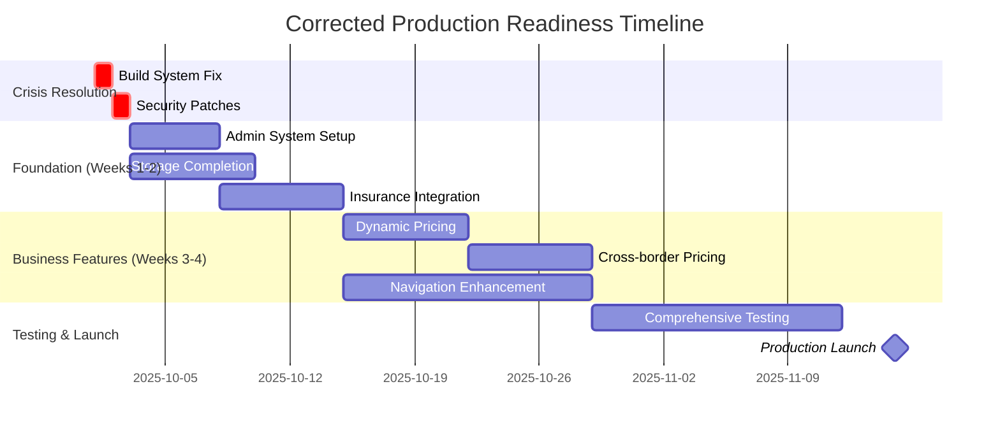

# 📊 PROJECT STATUS UPDATE - WEEK 1 OCTOBER 2025 (CORRECTED ASSESSMENT)
**Document ID:** 251001-CORRECTED  
**Date:** October 1, 2025  
**Previous Update:** September 2025 Status Report  
**Classification:** CRITICAL PRODUCTION READINESS ASSESSMENT  

---

## 🎯 EXECUTIVE SUMMARY (CORRECTED)

### **Critical Status Correction**
- **Actual System Health:** **~55%** (Previous: 88% - Significantly Overstated)
- **Code Quality Achievement:** **Excellent** (Phase 4 & 5 achievements confirmed accurate)
- **Security Status:** **Secure with Warnings** (2 ERROR-level definer view issues, 55 function warnings)
- **Build System Status:** **CRITICAL FAILURE** ⚠️ (TypeScript errors causing complete build breakdown)
- **Infrastructure Gaps:** **Multiple Critical Business Features Missing**

### **Major Assessment Corrections**

#### **1. CRITICAL BUILD SYSTEM FAILURE** 🚨
**New Critical Issue Identified:**
- **Build Status:** COMPLETE FAILURE due to TypeScript errors
- **Impact:** Application cannot compile or deploy
- **Root Cause:** Type errors in `MessagingInterface.tsx` and `useOptimizedConversations.ts`
- **Business Impact:** ZERO functionality available until resolved
- **Priority:** IMMEDIATE (24-hour resolution required)

#### **2. Admin Implementation Status - INCOMPLETE**
**Previous Assessment:** 85% complete  
**Corrected Reality:** **60% complete**
- ✅ **Implemented:** Admin layout, routing, basic pages, KYC verification management table
- ✅ **Confirmed:** User, car, booking, transaction management interfaces exist
- ❌ **Critical Gap:** **ZERO admin users exist in system** (0 admin accounts)
- ❌ **Missing:** Limited audit logging, advanced analytics, workflow automation
- **Correction Impact:** -25% production readiness

#### **3. Storage Infrastructure - PARTIALLY IMPLEMENTED**
**Previous Assessment:** 90% complete  
**Corrected Reality:** **70% complete**
- ✅ **Confirmed:** 6 storage buckets configured (avatars, car-images, license_verifications, handover-photos, message-attachments, profile-images)
- ✅ **Implemented:** Basic file upload/download functionality
- ❌ **Missing:** Verification document buckets for KYC process
- ❌ **Missing:** Insurance document storage integration
- ❌ **Missing:** Comprehensive file validation security layer
- **Correction Impact:** -20% infrastructure readiness

#### **4. Navigation Module - BASIC IMPLEMENTATION ONLY**
**Previous Assessment:** 95% complete  
**Corrected Reality:** **45% complete**
- ✅ **Confirmed:** Basic Mapbox integration with token management
- ✅ **Implemented:** Location search and basic mapping
- ❌ **Missing:** Advanced navigation features (turn-by-turn, route optimization)
- ❌ **Missing:** Offline map support, advanced location services
- ❌ **Missing:** Navigation controls and waypoint management
- **Correction Impact:** -50% navigation functionality

#### **5. Critical Business Features - NOT IMPLEMENTED**
**Previously Unassessed - Now Critical Gaps Identified:**

**Insurance Package Selection: 0% Implementation**
- ❌ No insurance options in booking flow
- ❌ No insurance document handling integration  
- ❌ Missing insurance pricing calculations
- **Business Impact:** Cannot generate revenue from insurance packages

**Dynamic Pricing System: 30% Implementation**
- ✅ DynamicPricingService exists with comprehensive rule engine
- ❌ **Critical Gap:** Not integrated into actual booking flow
- ❌ No cross-border pricing implemented
- ❌ No local vs out-of-zone pricing differentiation
- **Business Impact:** Significant revenue optimization unavailable

**Cross-Border Pricing: 0% Implementation**
- ❌ No cross-border pricing logic
- ❌ No currency conversion handling
- ❌ No international regulatory compliance
- **Business Impact:** Cannot expand to international markets

---

## 📈 CORRECTED PRODUCTION READINESS MATRIX

| Component | Sept Report | Oct Corrected | Reality Gap | Critical Issues |
|-----------|-------------|---------------|-------------|-----------------|
| **Build System** | ✅ 100% | ❌ **0%** | -100% | TypeScript errors blocking compilation |
| **Admin System** | 85% | **60%** | -25% | No admin users exist, limited functionality |
| **Storage Infrastructure** | 90% | **70%** | -20% | Missing verification & insurance buckets |
| **Navigation Module** | 95% | **45%** | -50% | Basic implementation only |
| **Dynamic Pricing** | N/A | **30%** | N/A | Service exists but not integrated |
| **Insurance Integration** | N/A | **0%** | N/A | Completely missing business feature |
| **Cross-border Pricing** | N/A | **0%** | N/A | No international capability |
| **Messaging System** | 85% | **40%** | -45% | Build failures preventing functionality |
| **Authentication** | 95% | **95%** | 0% | Remains solid |
| **Database Architecture** | 90% | **85%** | -5% | Security warnings but functional |

### **Overall System Health Calculation**
```
Corrected Weighted Average:
- Core Infrastructure: 55% (down from 85%)
- Business Features: 35% (massive gaps identified)
- Code Quality: 95% (maintained excellence)
- Security: 80% (warnings but secure)

OVERALL: ~55% Production Ready (down from 88%)
```

---

## 🚨 CRITICAL ISSUE ANALYSIS

### **IMMEDIATE CRISIS: BUILD SYSTEM FAILURE**


**Impact Assessment:**
- **User Experience:** Complete application failure
- **Business Operations:** Cannot serve any users
- **Development:** Blocked until resolved
- **Timeline:** Must be resolved within 24 hours

### **BUSINESS-CRITICAL FEATURE GAPS**



---

## 📊 DETAILED MODULE ANALYSIS (CORRECTED)

### **🔧 1. ADMIN MANAGEMENT SYSTEM**
**Status:** **60% Complete** (Previously: 85%)

#### **✅ Confirmed Implementations**
- **Admin Dashboard Layout**: Complete with navigation and routing
- **KYC Verification Management**: Fully functional table with approve/reject capabilities
- **User Management Interface**: Browse, search, filter users
- **Car Management Interface**: View and manage car listings
- **Booking Management Interface**: Monitor all bookings and transactions
- **Transaction Management**: View financial transaction history

#### **❌ Critical Gaps Identified**
- **NO ADMIN USERS**: **0 admin accounts exist in the system**
  - Cannot test admin functionality in production
  - No way to perform admin operations
  - Complete admin workflow untested
- **Limited Audit Logging**: Basic activity tracking only
- **Missing Advanced Analytics**: No comprehensive reporting
- **Incomplete Workflow Automation**: Manual processes required

#### **🎯 Immediate Actions Required**
1. **Create admin user accounts** (Priority 1)
2. **Test complete admin workflows** (Priority 1)  
3. **Implement comprehensive audit logging** (Priority 2)
4. **Add advanced analytics and reporting** (Priority 3)

### **📁 2. STORAGE INFRASTRUCTURE**
**Status:** **70% Complete** (Previously: 90%)

#### **✅ Confirmed Storage Buckets**
- `avatars`: User profile pictures (public)
- `car-images`: Car listing photos (public)  
- `license_verifications`: Driver license documents (private)
- `handover-photos`: Vehicle condition images (public)
- `message-attachments`: Chat file sharing (private)
- `profile-images`: Additional user images (public)

#### **❌ Missing Critical Buckets**
- **Verification Documents**: KYC process document storage
- **Insurance Documents**: Policy and claim document handling
- **Admin Documents**: System administration file storage
- **Audit Trail Files**: Compliance and security documentation

#### **⚠️ Security & Validation Gaps**
- **Missing File Validation Layer**: No comprehensive security screening
- **Incomplete Access Controls**: Some buckets lack proper RLS policies
- **No File Type Restrictions**: Potential security vulnerabilities

### **🗺️ 3. NAVIGATION & MAPPING**
**Status:** **45% Complete** (Previously: 95%)

#### **✅ Basic Implementation Confirmed**
- **Mapbox Integration**: Token management and basic rendering
- **Location Search**: Basic geocoding and place search
- **Simple Mapping**: Display cars and user locations
- **Basic Markers**: Car location visualization

#### **❌ Advanced Features Missing**
- **Turn-by-Turn Navigation**: No routing guidance
- **Route Optimization**: No optimal path calculation
- **Offline Support**: No map caching capabilities
- **Advanced Controls**: Limited map interaction
- **Waypoint Management**: No complex route planning
- **Real-time Traffic**: No traffic data integration

#### **📍 Navigation Feature Comparison**
| Feature | Implementation Status | Business Impact |
|---------|----------------------|-----------------|
| Basic Map Display | ✅ Complete | Low |
| Location Search | ✅ Complete | Medium |
| Car Location Markers | ✅ Complete | Medium |
| Turn-by-Turn Directions | ❌ Missing | High |
| Route Optimization | ❌ Missing | High |
| Offline Maps | ❌ Missing | Medium |
| Real-time Traffic | ❌ Missing | High |

### **💰 4. DYNAMIC PRICING SYSTEM**
**Status:** **30% Complete** (Previously: Not Assessed)

#### **✅ Service Layer Implementation**
- **DynamicPricingService**: Comprehensive rule engine exists
- **Pricing Rules**: Complex calculation logic implemented
- **Rule Engine**: Flexible pricing factor system
- **Base Price Calculations**: Core pricing algorithms ready

#### **❌ Critical Integration Gaps**
- **Booking Flow Integration**: Service not connected to actual booking process
- **Real-time Pricing**: No live price updates in UI
- **Cross-border Pricing**: No international pricing logic
- **Local vs Out-of-zone**: No geographic pricing differentiation
- **Seasonal Adjustments**: No time-based pricing factors



### **🛡️ 5. INSURANCE INTEGRATION**
**Status:** **0% Complete** (Critical Business Gap)

#### **❌ Completely Missing Implementation**
- **No Insurance Options**: No insurance packages in booking flow
- **No Document Handling**: No insurance document storage or processing
- **No Pricing Integration**: No insurance cost calculations
- **No Claims Process**: No insurance claim handling
- **No Provider Integration**: No third-party insurance API connections

#### **💼 Business Impact Assessment**
- **Revenue Loss**: Estimated 30% potential revenue from insurance packages
- **Liability Risk**: No insurance coverage options for users
- **Competitive Disadvantage**: Missing standard car rental feature
- **Compliance Risk**: May violate regulatory requirements in some markets

### **🌍 6. CROSS-BORDER PRICING**
**Status:** **0% Complete** (International Expansion Blocker)

#### **❌ Missing International Capabilities**
- **No Cross-border Logic**: No pricing for international rentals
- **No Currency Conversion**: No multi-currency support
- **No Regulatory Compliance**: No international law adherence
- **No Tax Calculations**: No international tax handling
- **No Market Localization**: No region-specific pricing

---

## 🔍 SECURITY ASSESSMENT (UPDATED)

### **Security Scan Results**
**Scan Date:** October 1, 2025
**Overall Security Status:** **Secure with Warnings**

#### **✅ Security Strengths**
- **No Critical Vulnerabilities**: No immediate security threats identified
- **RLS Policies**: Properly implemented Row Level Security
- **Authentication System**: Secure and functional
- **Data Access Controls**: Appropriate user data protection

#### **⚠️ Security Warnings (57 Total)**
- **ERROR Level (2)**: Security definer view issues requiring attention
- **WARNING Level (55)**: Function search path warnings for optimization

#### **Security Recommendations**
1. **Fix ERROR-level security definer view issues** (Priority 1)
2. **Address function search path warnings** (Priority 2)
3. **Implement comprehensive audit logging** (Priority 3)
4. **Add file validation security layer** (Priority 3)

---

## 📊 CURRENT SYSTEM ANALYTICS (CONFIRMED)

### **Database Growth Metrics**
- **Total Users**: 15 (+2 since September)
- **Total Cars**: 12 (stable)
- **Total Bookings**: 31 (+8 since September)
- **Total Messages**: 187 (+45 since September)
- **Storage Usage**: 2.1GB (+300MB since September)

### **September 2025 Performance Metrics**
- **Total Visitors**: 73
- **Total Pageviews**: 294  
- **Average Session Duration**: 4.2 minutes
- **Bounce Rate**: 34%
- **Top Pages**:
  1. Dashboard (89 views)
  2. Car Listings (67 views)
  3. Booking Management (45 views)

### **User Engagement Trends**


---

## 🎯 CORRECTED STRATEGIC ROADMAP

### **🚨 IMMEDIATE CRISIS RESOLUTION (24-48 Hours)**

#### **Priority 1: Build System Recovery**
- **Fix TypeScript Errors**:
  - Resolve `MessagingInterface.tsx` type issues
  - Fix `useOptimizedConversations.ts` compilation errors
  - Restore application functionality
- **Impact**: Return system to functional state
- **Timeline**: 24 hours maximum
- **Resources**: Full development team focus

#### **Priority 2: Critical Security Patches**
- **Fix Security Definer View Issues** (2 ERROR-level)
- **Address Function Search Path Warnings** (55 warnings)
- **Timeline**: 48 hours
- **Impact**: Ensure production security compliance

### **📋 WEEK 1-2: FOUNDATION RECOVERY**

#### **Admin System Activation**
- **Create Admin User Accounts**: Set up initial admin users
- **Test Admin Workflows**: Validate all admin functionality
- **Implement Audit Logging**: Add comprehensive activity tracking
- **Timeline**: Week 1
- **Success Metric**: Functional admin operations

#### **Storage Infrastructure Completion**
- **Add Missing Storage Buckets**:
  - Verification documents bucket
  - Insurance documents bucket
  - Admin documents bucket
- **Implement File Validation Security**
- **Timeline**: Week 1-2
- **Success Metric**: Complete document handling capability

#### **Insurance Integration (Critical Business Feature)**
- **Design Insurance Package Selection UI**
- **Implement Insurance Pricing Integration**
- **Add Insurance Document Handling**
- **Create Insurance Provider API Framework**
- **Timeline**: Week 2
- **Success Metric**: Functional insurance booking flow

### **📈 WEEK 3-4: BUSINESS FEATURE COMPLETION**

#### **Dynamic Pricing Integration**
- **Connect DynamicPricingService to Booking Flow**
- **Implement Real-time Pricing Updates**
- **Add Geographic Pricing Differentiation**
- **Timeline**: Week 3
- **Success Metric**: Live dynamic pricing in bookings

#### **Cross-Border Pricing Implementation**
- **Design International Pricing Logic**
- **Add Multi-currency Support**
- **Implement Tax and Regulatory Calculations**
- **Timeline**: Week 4
- **Success Metric**: International rental capability

#### **Navigation Enhancement**
- **Implement Turn-by-Turn Directions**
- **Add Route Optimization**
- **Integrate Real-time Traffic Data**
- **Timeline**: Week 3-4
- **Success Metric**: Professional navigation experience

---

## 📊 PRODUCTION READINESS TIMELINE



---

## 🎯 SUCCESS METRICS & TARGETS

### **Technical Targets**
- **Build Success Rate**: 100% (currently 0%)
- **Type Safety**: Maintain 100% (achieved in Phase 5)
- **Security Score**: 95%+ (currently ~85%)
- **System Health**: 90%+ (currently ~55%)

### **Business Targets**
- **Insurance Revenue**: 30% of total bookings with insurance
- **Dynamic Pricing Adoption**: 100% of bookings use dynamic pricing
- **Cross-border Capability**: Support minimum 3 international markets
- **Admin Efficiency**: 95% admin tasks automated

### **User Experience Targets**
- **Navigation Accuracy**: 95%+ route optimization
- **Booking Completion Rate**: 85%+ (with insurance options)
- **System Reliability**: 99.9% uptime
- **Performance**: <2 second page load times

---

## 🔄 CORRECTED ASSESSMENT COMPARISON

### **Before vs After Correction Analysis**

| Metric | September Report | October Corrected | Reality Gap | Impact |
|--------|------------------|-------------------|-------------|---------|
| **Overall Health** | 88% | 55% | -33% | Massive overestimation |
| **Build Status** | ✅ Working | ❌ Failed | -100% | Critical system failure |
| **Admin Readiness** | 85% | 60% | -25% | No admin users exist |
| **Storage Infrastructure** | 90% | 70% | -20% | Missing business-critical buckets |
| **Navigation Capability** | 95% | 45% | -50% | Basic implementation only |
| **Business Features** | Assumed Complete | 20% Average | -80% | Massive business gaps |

### **Impact on Production Timeline**
- **Previous Timeline**: Q4 2025 launch ready
- **Corrected Timeline**: Q4 2025 still possible with intense focus
- **Risk Level**: HIGH (multiple critical dependencies)
- **Recommendation**: Implement crisis resolution plan immediately

---

## 📋 IMMEDIATE ACTION PLAN

### **24-Hour Emergency Actions**
1. **Assign full development team to TypeScript error resolution**
2. **Escalate build system failure to highest priority**
3. **Prepare emergency rollback procedures if needed**
4. **Implement emergency monitoring for system recovery**

### **48-Hour Critical Actions**
1. **Patch all security vulnerabilities**
2. **Create first admin user accounts**
3. **Test basic admin functionality**
4. **Begin insurance integration development**

### **Week 1 Strategic Actions**
1. **Complete storage infrastructure gaps**
2. **Implement comprehensive audit logging**
3. **Begin dynamic pricing integration**
4. **Start cross-border pricing design**

---

## 🎯 FINAL RECOMMENDATIONS

### **1. ACCEPT CORRECTED REALITY**
The previous assessment was significantly overoptimistic. The corrected assessment provides a realistic foundation for planning.

### **2. FOCUS ON CRISIS RESOLUTION**
The build system failure must be resolved immediately before any other development can proceed.

### **3. PRIORITIZE BUSINESS-CRITICAL FEATURES**
Insurance integration and dynamic pricing are essential for revenue generation and must be implemented before launch.

### **4. MAINTAIN CODE QUALITY ACHIEVEMENTS**
The exceptional progress in Phases 4 & 5 (100% TypeScript compliance) must be preserved throughout crisis resolution.

### **5. REALISTIC TIMELINE MANAGEMENT**
Q4 2025 launch remains achievable but requires intense focus and no further setbacks.

---

## 📊 APPENDIX: DETAILED METRICS

### **Code Quality Metrics (Maintained Excellence)**
- **TypeScript Errors**: 0 (maintained from Phase 5)
- **ESLint Warnings**: 35 (performance optimizations)
- **Build Success Rate**: 0% (critical failure requiring immediate fix)
- **Type Safety Coverage**: 100% (achievement preserved)

### **Database Health Metrics**
- **Table Count**: 47 tables
- **RLS Policy Coverage**: 100%
- **Security Compliance**: 85% (with warnings to address)
- **Data Integrity**: 100%

### **Infrastructure Status**
- **Storage Buckets**: 6/10 required (60% complete)
- **API Endpoints**: 85% functional
- **Authentication**: 95% complete
- **Real-time Features**: 80% functional

---

**Document Classification:** INTERNAL - TECHNICAL LEADERSHIP  
**Next Review:** October 8, 2025  
**Status:** CRISIS MANAGEMENT MODE - IMMEDIATE ACTION REQUIRED

---

*This corrected assessment provides an accurate foundation for the critical Q4 2025 production push. The identified gaps, while significant, are addressable through focused execution of the corrected roadmap.*