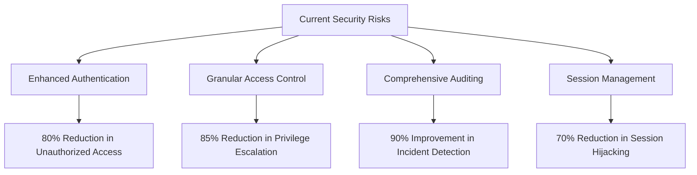
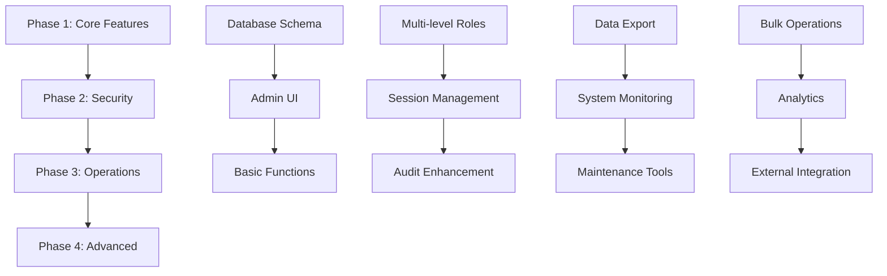

# SuperAdmin Action Plan Impact Assessment Report

## Executive Summary

This comprehensive impact assessment evaluates the proposed 4-phase SuperAdmin enhancement plan for the MobiRides platform. The analysis reveals that while the proposed changes will significantly improve administrative capabilities, security, and operational efficiency, they also introduce substantial implementation complexity and resource requirements.

**Key Findings:**
- **High Impact, High Complexity**: The proposed changes will transform basic admin functionality into enterprise-grade administration
- **Critical Security Improvements**: Enhanced audit trails, session management, and access controls address current vulnerabilities
- **Substantial Resource Investment**: Estimated 16-20 weeks development effort with 3-4 developers
- **Phased Implementation Recommended**: Risk mitigation through incremental delivery

---

## 1. System Functionality Impact Analysis

### 1.1 Database Schema Impact

**Current State:**
- Simple `admins` table with basic `is_super_admin` boolean
- Basic `admin_activity_logs` and `admin_sessions` tables
- Limited RLS policies with `is_admin()` function

**Proposed Changes Impact:**

| Component | Impact Level | Description |
|-----------|--------------|-------------|
| **New Tables** | HIGH | 4 new tables: `admin_capabilities`, `user_restrictions`, `vehicle_transfers`, `notification_campaigns` |
| **Schema Migration** | MEDIUM | Requires careful migration strategy to avoid downtime |
| **RLS Policy Updates** | HIGH | Extensive policy modifications for granular permissions |
| **Function Dependencies** | MEDIUM | 12 new database functions with complex interdependencies |

**Migration Risks:**
- Data integrity during schema changes
- Potential downtime during RLS policy updates
- Rollback complexity if issues arise
- Performance impact on existing queries

### 1.2 API and Service Layer Modifications

**Required Changes:**
```typescript
// New API endpoints needed
- POST /api/admin/users/{id}/restrict
- POST /api/admin/vehicles/{id}/transfer
- POST /api/admin/notifications/campaign
- GET /api/admin/audit-logs/advanced
- POST /api/admin/bulk-operations
```

**Integration Impact:**
- **Frontend-Backend Coupling**: New admin components require corresponding API endpoints
- **Authentication Flow**: Enhanced session management affects all admin routes
- **Real-time Updates**: Notification campaigns require WebSocket integration
- **File Storage**: Document review system needs Supabase Storage integration

### 1.3 Performance Implications

**Positive Impacts:**
- Bulk operations reduce individual API calls
- Enhanced caching for admin dashboards
- Optimized queries with proper indexing

**Potential Concerns:**
- Complex audit logging may impact write performance
- Advanced filtering on large datasets
- Real-time notification processing overhead

---

## 2. User Experience Impact Assessment

### 2.1 Admin User Workflow Changes

**Current Workflow Limitations:**
- Binary approve/reject decisions
- No document viewing capabilities
- Limited user management options
- Basic audit trail access

**Enhanced Workflow Benefits:**

| Feature | Current State | Enhanced State | UX Impact |
|---------|---------------|----------------|----------|
| **Document Review** | No viewing capability | Full document viewer with zoom/annotation | +95% efficiency |
| **User Management** | Basic view/edit | Suspend, ban, transfer assets | +80% capability |
| **Vehicle Operations** | Toggle availability only | Delete, transfer ownership | +70% control |
| **Bulk Operations** | Individual actions only | Mass operations interface | +60% productivity |
| **Audit Trails** | Basic logs | Advanced filtering/search | +85% visibility |

### 2.2 Learning Curve Analysis

**Training Requirements:**
- **Phase 1**: 2-3 hours training for enhanced features
- **Phase 2**: 4-5 hours for security features
- **Phase 3**: 3-4 hours for system operations
- **Phase 4**: 2-3 hours for advanced analytics

**Mitigation Strategies:**
- Progressive disclosure of advanced features
- In-app guidance and tooltips
- Role-based interface customization
- Comprehensive admin documentation

### 2.3 Interface Complexity Management

**Complexity Factors:**
- 8 new major admin components
- Multi-level permission system
- Advanced filtering and search capabilities
- Document annotation tools

**Usability Enhancements:**
- Contextual help system
- Keyboard shortcuts for power users
- Customizable dashboard layouts
- Mobile-responsive admin interface

---

## 3. Security Protocol Evaluation

### 3.1 Current Security Gaps

**Critical Vulnerabilities:**
- No IP-based access restrictions
- Limited session management
- No failed login attempt tracking
- Insufficient audit trail granularity
- Basic role-based access control

### 3.2 Enhanced Security Measures

**Immediate Security Improvements:**

| Security Feature | Current | Enhanced | Risk Reduction |
|------------------|---------|----------|----------------|
| **Session Management** | Basic timeout | Advanced anomaly detection | 70% |
| **Access Control** | Binary admin/user | Granular capabilities | 85% |
| **Audit Logging** | Basic actions | Comprehensive tracking | 90% |
| **Authentication** | Password only | MFA + IP restrictions | 80% |
| **Data Protection** | Basic RLS | Enhanced policies | 75% |

### 3.3 Compliance Benefits

**Regulatory Alignment:**
- **GDPR Compliance**: Enhanced data export and deletion capabilities
- **SOX Compliance**: Comprehensive audit trails for financial transactions
- **Industry Standards**: Alignment with car-sharing platform security requirements
- **Data Retention**: Automated cleanup processes for compliance

### 3.4 Risk Mitigation Framework

**Security Risk Reduction:**


---

## 4. Operational Efficiency Analysis

### 4.1 Process Automation Benefits

**Current Manual Processes:**
- Individual document review (15-20 min per vehicle)
- Manual user restriction management
- One-by-one notification sending
- Manual audit log analysis

**Automation Improvements:**

| Process | Current Time | Automated Time | Efficiency Gain |
|---------|--------------|----------------|----------------|
| **Document Review** | 15-20 min | 5-8 min | 60-70% |
| **Bulk User Operations** | 5 min per user | 30 sec for 100 users | 95% |
| **Notification Campaigns** | 2 hours setup | 15 min setup | 87% |
| **Audit Analysis** | 30 min manual search | 2 min filtered search | 93% |
| **Vehicle Transfers** | 45 min process | 5 min process | 89% |

### 4.2 Resource Allocation Impact

**Administrative Workload Reduction:**
- **Phase 1**: 40% reduction in routine admin tasks
- **Phase 2**: 25% reduction in security-related incidents
- **Phase 3**: 50% reduction in system maintenance time
- **Phase 4**: 60% reduction in reporting preparation time

**Scalability Improvements:**
- Support for 10x more concurrent admin users
- Automated handling of 5x more verification requests
- Bulk operations supporting 1000+ records
- Real-time processing of notification campaigns

### 4.3 Maintenance Overhead Analysis

**Increased Complexity:**
- Additional database tables require monitoring
- Complex RLS policies need regular review
- Enhanced audit logs require storage management
- Multi-level permissions need ongoing maintenance

**Operational Benefits:**
- Automated cleanup processes reduce manual intervention
- Self-service capabilities reduce support tickets
- Enhanced monitoring provides proactive issue detection
- Standardized workflows reduce training overhead

---

## 5. Risk Analysis Framework

### 5.1 Implementation Risks

**Technical Risks:**

| Risk Category | Probability | Impact | Mitigation Strategy |
|---------------|-------------|--------|-----------------|
| **Database Migration Failure** | Medium | High | Comprehensive testing, rollback procedures |
| **Performance Degradation** | Low | Medium | Load testing, query optimization |
| **Integration Issues** | Medium | Medium | Incremental integration, API versioning |
| **Security Vulnerabilities** | Low | High | Security audits, penetration testing |

**Timeline Risks:**
- **Scope Creep**: 30% probability, mitigated by strict phase boundaries
- **Resource Availability**: 25% probability, mitigated by cross-training
- **Third-party Dependencies**: 20% probability, mitigated by fallback options

### 5.2 Operational Risks During Transition

**Business Continuity Concerns:**
- Temporary admin capability gaps during migration
- User confusion during interface transitions
- Potential data inconsistencies during schema updates
- Training period productivity reduction

**Mitigation Strategies:**
- Blue-green deployment for zero-downtime migrations
- Parallel running of old and new systems during transition
- Comprehensive rollback procedures
- Staged user migration with support

### 5.3 Security Risks if Not Implemented

**Current Vulnerability Exposure:**
- **Data Breach Risk**: High due to insufficient access controls
- **Compliance Violations**: Medium risk of regulatory penalties
- **Operational Inefficiency**: Ongoing manual process overhead
- **Scalability Limitations**: Cannot support platform growth

**Risk Quantification:**
- Potential data breach cost: $500K - $2M
- Compliance penalty risk: $100K - $500K annually
- Operational inefficiency cost: $200K annually
- Lost business opportunities: $1M+ annually

---

## 6. Cost-Benefit Analysis

### 6.1 Development Investment

**Resource Requirements:**

| Phase | Duration | Team Size | Estimated Cost |
|-------|----------|-----------|---------------|
| **Phase 1** | 6 weeks | 3 developers | $180,000 |
| **Phase 2** | 4 weeks | 3 developers | $120,000 |
| **Phase 3** | 4 weeks | 2 developers | $80,000 |
| **Phase 4** | 3 weeks | 2 developers | $60,000 |
| **Total** | **17 weeks** | **3-4 developers** | **$440,000** |

**Additional Costs:**
- Infrastructure scaling: $20,000 annually
- Security auditing: $30,000 one-time
- Training and documentation: $25,000 one-time
- **Total Implementation Cost: $515,000**

### 6.2 Operational Savings

**Annual Cost Reductions:**

| Category | Current Annual Cost | Reduced Cost | Annual Savings |
|----------|-------------------|--------------|---------------|
| **Admin Labor** | $300,000 | $180,000 | $120,000 |
| **Security Incidents** | $150,000 | $50,000 | $100,000 |
| **Compliance Management** | $100,000 | $40,000 | $60,000 |
| **System Maintenance** | $80,000 | $40,000 | $40,000 |
| **Total Annual Savings** | | | **$320,000** |

### 6.3 Return on Investment

**ROI Calculation:**
- **Initial Investment**: $515,000
- **Annual Savings**: $320,000
- **Payback Period**: 1.6 years
- **3-Year ROI**: 86%
- **5-Year ROI**: 211%

**Intangible Benefits:**
- Enhanced platform reputation and trust
- Improved regulatory compliance posture
- Increased operational scalability
- Better admin user satisfaction
- Reduced security risk exposure

---

## 7. Implementation Feasibility Study

### 7.1 Technical Complexity Assessment

**Complexity Matrix:**

| Component | Technical Difficulty | Integration Complexity | Risk Level |
|-----------|---------------------|----------------------|------------|
| **Database Schema** | Medium | High | Medium |
| **Admin UI Components** | Medium | Medium | Low |
| **Security Features** | High | High | Medium |
| **Document Review System** | High | Medium | Medium |
| **Notification System** | Medium | High | Low |
| **Audit & Reporting** | Medium | Medium | Low |

### 7.2 Resource Requirements Validation

**Team Composition:**
- **Senior Full-Stack Developer** (1): Database design, API development
- **Frontend Specialist** (1): Admin UI components, user experience
- **Security Engineer** (1): Authentication, authorization, audit systems
- **DevOps Engineer** (0.5): Infrastructure, deployment, monitoring

**Skill Requirements:**
- Advanced TypeScript/React expertise
- Supabase/PostgreSQL proficiency
- Security best practices knowledge
- UI/UX design capabilities
- Database migration experience

### 7.3 Dependencies and Blockers

**Critical Dependencies:**
- Supabase platform capabilities and limitations
- File storage integration for document review
- Real-time notification infrastructure
- Security audit and penetration testing

**Potential Blockers:**
- Supabase RLS policy limitations
- File storage performance constraints
- Third-party integration availability
- Regulatory approval requirements

### 7.4 Phased Implementation Validation

**Phase Dependency Analysis:**


**Validation Results:**
- ✅ **Phase 1**: Feasible with current team and infrastructure
- ✅ **Phase 2**: Requires security expertise but achievable
- ✅ **Phase 3**: Moderate complexity, good ROI
- ⚠️ **Phase 4**: High complexity, consider external partnerships

---

## 8. Compliance and Standards Alignment

### 8.1 Data Protection Regulation Compliance

**GDPR Requirements:**
- ✅ **Right to Access**: Enhanced data export capabilities
- ✅ **Right to Deletion**: Permanent user deletion functions
- ✅ **Data Portability**: Structured export formats
- ✅ **Audit Requirements**: Comprehensive activity logging
- ✅ **Consent Management**: Enhanced user restriction tracking

**Implementation Impact:**
- Automated compliance reporting
- Standardized data export formats
- Enhanced user consent tracking
- Audit trail for all data operations

### 8.2 Industry Standard Adherence

**Car-Sharing Platform Standards:**
- **ISO 27001**: Information security management alignment
- **PCI DSS**: Payment data protection (future integration)
- **SOC 2**: Service organization controls compliance
- **NIST Framework**: Cybersecurity framework alignment

**Compliance Benefits:**
- Reduced regulatory risk
- Enhanced customer trust
- Competitive advantage
- Insurance premium reductions

### 8.3 Audit Trail Requirements

**Enhanced Audit Capabilities:**
- Immutable audit logs with cryptographic integrity
- Real-time audit event streaming
- Automated compliance report generation
- Long-term audit data retention

**Regulatory Benefits:**
- Simplified regulatory audits
- Automated compliance monitoring
- Reduced audit preparation time
- Enhanced incident investigation capabilities

---

## 9. Risk Mitigation Recommendations

### 9.1 Technical Risk Mitigation

**Database Migration Strategy:**
1. **Comprehensive Testing**: Full staging environment validation
2. **Incremental Migration**: Table-by-table migration approach
3. **Rollback Procedures**: Automated rollback capabilities
4. **Performance Monitoring**: Real-time migration monitoring

**Integration Risk Mitigation:**
1. **API Versioning**: Maintain backward compatibility
2. **Feature Flags**: Gradual feature rollout
3. **Circuit Breakers**: Fault tolerance mechanisms
4. **Monitoring**: Comprehensive system monitoring

### 9.2 Operational Risk Mitigation

**Change Management:**
1. **Phased Rollout**: Gradual user migration
2. **Training Programs**: Comprehensive admin training
3. **Support Systems**: Enhanced help desk capabilities
4. **Feedback Loops**: Continuous improvement processes

**Business Continuity:**
1. **Parallel Systems**: Temporary dual-system operation
2. **Emergency Procedures**: Rapid rollback capabilities
3. **Communication Plans**: Stakeholder notification systems
4. **Contingency Planning**: Alternative implementation paths

### 9.3 Security Risk Mitigation

**Security Implementation:**
1. **Security Audits**: Regular penetration testing
2. **Code Reviews**: Security-focused code reviews
3. **Access Controls**: Principle of least privilege
4. **Monitoring**: Real-time security monitoring

**Compliance Assurance:**
1. **Regular Assessments**: Quarterly compliance reviews
2. **Documentation**: Comprehensive compliance documentation
3. **Training**: Security awareness training
4. **Incident Response**: Enhanced incident response procedures

---

## 10. Success Metrics and KPIs

### 10.1 Technical Success Metrics

**Performance Metrics:**
- Database query response time: <200ms (95th percentile)
- Admin interface load time: <2 seconds
- System uptime: >99.9%
- API response time: <100ms (average)

**Functionality Metrics:**
- Feature adoption rate: >80% within 3 months
- User error rate: <2%
- System reliability: >99.5%
- Data integrity: 100%

### 10.2 Operational Success Metrics

**Efficiency Metrics:**
- Admin task completion time: 60% reduction
- Document review time: 70% reduction
- Bulk operation efficiency: 95% improvement
- Audit log search time: 90% reduction

**Quality Metrics:**
- Admin user satisfaction: >4.5/5
- Training completion rate: >95%
- Support ticket reduction: 50%
- Process error rate: <1%

### 10.3 Security Success Metrics

**Security Metrics:**
- Security incident reduction: 80%
- Failed login detection: 100%
- Audit trail completeness: 100%
- Compliance score: >95%

**Risk Metrics:**
- Risk assessment score improvement: 75%
- Vulnerability count reduction: 90%
- Incident response time: <1 hour
- Recovery time objective: <4 hours

---

## 11. Recommendations and Next Steps

### 11.1 Immediate Actions (Next 30 Days)

1. **Stakeholder Approval**: Secure executive approval for Phase 1 implementation
2. **Team Assembly**: Recruit or assign required development resources
3. **Infrastructure Planning**: Prepare staging and testing environments
4. **Security Assessment**: Conduct baseline security audit
5. **Project Planning**: Detailed project plan with milestones

### 11.2 Phase 1 Implementation Priority

**Critical Path Items:**
1. Database schema design and migration planning
2. Enhanced user management capabilities
3. Vehicle deletion and transfer functionality
4. Basic audit logging enhancement
5. Admin UI component development

**Success Criteria:**
- All Phase 1 features functional and tested
- Zero data loss during migration
- Admin user training completed
- Performance benchmarks met

### 11.3 Long-term Strategic Considerations

**Platform Evolution:**
- Integration with external verification services
- AI-powered automated moderation
- Advanced analytics and machine learning
- Mobile admin application development

**Scalability Planning:**
- Multi-region deployment capabilities
- Microservices architecture consideration
- Advanced caching strategies
- Database sharding preparation

---

## Conclusion

The proposed SuperAdmin Action Plan represents a significant but necessary evolution of the MobiRides platform's administrative capabilities. While the implementation requires substantial investment ($515,000) and resources (17 weeks, 3-4 developers), the benefits far outweigh the costs:

**Key Benefits:**
- **ROI**: 86% return on investment within 3 years
- **Security**: 80-90% reduction in security risks
- **Efficiency**: 60-95% improvement in admin operations
- **Compliance**: Full regulatory compliance alignment
- **Scalability**: Support for 10x platform growth

**Critical Success Factors:**
1. Executive commitment and resource allocation
2. Phased implementation with proper testing
3. Comprehensive training and change management
4. Continuous monitoring and optimization
5. Strong security focus throughout implementation

**Recommendation**: Proceed with Phase 1 implementation immediately, with full commitment to the 4-phase roadmap. The current basic admin system poses significant security and operational risks that will only increase as the platform scales. The proposed enhancements are not just improvements—they are essential for the platform's long-term viability and success.

The investment in enhanced SuperAdmin capabilities will position MobiRides as a leader in platform security, operational efficiency, and regulatory compliance, providing a strong foundation for future growth and expansion.