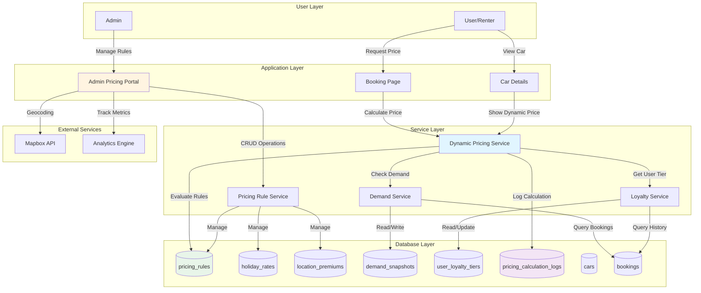
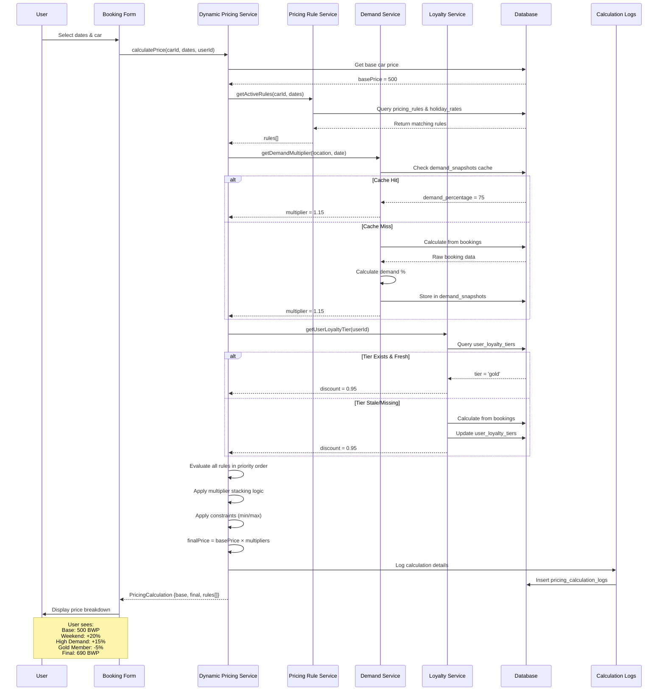
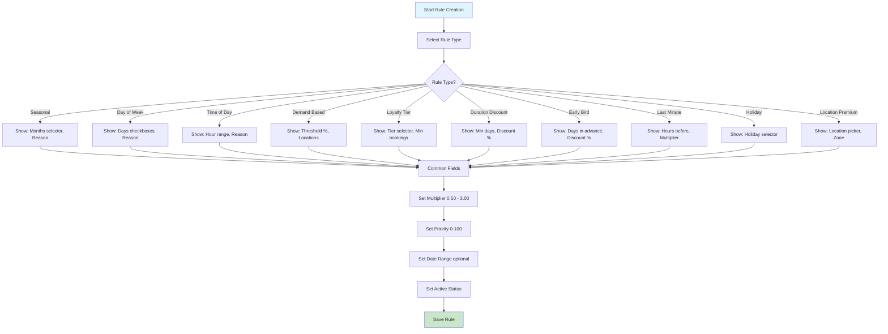
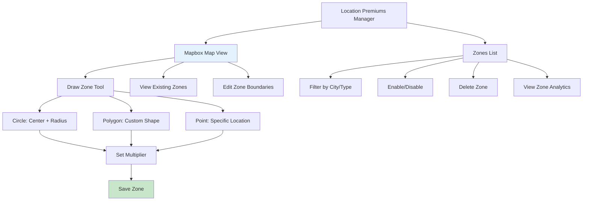
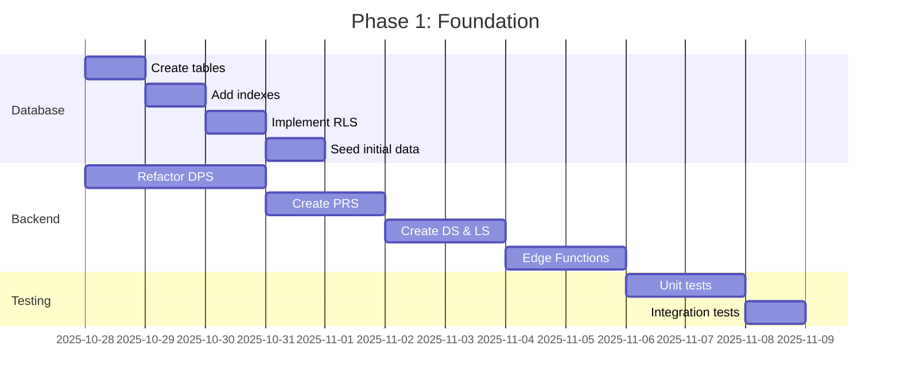
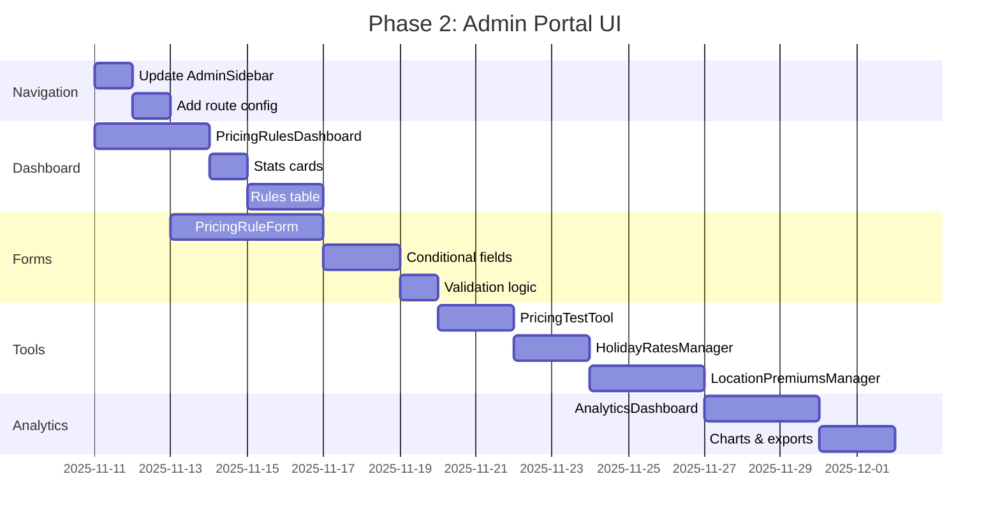
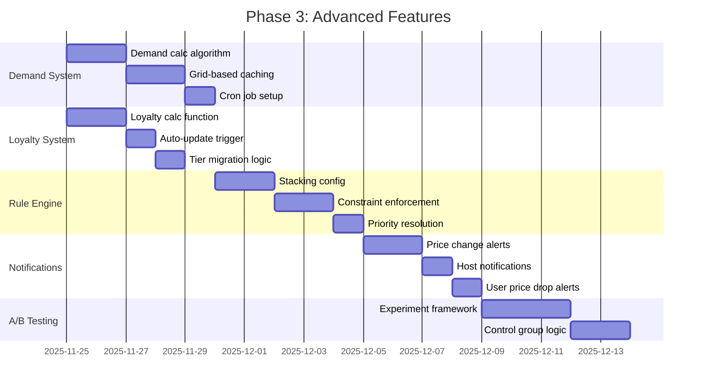
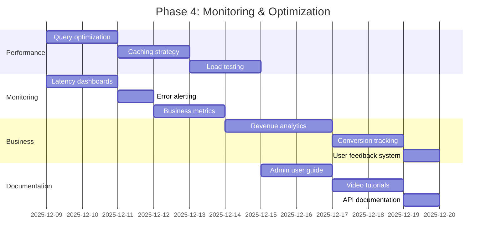
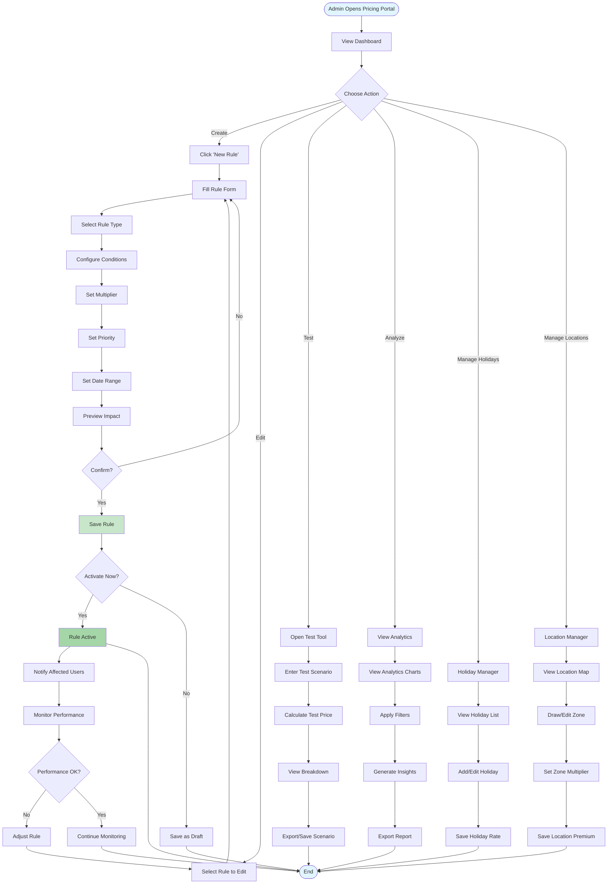

# Dynamic Pricing System Implementation Plan
**Date:** October 28, 2025  
**Project:** MobiRides Car Rental Platform  
**Version:** 1.0

---

## Executive Summary

This document outlines the comprehensive implementation plan for a dynamic pricing system in MobiRides. The system will enable intelligent, rule-based pricing that responds to demand, seasonality, user loyalty, and other factors while providing admins with a powerful management portal.

### Key Objectives
- Enable automated pricing adjustments based on market conditions
- Provide admins with a comprehensive pricing management portal
- Increase revenue per available car by 10-15%
- Maintain user transparency with clear price breakdowns
- Ensure sub-200ms price calculation performance

---

## System Architecture Overview



---

## Database Schema Design

### 1. Pricing Rules Table

```sql
-- Core pricing rules configuration
CREATE TABLE pricing_rules (
  id UUID PRIMARY KEY DEFAULT gen_random_uuid(),
  name TEXT NOT NULL,
  description TEXT,
  rule_type TEXT NOT NULL CHECK (rule_type IN (
    'seasonal',
    'day_of_week',
    'time_of_day',
    'demand_based',
    'loyalty_tier',
    'duration_discount',
    'early_bird',
    'last_minute',
    'holiday',
    'location_premium'
  )),
  multiplier DECIMAL(4,2) NOT NULL CHECK (multiplier >= 0.5 AND multiplier <= 3.0),
  priority INTEGER NOT NULL DEFAULT 0,
  is_active BOOLEAN DEFAULT true,
  conditions JSONB NOT NULL DEFAULT '{}',
  
  -- Date range for rule validity
  valid_from TIMESTAMP WITH TIME ZONE,
  valid_to TIMESTAMP WITH TIME ZONE,
  
  -- Metadata
  created_by UUID REFERENCES auth.users(id),
  created_at TIMESTAMP WITH TIME ZONE DEFAULT now(),
  updated_at TIMESTAMP WITH TIME ZONE DEFAULT now(),
  
  -- Constraints
  CONSTRAINT valid_date_range CHECK (valid_to IS NULL OR valid_to > valid_from)
);

-- Indexes for performance
CREATE INDEX idx_pricing_rules_type ON pricing_rules(rule_type);
CREATE INDEX idx_pricing_rules_active ON pricing_rules(is_active);
CREATE INDEX idx_pricing_rules_priority ON pricing_rules(priority DESC);
CREATE INDEX idx_pricing_rules_dates ON pricing_rules(valid_from, valid_to);

-- Example conditions JSONB structure:
-- For seasonal rule:
-- {
--   "months": [6, 7, 8],  -- June, July, August
--   "reason": "Summer peak season"
-- }
-- For day_of_week rule:
-- {
--   "days": [5, 6],  -- Friday, Saturday
--   "reason": "Weekend premium"
-- }
-- For loyalty_tier rule:
-- {
--   "tier": "gold",
--   "min_bookings": 10
-- }
```

### 2. Holiday Rates Table

```sql
-- Special pricing for holidays
CREATE TABLE holiday_rates (
  id UUID PRIMARY KEY DEFAULT gen_random_uuid(),
  name TEXT NOT NULL,
  date DATE NOT NULL UNIQUE,
  multiplier DECIMAL(4,2) NOT NULL CHECK (multiplier >= 0.5 AND multiplier <= 3.0),
  is_active BOOLEAN DEFAULT true,
  description TEXT,
  created_at TIMESTAMP WITH TIME ZONE DEFAULT now(),
  updated_at TIMESTAMP WITH TIME ZONE DEFAULT now()
);

CREATE INDEX idx_holiday_rates_date ON holiday_rates(date);
CREATE INDEX idx_holiday_rates_active ON holiday_rates(is_active);

-- Seed Botswana holidays
INSERT INTO holiday_rates (name, date, multiplier, description) VALUES
('New Year''s Day', '2025-01-01', 1.3, 'Public holiday'),
('Good Friday', '2025-04-18', 1.3, 'Public holiday'),
('Easter Monday', '2025-04-21', 1.3, 'Public holiday'),
('Labour Day', '2025-05-01', 1.2, 'Public holiday'),
('Ascension Day', '2025-05-29', 1.2, 'Public holiday'),
('Sir Seretse Khama Day', '2025-07-01', 1.3, 'Public holiday'),
('President''s Day', '2025-07-21', 1.3, 'Public holiday'),
('Botswana Day', '2025-09-30', 1.4, 'National holiday'),
('Christmas Day', '2025-12-25', 1.4, 'Public holiday'),
('Boxing Day', '2025-12-26', 1.4, 'Public holiday');
```

### 3. Location Premiums Table

```sql
-- Geographic-based pricing adjustments
CREATE TABLE location_premiums (
  id UUID PRIMARY KEY DEFAULT gen_random_uuid(),
  name TEXT NOT NULL,
  location_type TEXT NOT NULL CHECK (location_type IN ('city', 'zone', 'radius')),
  
  -- For city/zone type
  city TEXT,
  zone_name TEXT,
  
  -- For radius type
  center_lat DECIMAL(10,8),
  center_lng DECIMAL(11,8),
  radius_km DECIMAL(6,2),
  
  multiplier DECIMAL(4,2) NOT NULL CHECK (multiplier >= 0.5 AND multiplier <= 3.0),
  is_active BOOLEAN DEFAULT true,
  description TEXT,
  
  created_at TIMESTAMP WITH TIME ZONE DEFAULT now(),
  updated_at TIMESTAMP WITH TIME ZONE DEFAULT now(),
  
  CONSTRAINT valid_location CHECK (
    (location_type = 'city' AND city IS NOT NULL) OR
    (location_type = 'zone' AND city IS NOT NULL AND zone_name IS NOT NULL) OR
    (location_type = 'radius' AND center_lat IS NOT NULL AND center_lng IS NOT NULL AND radius_km IS NOT NULL)
  )
);

CREATE INDEX idx_location_premiums_city ON location_premiums(city);
CREATE INDEX idx_location_premiums_type ON location_premiums(location_type);
CREATE INDEX idx_location_premiums_active ON location_premiums(is_active);

-- Seed Gaborone zones
INSERT INTO location_premiums (name, location_type, city, zone_name, multiplier, description) VALUES
('Gaborone CBD', 'zone', 'Gaborone', 'CBD', 1.2, 'Central Business District premium'),
('Airport Area', 'zone', 'Gaborone', 'Airport', 1.15, 'Sir Seretse Khama Airport vicinity'),
('Game City Mall', 'zone', 'Gaborone', 'Game City', 1.1, 'Popular shopping area');
```

### 4. Demand Snapshots Table

```sql
-- Store demand calculations for caching
CREATE TABLE demand_snapshots (
  id UUID PRIMARY KEY DEFAULT gen_random_uuid(),
  location TEXT NOT NULL,
  date DATE NOT NULL,
  demand_percentage INTEGER NOT NULL CHECK (demand_percentage >= 0 AND demand_percentage <= 100),
  total_cars INTEGER NOT NULL DEFAULT 0,
  booked_cars INTEGER NOT NULL DEFAULT 0,
  calculated_at TIMESTAMP WITH TIME ZONE DEFAULT now(),
  
  CONSTRAINT unique_location_date UNIQUE (location, date)
);

CREATE INDEX idx_demand_snapshots_location_date ON demand_snapshots(location, date);
CREATE INDEX idx_demand_snapshots_date ON demand_snapshots(date);

-- Function to calculate demand (called by cron job)
CREATE OR REPLACE FUNCTION calculate_demand_for_location(
  p_location TEXT,
  p_date DATE
) RETURNS VOID AS $$
DECLARE
  v_total_cars INTEGER;
  v_booked_cars INTEGER;
  v_demand_pct INTEGER;
BEGIN
  -- Count total cars in location
  SELECT COUNT(*) INTO v_total_cars
  FROM cars
  WHERE location = p_location AND status = 'available';
  
  -- Count booked cars for the date
  SELECT COUNT(DISTINCT car_id) INTO v_booked_cars
  FROM bookings
  WHERE p_date BETWEEN start_date AND end_date
    AND status IN ('confirmed', 'active')
    AND car_id IN (SELECT id FROM cars WHERE location = p_location);
  
  -- Calculate demand percentage
  v_demand_pct := CASE 
    WHEN v_total_cars = 0 THEN 0
    ELSE (v_booked_cars * 100 / v_total_cars)
  END;
  
  -- Upsert snapshot
  INSERT INTO demand_snapshots (location, date, demand_percentage, total_cars, booked_cars, calculated_at)
  VALUES (p_location, p_date, v_demand_pct, v_total_cars, v_booked_cars, now())
  ON CONFLICT (location, date) 
  DO UPDATE SET
    demand_percentage = EXCLUDED.demand_percentage,
    total_cars = EXCLUDED.total_cars,
    booked_cars = EXCLUDED.booked_cars,
    calculated_at = now();
END;
$$ LANGUAGE plpgsql;
```

### 5. User Loyalty Tiers Table

```sql
-- Track user loyalty levels for pricing benefits
CREATE TABLE user_loyalty_tiers (
  id UUID PRIMARY KEY DEFAULT gen_random_uuid(),
  user_id UUID NOT NULL REFERENCES auth.users(id) UNIQUE,
  tier TEXT NOT NULL CHECK (tier IN ('bronze', 'silver', 'gold', 'platinum')),
  total_bookings INTEGER DEFAULT 0,
  total_spent DECIMAL(10,2) DEFAULT 0,
  last_calculated TIMESTAMP WITH TIME ZONE DEFAULT now(),
  created_at TIMESTAMP WITH TIME ZONE DEFAULT now(),
  updated_at TIMESTAMP WITH TIME ZONE DEFAULT now()
);

CREATE INDEX idx_user_loyalty_user ON user_loyalty_tiers(user_id);
CREATE INDEX idx_user_loyalty_tier ON user_loyalty_tiers(tier);

-- Function to update user loyalty tier
CREATE OR REPLACE FUNCTION update_user_loyalty_tier(p_user_id UUID)
RETURNS TEXT AS $$
DECLARE
  v_total_bookings INTEGER;
  v_total_spent DECIMAL(10,2);
  v_tier TEXT;
BEGIN
  -- Calculate metrics
  SELECT 
    COUNT(*),
    COALESCE(SUM(total_price), 0)
  INTO v_total_bookings, v_total_spent
  FROM bookings
  WHERE renter_id = p_user_id
    AND status IN ('completed', 'confirmed');
  
  -- Determine tier
  v_tier := CASE
    WHEN v_total_bookings >= 20 OR v_total_spent >= 10000 THEN 'platinum'
    WHEN v_total_bookings >= 10 OR v_total_spent >= 5000 THEN 'gold'
    WHEN v_total_bookings >= 5 OR v_total_spent >= 2000 THEN 'silver'
    ELSE 'bronze'
  END;
  
  -- Upsert tier
  INSERT INTO user_loyalty_tiers (user_id, tier, total_bookings, total_spent, last_calculated)
  VALUES (p_user_id, v_tier, v_total_bookings, v_total_spent, now())
  ON CONFLICT (user_id)
  DO UPDATE SET
    tier = EXCLUDED.tier,
    total_bookings = EXCLUDED.total_bookings,
    total_spent = EXCLUDED.total_spent,
    last_calculated = now(),
    updated_at = now();
    
  RETURN v_tier;
END;
$$ LANGUAGE plpgsql;
```

### 6. Pricing Calculation Logs Table

```sql
-- Audit trail for all price calculations
CREATE TABLE pricing_calculation_logs (
  id UUID PRIMARY KEY DEFAULT gen_random_uuid(),
  car_id UUID REFERENCES cars(id),
  user_id UUID REFERENCES auth.users(id),
  base_price DECIMAL(10,2) NOT NULL,
  final_price DECIMAL(10,2) NOT NULL,
  applied_rules JSONB NOT NULL DEFAULT '[]',
  calculation_details JSONB,
  booking_id UUID REFERENCES bookings(id),
  created_at TIMESTAMP WITH TIME ZONE DEFAULT now()
);

CREATE INDEX idx_pricing_logs_car ON pricing_calculation_logs(car_id);
CREATE INDEX idx_pricing_logs_user ON pricing_calculation_logs(user_id);
CREATE INDEX idx_pricing_logs_booking ON pricing_calculation_logs(booking_id);
CREATE INDEX idx_pricing_logs_created ON pricing_calculation_logs(created_at DESC);

-- Example applied_rules JSONB structure:
-- [
--   {
--     "rule_id": "uuid",
--     "rule_name": "Weekend Premium",
--     "rule_type": "day_of_week",
--     "multiplier": 1.2,
--     "reason": "Friday booking"
--   },
--   {
--     "rule_id": "uuid",
--     "rule_name": "Summer Season",
--     "rule_type": "seasonal",
--     "multiplier": 1.15,
--     "reason": "July booking"
--   }
-- ]
```

---

## Price Calculation Flow



---

## Admin Pricing Management Portal

### Admin Sidebar Navigation Update

```typescript
// src/components/admin/AdminSidebar.tsx
const adminMenuItems = [
  { title: "Dashboard", url: "/admin", icon: LayoutDashboard },
  { title: "User Management", url: "/admin/users", icon: Users },
  { title: "Car Management", url: "/admin/cars", icon: Car },
  { title: "Bookings", url: "/admin/bookings", icon: Calendar },
  { title: "Verifications", url: "/admin/verifications", icon: Shield },
  { title: "Transactions", url: "/admin/transactions", icon: CreditCard },
  { title: "Messages", url: "/admin/messages", icon: MessageSquare },
  { title: "Pricing Rules", url: "/admin/pricing", icon: TrendingUp }, // NEW
  { title: "Admin Management", url: "/admin/admins", icon: ShieldCheck },
];
```

### Portal Structure Overview

```mermaid
graph TD
    AP[Admin Pricing Portal]
    
    AP --> PRD[Pricing Rules Dashboard]
    AP --> PRF[Create/Edit Rule Form]
    AP --> PTT[Pricing Test Tool]
    AP --> HRM[Holiday Rates Manager]
    AP --> LPM[Location Premiums Manager]
    AP --> PAD[Pricing Analytics Dashboard]
    
    PRD --> RLT[Rules List Table]
    PRD --> QA[Quick Actions]
    PRD --> SF[Stats & Filters]
    
    PRF --> RT[Rule Type Selector]
    PRF --> MS[Multiplier Slider]
    PRF --> CF[Conditions Form]
    PRF --> DR[Date Range Picker]
    
    PTT --> SI[Scenario Input]
    PTT --> PR[Price Result]
    PTT --> BD[Breakdown Display]
    
    HRM --> HC[Holiday Calendar]
    HRM --> HF[Holiday Form]
    
    LPM --> MM[Mapbox Map]
    LPM --> ZL[Zone List]
    LPM --> ZF[Zone Form]
    
    PAD --> RC[Revenue Charts]
    PAD --> RA[Rules Analytics]
    PAD --> EX[Export Reports]
    
    style AP fill:#e1f5ff
    style PRD fill:#fff4e1
    style PAD fill:#e8f5e9
```



---

## Admin UI Components

### 1. Pricing Rules Dashboard

**Location:** `src/pages/admin/PricingRulesDashboard.tsx`

**Features:**
- Overview stats cards (Total Rules, Active Rules, Avg Multiplier, Revenue Impact)
- Filterable table of all pricing rules
- Quick actions: Enable/Disable, Edit, Delete, Duplicate
- Bulk operations
- Real-time rule effectiveness metrics

**Sample UI Structure:**
```
┌────────────────────────────────────────────────────────────┐
│  Pricing Rules Management                      + New Rule  │
├────────────────────────────────────────────────────────────┤
│  [Total: 24] [Active: 18] [Avg Mult: 1.12] [Impact: +8%] │
├────────────────────────────────────────────────────────────┤
│  Filters: [Type ▼] [Status ▼] [Priority ▼] [Search...]   │
├────────────────────────────────────────────────────────────┤
│  Name              Type        Multiplier  Priority  Status│
│  ─────────────────────────────────────────────────────────│
│  Weekend Premium   Day of Week  1.20       100      ●      │
│  Summer Season     Seasonal     1.15       90       ●      │
│  Gold Loyalty      Loyalty Tier 0.95       80       ●      │
│  High Demand       Demand-Based 1.25       70       ●      │
│  ...                                                       │
└────────────────────────────────────────────────────────────┘
```

### 2. Create/Edit Pricing Rule Form

**Location:** `src/components/admin/PricingRuleForm.tsx`



**Field Details by Rule Type:**

| Rule Type | Specific Fields | Example Conditions |
|-----------|----------------|-------------------|
| **Seasonal** | - Month selector (multi-select)<br>- Reason text | `{"months": [6,7,8], "reason": "Summer peak"}` |
| **Day of Week** | - Weekday checkboxes<br>- Reason text | `{"days": [5,6], "reason": "Weekend demand"}` |
| **Time of Day** | - Hour range slider<br>- Reason text | `{"start_hour": 18, "end_hour": 22, "reason": "Evening peak"}` |
| **Demand Based** | - Threshold percentage<br>- Location filter | `{"threshold_pct": 70, "locations": ["Gaborone"]}` |
| **Loyalty Tier** | - Tier dropdown<br>- Min bookings | `{"tier": "gold", "min_bookings": 10}` |
| **Duration Discount** | - Min duration (days)<br>- Discount type | `{"min_days": 7, "discount_pct": 10}` |
| **Early Bird** | - Days in advance<br>- Discount % | `{"days_advance": 30, "discount_pct": 15}` |
| **Last Minute** | - Hours before pickup<br>- Multiplier | `{"hours_before": 24, "multiplier": 1.3}` |
| **Holiday** | - Holiday selector from holiday_rates | `{"holiday_id": "uuid"}` |
| **Location Premium** | - City input<br>- Zone/radius picker | `{"city": "Gaborone", "zone": "CBD"}` |

**Common Fields for All Types:**
- **Name:** Text input (required, max 100 chars)
- **Description:** Textarea (optional, max 500 chars)
- **Multiplier:** Slider with live preview (0.50 - 3.00, step 0.05)
- **Priority:** Number input (0-100, higher = evaluated first)
- **Valid From/To:** Date range picker (optional)
- **Is Active:** Toggle switch

### 3. Pricing Rule Testing Tool

**Location:** `src/components/admin/PricingTestTool.tsx`

**Purpose:** Allow admins to simulate pricing scenarios without creating actual bookings.

**Sample UI:**
```
┌────────────────────────────────────────────────────────────┐
│  Test Pricing Calculation                                  │
├────────────────────────────────────────────────────────────┤
│  Scenario Inputs:                                          │
│  ┌──────────────────────────────────────────────────────┐ │
│  │ Car: [Select Car ▼] Toyota Corolla 2023              │ │
│  │ Location: Gaborone                                    │ │
│  │ Base Price: 500 BWP/day                               │ │
│  │                                                        │ │
│  │ Pickup:  [📅 2025-12-20 10:00]                        │ │
│  │ Return:  [📅 2025-12-27 10:00]                        │ │
│  │ Duration: 7 days                                      │ │
│  │                                                        │ │
│  │ User: [Select User ▼] Optional                        │ │
│  │ Loyalty Tier: Gold                                    │ │
│  └──────────────────────────────────────────────────────┘ │
│                                                             │
│  [Calculate Price]                                         │
│                                                             │
│  Results:                                                  │
│  ┌──────────────────────────────────────────────────────┐ │
│  │ Base Price:        3,500 BWP (7 days × 500)          │ │
│  │                                                        │ │
│  │ Applied Rules:                                        │ │
│  │ ✓ Christmas Holiday (+40%)      +1,400 BWP          │ │
│  │ ✓ Week Discount (-10%)          -350 BWP            │ │
│  │ ✓ Gold Member (-5%)             -175 BWP            │ │
│  │ ✓ High Demand (+15%)            +525 BWP            │ │
│  │                                                        │ │
│  │ Effective Multiplier: 1.40×                           │ │
│  │ ─────────────────────────────────────────────────    │ │
│  │ Final Price:       4,900 BWP                         │ │
│  │                                                        │ │
│  │ [Export Result] [Save Scenario] [Reset]              │ │
│  └──────────────────────────────────────────────────────┘ │
└────────────────────────────────────────────────────────────┘
```

### 4. Holiday Rates Manager

**Location:** `src/components/admin/HolidayRatesManager.tsx`

**Features:**
- Calendar view of holidays with color-coded multipliers
- CRUD operations for holidays
- Bulk import from CSV
- Annual template copy

**Sample Table:**
```
┌────────────────────────────────────────────────────────────┐
│  Holiday Rates - 2025                      + Add Holiday   │
├────────────────────────────────────────────────────────────┤
│  Date         Holiday Name           Multiplier   Active   │
│  ─────────────────────────────────────────────────────────│
│  2025-01-01   New Year's Day          1.30×        ●       │
│  2025-04-18   Good Friday             1.30×        ●       │
│  2025-04-21   Easter Monday           1.30×        ●       │
│  2025-12-25   Christmas Day           1.40×        ●       │
│  2025-12-26   Boxing Day              1.40×        ●       │
│  ...                                                       │
└────────────────────────────────────────────────────────────┘
```

### 5. Location Premiums Manager

**Location:** `src/components/admin/LocationPremiumsManager.tsx`



**Features:**
- Interactive Mapbox map for zone management
- Draw tools for circular and polygon zones
- Visual representation of multipliers (color-coded heat map)
- Zone overlap detection and warnings
- Performance analytics per zone

**Sample Zone Card:**
```
┌──────────────────────────────────────┐
│ 🗺️ Gaborone CBD                      │
├──────────────────────────────────────┤
│ Type: Zone                           │
│ Multiplier: 1.20×                    │
│ Active Cars: 47                      │
│ Bookings (30d): 312                  │
│ Revenue Impact: +8,420 BWP           │
│                                      │
│ [View on Map] [Edit] [Deactivate]   │
└──────────────────────────────────────┘
```

### 6. Pricing Analytics Dashboard

**Location:** `src/pages/admin/PricingAnalyticsDashboard.tsx`

**Key Metrics:**
1. **Revenue Impact:** Total additional revenue from dynamic pricing
2. **Rule Effectiveness:** Which rules generate most revenue
3. **Price Distribution:** Histogram of price adjustments
4. **Conversion Rates:** Booking conversion by price bracket
5. **User Segments:** Pricing impact by loyalty tier
6. **Geographic Analysis:** Revenue by location zone

**Sample Charts:**

```
Revenue Impact Over Time (Line Chart)
┌────────────────────────────────────────────────┐
│  BWP                                           │
│  40k│                                      ╱   │
│     │                                  ╱───    │
│  30k│                              ╱───        │
│     │                          ╱───            │
│  20k│                      ╱───                │
│     │                  ╱───                    │
│  10k│              ╱───                        │
│     │  ────────────                            │
│   0 └─────┬─────┬─────┬─────┬─────┬─────────  │
│         Jun   Jul   Aug   Sep   Oct   Nov     │
│                                                │
│  Base Revenue  Dynamic Revenue  Delta         │
└────────────────────────────────────────────────┘

Most Applied Rules (Pie Chart)
┌────────────────────────────────────┐
│         Rule Distribution          │
│                                    │
│           ╱───╲                    │
│        ╱─┘     ╲                   │
│      ╱           ╲                 │
│     │      35%    │  Weekend       │
│     │             │  Premium       │
│      ╲           ╱                 │
│        ╲─╮  ╱──╱   25% Demand     │
│           ╲╱        20% Loyalty   │
│                     20% Other      │
└────────────────────────────────────┘
```

---

## Row Level Security (RLS) Policies

```sql
-- RLS for pricing_rules table
ALTER TABLE pricing_rules ENABLE ROW LEVEL SECURITY;

CREATE POLICY "Admins full access to pricing_rules"
ON pricing_rules
FOR ALL
USING (
  EXISTS (
    SELECT 1 FROM admins
    WHERE admins.user_id = auth.uid()
    AND admins.status = 'active'
  )
);

CREATE POLICY "Users can view active pricing_rules"
ON pricing_rules
FOR SELECT
USING (is_active = true AND (valid_to IS NULL OR valid_to > now()));

-- RLS for holiday_rates table
ALTER TABLE holiday_rates ENABLE ROW LEVEL SECURITY;

CREATE POLICY "Admins full access to holiday_rates"
ON holiday_rates
FOR ALL
USING (
  EXISTS (
    SELECT 1 FROM admins
    WHERE admins.user_id = auth.uid()
    AND admins.status = 'active'
  )
);

CREATE POLICY "Users can view active holiday_rates"
ON holiday_rates
FOR SELECT
USING (is_active = true);

-- RLS for location_premiums table
ALTER TABLE location_premiums ENABLE ROW LEVEL SECURITY;

CREATE POLICY "Admins full access to location_premiums"
ON location_premiums
FOR ALL
USING (
  EXISTS (
    SELECT 1 FROM admins
    WHERE admins.user_id = auth.uid()
    AND admins.status = 'active'
  )
);

CREATE POLICY "Users can view active location_premiums"
ON location_premiums
FOR SELECT
USING (is_active = true);

-- RLS for user_loyalty_tiers table
ALTER TABLE user_loyalty_tiers ENABLE ROW LEVEL SECURITY;

CREATE POLICY "Users view own loyalty tier"
ON user_loyalty_tiers
FOR SELECT
USING (user_id = auth.uid());

CREATE POLICY "Admins full access to loyalty tiers"
ON user_loyalty_tiers
FOR ALL
USING (
  EXISTS (
    SELECT 1 FROM admins
    WHERE admins.user_id = auth.uid()
    AND admins.status = 'active'
  )
);

CREATE POLICY "System can update loyalty tiers"
ON user_loyalty_tiers
FOR UPDATE
USING (true)
WITH CHECK (true);

-- RLS for pricing_calculation_logs table
ALTER TABLE pricing_calculation_logs ENABLE ROW LEVEL SECURITY;

CREATE POLICY "Users view own pricing logs"
ON pricing_calculation_logs
FOR SELECT
USING (user_id = auth.uid());

CREATE POLICY "Admins view all pricing logs"
ON pricing_calculation_logs
FOR SELECT
USING (
  EXISTS (
    SELECT 1 FROM admins
    WHERE admins.user_id = auth.uid()
    AND admins.status = 'active'
  )
);

CREATE POLICY "System can insert pricing logs"
ON pricing_calculation_logs
FOR INSERT
WITH CHECK (true);

-- RLS for demand_snapshots table
ALTER TABLE demand_snapshots ENABLE ROW LEVEL SECURITY;

CREATE POLICY "Admins view demand snapshots"
ON demand_snapshots
FOR SELECT
USING (
  EXISTS (
    SELECT 1 FROM admins
    WHERE admins.user_id = auth.uid()
    AND admins.status = 'active'
  )
);

CREATE POLICY "System can manage demand snapshots"
ON demand_snapshots
FOR ALL
USING (true)
WITH CHECK (true);
```

---

## Implementation Phases

### Phase 1: Foundation (Week 1-2)



**Deliverables:**
- ✅ All 6 database tables created with proper constraints
- ✅ Comprehensive RLS policies implemented
- ✅ Helper functions for demand and loyalty calculations
- ✅ Refactored `DynamicPricingService` reading from DB
- ✅ New service classes: `PricingRuleService`, `DemandService`, `LoyaltyService`
- ✅ Edge Functions for pricing operations
- ✅ 90%+ test coverage for business logic

### Phase 2: Admin Portal UI (Week 3-4)



**Deliverables:**
- ✅ "Pricing Rules" menu item in admin sidebar
- ✅ `/admin/pricing` route with sub-routes
- ✅ Pricing Rules Dashboard with CRUD operations
- ✅ Dynamic form for all 10 rule types
- ✅ Real-time pricing test tool
- ✅ Holiday rates calendar manager
- ✅ Interactive location premiums map
- ✅ Comprehensive analytics dashboard with Recharts
- ✅ CSV export functionality

### Phase 3: Advanced Features (Week 5-6)



**Deliverables:**
- ✅ Real-time demand calculation with 15-min refresh
- ✅ Location-based demand grid (2km x 2km cells)
- ✅ Automatic loyalty tier updates (hourly cron)
- ✅ Rule stacking configuration and limits
- ✅ Global multiplier constraints (0.5x - 3.0x)
- ✅ Price change notification system
- ✅ A/B testing framework for rule experiments
- ✅ Comprehensive logging for all calculations

### Phase 4: Monitoring & Optimization (Week 7-8)



**Deliverables:**
- ✅ Sub-200ms price calculation latency (p95)
- ✅ Database query optimization with explain plans
- ✅ Redis caching for hot paths
- ✅ Real-time monitoring dashboards
- ✅ Automated alerting for anomalies
- ✅ Business KPI tracking and reports
- ✅ User feedback collection system
- ✅ Complete admin documentation and training materials

---

## Price Calculation Algorithm (Detailed)

### Multi-Pass Evaluation Process

```javascript
async function calculateDynamicPrice(request: PricingRequest): Promise<PricingResult> {
  const { carId, startDate, endDate, userId } = request;
  
  // Step 1: Fetch base data
  const car = await getCar(carId);
  const basePrice = car.price_per_day;
  const duration = calculateDays(startDate, endDate);
  const totalBasePrice = basePrice * duration;
  
  // Step 2: Fetch all applicable rules
  const rules = await fetchApplicableRules({
    carId,
    startDate,
    endDate,
    location: car.location,
    ownerId: car.owner_id
  });
  
  // Step 3: Sort rules by priority (higher first)
  const sortedRules = rules.sort((a, b) => b.priority - a.priority);
  
  // Step 4: Evaluate rules in passes
  let appliedRules = [];
  let multiplicativeRules = [];
  let discountRules = [];
  
  for (const rule of sortedRules) {
    const isApplicable = await evaluateRuleConditions(rule, request);
    
    if (isApplicable) {
      if (rule.rule_type.includes('discount') || rule.rule_type === 'loyalty_tier') {
        discountRules.push(rule);
      } else {
        multiplicativeRules.push(rule);
      }
      appliedRules.push(rule);
    }
  }
  
  // Step 5: Apply multiplicative stacking
  // For multiple premiums: multiply them together
  // e.g., Weekend (1.2) × High Demand (1.15) = 1.38
  let premiumMultiplier = 1.0;
  for (const rule of multiplicativeRules) {
    premiumMultiplier *= rule.multiplier;
  }
  
  // Step 6: Apply discount stacking
  // For multiple discounts: apply sequentially
  // e.g., Long rental (-10%) then Loyalty (-5%) = -14.5%
  let discountMultiplier = 1.0;
  for (const rule of discountRules) {
    discountMultiplier *= rule.multiplier;
  }
  
  // Step 7: Combine multipliers
  let finalMultiplier = premiumMultiplier * discountMultiplier;
  
  // Step 8: Apply constraints
  const MIN_MULTIPLIER = 0.5;  // Max 50% discount
  const MAX_MULTIPLIER = 3.0;  // Max 200% premium
  finalMultiplier = Math.max(MIN_MULTIPLIER, Math.min(MAX_MULTIPLIER, finalMultiplier));
  
  // Step 9: Calculate final price
  const finalPrice = Math.round(totalBasePrice * finalMultiplier);
  
  // Step 10: Log calculation
  await logPricingCalculation({
    carId,
    userId,
    basePrice: totalBasePrice,
    finalPrice,
    appliedRules: appliedRules.map(r => ({
      rule_id: r.id,
      rule_name: r.name,
      rule_type: r.rule_type,
      multiplier: r.multiplier
    })),
    effectiveMultiplier: finalMultiplier
  });
  
  return {
    basePrice: totalBasePrice,
    finalPrice,
    appliedRules,
    effectiveMultiplier: finalMultiplier,
    breakdown: {
      premiums: multiplicativeRules,
      discounts: discountRules
    }
  };
}
```

### Rule Evaluation Examples

**1. Weekend Premium (Day of Week)**
```javascript
function evaluateDayOfWeekRule(rule, request) {
  const { startDate, endDate } = request;
  const { days } = rule.conditions; // e.g., [5, 6] for Fri, Sat
  
  // Check if any day in the rental period is in the target days
  let currentDate = new Date(startDate);
  const endDateTime = new Date(endDate);
  
  while (currentDate <= endDateTime) {
    const dayOfWeek = currentDate.getDay();
    if (days.includes(dayOfWeek)) {
      return true;
    }
    currentDate.setDate(currentDate.getDate() + 1);
  }
  
  return false;
}
```

**2. High Demand (Demand-Based)**
```javascript
async function evaluateDemandRule(rule, request) {
  const { startDate, location } = request;
  const { threshold_pct, locations } = rule.conditions;
  
  // Check if rule applies to this location
  if (locations && !locations.includes(location)) {
    return false;
  }
  
  // Fetch demand snapshot
  const demand = await getDemandSnapshot(location, startDate);
  
  // Apply rule if demand exceeds threshold
  return demand.demand_percentage >= threshold_pct;
}
```

**3. Gold Member (Loyalty Tier)**
```javascript
async function evaluateLoyaltyRule(rule, request) {
  const { userId } = request;
  const { tier, min_bookings } = rule.conditions;
  
  if (!userId) return false; // Guest users don't get loyalty discounts
  
  // Fetch user loyalty tier
  const userTier = await getUserLoyaltyTier(userId);
  
  // Check tier match and minimum bookings
  return userTier.tier === tier && userTier.total_bookings >= min_bookings;
}
```

**4. Long Rental Discount (Duration-Based)**
```javascript
function evaluateDurationRule(rule, request) {
  const { startDate, endDate } = request;
  const { min_days } = rule.conditions;
  
  const duration = calculateDays(startDate, endDate);
  return duration >= min_days;
}
```

---

## User-Facing Price Display

### Booking Dialog Enhancement

**Before:**
```
┌─────────────────────────────┐
│ Price: 500 BWP/day          │
│ Total (7 days): 3,500 BWP   │
└─────────────────────────────┘
```

**After:**
```
┌──────────────────────────────────────┐
│ Price Breakdown                      │
├──────────────────────────────────────┤
│ Base Rate: 500 BWP/day              │
│ Duration: 7 days                     │
│                                      │
│ Subtotal:         3,500 BWP         │
│                                      │
│ Dynamic Adjustments:                 │
│ ✓ Weekend days      (+20%) +400 BWP│
│ ✓ High demand       (+15%) +525 BWP│
│ ✓ Gold member       (-5%)  -175 BWP│
│ ✓ Week rental       (-10%) -350 BWP│
│                                      │
│ Total:            3,900 BWP         │
│                                      │
│ 💡 Save 15% by booking 30+ days     │
│    in advance!                       │
└──────────────────────────────────────┘
```

### Car Listing Cards

```typescript
// src/components/car/CarCard.tsx enhancement
<Card>
  <CardHeader>
    <Badge variant={priceChange > 0 ? "destructive" : "success"}>
      {priceChange > 0 ? `+${priceChange}%` : `${priceChange}%`}
    </Badge>
    <CardTitle>{car.name}</CardTitle>
  </CardHeader>
  <CardContent>
    <div className="price-display">
      {dynamicPrice !== basePrice && (
        <span className="original-price line-through text-muted-foreground">
          {basePrice} BWP/day
        </span>
      )}
      <span className="current-price text-2xl font-bold">
        {dynamicPrice} BWP/day
      </span>
    </div>
    {priceFactors.length > 0 && (
      <Tooltip>
        <TooltipTrigger>
          <Info className="h-4 w-4" />
        </TooltipTrigger>
        <TooltipContent>
          <p>Price adjusted for:</p>
          <ul>
            {priceFactors.map(factor => (
              <li key={factor}>{factor}</li>
            ))}
          </ul>
        </TooltipContent>
      </Tooltip>
    )}
  </CardContent>
</Card>
```

---

## Admin Management Workflow



---

## Edge Cases & Handling

### 1. Rule Conflicts
**Problem:** Multiple rules of same type apply simultaneously  
**Solution:** Priority-based resolution + admin warnings

```typescript
// Check for conflicting rules during creation
async function validateRuleConflicts(newRule: PricingRule) {
  const conflicts = await db
    .from('pricing_rules')
    .select('*')
    .eq('rule_type', newRule.rule_type)
    .eq('is_active', true)
    .overlaps('valid_from', 'valid_to', newRule.valid_from, newRule.valid_to);
  
  if (conflicts.length > 0) {
    return {
      warning: true,
      message: `${conflicts.length} existing rules may conflict`,
      conflicts: conflicts.map(c => ({
        name: c.name,
        priority: c.priority,
        action: c.priority > newRule.priority ? 'will_override' : 'will_be_overridden'
      }))
    };
  }
  
  return { warning: false };
}
```

### 2. Extreme Multipliers
**Problem:** Stacked rules creating unreasonable prices  
**Solution:** Global constraints + admin alerts

```typescript
const PRICING_CONSTRAINTS = {
  MIN_MULTIPLIER: 0.5,  // Max 50% off
  MAX_MULTIPLIER: 3.0,  // Max 200% increase
  ALERT_THRESHOLD: 2.0  // Alert admins if > 2x
};

// After calculating final multiplier
if (finalMultiplier > PRICING_CONSTRAINTS.ALERT_THRESHOLD) {
  await sendAdminAlert({
    type: 'extreme_pricing',
    carId,
    basePrice,
    calculatedPrice: basePrice * finalMultiplier,
    multiplier: finalMultiplier,
    appliedRules
  });
}

// Apply constraints
finalMultiplier = Math.max(
  PRICING_CONSTRAINTS.MIN_MULTIPLIER,
  Math.min(PRICING_CONSTRAINTS.MAX_MULTIPLIER, finalMultiplier)
);
```

### 3. Demand Data Staleness
**Problem:** Cached demand data becomes outdated  
**Solution:** TTL-based cache invalidation + fallback

```typescript
const DEMAND_CACHE_TTL = 15 * 60 * 1000; // 15 minutes

async function getDemandSnapshot(location: string, date: Date) {
  const cached = await db
    .from('demand_snapshots')
    .select('*')
    .eq('location', location)
    .eq('date', date)
    .single();
  
  if (cached && (Date.now() - cached.calculated_at < DEMAND_CACHE_TTL)) {
    return cached;
  }
  
  // Recalculate if stale
  await calculateDemandForLocation(location, date);
  
  // Fetch fresh data
  return await db
    .from('demand_snapshots')
    .select('*')
    .eq('location', location)
    .eq('date', date)
    .single();
}
```

### 4. User Tier Staleness
**Problem:** User loyalty tier not updated after recent bookings  
**Solution:** Lazy update on calculation + hourly cron

```typescript
async function getUserLoyaltyTier(userId: string) {
  const cached = await db
    .from('user_loyalty_tiers')
    .select('*')
    .eq('user_id', userId)
    .single();
  
  const TIER_STALENESS_THRESHOLD = 24 * 60 * 60 * 1000; // 24 hours
  
  if (!cached || (Date.now() - cached.last_calculated > TIER_STALENESS_THRESHOLD)) {
    // Trigger async update
    await updateUserLoyaltyTier(userId);
    
    // Re-fetch
    return await db
      .from('user_loyalty_tiers')
      .select('*')
      .eq('user_id', userId)
      .single();
  }
  
  return cached;
}
```

### 5. Overlapping Date Ranges
**Problem:** Same rule type with overlapping validity periods  
**Solution:** Priority resolution + admin UI warnings

```typescript
// In PricingRuleForm validation
const overlappingRules = await db.rpc('check_rule_overlap', {
  p_rule_type: formData.rule_type,
  p_valid_from: formData.valid_from,
  p_valid_to: formData.valid_to,
  p_exclude_id: editingRuleId // Don't check against itself when editing
});

if (overlappingRules.length > 0) {
  showWarning({
    title: 'Overlapping Rules Detected',
    message: `${overlappingRules.length} rules overlap with this date range. Higher priority rules will take precedence.`,
    details: overlappingRules
  });
}
```

### 6. Location Overlap
**Problem:** Car in multiple location premium zones  
**Solution:** Apply highest multiplier + log all applicable zones

```typescript
async function getLocationPremiums(lat: number, lng: number, city: string) {
  const applicableZones = await db
    .from('location_premiums')
    .select('*')
    .eq('is_active', true)
    .or(`city.eq.${city},location_type.eq.radius`);
  
  const matchingZones = applicableZones.filter(zone => {
    if (zone.location_type === 'city' && zone.city === city) return true;
    if (zone.location_type === 'zone' && zone.city === city) return true;
    if (zone.location_type === 'radius') {
      const distance = calculateDistance(lat, lng, zone.center_lat, zone.center_lng);
      return distance <= zone.radius_km;
    }
    return false;
  });
  
  if (matchingZones.length === 0) return null;
  
  // Return zone with highest multiplier
  return matchingZones.reduce((highest, current) => 
    current.multiplier > highest.multiplier ? current : highest
  );
}
```

---

## Success Metrics & KPIs

### Business Metrics
- **Revenue per Available Car (RevPAC):** Target +10-15% increase
- **Average Transaction Value:** Target +8-12% increase
- **Booking Conversion Rate:** Maintain or improve (no negative impact)
- **Host Earnings:** Target +12-18% increase from demand-based pricing
- **Pricing Rule Effectiveness:** Track revenue impact per rule type

### Operational Metrics
- **Price Calculation Latency:** Target < 200ms (p95)
- **Rule Evaluation Performance:** Target < 50ms per rule
- **Cache Hit Rate:** Target > 85% for demand data
- **System Uptime:** Target 99.9%
- **Error Rate:** Target < 0.1%

### User Experience Metrics
- **Price Clarity Score:** User survey on price transparency (target > 4.2/5)
- **Booking Abandonment Rate:** Monitor for increases (target < 15%)
- **Support Tickets:** Track pricing-related inquiries (target < 2% of bookings)
- **User Retention:** Monitor impact on repeat bookings (target +5%)

### Admin Metrics
- **Rules Created per Week:** Track adoption by admins
- **Rule Modification Frequency:** Measure admin engagement
- **Test Scenarios Run:** Usage of testing tool
- **Time to Create Rule:** Target < 3 minutes for simple rules

---

## Future Enhancements

### Machine Learning Optimization
- Predict optimal pricing based on historical conversion data
- Anomaly detection for unusual pricing patterns
- Automated A/B test winner selection
- Personalized pricing recommendations per car

### Competitor Price Monitoring
- Scrape competitor pricing data
- Adjust rules based on market rates
- Dynamic competitiveness scoring
- Price matching automation

### Event-Based Pricing
- Integration with events calendar (concerts, sports, conferences)
- Automatic surge pricing for major events
- Airport flight schedule integration
- Weather-based adjustments

### Dynamic Commission Rates
- Variable platform commission based on demand
- Host tier-based commission structure
- Volume-based commission discounts
- Time-limited commission promotions

### Personalized Pricing
- User behavior-based discounts
- Abandoned cart recovery pricing
- Referral-based discounts
- Birthday/anniversary specials

---

## Technical Considerations

### Performance Optimization

**1. Database Query Optimization**
```sql
-- Composite indexes for common queries
CREATE INDEX idx_pricing_rules_lookup 
ON pricing_rules(is_active, rule_type, priority DESC) 
WHERE valid_from IS NOT NULL AND valid_to IS NOT NULL;

-- Partial index for active rules only
CREATE INDEX idx_active_pricing_rules 
ON pricing_rules(priority DESC, valid_from, valid_to) 
WHERE is_active = true;

-- Covering index for demand lookups
CREATE INDEX idx_demand_covering 
ON demand_snapshots(location, date, demand_percentage, calculated_at);
```

**2. Caching Strategy**
- **Redis Cache Layers:**
  - L1: Active pricing rules (TTL: 5 minutes)
  - L2: Demand snapshots (TTL: 15 minutes)
  - L3: User loyalty tiers (TTL: 1 hour)
  - L4: Location premiums (TTL: 30 minutes)

**3. Async Processing**
```typescript
// Queue pricing calculations for background processing
await queueJob('calculate_price', {
  carId,
  startDate,
  endDate,
  userId
}, {
  priority: 'high',
  timeout: 5000,
  retries: 3
});
```

### Security Considerations

**1. Input Validation**
```typescript
const pricingRuleSchema = z.object({
  name: z.string().min(1).max(100),
  rule_type: z.enum([...RULE_TYPES]),
  multiplier: z.number().min(0.5).max(3.0),
  priority: z.number().int().min(0).max(100),
  conditions: z.record(z.any()),
  valid_from: z.date().optional(),
  valid_to: z.date().optional()
}).refine(data => !data.valid_to || data.valid_to > data.valid_from, {
  message: "valid_to must be after valid_from"
});
```

**2. Audit Logging**
```sql
-- Audit table for all pricing rule changes
CREATE TABLE pricing_rules_audit (
  id UUID PRIMARY KEY DEFAULT gen_random_uuid(),
  rule_id UUID NOT NULL,
  action TEXT NOT NULL CHECK (action IN ('created', 'updated', 'deleted', 'activated', 'deactivated')),
  changed_by UUID REFERENCES auth.users(id),
  old_values JSONB,
  new_values JSONB,
  ip_address INET,
  user_agent TEXT,
  created_at TIMESTAMP WITH TIME ZONE DEFAULT now()
);
```

**3. Rate Limiting**
```typescript
// Limit pricing calculation requests per user
const rateLimiter = new RateLimiter({
  points: 100, // 100 requests
  duration: 60, // per 60 seconds
  blockDuration: 60 // block for 60 seconds if exceeded
});

await rateLimiter.consume(userId);
```

---

## Implementation Summary & Next Steps

### Immediate Next Steps (Week 1-2)

1. **Database Setup**
   - Run migration scripts to create all 6 tables
   - Implement RLS policies
   - Seed initial data (holidays, default rules)
   - Create helper functions

2. **Backend Refactoring**
   - Refactor `DynamicPricingService` to read from database
   - Create `PricingRuleService`, `DemandService`, `LoyaltyService`
   - Implement Edge Functions for admin operations
   - Add comprehensive error handling and logging

3. **Testing Foundation**
   - Write unit tests for rule evaluation logic
   - Create integration tests for API endpoints
   - Set up test data fixtures
   - Implement performance benchmarks

### Short-term Goals (Week 3-6)

4. **Admin Portal Development**
   - Build Pricing Rules Dashboard
   - Create dynamic rule form with all 10 types
   - Implement pricing test tool
   - Develop holiday and location managers
   - Build analytics dashboard with Recharts

5. **User-Facing Updates**
   - Update BookingDialog to show price breakdown
   - Add dynamic pricing badges to car cards
   - Implement price history tracking
   - Create price drop notification system

6. **Advanced Features**
   - Implement demand calculation with caching
   - Create loyalty tier automation
   - Add rule stacking configuration
   - Build A/B testing framework

### Long-term Goals (Week 7-8)

7. **Monitoring & Optimization**
   - Set up performance monitoring dashboards
   - Implement automated alerting
   - Optimize database queries based on production data
   - Create business analytics reports

8. **Documentation & Training**
   - Write comprehensive admin user guide
   - Create video tutorials for rule management
   - Document API endpoints
   - Prepare knowledge base articles

### Success Criteria Checklist

- [ ] Admins can create/edit/delete pricing rules without code changes
- [ ] Users see transparent price breakdowns in booking flow
- [ ] Price calculation completes in < 200ms for 95% of requests
- [ ] Revenue per available car increases by 10-15%
- [ ] Booking conversion rate maintains or improves
- [ ] Zero pricing calculation errors in production
- [ ] Analytics dashboard provides actionable insights
- [ ] Admin training completed and portal adoption > 80%

### Risk Mitigation Strategies

1. **Feature Flag System**
   - Global dynamic pricing toggle
   - Per-rule type toggles
   - A/B test control groups

2. **Fallback Mechanisms**
   - Automatic fallback to base price on calculation errors
   - Cached pricing for service outages
   - Manual override capability for admins

3. **Gradual Rollout**
   - Phase 1: Internal testing (Week 1-2)
   - Phase 2: 10% of traffic (Week 3-4)
   - Phase 3: 50% of traffic (Week 5-6)
   - Phase 4: 100% rollout (Week 7+)

4. **Monitoring & Alerts**
   - Real-time price anomaly detection
   - Conversion rate drop alerts
   - Performance degradation warnings
   - Daily revenue impact reports

---

## Conclusion

This dynamic pricing system will transform MobiRides from a static pricing model to an intelligent, adaptive pricing engine that maximizes revenue while maintaining user trust through transparency. The comprehensive admin portal empowers business stakeholders to make data-driven pricing decisions without technical dependencies.

**Key Success Factors:**
✅ Robust database architecture with proper constraints and indexes  
✅ Flexible rule engine supporting diverse pricing strategies  
✅ User-friendly admin portal requiring no technical knowledge  
✅ Transparent price breakdowns building user confidence  
✅ Performance-optimized calculation engine (< 200ms)  
✅ Comprehensive analytics for continuous optimization  
✅ Security-first approach with RLS and audit trails  

**Expected Outcomes:**
- 10-15% increase in revenue per available car
- Enhanced host earnings through demand-based pricing
- Improved booking conversions via strategic discounts
- Data-driven pricing optimization capability
- Reduced operational overhead for pricing management

---

**Document Version:** 1.0  
**Last Updated:** October 28, 2025  
**Owner:** MobiRides Technical Team  
**Status:** Ready for Implementation

