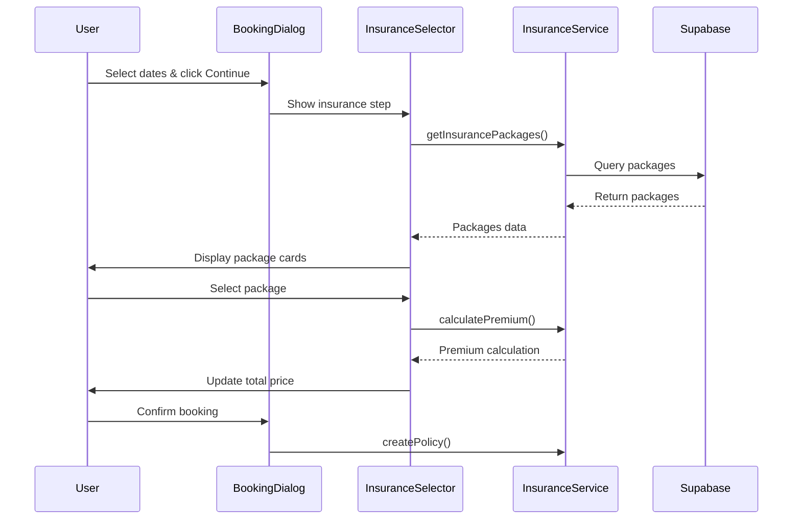
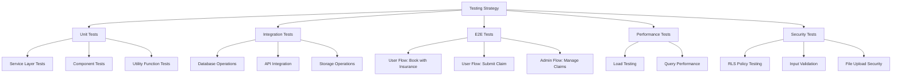
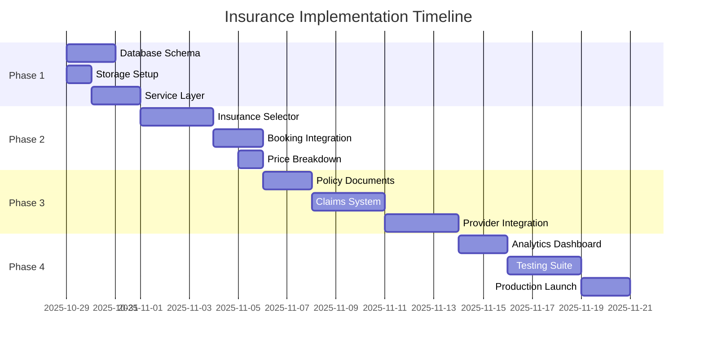

# MobiRides Insurance Integration Plan
**Epic**: MOBI-INS-001  
**Created**: October 28, 2025  
**Status**: Planning Phase  
**Priority**: Critical-High  
**Estimated Timeline**: 22 working days (3-4 weeks)  
**Revenue Impact**: +30-40% per booking

---

## Executive Summary

### Current State: 0% Complete
- ❌ No insurance packages defined
- ❌ No insurance selection in booking flow
- ❌ No insurance pricing or policy management
- ❌ No claims management system
- ❌ Missing competitive feature vs market leaders

### Business Impact
- **Revenue Loss**: Estimated $2,000-3,000/month from 50 bookings without insurance upsell
- **Competitive Disadvantage**: Industry standard feature missing
- **Risk Exposure**: No formal insurance framework for platform liability
- **User Confidence**: Missing trust signal for renters

### Success Criteria
- ✅ 30%+ insurance attach rate within first month
- ✅ $40-60 average revenue per insurance policy
- ✅ <5% claim dispute rate
- ✅ Complete claims processing within 48 hours
- ✅ Zero insurance-related booking failures

---

## Epic Overview

### Epic: Complete Insurance Package Integration for Revenue Optimization
**ID**: MOBI-INS-001  
**Type**: Feature Implementation  
**Business Value**: High  
**Technical Complexity**: Medium-High

### Dependencies
- ✅ Supabase database (existing)
- ✅ Booking system (existing)
- ✅ Wallet/payment system (existing)
- ❌ PDF generation library (needs installation)
- ❌ Insurance provider API integration (Phase 3)

### Key Stakeholders
- **Product Owner**: Revenue optimization priority
- **Engineering Lead**: Technical feasibility and architecture
- **Legal/Compliance**: Insurance regulations and policy terms
- **Customer Support**: Claims handling processes

---

## Phase 1: Foundation & Infrastructure (Days 1-5)

### Story 1.1: Database Schema Design & Implementation
**ID**: MOBI-INS-101  
**Story Points**: 8  
**Priority**: Critical  
**Assignee**: Backend Engineer  

#### User Story
> As a platform administrator, I need a robust database schema to manage insurance packages, policies, and claims so that the insurance system has a solid foundation.

#### Acceptance Criteria
- [ ] All insurance tables created with proper constraints
- [ ] RLS policies configured for security
- [ ] Foreign key relationships established
- [ ] Indexes created for performance
- [ ] Sample insurance packages seeded
- [ ] Database migration tested and documented

#### Technical Details

**Database Schema:**

```sql
-- Insurance Packages Table
CREATE TABLE IF NOT EXISTS public.insurance_packages (
  id UUID DEFAULT gen_random_uuid() PRIMARY KEY,
  name TEXT NOT NULL, -- 'Basic', 'Standard', 'Premium'
  display_name TEXT NOT NULL,
  description TEXT NOT NULL,
  coverage_amount DECIMAL(10,2) NOT NULL, -- Coverage limit in BWP
  daily_rate DECIMAL(10,2) NOT NULL, -- Daily insurance cost
  coverage_details JSONB NOT NULL, -- Detailed coverage breakdown
  deductible DECIMAL(10,2) DEFAULT 0, -- Amount renter pays in claim
  features TEXT[] NOT NULL, -- List of features
  is_active BOOLEAN DEFAULT true,
  sort_order INTEGER DEFAULT 0,
  created_at TIMESTAMP WITH TIME ZONE DEFAULT now(),
  updated_at TIMESTAMP WITH TIME ZONE DEFAULT now()
);

-- Insurance Policies Table (Active policies for bookings)
CREATE TABLE IF NOT EXISTS public.insurance_policies (
  id UUID DEFAULT gen_random_uuid() PRIMARY KEY,
  policy_number TEXT UNIQUE NOT NULL, -- Format: INS-YYYY-XXXXXX
  booking_id UUID NOT NULL REFERENCES public.bookings(id) ON DELETE CASCADE,
  package_id UUID NOT NULL REFERENCES public.insurance_packages(id),
  renter_id UUID NOT NULL REFERENCES auth.users(id),
  car_id UUID NOT NULL REFERENCES public.cars(id),
  
  -- Policy period
  start_date TIMESTAMP WITH TIME ZONE NOT NULL,
  end_date TIMESTAMP WITH TIME ZONE NOT NULL,
  
  -- Financial details
  total_premium DECIMAL(10,2) NOT NULL,
  coverage_amount DECIMAL(10,2) NOT NULL,
  deductible DECIMAL(10,2) NOT NULL,
  
  -- Policy status
  status TEXT NOT NULL DEFAULT 'active', -- active, expired, cancelled, claimed
  
  -- Policy documents
  policy_document_url TEXT,
  terms_accepted_at TIMESTAMP WITH TIME ZONE,
  
  created_at TIMESTAMP WITH TIME ZONE DEFAULT now(),
  updated_at TIMESTAMP WITH TIME ZONE DEFAULT now()
);

-- Insurance Claims Table
CREATE TABLE IF NOT EXISTS public.insurance_claims (
  id UUID DEFAULT gen_random_uuid() PRIMARY KEY,
  claim_number TEXT UNIQUE NOT NULL, -- Format: CLM-YYYY-XXXXXX
  policy_id UUID NOT NULL REFERENCES public.insurance_policies(id),
  booking_id UUID NOT NULL REFERENCES public.bookings(id),
  renter_id UUID NOT NULL REFERENCES auth.users(id),
  
  -- Claim details
  incident_date TIMESTAMP WITH TIME ZONE NOT NULL,
  incident_description TEXT NOT NULL,
  damage_description TEXT NOT NULL,
  estimated_damage_cost DECIMAL(10,2),
  
  -- Claim status
  status TEXT NOT NULL DEFAULT 'submitted', -- submitted, under_review, approved, rejected, paid
  
  -- Claim resolution
  approved_amount DECIMAL(10,2),
  deductible_paid DECIMAL(10,2),
  payout_amount DECIMAL(10,2),
  rejection_reason TEXT,
  
  -- Supporting documents
  evidence_urls TEXT[], -- Photos, police reports, etc.
  
  -- Workflow timestamps
  submitted_at TIMESTAMP WITH TIME ZONE DEFAULT now(),
  reviewed_at TIMESTAMP WITH TIME ZONE,
  resolved_at TIMESTAMP WITH TIME ZONE,
  paid_at TIMESTAMP WITH TIME ZONE,
  
  -- Admin notes
  admin_notes TEXT,
  reviewed_by UUID REFERENCES auth.users(id),
  
  created_at TIMESTAMP WITH TIME ZONE DEFAULT now(),
  updated_at TIMESTAMP WITH TIME ZONE DEFAULT now()
);

-- Insurance Coverage Details (Reference data)
CREATE TABLE IF NOT EXISTS public.insurance_coverage_details (
  id UUID DEFAULT gen_random_uuid() PRIMARY KEY,
  package_id UUID NOT NULL REFERENCES public.insurance_packages(id) ON DELETE CASCADE,
  coverage_type TEXT NOT NULL, -- 'collision', 'theft', 'third_party', 'personal_accident'
  coverage_limit DECIMAL(10,2) NOT NULL,
  description TEXT NOT NULL,
  exclusions TEXT[],
  created_at TIMESTAMP WITH TIME ZONE DEFAULT now()
);

-- Create indexes for performance
CREATE INDEX idx_insurance_policies_booking ON public.insurance_policies(booking_id);
CREATE INDEX idx_insurance_policies_renter ON public.insurance_policies(renter_id);
CREATE INDEX idx_insurance_policies_status ON public.insurance_policies(status);
CREATE INDEX idx_insurance_claims_policy ON public.insurance_claims(policy_id);
CREATE INDEX idx_insurance_claims_status ON public.insurance_claims(status);
CREATE INDEX idx_insurance_claims_renter ON public.insurance_claims(renter_id);

-- Enable RLS
ALTER TABLE public.insurance_packages ENABLE ROW LEVEL SECURITY;
ALTER TABLE public.insurance_policies ENABLE ROW LEVEL SECURITY;
ALTER TABLE public.insurance_claims ENABLE ROW LEVEL SECURITY;
ALTER TABLE public.insurance_coverage_details ENABLE ROW LEVEL SECURITY;

-- RLS Policies for insurance_packages (Public read, admin write)
CREATE POLICY "Insurance packages are viewable by everyone"
  ON public.insurance_packages FOR SELECT
  USING (is_active = true);

CREATE POLICY "Only admins can manage insurance packages"
  ON public.insurance_packages FOR ALL
  USING (
    EXISTS (
      SELECT 1 FROM public.profiles
      WHERE profiles.id = auth.uid()
      AND profiles.user_type = 'admin'
    )
  );

-- RLS Policies for insurance_policies
CREATE POLICY "Users can view their own insurance policies"
  ON public.insurance_policies FOR SELECT
  USING (renter_id = auth.uid());

CREATE POLICY "Admins can view all insurance policies"
  ON public.insurance_policies FOR SELECT
  USING (
    EXISTS (
      SELECT 1 FROM public.profiles
      WHERE profiles.id = auth.uid()
      AND profiles.user_type = 'admin'
    )
  );

CREATE POLICY "System can create insurance policies"
  ON public.insurance_policies FOR INSERT
  WITH CHECK (renter_id = auth.uid());

-- RLS Policies for insurance_claims
CREATE POLICY "Users can view their own claims"
  ON public.insurance_claims FOR SELECT
  USING (renter_id = auth.uid());

CREATE POLICY "Users can submit claims for their policies"
  ON public.insurance_claims FOR INSERT
  WITH CHECK (
    renter_id = auth.uid()
    AND EXISTS (
      SELECT 1 FROM public.insurance_policies
      WHERE insurance_policies.id = policy_id
      AND insurance_policies.renter_id = auth.uid()
    )
  );

CREATE POLICY "Admins can manage all claims"
  ON public.insurance_claims FOR ALL
  USING (
    EXISTS (
      SELECT 1 FROM public.profiles
      WHERE profiles.id = auth.uid()
      AND profiles.user_type = 'admin'
    )
  );

-- Seed initial insurance packages
INSERT INTO public.insurance_packages (name, display_name, description, coverage_amount, daily_rate, coverage_details, deductible, features, sort_order) VALUES
(
  'basic',
  'Basic Coverage',
  'Essential protection for your rental',
  50000.00,
  35.00,
  '{"collision": 50000, "theft": 50000, "third_party": 25000}'::jsonb,
  2000.00,
  ARRAY['Collision damage coverage up to BWP 50,000', 'Theft protection', 'Third-party liability up to BWP 25,000', 'BWP 2,000 deductible'],
  1
),
(
  'standard',
  'Standard Coverage',
  'Comprehensive protection with lower deductible',
  100000.00,
  60.00,
  '{"collision": 100000, "theft": 100000, "third_party": 50000, "personal_accident": 10000}'::jsonb,
  1000.00,
  ARRAY['Collision damage coverage up to BWP 100,000', 'Full theft protection', 'Third-party liability up to BWP 50,000', 'Personal accident cover BWP 10,000', 'BWP 1,000 deductible', '24/7 roadside assistance'],
  2
),
(
  'premium',
  'Premium Coverage',
  'Maximum protection with zero deductible',
  200000.00,
  95.00,
  '{"collision": 200000, "theft": 200000, "third_party": 100000, "personal_accident": 25000, "medical": 15000}'::jsonb,
  0.00,
  ARRAY['Collision damage coverage up to BWP 200,000', 'Comprehensive theft protection', 'Third-party liability up to BWP 100,000', 'Personal accident cover BWP 25,000', 'Medical expenses up to BWP 15,000', 'Zero deductible', '24/7 roadside assistance', 'Replacement vehicle guarantee'],
  3
);

-- Timestamp update trigger
CREATE OR REPLACE FUNCTION update_insurance_updated_at()
RETURNS TRIGGER AS $$
BEGIN
  NEW.updated_at = now();
  RETURN NEW;
END;
$$ LANGUAGE plpgsql;

CREATE TRIGGER update_insurance_packages_updated_at
  BEFORE UPDATE ON public.insurance_packages
  FOR EACH ROW EXECUTE FUNCTION update_insurance_updated_at();

CREATE TRIGGER update_insurance_policies_updated_at
  BEFORE UPDATE ON public.insurance_policies
  FOR EACH ROW EXECUTE FUNCTION update_insurance_updated_at();

CREATE TRIGGER update_insurance_claims_updated_at
  BEFORE UPDATE ON public.insurance_claims
  FOR EACH ROW EXECUTE FUNCTION update_insurance_updated_at();
```

#### Testing Checklist
- [ ] All tables created successfully
- [ ] RLS policies prevent unauthorized access
- [ ] Seed data loads correctly
- [ ] Foreign key constraints work
- [ ] Indexes improve query performance
- [ ] Triggers update timestamps correctly

---

### Story 1.2: Storage Bucket Setup for Insurance Documents
**ID**: MOBI-INS-102  
**Story Points**: 3  
**Priority**: High  
**Assignee**: Backend Engineer

#### User Story
> As a system, I need secure storage for insurance policy documents and claim evidence so that all insurance-related files are properly managed.

#### Acceptance Criteria
- [ ] Storage buckets created for insurance documents
- [ ] RLS policies configured for secure access
- [ ] File upload size limits set
- [ ] Accepted file types validated
- [ ] Public/private access configured correctly

#### Technical Details

**Storage Configuration:**

```sql
-- Create storage buckets
INSERT INTO storage.buckets (id, name, public) 
VALUES 
  ('insurance-policies', 'insurance-policies', false),
  ('insurance-claims', 'insurance-claims', false);

-- Storage policies for insurance-policies bucket
CREATE POLICY "Users can view their own insurance policy documents"
  ON storage.objects FOR SELECT
  USING (
    bucket_id = 'insurance-policies' 
    AND auth.uid()::text = (storage.foldername(name))[1]
  );

CREATE POLICY "System can upload insurance policy documents"
  ON storage.objects FOR INSERT
  WITH CHECK (
    bucket_id = 'insurance-policies'
    AND auth.uid()::text = (storage.foldername(name))[1]
  );

-- Storage policies for insurance-claims bucket
CREATE POLICY "Users can view their own claim documents"
  ON storage.objects FOR SELECT
  USING (
    bucket_id = 'insurance-claims'
    AND auth.uid()::text = (storage.foldername(name))[1]
  );

CREATE POLICY "Users can upload claim evidence"
  ON storage.objects FOR INSERT
  WITH CHECK (
    bucket_id = 'insurance-claims'
    AND auth.uid()::text = (storage.foldername(name))[1]
  );

CREATE POLICY "Admins can access all claim documents"
  ON storage.objects FOR SELECT
  USING (
    bucket_id = 'insurance-claims'
    AND EXISTS (
      SELECT 1 FROM public.profiles
      WHERE profiles.id = auth.uid()
      AND profiles.user_type = 'admin'
    )
  );
```

**File Validation Rules:**
- **Policy Documents**: PDF only, max 5MB
- **Claim Evidence**: Images (JPEG, PNG, HEIC), PDF, max 10MB per file
- **Folder Structure**: `{user_id}/{policy_number}/` or `{user_id}/{claim_number}/`

---

### Story 1.3: Insurance Service Layer Development
**ID**: MOBI-INS-103  
**Story Points**: 8  
**Priority**: High  
**Assignee**: Backend Engineer

#### User Story
> As a developer, I need a service layer to handle all insurance-related business logic so that insurance operations are consistent and maintainable.

#### Acceptance Criteria
- [ ] Insurance service class created with all core methods
- [ ] TypeScript interfaces defined for type safety
- [ ] Error handling implemented
- [ ] Service methods unit tested
- [ ] Documentation written

#### Technical Details

**File**: `src/services/insuranceService.ts`

```typescript
import { supabase } from '@/integrations/supabase/client';
import { Database } from '@/integrations/supabase/types';

export type InsurancePackage = Database['public']['Tables']['insurance_packages']['Row'];
export type InsurancePolicy = Database['public']['Tables']['insurance_policies']['Row'];
export type InsuranceClaim = Database['public']['Tables']['insurance_claims']['Row'];

export interface InsurancePriceCalculation {
  packageId: string;
  dailyRate: number;
  numberOfDays: number;
  totalPremium: number;
  coverageAmount: number;
  deductible: number;
}

export class InsuranceService {
  /**
   * Get all active insurance packages
   */
  static async getInsurancePackages(): Promise<InsurancePackage[]> {
    const { data, error } = await supabase
      .from('insurance_packages')
      .select('*')
      .eq('is_active', true)
      .order('sort_order', { ascending: true });

    if (error) throw error;
    return data || [];
  }

  /**
   * Get insurance package by ID
   */
  static async getPackageById(packageId: string): Promise<InsurancePackage> {
    const { data, error } = await supabase
      .from('insurance_packages')
      .select('*')
      .eq('id', packageId)
      .single();

    if (error) throw error;
    return data;
  }

  /**
   * Calculate insurance premium for a booking
   */
  static async calculatePremium(
    packageId: string,
    startDate: Date,
    endDate: Date
  ): Promise<InsurancePriceCalculation> {
    const insurancePackage = await this.getPackageById(packageId);
    
    const numberOfDays = Math.ceil(
      (endDate.getTime() - startDate.getTime()) / (1000 * 60 * 60 * 24)
    );

    const totalPremium = insurancePackage.daily_rate * numberOfDays;

    return {
      packageId: insurancePackage.id,
      dailyRate: insurancePackage.daily_rate,
      numberOfDays,
      totalPremium,
      coverageAmount: insurancePackage.coverage_amount,
      deductible: insurancePackage.deductible,
    };
  }

  /**
   * Create insurance policy for a booking
   */
  static async createPolicy(
    bookingId: string,
    packageId: string,
    renterId: string,
    carId: string,
    startDate: Date,
    endDate: Date
  ): Promise<InsurancePolicy> {
    const calculation = await this.calculatePremium(packageId, startDate, endDate);
    
    // Generate policy number
    const policyNumber = `INS-${new Date().getFullYear()}-${Math.random().toString(36).substr(2, 6).toUpperCase()}`;

    const { data, error } = await supabase
      .from('insurance_policies')
      .insert({
        policy_number: policyNumber,
        booking_id: bookingId,
        package_id: packageId,
        renter_id: renterId,
        car_id: carId,
        start_date: startDate.toISOString(),
        end_date: endDate.toISOString(),
        total_premium: calculation.totalPremium,
        coverage_amount: calculation.coverageAmount,
        deductible: calculation.deductible,
        status: 'active',
        terms_accepted_at: new Date().toISOString(),
      })
      .select()
      .single();

    if (error) throw error;
    return data;
  }

  /**
   * Get policy by booking ID
   */
  static async getPolicyByBookingId(bookingId: string): Promise<InsurancePolicy | null> {
    const { data, error } = await supabase
      .from('insurance_policies')
      .select('*')
      .eq('booking_id', bookingId)
      .single();

    if (error && error.code !== 'PGRST116') throw error; // Ignore "not found" error
    return data;
  }

  /**
   * Get all policies for a user
   */
  static async getUserPolicies(userId: string): Promise<InsurancePolicy[]> {
    const { data, error } = await supabase
      .from('insurance_policies')
      .select('*, insurance_packages(*), bookings(*), cars(*)')
      .eq('renter_id', userId)
      .order('created_at', { ascending: false });

    if (error) throw error;
    return data || [];
  }

  /**
   * Update policy status
   */
  static async updatePolicyStatus(
    policyId: string,
    status: 'active' | 'expired' | 'cancelled' | 'claimed'
  ): Promise<void> {
    const { error } = await supabase
      .from('insurance_policies')
      .update({ status })
      .eq('id', policyId);

    if (error) throw error;
  }
}

export class ClaimsService {
  /**
   * Submit an insurance claim
   */
  static async submitClaim(
    policyId: string,
    bookingId: string,
    renterId: string,
    incidentDate: Date,
    incidentDescription: string,
    damageDescription: string,
    estimatedCost: number,
    evidenceUrls: string[]
  ): Promise<InsuranceClaim> {
    // Generate claim number
    const claimNumber = `CLM-${new Date().getFullYear()}-${Math.random().toString(36).substr(2, 6).toUpperCase()}`;

    const { data, error } = await supabase
      .from('insurance_claims')
      .insert({
        claim_number: claimNumber,
        policy_id: policyId,
        booking_id: bookingId,
        renter_id: renterId,
        incident_date: incidentDate.toISOString(),
        incident_description: incidentDescription,
        damage_description: damageDescription,
        estimated_damage_cost: estimatedCost,
        evidence_urls: evidenceUrls,
        status: 'submitted',
        submitted_at: new Date().toISOString(),
      })
      .select()
      .single();

    if (error) throw error;
    return data;
  }

  /**
   * Get all claims for a user
   */
  static async getUserClaims(userId: string): Promise<InsuranceClaim[]> {
    const { data, error } = await supabase
      .from('insurance_claims')
      .select('*, insurance_policies(*), bookings(*)')
      .eq('renter_id', userId)
      .order('submitted_at', { ascending: false });

    if (error) throw error;
    return data || [];
  }

  /**
   * Update claim status (admin only)
   */
  static async updateClaimStatus(
    claimId: string,
    status: 'under_review' | 'approved' | 'rejected' | 'paid',
    adminId: string,
    approvedAmount?: number,
    rejectionReason?: string,
    adminNotes?: string
  ): Promise<void> {
    const updates: any = {
      status,
      reviewed_by: adminId,
      reviewed_at: new Date().toISOString(),
    };

    if (status === 'approved' && approvedAmount) {
      updates.approved_amount = approvedAmount;
      updates.resolved_at = new Date().toISOString();
    }

    if (status === 'rejected' && rejectionReason) {
      updates.rejection_reason = rejectionReason;
      updates.resolved_at = new Date().toISOString();
    }

    if (status === 'paid') {
      updates.paid_at = new Date().toISOString();
    }

    if (adminNotes) {
      updates.admin_notes = adminNotes;
    }

    const { error } = await supabase
      .from('insurance_claims')
      .update(updates)
      .eq('id', claimId);

    if (error) throw error;
  }
}
```

#### Testing Plan
- Unit tests for all service methods
- Integration tests with Supabase
- Error handling tests
- Premium calculation edge cases
- Policy number uniqueness tests

---

## Phase 2: User Interface & Booking Integration (Days 6-11)

### Story 2.1: Insurance Package Selection Component
**ID**: MOBI-INS-201  
**Story Points**: 8  
**Priority**: Critical  
**Assignee**: Frontend Engineer

#### User Story
> As a renter, I want to easily compare and select insurance packages during booking so that I can protect myself and the vehicle.

#### Acceptance Criteria
- [ ] Insurance package cards display all key information
- [ ] Users can compare coverage between packages
- [ ] Selected package highlights visually
- [ ] Price updates in real-time based on rental duration
- [ ] Mobile responsive design
- [ ] Loading states handled gracefully
- [ ] Error states display user-friendly messages

#### UI/UX Flow



#### Technical Details

**File**: `src/components/insurance/InsurancePackageSelector.tsx`

```typescript
import React from 'react';
import { useQuery } from '@tanstack/react-query';
import { Card } from '@/components/ui/card';
import { Button } from '@/components/ui/button';
import { Badge } from '@/components/ui/badge';
import { Checkbox } from '@/components/ui/checkbox';
import { Check, Shield, Info } from 'lucide-react';
import { InsuranceService, InsurancePackage } from '@/services/insuranceService';
import { Skeleton } from '@/components/ui/skeleton';
import { Alert, AlertDescription } from '@/components/ui/alert';

interface InsurancePackageSelectorProps {
  startDate: Date;
  endDate: Date;
  onSelectPackage: (packageId: string | null, premium: number) => void;
  selectedPackageId: string | null;
}

export const InsurancePackageSelector: React.FC<InsurancePackageSelectorProps> = ({
  startDate,
  endDate,
  onSelectPackage,
  selectedPackageId,
}) => {
  const { data: packages, isLoading, error } = useQuery({
    queryKey: ['insurance-packages'],
    queryFn: InsuranceService.getInsurancePackages,
  });

  const numberOfDays = Math.ceil(
    (endDate.getTime() - startDate.getTime()) / (1000 * 60 * 60 * 24)
  );

  const handleSelectPackage = (pkg: InsurancePackage) => {
    if (selectedPackageId === pkg.id) {
      onSelectPackage(null, 0);
    } else {
      const premium = pkg.daily_rate * numberOfDays;
      onSelectPackage(pkg.id, premium);
    }
  };

  if (isLoading) {
    return (
      <div className="space-y-4">
        <Skeleton className="h-48 w-full" />
        <Skeleton className="h-48 w-full" />
        <Skeleton className="h-48 w-full" />
      </div>
    );
  }

  if (error) {
    return (
      <Alert variant="destructive">
        <AlertDescription>
          Failed to load insurance packages. Please try again.
        </AlertDescription>
      </Alert>
    );
  }

  return (
    <div className="space-y-6">
      <div className="space-y-2">
        <h3 className="text-lg font-semibold">Protect Your Rental</h3>
        <p className="text-sm text-muted-foreground">
          Choose an insurance package for peace of mind during your rental period ({numberOfDays} days)
        </p>
      </div>

      <div className="space-y-4">
        {/* Option to skip insurance */}
        <Card
          className={`p-4 cursor-pointer transition-all ${
            selectedPackageId === null ? 'ring-2 ring-primary' : ''
          }`}
          onClick={() => onSelectPackage(null, 0)}
        >
          <div className="flex items-start space-x-3">
            <Checkbox checked={selectedPackageId === null} />
            <div className="flex-1">
              <div className="font-medium">No Insurance</div>
              <p className="text-sm text-muted-foreground mt-1">
                I'll rely on my personal insurance or accept full liability
              </p>
            </div>
            <div className="text-right">
              <div className="text-lg font-bold">BWP 0.00</div>
            </div>
          </div>
        </Card>

        {/* Insurance package cards */}
        {packages?.map((pkg) => {
          const totalPremium = pkg.daily_rate * numberOfDays;
          const isSelected = selectedPackageId === pkg.id;
          const isRecommended = pkg.name === 'standard';

          return (
            <Card
              key={pkg.id}
              className={`p-6 cursor-pointer transition-all hover:shadow-md ${
                isSelected ? 'ring-2 ring-primary' : ''
              }`}
              onClick={() => handleSelectPackage(pkg)}
            >
              <div className="space-y-4">
                {/* Header */}
                <div className="flex items-start justify-between">
                  <div className="flex items-start space-x-3">
                    <div className="mt-1">
                      <Shield className={`h-6 w-6 ${isSelected ? 'text-primary' : 'text-muted-foreground'}`} />
                    </div>
                    <div>
                      <div className="flex items-center space-x-2">
                        <h4 className="text-lg font-semibold">{pkg.display_name}</h4>
                        {isRecommended && (
                          <Badge variant="default">Recommended</Badge>
                        )}
                      </div>
                      <p className="text-sm text-muted-foreground mt-1">
                        {pkg.description}
                      </p>
                    </div>
                  </div>
                  <div className="text-right">
                    <div className="text-2xl font-bold">BWP {totalPremium.toFixed(2)}</div>
                    <div className="text-xs text-muted-foreground">
                      BWP {pkg.daily_rate}/day
                    </div>
                  </div>
                </div>

                {/* Coverage details */}
                <div className="space-y-2">
                  {pkg.features.map((feature, index) => (
                    <div key={index} className="flex items-start space-x-2">
                      <Check className="h-4 w-4 text-green-600 mt-0.5 flex-shrink-0" />
                      <span className="text-sm">{feature}</span>
                    </div>
                  ))}
                </div>

                {/* Coverage limits */}
                <div className="pt-4 border-t">
                  <div className="grid grid-cols-2 gap-4 text-sm">
                    <div>
                      <div className="text-muted-foreground">Coverage Limit</div>
                      <div className="font-semibold">BWP {pkg.coverage_amount.toLocaleString()}</div>
                    </div>
                    <div>
                      <div className="text-muted-foreground">Deductible</div>
                      <div className="font-semibold">
                        {pkg.deductible === 0 ? 'Zero' : `BWP ${pkg.deductible.toLocaleString()}`}
                      </div>
                    </div>
                  </div>
                </div>

                {/* Select button */}
                {isSelected && (
                  <Button className="w-full" variant="default">
                    <Check className="h-4 w-4 mr-2" />
                    Selected
                  </Button>
                )}
              </div>
            </Card>
          );
        })}
      </div>

      {/* Information alert */}
      <Alert>
        <Info className="h-4 w-4" />
        <AlertDescription>
          Insurance coverage is valid for the entire rental period. Claims must be submitted within 48 hours of an incident.
        </AlertDescription>
      </Alert>
    </div>
  );
};
```

#### Design Specifications
- Use semantic design tokens from `index.css`
- Hover states with subtle elevation
- Mobile-first responsive breakpoints
- Accessibility: Keyboard navigation and screen reader support
- Loading skeleton matches final layout

---

### Story 2.2: Booking Dialog Integration
**ID**: MOBI-INS-202  
**Story Points**: 5  
**Priority**: Critical  
**Assignee**: Frontend Engineer

#### User Story
> As a renter, I want insurance selection integrated into the booking flow so that I can add insurance when booking a car.

#### Acceptance Criteria
- [ ] Insurance step added to booking dialog
- [ ] Total price updates when insurance selected
- [ ] Insurance policy created when booking confirmed
- [ ] Booking confirmation shows insurance details
- [ ] Database updated with insurance information

#### Technical Details

**Updates to**: `src/components/booking/BookingDialog.tsx`

```typescript
// Add insurance state
const [selectedInsurancePackageId, setSelectedInsurancePackageId] = useState<string | null>(null);
const [insurancePremium, setInsurancePremium] = useState<number>(0);

// Update total price calculation
const totalPrice = useMemo(() => {
  const basePrice = calculatePrice(startDate, endDate, car.price_per_day);
  return basePrice + insurancePremium;
}, [startDate, endDate, car.price_per_day, insurancePremium]);

// Update booking creation to include insurance
const handleBookingConfirm = async () => {
  try {
    // Create booking first
    const booking = await createBooking({
      car_id: car.id,
      start_date: startDate,
      end_date: endDate,
      total_price: totalPrice,
      insurance_package_id: selectedInsurancePackageId, // New field
      insurance_premium: insurancePremium, // New field
    });

    // Create insurance policy if selected
    if (selectedInsurancePackageId && user) {
      await InsuranceService.createPolicy(
        booking.id,
        selectedInsurancePackageId,
        user.id,
        car.id,
        startDate,
        endDate
      );
    }

    toast.success('Booking confirmed!');
    onClose();
  } catch (error) {
    toast.error('Failed to create booking');
  }
};

// Add insurance step to dialog
<DialogContent className="max-w-2xl max-h-[90vh] overflow-y-auto">
  {step === 'insurance' && (
    <InsurancePackageSelector
      startDate={startDate}
      endDate={endDate}
      onSelectPackage={(packageId, premium) => {
        setSelectedInsurancePackageId(packageId);
        setInsurancePremium(premium);
      }}
      selectedPackageId={selectedInsurancePackageId}
    />
  )}
</DialogContent>
```

**Database Migration**:
```sql
ALTER TABLE public.bookings 
ADD COLUMN insurance_package_id UUID REFERENCES public.insurance_packages(id),
ADD COLUMN insurance_premium DECIMAL(10,2) DEFAULT 0;
```

---

### Story 2.3: Price Breakdown Component
**ID**: MOBI-INS-203  
**Story Points**: 3  
**Priority**: Medium  
**Assignee**: Frontend Engineer

#### User Story
> As a renter, I want to see a clear breakdown of my booking costs including insurance so that I understand what I'm paying for.

#### Acceptance Criteria
- [ ] Component displays itemized pricing
- [ ] Insurance premium shown separately
- [ ] Total price clearly highlighted
- [ ] Responsive design
- [ ] Updates in real-time

#### Technical Details

**File**: `src/components/booking/PriceBreakdown.tsx`

```typescript
interface PriceBreakdownProps {
  basePrice: number;
  insurancePremium: number;
  numberOfDays: number;
}

export const PriceBreakdown: React.FC<PriceBreakdownProps> = ({
  basePrice,
  insurancePremium,
  numberOfDays,
}) => {
  const total = basePrice + insurancePremium;

  return (
    <Card className="p-4">
      <div className="space-y-3">
        <h4 className="font-semibold">Price Breakdown</h4>
        
        <div className="space-y-2 text-sm">
          <div className="flex justify-between">
            <span className="text-muted-foreground">
              Car rental ({numberOfDays} days)
            </span>
            <span>BWP {basePrice.toFixed(2)}</span>
          </div>
          
          {insurancePremium > 0 && (
            <div className="flex justify-between">
              <span className="text-muted-foreground">
                Insurance premium
              </span>
              <span>BWP {insurancePremium.toFixed(2)}</span>
            </div>
          )}
        </div>

        <Separator />
        
        <div className="flex justify-between font-bold text-lg">
          <span>Total</span>
          <span>BWP {total.toFixed(2)}</span>
        </div>
      </div>
    </Card>
  );
};
```

---

## Phase 3: Advanced Features (Days 12-17)

### Story 3.1: Insurance Policy Document Management
**ID**: MOBI-INS-301  
**Story Points**: 5  
**Priority**: Medium  
**Assignee**: Backend Engineer

#### User Story
> As a renter, I want to receive a digital insurance policy document so that I have proof of coverage.

#### Acceptance Criteria
- [ ] PDF policy documents generated automatically
- [ ] Documents stored in Supabase storage
- [ ] Download link sent via email
- [ ] Policy accessible in user dashboard
- [ ] PDF includes all policy details

#### Technical Details

**Install dependency**: `jspdf`

**File**: `src/services/policyDocumentService.ts`

```typescript
import { jsPDF } from 'jspdf';
import { supabase } from '@/integrations/supabase/client';
import { InsurancePolicy } from './insuranceService';

export class PolicyDocumentService {
  /**
   * Generate PDF policy document
   */
  static async generatePolicyDocument(policy: InsurancePolicy): Promise<Blob> {
    const doc = new jsPDF();
    
    // Add policy details to PDF
    doc.setFontSize(20);
    doc.text('Insurance Policy Certificate', 20, 20);
    
    doc.setFontSize(12);
    doc.text(`Policy Number: ${policy.policy_number}`, 20, 40);
    doc.text(`Coverage Period: ${new Date(policy.start_date).toLocaleDateString()} - ${new Date(policy.end_date).toLocaleDateString()}`, 20, 50);
    doc.text(`Coverage Amount: BWP ${policy.coverage_amount}`, 20, 60);
    doc.text(`Premium Paid: BWP ${policy.total_premium}`, 20, 70);
    doc.text(`Deductible: BWP ${policy.deductible}`, 20, 80);
    
    // Add more details as needed...
    
    return doc.output('blob');
  }

  /**
   * Upload policy document to storage
   */
  static async uploadPolicyDocument(
    userId: string,
    policyNumber: string,
    pdfBlob: Blob
  ): Promise<string> {
    const fileName = `${userId}/${policyNumber}/policy.pdf`;
    
    const { data, error } = await supabase.storage
      .from('insurance-policies')
      .upload(fileName, pdfBlob, {
        contentType: 'application/pdf',
        upsert: true,
      });

    if (error) throw error;

    const { data: urlData } = supabase.storage
      .from('insurance-policies')
      .getPublicUrl(fileName);

    return urlData.publicUrl;
  }

  /**
   * Generate and save policy document
   */
  static async createAndStorePolicyDocument(policy: InsurancePolicy): Promise<string> {
    const pdfBlob = await this.generatePolicyDocument(policy);
    const url = await this.uploadPolicyDocument(
      policy.renter_id,
      policy.policy_number,
      pdfBlob
    );

    // Update policy with document URL
    await supabase
      .from('insurance_policies')
      .update({ policy_document_url: url })
      .eq('id', policy.id);

    return url;
  }
}
```

**Email Integration**:
- Send policy document link via Resend
- Include in booking confirmation email
- Add to renter dashboard for download

---

### Story 3.2: Insurance Claims Submission System
**ID**: MOBI-INS-302  
**Story Points**: 8  
**Priority**: Medium  
**Assignee**: Frontend + Backend Engineer

#### User Story
> As a renter, I want to submit insurance claims easily with supporting evidence so that I can get compensated for covered incidents.

#### Acceptance Criteria
- [ ] Claim submission form with file upload
- [ ] Admin interface to review claims
- [ ] Email notifications for claim status updates
- [ ] Claim history visible to users
- [ ] Admin can approve/reject claims

#### Technical Details

**File**: `src/components/insurance/ClaimSubmissionForm.tsx`

```typescript
import { useState } from 'react';
import { useForm } from 'react-hook-form';
import { zodResolver } from '@hookform/resolvers/zod';
import * as z from 'zod';
import { ClaimsService } from '@/services/insuranceService';
import { supabase } from '@/integrations/supabase/client';
import { toast } from 'sonner';

const claimSchema = z.object({
  incidentDate: z.date(),
  incidentDescription: z.string().min(20, 'Please provide detailed description'),
  damageDescription: z.string().min(20, 'Please describe the damage'),
  estimatedCost: z.number().min(0),
});

interface ClaimSubmissionFormProps {
  policyId: string;
  bookingId: string;
  userId: string;
}

export const ClaimSubmissionForm: React.FC<ClaimSubmissionFormProps> = ({
  policyId,
  bookingId,
  userId,
}) => {
  const [evidenceFiles, setEvidenceFiles] = useState<File[]>([]);
  const [uploading, setUploading] = useState(false);

  const form = useForm({
    resolver: zodResolver(claimSchema),
  });

  const handleFileUpload = async (files: FileList) => {
    const uploadedUrls: string[] = [];
    
    for (const file of Array.from(files)) {
      const fileName = `${userId}/${Date.now()}-${file.name}`;
      const { data, error } = await supabase.storage
        .from('insurance-claims')
        .upload(fileName, file);

      if (error) throw error;

      const { data: urlData } = supabase.storage
        .from('insurance-claims')
        .getPublicUrl(fileName);

      uploadedUrls.push(urlData.publicUrl);
    }

    return uploadedUrls;
  };

  const onSubmit = async (data: z.infer<typeof claimSchema>) => {
    try {
      setUploading(true);

      // Upload evidence files
      const evidenceUrls = evidenceFiles.length > 0
        ? await handleFileUpload(evidenceFiles as unknown as FileList)
        : [];

      // Submit claim
      await ClaimsService.submitClaim(
        policyId,
        bookingId,
        userId,
        data.incidentDate,
        data.incidentDescription,
        data.damageDescription,
        data.estimatedCost,
        evidenceUrls
      );

      toast.success('Claim submitted successfully');
      form.reset();
    } catch (error) {
      toast.error('Failed to submit claim');
    } finally {
      setUploading(false);
    }
  };

  return (
    <Form {...form}>
      <form onSubmit={form.handleSubmit(onSubmit)} className="space-y-6">
        {/* Form fields */}
      </form>
    </Form>
  );
};
```

**Admin Claims Management**: `src/pages/admin/ClaimsManagement.tsx`

```typescript
export const ClaimsManagementPage = () => {
  const { data: claims, refetch } = useQuery({
    queryKey: ['admin-claims'],
    queryFn: async () => {
      const { data } = await supabase
        .from('insurance_claims')
        .select('*, insurance_policies(*), bookings(*), profiles(*)')
        .order('submitted_at', { ascending: false });
      return data;
    },
  });

  const handleUpdateStatus = async (
    claimId: string,
    status: string,
    approvedAmount?: number
  ) => {
    const { data: { user } } = await supabase.auth.getUser();
    
    await ClaimsService.updateClaimStatus(
      claimId,
      status as any,
      user!.id,
      approvedAmount
    );

    toast.success('Claim updated');
    refetch();
  };

  return (
    <div className="space-y-6">
      <h1 className="text-3xl font-bold">Insurance Claims</h1>
      
      <ClaimsTable claims={claims} onUpdateStatus={handleUpdateStatus} />
    </div>
  );
};
```

---

### Story 3.3: Third-Party Insurance Provider Integration
**ID**: MOBI-INS-303  
**Story Points**: 13  
**Priority**: Low (Future Enhancement)  
**Assignee**: Backend Engineer

#### User Story
> As the platform owner, I want to integrate with a third-party insurance provider so that we can offer real insurance coverage instead of self-underwriting.

#### Acceptance Criteria
- [ ] API integration with insurance provider
- [ ] Policy synchronization
- [ ] Claims forwarding to provider
- [ ] Premium calculation via provider API
- [ ] Webhook handling for status updates

#### Technical Details

**Integration Pattern**:

```typescript
// Abstract insurance provider interface
interface InsuranceProviderAdapter {
  createPolicy(bookingDetails: BookingDetails): Promise<ExternalPolicy>;
  submitClaim(claimDetails: ClaimDetails): Promise<ExternalClaim>;
  getQuote(bookingDetails: BookingDetails): Promise<Quote>;
  cancelPolicy(policyId: string): Promise<void>;
}

// Concrete implementation for Botswana Insurance Company
class BotswanaInsuranceAdapter implements InsuranceProviderAdapter {
  private apiKey: string;
  private baseUrl: string;

  async createPolicy(bookingDetails: BookingDetails): Promise<ExternalPolicy> {
    // Call external API
    const response = await fetch(`${this.baseUrl}/policies`, {
      method: 'POST',
      headers: {
        'Authorization': `Bearer ${this.apiKey}`,
        'Content-Type': 'application/json',
      },
      body: JSON.stringify(bookingDetails),
    });

    return await response.json();
  }

  // Implement other methods...
}
```

**Edge Function for Webhooks**: `supabase/functions/insurance-webhooks/index.ts`

```typescript
import { serve } from 'https://deno.land/std@0.168.0/http/server.ts';
import { createClient } from 'https://esm.sh/@supabase/supabase-js@2';

serve(async (req) => {
  const { event, data } = await req.json();

  const supabase = createClient(
    Deno.env.get('SUPABASE_URL')!,
    Deno.env.get('SUPABASE_SERVICE_ROLE_KEY')!
  );

  switch (event) {
    case 'policy.updated':
      await supabase
        .from('insurance_policies')
        .update({ status: data.status })
        .eq('external_policy_id', data.policyId);
      break;

    case 'claim.processed':
      await supabase
        .from('insurance_claims')
        .update({ 
          status: data.status,
          approved_amount: data.approvedAmount,
        })
        .eq('external_claim_id', data.claimId);
      break;
  }

  return new Response(JSON.stringify({ success: true }), {
    headers: { 'Content-Type': 'application/json' },
  });
});
```

---

## Phase 4: Analytics, Testing & Launch (Days 18-22)

### Story 4.1: Insurance Analytics Dashboard
**ID**: MOBI-INS-401  
**Story Points**: 5  
**Priority**: Medium  
**Assignee**: Frontend Engineer

#### User Story
> As a platform administrator, I want to see insurance analytics so that I can track revenue and adoption.

#### Acceptance Criteria
- [ ] Dashboard shows key insurance metrics
- [ ] Revenue tracking by package type
- [ ] Adoption rate visualization
- [ ] Claims statistics
- [ ] Export functionality for reports

#### Key Metrics to Track
- Insurance attach rate (% of bookings with insurance)
- Revenue by package type (Basic/Standard/Premium)
- Average premium per booking
- Claims ratio (claims / policies)
- Claim approval rate
- Average claim payout

---

### Story 4.2: Comprehensive Testing Suite
**ID**: MOBI-INS-402  
**Story Points**: 8  
**Priority**: High  
**Assignee**: QA Engineer + Developers

#### Testing Plan



**Test Coverage Goals**:
- Unit tests: 80%+ coverage
- Integration tests: All critical paths
- E2E tests: Complete user flows
- Performance: <2s page load, <500ms API calls
- Security: All RLS policies validated

---

### Story 4.3: Production Deployment & Monitoring
**ID**: MOBI-INS-403  
**Story Points**: 5  
**Priority**: Critical  
**Assignee**: DevOps + Backend Engineer

#### Deployment Checklist
- [ ] All database migrations applied to production
- [ ] Storage buckets configured
- [ ] Environment variables set
- [ ] Email templates configured
- [ ] Analytics tracking enabled
- [ ] Error monitoring setup (Sentry/LogRocket)
- [ ] Performance monitoring configured
- [ ] Backup strategy implemented

#### Monitoring Dashboard
- Insurance policy creation success rate
- Average premium calculation time
- Claim submission success rate
- Email delivery rate
- Storage upload success rate
- Database query performance

#### Insurance-Specific Monitoring
```typescript
// Key metrics to track
const insuranceMetrics = {
  policies_created_today: number,
  policies_active: number,
  total_premium_revenue_today: number,
  claims_submitted_today: number,
  claims_pending_review: number,
  average_claim_resolution_time_hours: number,
  insurance_attach_rate_percentage: number,
};
```

---

## Timeline Summary



---

## Success Criteria

### Business Metrics
- ✅ **30%+ insurance attach rate** within first month
- ✅ **BWP 2,000+** additional monthly revenue (50 bookings × 30% × BWP 140 avg)
- ✅ **<5% claim dispute rate**
- ✅ **90%+ user satisfaction** with insurance process
- ✅ **<48 hours** average claim processing time

### Technical Metrics
- ✅ **99.9% uptime** for insurance services
- ✅ **<2s** insurance package loading time
- ✅ **<500ms** premium calculation time
- ✅ **100% successful** policy creation rate
- ✅ **Zero data loss** in claims submissions

### User Experience Metrics
- ✅ **<3 clicks** to select insurance
- ✅ **<5 minutes** to submit a claim
- ✅ **Clear pricing** breakdown displayed
- ✅ **Mobile-friendly** interface
- ✅ **Accessible** (WCAG AA compliance)

---

## Risk Mitigation

### Technical Risks
| Risk | Impact | Probability | Mitigation |
|------|--------|-------------|------------|
| Database migration fails | High | Low | Test on staging, rollback plan |
| Storage bucket misconfiguration | Medium | Medium | Validate RLS policies, test uploads |
| Premium calculation errors | High | Low | Unit tests, manual verification |
| Third-party API downtime | Medium | Medium | Graceful degradation, retry logic |

### Business Risks
| Risk | Impact | Probability | Mitigation |
|------|--------|-------------|------------|
| Low insurance adoption | High | Medium | Clear value proposition, recommended package |
| High claim rate | High | Low | Proper coverage limits, deductibles |
| Legal compliance issues | High | Low | Legal review before launch |
| User confusion | Medium | Medium | Clear UI/UX, help documentation |

---

## Go-Live Checklist

### Pre-Launch (Week 3)
- [ ] All code reviewed and merged
- [ ] QA testing completed
- [ ] Security audit passed
- [ ] Legal terms reviewed
- [ ] Support team trained
- [ ] Documentation completed

### Launch Day (Day 22)
- [ ] Deploy to production
- [ ] Run smoke tests
- [ ] Monitor error rates
- [ ] Check analytics tracking
- [ ] Verify email notifications
- [ ] Test complete user flow

### Post-Launch (Week 4+)
- [ ] Monitor adoption rates daily
- [ ] Collect user feedback
- [ ] Track revenue impact
- [ ] Analyze claim patterns
- [ ] Optimize based on data
- [ ] Plan future enhancements

---

## Dependencies & Prerequisites

### Technical Dependencies
- ✅ Supabase connection active
- ✅ React Query configured
- ✅ Email service (Resend) active
- ❌ PDF generation library (`jspdf`) - needs installation
- ❌ Insurance provider API credentials (Phase 3 only)

### Team Dependencies
- Backend Engineer (Phase 1, 3, 4)
- Frontend Engineer (Phase 2, 4)
- QA Engineer (Phase 4)
- Product Owner (All phases - approval)
- Legal Counsel (Pre-launch review)

### External Dependencies
- Third-party insurance provider (Phase 3 only)
- Payment gateway (existing)
- Email delivery service (existing)

---

## Post-Implementation Roadmap

### Short-Term Enhancements (Months 2-3)
1. **Dynamic Pricing**: Adjust insurance rates based on car value, driver history
2. **Multi-Currency Support**: Support for different currencies
3. **Mobile App Integration**: Native mobile insurance flow
4. **Advanced Analytics**: Predictive modeling for claims

### Medium-Term Enhancements (Months 4-6)
1. **Real-Time Claims Tracking**: GPS-based incident reporting
2. **AI-Powered Damage Assessment**: Photo analysis for claims
3. **Insurance Marketplace**: Multiple provider options
4. **Loyalty Discounts**: Rewards for claim-free renters

### Long-Term Vision (Year 1+)
1. **Host Insurance Products**: Insurance for car owners
2. **Peer Insurance Pool**: Community-based insurance model
3. **International Expansion**: Country-specific insurance packages
4. **Blockchain Verification**: Immutable policy records

---

## Appendix

### A. Insurance Package Pricing Strategy

| Package | Daily Rate | Target Market | Expected Adoption |
|---------|-----------|---------------|-------------------|
| Basic | BWP 35 | Budget renters | 40% |
| Standard | BWP 60 | Majority of renters | 50% |
| Premium | BWP 95 | Luxury/high-value cars | 10% |

**Expected Revenue (50 bookings/month, 30% attach rate, 4 days avg)**:
- Basic: 6 bookings × BWP 35 × 4 days = BWP 840
- Standard: 8 bookings × BWP 60 × 4 days = BWP 1,920
- Premium: 2 bookings × BWP 95 × 4 days = BWP 760
- **Total Monthly Revenue**: BWP 3,520

### B. Legal Compliance Checklist
- [ ] Insurance terms and conditions reviewed by legal counsel
- [ ] Coverage limits comply with Botswana regulations
- [ ] Privacy policy updated for insurance data
- [ ] Consent forms for claim data collection
- [ ] GDPR/data protection compliance (if applicable)

### C. Support Documentation
- User guide: "How to Select Insurance"
- User guide: "How to Submit a Claim"
- Admin guide: "Processing Insurance Claims"
- FAQ: Common insurance questions
- Video tutorial: Insurance selection process

---

**Document Status**: Draft  
**Next Review Date**: November 1, 2025  
**Owner**: Product Team  
**Last Updated**: October 28, 2025
