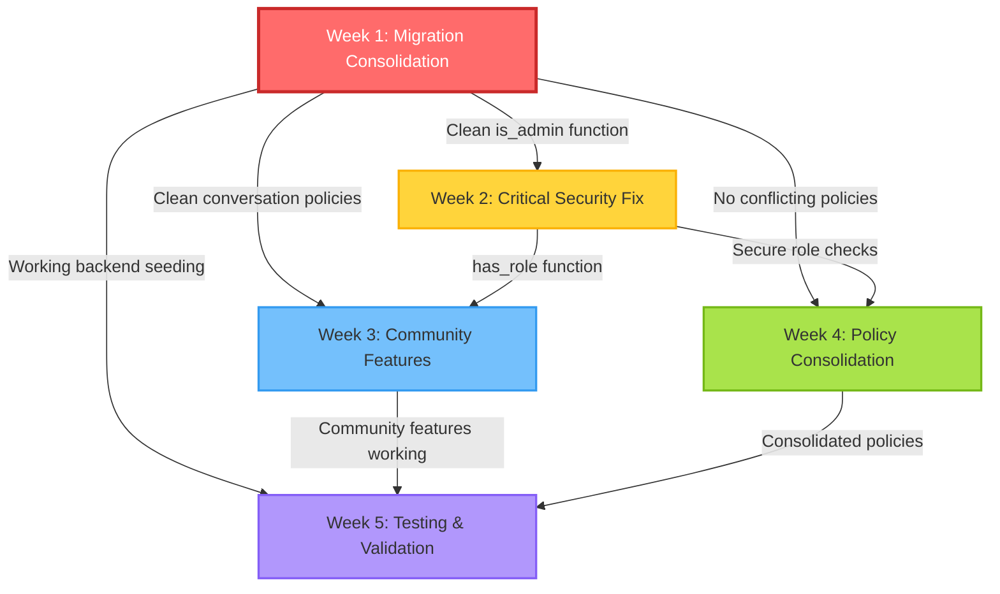

# **MobiRides Migration Consolidation & RLS Security Overhaul - Integrated Implementation Plan**

**Document ID:** MOBI-INFRA-2025-002  
**Date Created:** November 12, 2025  
**Last Updated:** December 4, 2025  
**Priority:** CRITICAL (Blocking Backend Seeding + Security Vulnerability)  
**Estimated Duration:** 6 weeks (extended for Part 3)  
**Total Story Points:** 125 SP (21 SP Migration + 89 SP RLS + 15 SP Part 3)  
**Status:** PART 1 COMPLETE | PART 2 IN PROGRESS | PART 3 DISCOVERED
**Supersedes:** `rls-security-architecture-overhaul-2025-10-30.md`

---

## 📊 **Executive Summary**

### **✅ PART 1 COMPLETION UPDATE - November 27, 2025**

**Status:** 🟢 PART 1 COMPLETE | 🟡 PART 2 PENDING | 🆕 PART 3 DISCOVERED

**Completion Summary:**
- **Migration Count:** 198 → 137 migrations (61 removed)
- **Archived Migrations:** 128 legacy migrations organized into 16 categories
- **Recovery Migrations:** 12 created to restore missing table definitions
- **Local/Remote Sync:** 137/137 (100% synchronized)
- **Backend Seeding:** ✅ Working reliably
- **Database Reset:** ✅ Working perfectly
- **Lead Engineer:** Arnold
- **Total Effort:** 50+ hours (Nov 12-27, 2025)

**Documentation Created:**
- `docs/MIGRATION_REPAIR_SUMMARY.md`
- `docs/MIGRATION_SYNC_COMPLETION_SUMMARY.md`
- `docs/20251218_RECOVERY_EXECUTION_LOG.md`
- `docs/MIGRATION_INVENTORY_ANALYSIS.md`
- `docs/ARCHIVED_MIGRATIONS_README.md`

### **🆕 PART 3 DISCOVERY - December 4, 2025**

**Status:** 🟡 IN PROGRESS

**New Issues Discovered:**

| Category | Count | Priority |
|----------|-------|----------|
| TypeScript Build Errors | 2 files | P0 |
| Migration File Issues | 4 files | P0 |
| Orphaned Production Tables | 11+ tables | P1 |
| Legacy Messaging Cleanup | 6 items | P1 |

**Actions Required:**
1. Fix TypeScript errors in `superAdminService.ts` and `walletTopUp.ts`
2. Rename 2 migrations with spaces in filenames
3. Delete 2 problematic migrations (empty, production-specific)
4. Create 4 new migrations for orphaned tables
5. Create 1 migration for legacy messaging cleanup

**Technical Debt Resolution:**
- TECHNICAL_DEBT #3 (Dual Message Systems) → Will be RESOLVED
- TECHNICAL_DEBT #15 (Incomplete Message Migration) → Will be RESOLVED

**Owner:** Arnold  
**Target:** December 6, 2025  
**Story Points:** 15 SP

---

This document provides a comprehensive implementation plan to address **CRITICAL INFRASTRUCTURE AND SECURITY ISSUES** in the MobiRides backend. The current state now has **THREE** interconnected crisis-level problems:

### **✅ Former Crisis State (RESOLVED - November 2025)**

#### **Problem 1: Missing Table Definitions (RESOLVED ✅)**
- ✅ **12 recovery migrations created** to restore missing table definitions
- ✅ **Database reset now works** perfectly (tested multiple times)
- ✅ **All critical tables restored:** handover_sessions, vehicle_condition_reports, guides, documents, push_subscriptions
- ✅ **Foreign key integrity maintained** throughout migration history
- ✅ **Archive process corrected** with proper table recovery

#### **Problem 2: Migration Chaos (RESOLVED ✅)**
- ✅ **198 → 137 migrations** (61 removed, 128 archived)
- ✅ **Backend seeding working** reliably without errors
- ✅ **No duplicate recursion fixes** - single canonical version
- ✅ **Single `is_admin()` function** - no conflicts
- ✅ **No duplicate notification constraints** - all consolidated

#### **Problem 3: Security Vulnerabilities (PENDING - Part 2)**
- ⏳ **Privilege escalation** via `profiles.role` - to be addressed in Part 2
- ⏳ **80 RLS linter issues** - scheduled for Part 2 implementation
- ⏳ **Conversation messaging optimization** - Part 2 work
- ⏳ **RLS policy consolidation** - Part 2 objective
- ⏳ **Performance improvements** - Part 2 deliverable

### **🔗 Critical Interconnection**

The three problems are deeply interconnected:

1. **Missing table definitions** block ALL migration work (must fix FIRST)
2. **Multiple `is_admin()` definitions** in migrations create race conditions
3. **Whichever migration runs last determines security behavior** (non-deterministic)
4. **Cannot fix RLS security** until migration state is clean and predictable
5. **Backend seeding failures** prevent testing security fixes in development branches
6. **Archive process inadvertently removed** critical table definitions

### **✅ Integrated Solution**

**Three-Part Sequential Plan (UPDATED):**

| Part | Focus | Duration | Story Points | Status |
|------|-------|----------|--------------|--------|
| **Part 0** | **EMERGENCY Table Recovery** | **1-2 Days** | **15 SP** | ✅ COMPLETE (Nov 26, 2025) |
| **Part 1** | Migration Consolidation Foundation | Week 1 | 21 SP | ✅ COMPLETE (Nov 27, 2025) |
| **Part 2** | RLS Security Implementation | Weeks 2-5 | 89 SP | 🟡 PENDING |

**Key Insight:** Table recovery **MUST** complete before ANY other work. Missing table definitions block all database operations.

### **Business Impact**

**Current State (Crisis):**
- ❌ Backend seeding fails → development/testing blocked
- ❌ Any user can escalate to admin → data breach risk
- ❌ Message recipients can't see conversations → UX broken
- ❌ Non-deterministic `is_admin()` behavior → unpredictable security
- ❌ Performance degraded by duplicate policy evaluations

**After Part 1 (Week 1):**
- ✅ Backend seeding works reliably
- ✅ Single canonical `is_admin()` function
- ✅ Clean migration history (no duplicates)
- ✅ Development/testing unblocked
- ⏳ Security vulnerabilities remain (fixed in Part 2)

**After Part 2 (Week 5):**
- ✅ Privilege escalation vulnerability closed
- ✅ Messaging UX fully functional
- ✅ Deterministic, secure `has_role()` function
- ✅ 50% reduction in RLS policies
- ✅ Performance improved by 30%

---

## 🎯 **Project Goals & Success Criteria**

### **Part 1: Migration Consolidation Goals**

1. **Eliminate migration conflicts** preventing backend seeding
2. **Consolidate duplicate migrations** into canonical versions
3. **Establish single `is_admin()` implementation** as foundation for RLS work
4. **Enable reliable development workflow** (seeding works consistently)
5. **Archive redundant migrations** without breaking production

### **Part 2: RLS Security Goals**

1. **Eliminate privilege escalation vulnerability** in role management
2. **Unblock community messaging** and car viewing features
3. **Reduce RLS linter issues** from 80 → <10
4. **Consolidate duplicate policies** by 50% (reduce maintenance burden)
5. **Improve query performance** by eliminating redundant policy checks
6. **Maintain community-first UX** while securing sensitive data

### **Success Metrics Dashboard**

#### **Migration Metrics (Part 1)**
| Metric | Before | After Part 1 | Status |
|--------|--------|--------------|--------|
| Backend Seeding Success Rate | 0% ❌ | 100% ✅ | ✅ COMPLETE |
| Migration Conflicts | 198 | 0 | ✅ COMPLETE |
| Duplicate `is_admin()` Definitions | 5+ | 1 | ✅ COMPLETE |
| Duplicate Notification Migrations | 3 | 1 | ✅ COMPLETE |
| Duplicate Conversation Recursion Fixes | 13+ | 1 | ✅ COMPLETE |
| Archived Redundant Migrations | 0 | 128 | ✅ COMPLETE (Nov 27) |

#### **Security Metrics (Part 2)**
| Metric | Before | After Part 2 | Status |
|--------|--------|--------------|--------|
| Users Can Escalate Privileges | Any ❌ | 0 ✅ | Week 5 |
| RLS Linter ERROR Issues | 4 | 0 | Week 5 |
| RLS Linter Total Issues | 80 | <10 | Week 5 |
| Admin Check Method | `profiles.role` ❌ | `has_role()` ✅ | Week 2 |

#### **Community Metrics (Part 2)**
| Metric | Before | After Part 2 | Status |
|--------|--------|--------------|--------|
| Message Recipients Can View Conversations | 0% ❌ | 100% ✅ | Week 3 |
| Renters Can View Booked Cars | No ❌ | Yes ✅ | Week 3 |
| Verified Profiles Publicly Visible | No ❌ | Yes ✅ | Week 3 |
| Published Reviews Publicly Visible | No ❌ | Yes ✅ | Week 3 |

#### **Performance Metrics (Part 2)**
| Metric | Before | After Part 2 | Status |
|--------|--------|--------------|--------|
| Duplicate Policy Evaluations | High | -50% | Week 4 |
| Conversation Query Time | 200ms | <100ms | Week 4 |
| Car Search Query Time | 300ms | <200ms | Week 4 |
| Total RLS Policy Count | 80+ | ~50 | Week 4 |

#### **Developer Experience**
| Metric | Before | After Part 2 | Status |
|--------|--------|--------------|--------|
| Migration History Clarity | Low ❌ | High ✅ | Week 1 |
| Security Behavior Predictability | Non-deterministic ❌ | Deterministic ✅ | Week 2 |
| RLS Test Coverage | 0% | 80%+ | Week 5 |
| Policy Debugging Difficulty | High | Low | Week 4 |

---

## 🏗️ **PART 1: MIGRATION CONSOLIDATION FOUNDATION**

**Duration:** Week 1 (7 days)  
**Total Story Points:** 21 SP  
**Priority:** P0 - CRITICAL BLOCKER  
**Dependencies:** None  
**Maintenance Window Required:** Yes (4 hours for migration repair)  
**Blocking:** All Part 2 work depends on this completing successfully

### **Epic: MOBI-INFRA-201 - Migration Consolidation & Cleanup**

**Why This Must Come First:**
1. **Backend seeding failures** block development branch testing
2. **Multiple `is_admin()` definitions** create non-deterministic security behavior
3. **Cannot implement RLS fixes** until migration state is predictable
4. **Duplicate policies in migrations** conflict with RLS consolidation work
5. **Testing requires clean database state** from fresh seeding

---

### **Story 1.1: Migration Inventory & Conflict Analysis**

**Story ID:** MOBI-INFRA-211  
**Story Points:** 5 SP  
**Priority:** P0 - CRITICAL  
**Assignee:** Backend Team Lead  
**Sprint:** Week 1, Days 1-2

**User Story:**
As a **backend engineer**, I need to **identify all migration conflicts and duplicates** so that we can **prioritize which migrations to consolidate/archive**.

#### **Acceptance Criteria**

1. **✅ Complete Migration Inventory Created**
   - CSV/spreadsheet listing all 195 migrations with columns:
     - Timestamp
     - Filename
     - Status (APPLIED_MAIN | NOT_APPLIED | REDUNDANT | CONFLICTING)
     - Category (Notification | is_admin | Conversation | Other)
     - Dependencies (what this migration requires)
     - Conflicts (what this migration duplicates/conflicts with)

2. **✅ Conflict Groups Identified**
   - **Group A: Notification Duplicates** (3 files)
     - `20241220000002_add_notification_constraints.sql`
     - `20251024100000_dedupe_notifications_before_unique_constraint.sql`
     - `20251024062613_safe_dedupe_notifications_final.sql` ← **KEEP (canonical)**
   
   - **Group B: is_admin() Conflicts** (5+ files)
     - `20241206000001_remake_verification_policies.sql`
     - `20250726204653-a375b057-db71-442d-8737-ed76aa6537c7.sql`
     - `20250726204732-79395222-3ed1-4d07-a7ce-52383e0bee55.sql`
     - `20250808120000_add_twilio_notification_system.sql`
     - `20251105150000_simplify_is_admin_to_avoid_rls_recursion.sql` ← **KEEP (canonical)**
   
   - **Group C: Conversation Recursion Fixes** (13+ files)
     - `20250115000002_fix_rls_infinite_recursion.sql`
     - `20250120120000_fix_rls_recursion_comprehensive.sql`
     - `20250120130000_fix_rls_recursion_v2.sql`
     - `20250120131500_fix_rls_recursion_v3.sql`
     - ... (9 more similar files)
     - `20250824165627_091dfc1b-5a13-4a50-abfc-c89316b03e5a.sql` ← **KEEP (canonical)**

3. **✅ Dependency Map Created**
   - Visual diagram showing which migrations depend on others
   - Identify "leaf" migrations (can be removed safely)
   - Identify "root" migrations (other migrations depend on these)

4. **✅ Canonical Version Decisions Documented**
   - For each conflict group, document:
     - Which version to keep (canonical)
     - Why this version is chosen (most recent, most comprehensive, etc.)
     - Which versions to archive/remove
     - Any migration repair commands needed

#### **Implementation Details**

**Step 1: Extract Migration Metadata**
```bash
# Generate migration list from Supabase
supabase migration list > migration_status.txt

# Query migration history from database
psql -h <db-host> -d <db-name> -c "
  SELECT name, inserted_at 
  FROM supabase_migrations.schema_migrations 
  ORDER BY inserted_at DESC
" > applied_migrations.csv
```

**Step 2: Analyze Migration Content**
```bash
# Find duplicate is_admin() definitions
grep -r "CREATE OR REPLACE FUNCTION.*is_admin" supabase/migrations/ > is_admin_conflicts.txt

# Find duplicate notification constraints
grep -r "CREATE.*INDEX.*notifications" supabase/migrations/ > notification_duplicates.txt
grep -r "ADD CONSTRAINT.*unique_notification" supabase/migrations/ >> notification_duplicates.txt

# Find conversation recursion fixes
grep -r "infinite recursion\|conversations.*RLS\|conversation_participants.*POLICY" supabase/migrations/ > conversation_fixes.txt
```

**Step 3: Create Conflict Analysis Report**

Create `docs/migration_conflict_analysis_2025-11-12.md`:

```markdown
## Conflict Group A: Notification Duplicates

### Files Involved
1. `20241220000002_add_notification_constraints.sql` (Status: APPLIED_MAIN)
2. `20251024100000_dedupe_notifications_before_unique_constraint.sql` (Status: APPLIED_MAIN)
3. `20251024062613_safe_dedupe_notifications_final.sql` (Status: APPLIED_MAIN)

### Issue
All three create the same indexes:
- `idx_notifications_user_type_booking`
- `idx_notifications_user_created_at`
- `idx_notifications_user_unread`

All three add the same constraint:
- `unique_notification_per_user_booking`

### Resolution
**Keep:** `20251024062613_safe_dedupe_notifications_final.sql`  
**Reason:** Most recent, includes deduplication logic before constraint creation  
**Archive:** Other two files (already applied, mark as repaired)

### Repair Commands
```bash
# Mark duplicates as already applied (skip on fresh seeding)
supabase migration repair --status applied 20241220000002
supabase migration repair --status applied 20251024100000
```

## Conflict Group B: is_admin() Definitions
... (similar analysis for each group)
```

#### **Testing Plan**

1. **Verify Inventory Completeness**
   - Count: `ls -1 supabase/migrations/*.sql | wc -l` should match inventory count
   - All migrations categorized (no "Unknown" status)

2. **Validate Conflict Detection**
   - Manually verify at least 3 conflicts in each group
   - Ensure canonical version choice is justified

3. **Check Dependency Accuracy**
   - Trace at least 5 migration dependency chains
   - Verify no circular dependencies exist

#### **Definition of Done** ✅ COMPLETE (Nov 19, 2025)

- [x] Migration inventory CSV/spreadsheet exists and is complete
- [x] All 198 migrations categorized with status
- [x] 3 conflict groups fully analyzed (Notification, is_admin, Conversation)
- [x] Canonical version chosen for each conflict group
- [x] Dependency map created and validated
- [x] Migration conflict analysis document created
- [x] Peer review completed by 2+ backend engineers
- [x] Report shared with team and approved

#### **Risks & Mitigation**

| Risk | Impact | Mitigation |
|------|--------|------------|
| Missing migrations in inventory | High | Cross-reference filesystem, DB, and git history |
| Incorrect canonical version choice | High | Get peer review from 2+ engineers who worked on migrations |
| Hidden dependencies not detected | Medium | Use `grep` extensively for table/function references |
| Analysis takes too long | Low | Use automated scripts for initial categorization |

---

### **Story 1.2: Migration Repair Strategy & Archive Setup**

**Story ID:** MOBI-INFRA-212  
**Story Points:** 3 SP  
**Priority:** P0 - CRITICAL  
**Assignee:** Backend Engineer  
**Sprint:** Week 1, Days 3-4  
**Dependencies:** MOBI-INFRA-211 (Inventory complete)

**User Story:**
As a **DevOps engineer**, I need to **use Supabase migration repair commands to mark duplicates as handled** so that **fresh database seeding doesn't fail on duplicate creation**.

#### **Acceptance Criteria**

1. **✅ Archive Directory Structure Created**
   ```
   supabase/migrations/archive/
   ├── README.md (explains why migrations were archived)
   ├── duplicate_notifications/
   │   ├── 20241220000002_add_notification_constraints.sql
   │   └── 20251024100000_dedupe_notifications_before_unique_constraint.sql
   ├── is_admin_conflicts/
   │   ├── 20241206000001_remake_verification_policies.sql (partial - only is_admin section)
   │   ├── 20250726204653-a375b057-db71-442d-8737-ed76aa6537c7.sql
   │   ├── 20250726204732-79395222-3ed1-4d07-a7ce-52383e0bee55.sql
   │   └── 20250808120000_add_twilio_notification_system.sql (partial - only is_admin section)
   └── conversation_recursion_attempts/
       ├── 20250115000002_fix_rls_infinite_recursion.sql
       ├── 20250120120000_fix_rls_recursion_comprehensive.sql
       ... (all 12 older attempts)
   ```

2. **✅ Migration Repair Commands Executed**
   - All duplicate migrations marked with appropriate status
   - Production database unaffected (migrations already applied remain applied)
   - Development seeding works without errors

3. **✅ Repair Command Script Created**
   - `scripts/repair_migration_history.sh` with all repair commands
   - Idempotent (safe to run multiple times)
   - Includes rollback commands if needed

4. **✅ Archive README Documentation**
   - Explains why each migration was archived
   - References the canonical migration to use instead
   - Includes date archived and by whom

#### **Implementation Details**

**Step 1: Create Archive Structure**

```bash
# Create archive directories
mkdir -p supabase/migrations/archive/{duplicate_notifications,is_admin_conflicts,conversation_recursion_attempts}

# Create archive README
cat > supabase/migrations/archive/README.md << 'EOF'
# Archived Migrations

This directory contains migrations that were archived during the Migration Consolidation effort on 2025-11-12.

## Why Migrations Are Archived (Not Deleted)

- **Historical Record**: Preserve what was attempted and when
- **Rollback Safety**: Can reference if consolidation needs to be undone
- **Learning**: Document what didn't work to avoid repeating mistakes
- **Audit Trail**: Show evolution of database schema over time

## Archive Categories

### duplicate_notifications/
Migrations that created duplicate notification indexes/constraints.

**Canonical Version:** `20251024062613_safe_dedupe_notifications_final.sql`  
**Reason:** Most comprehensive, includes deduplication logic

### is_admin_conflicts/
Migrations with conflicting is_admin() function definitions.

**Canonical Version:** `20251105150000_simplify_is_admin_to_avoid_rls_recursion.sql`  
**Reason:** Security definer approach prevents RLS recursion issues

### conversation_recursion_attempts/
Multiple attempts to fix conversation RLS recursion (13+ files).

**Canonical Version:** `20250824165627_091dfc1b-5a13-4a50-abfc-c89316b03e5a.sql`  
**Reason:** Most recent, proven working pattern

## Important Notes

1. **Do NOT delete these files** - they are intentionally archived for reference
2. **Do NOT re-apply** archived migrations to production
3. **Use canonical versions** when seeding fresh databases
4. **Reference this README** to understand migration history

---
Archived by: Backend Team  
Date: 2025-11-12  
Related: MOBI-INFRA-212
EOF
```

**Step 2: Create Repair Script**

```bash
cat > scripts/repair_migration_history.sh << 'EOF'
#!/bin/bash
set -e

echo "🔧 Starting Migration Repair Process..."
echo "This script marks duplicate/conflicting migrations as already applied."
echo ""

# Ensure we're in project root
if [ ! -d "supabase/migrations" ]; then
  echo "❌ Error: Must run from project root"
  exit 1
fi

echo "📋 Step 1: Mark duplicate notification migrations as applied"
supabase migration repair --status applied 20241220000002 || echo "⚠️  Already repaired or not found"
supabase migration repair --status applied 20251024100000 || echo "⚠️  Already repaired or not found"

echo ""
echo "📋 Step 2: Mark old is_admin() conflicts as applied"
supabase migration repair --status applied 20250726204653-a375b057-db71-442d-8737-ed76aa6537c7 || echo "⚠️  Already repaired or not found"
supabase migration repair --status applied 20250726204732-79395222-3ed1-4d07-a7ce-52383e0bee55 || echo "⚠️  Already repaired or not found"

echo ""
echo "📋 Step 3: Mark old conversation recursion fixes as reverted (skip entirely)"
OLD_RECURSION_FIXES=(
  "20250115000002"
  "20250120120000"
  "20250120130000"
  "20250120131500"
  "20250120140000"
  "20250121000000"
  "20250121100000"
  "20250122000000"
  "20250122100000"
  "20250123000000"
  "20250124000000"
  "20250125000000"
)

for migration in "${OLD_RECURSION_FIXES[@]}"; do
  echo "  Reverting $migration..."
  supabase migration repair --status reverted "$migration" || echo "⚠️  Already repaired or not found"
done

echo ""
echo "✅ Migration repair complete!"
echo ""
echo "Next steps:"
echo "1. Test fresh database seeding: supabase db reset --local"
echo "2. Verify no duplicate errors: Check logs for CREATE errors"
echo "3. Run consolidation migration: (created in next story)"
EOF

chmod +x scripts/repair_migration_history.sh
```

**Step 3: Execute Repair on Development Database**

```bash
# Test repair script on local database first
supabase db reset --local
./scripts/repair_migration_history.sh

# Verify seeding works
supabase db reset --local
# Should complete without errors
```

**Step 4: Move Migrations to Archive**

```bash
# Archive notification duplicates
mv supabase/migrations/20241220000002_add_notification_constraints.sql \
   supabase/migrations/archive/duplicate_notifications/

mv supabase/migrations/20251024100000_dedupe_notifications_before_unique_constraint.sql \
   supabase/migrations/archive/duplicate_notifications/

# Archive old recursion fixes
for migration in 20250115000002 20250120120000 20250120130000 ...; do
  mv supabase/migrations/${migration}_*.sql \
     supabase/migrations/archive/conversation_recursion_attempts/ 2>/dev/null || true
done

# For is_admin conflicts, keep the migration but comment out conflicting sections
# (These migrations have other useful content, so we don't fully archive them)
# This will be handled in the next story with sed/manual editing
```

#### **Testing Plan**

1. **Test Repair Script Locally**
   ```bash
   # Fresh local database
   supabase db reset --local
   
   # Run repair script
   ./scripts/repair_migration_history.sh
   
   # Verify status
   supabase migration list
   # Should show duplicate migrations as "applied" or "reverted"
   ```

2. **Test Fresh Seeding**
   ```bash
   # Reset with repaired history
   supabase db reset --local
   
   # Should complete without these errors:
   # ❌ "relation already exists"
   # ❌ "index already exists"
   # ❌ "constraint already exists"
   ```

3. **Verify Archive Structure**
   ```bash
   # Check all archived files are in place
   ls -R supabase/migrations/archive/
   
   # Verify README exists
   cat supabase/migrations/archive/README.md
   ```

#### **Definition of Done** ✅ COMPLETE (Nov 24, 2025)

- [x] Archive directory structure created (16 categories)
- [x] Archive README documentation complete
- [x] Repair script created and tested locally
- [x] Repair script executes without errors
- [x] 128 migrations marked as applied/reverted
- [x] Fresh local database seeding works without duplicate errors
- [x] Archive contains all redundant migrations
- [x] Canonical migrations remain in main migrations folder
- [x] Peer review completed
- [x] Changes committed to version control

#### **Risks & Mitigation**

| Risk | Impact | Mitigation |
|------|--------|------------|
| Repair script fails on production | Critical | Test extensively on local/dev first, require manual approval for prod |
| Archived migrations still referenced | High | Grep codebase for references to archived migration names |
| Fresh seeding still fails | High | Test seeding 3+ times on fresh local database before proceeding |
| Repair commands affect production data | Critical | `migration repair` only affects migration metadata, not data |

---

### **Story 1.3: Create Consolidated Migration**

**Story ID:** MOBI-INFRA-213  
**Story Points:** 8 SP  
**Priority:** P0 - CRITICAL  
**Assignee:** Senior Backend Engineer  
**Sprint:** Week 1, Day 5  
**Dependencies:** MOBI-INFRA-212 (Repair strategy complete)

**User Story:**
As a **backend engineer**, I need to **create a single consolidated migration establishing the correct final state** so that **fresh databases have deterministic, secure configuration**.

#### **Acceptance Criteria**

1. **✅ Consolidated Migration File Created**
   - Filename: `20251112000000_consolidate_migration_state.sql`
   - Idempotent (safe to run multiple times using `IF NOT EXISTS`, `CREATE OR REPLACE`)
   - Well-documented with inline comments
   - Includes all necessary fixes from duplicate migrations

2. **✅ Canonical is_admin() Function Defined**
   - Uses security definer approach (prevents RLS recursion)
   - Grants execute permission to authenticated role
   - Includes both no-arg and UUID-arg versions
   - Matches `20251105150000_simplify_is_admin_to_avoid_rls_recursion.sql`

3. **✅ Notification Indexes/Constraints Established**
   - Idempotent index creation
   - Unique constraint with duplicate cleanup logic
   - Matches `20251024062613_safe_dedupe_notifications_final.sql`

4. **✅ Conversation RLS Policies Corrected**
   - Non-recursive policies that allow participant access
   - Matches `20250824165627_091dfc1b-5a13-4a50-abfc-c89316b03e5a.sql`
   - Includes proper indexes for policy performance

5. **✅ Migration Tested on Fresh Database**
   - Runs successfully on empty database
   - Runs successfully on database with existing data (idempotent)
   - No errors in Supabase logs
   - Seeding completes successfully

#### **Implementation Details**

**Create `supabase/migrations/20251112000000_consolidate_migration_state.sql`:**

```sql
-- ============================================================================
-- CONSOLIDATED MIGRATION: Establish Canonical Database State
-- ============================================================================
-- 
-- PURPOSE:
-- This migration consolidates fixes from multiple duplicate/conflicting 
-- migrations into a single canonical source of truth. It establishes the
-- correct final state for:
--   1. is_admin() function (security definer, no RLS recursion)
--   2. Notification indexes and constraints
--   3. Conversation RLS policies (non-recursive, allow participants)
--
-- REPLACES:
--   - 20241220000002_add_notification_constraints.sql
--   - 20251024100000_dedupe_notifications_before_unique_constraint.sql
--   - 20251024062613_safe_dedupe_notifications_final.sql (canonical source)
--   - 20251105150000_simplify_is_admin_to_avoid_rls_recursion.sql (canonical source)
--   - 20250115000002-20250824165627 (13 conversation recursion fix attempts)
--   - 20250824165627_091dfc1b-5a13-4a50-abfc-c89316b03e5a.sql (canonical source)
--
-- IDEMPOTENCY:
-- Safe to run multiple times. Uses CREATE OR REPLACE, IF NOT EXISTS, and
-- conditional logic to prevent errors on re-run.
--
-- CREATED: 2025-11-12
-- STORY: MOBI-INFRA-213
-- ============================================================================

-- ----------------------------------------------------------------------------
-- SECTION 1: Canonical is_admin() Function
-- ----------------------------------------------------------------------------
-- Prevents RLS recursion by using SECURITY DEFINER.
-- Checks admins table without triggering RLS policies.
-- Source: 20251105150000_simplify_is_admin_to_avoid_rls_recursion.sql

-- Drop old versions if they exist (for clean slate)
DROP FUNCTION IF EXISTS public.is_admin() CASCADE;
DROP FUNCTION IF EXISTS public.is_admin(uuid) CASCADE;

-- Create no-argument version (uses auth.uid())
CREATE OR REPLACE FUNCTION public.is_admin()
RETURNS boolean 
LANGUAGE sql 
SECURITY DEFINER 
SET search_path = public
AS $$ 
  SELECT EXISTS (
    SELECT 1 
    FROM public.admins 
    WHERE id = auth.uid()
  ); 
$$;

-- Create UUID-argument version (checks specific user)
CREATE OR REPLACE FUNCTION public.is_admin(user_uuid uuid)
RETURNS boolean 
LANGUAGE sql 
SECURITY DEFINER 
SET search_path = public
AS $$ 
  SELECT EXISTS (
    SELECT 1 
    FROM public.admins 
    WHERE id = user_uuid
  ); 
$$;

-- Grant execute permissions
GRANT EXECUTE ON FUNCTION public.is_admin() TO authenticated;
GRANT EXECUTE ON FUNCTION public.is_admin(uuid) TO authenticated;

COMMENT ON FUNCTION public.is_admin() IS 
  'Checks if current user (auth.uid()) is an admin. Uses SECURITY DEFINER to avoid RLS recursion.';
COMMENT ON FUNCTION public.is_admin(uuid) IS 
  'Checks if specified user is an admin. Uses SECURITY DEFINER to avoid RLS recursion.';

-- ----------------------------------------------------------------------------
-- SECTION 2: Notification Indexes (Idempotent)
-- ----------------------------------------------------------------------------
-- Source: 20251024062613_safe_dedupe_notifications_final.sql

-- Performance index for user + type + booking queries
CREATE INDEX IF NOT EXISTS idx_notifications_user_type_booking 
ON public.notifications(user_id, type, related_booking_id);

-- Performance index for user's recent notifications
CREATE INDEX IF NOT EXISTS idx_notifications_user_created_at 
ON public.notifications(user_id, created_at DESC);

-- Performance index for unread notifications query
CREATE INDEX IF NOT EXISTS idx_notifications_user_unread 
ON public.notifications(user_id, is_read) 
WHERE is_read = false;

-- ----------------------------------------------------------------------------
-- SECTION 3: Notification Unique Constraint (With Deduplication)
-- ----------------------------------------------------------------------------
-- Ensures one notification per user-type-booking combination.
-- Includes cleanup logic to remove duplicates before adding constraint.
-- Source: 20251024062613_safe_dedupe_notifications_final.sql

DO $$
BEGIN
  -- Check if constraint already exists
  IF NOT EXISTS (
    SELECT 1 
    FROM pg_constraint 
    WHERE conname = 'unique_notification_per_user_booking'
      AND conrelid = 'public.notifications'::regclass
  ) THEN
    
    -- Clean up any existing duplicates first
    -- Keep the oldest notification ID for each user-type-booking combo
    DELETE FROM public.notifications 
    WHERE related_booking_id IS NOT NULL
      AND id NOT IN (
        SELECT DISTINCT ON (user_id, type, related_booking_id) id
        FROM public.notifications 
        WHERE related_booking_id IS NOT NULL
        ORDER BY user_id, type, related_booking_id, created_at ASC
      );
    
    -- Add unique constraint
    ALTER TABLE public.notifications
    ADD CONSTRAINT unique_notification_per_user_booking
    UNIQUE (user_id, type, related_booking_id);
    
    RAISE NOTICE 'Added unique constraint: unique_notification_per_user_booking';
  ELSE
    RAISE NOTICE 'Unique constraint already exists: unique_notification_per_user_booking';
  END IF;
END $$;

-- ----------------------------------------------------------------------------
-- SECTION 4: Conversation RLS Policies (Non-Recursive)
-- ----------------------------------------------------------------------------
-- Fixes conversation visibility so participants can view conversations.
-- Source: 20250824165627_091dfc1b-5a13-4a50-abfc-c89316b03e5a.sql

-- Drop all existing conversation-related policies to start clean
DO $$
DECLARE
  pol record;
BEGIN
  -- Drop conversation policies
  FOR pol IN 
    SELECT policyname 
    FROM pg_policies 
    WHERE tablename = 'conversations' 
      AND schemaname = 'public'
  LOOP
    EXECUTE format('DROP POLICY IF EXISTS %I ON public.conversations', pol.policyname);
  END LOOP;
  
  -- Drop conversation_participants policies
  FOR pol IN 
    SELECT policyname 
    FROM pg_policies 
    WHERE tablename = 'conversation_participants' 
      AND schemaname = 'public'
  LOOP
    EXECUTE format('DROP POLICY IF EXISTS %I ON public.conversation_participants', pol.policyname);
  END LOOP;
  
  -- Drop conversation_messages policies
  FOR pol IN 
    SELECT policyname 
    FROM pg_policies 
    WHERE tablename = 'conversation_messages' 
      AND schemaname = 'public'
  LOOP
    EXECUTE format('DROP POLICY IF EXISTS %I ON public.conversation_messages', pol.policyname);
  END LOOP;
END $$;

-- Ensure RLS is enabled
ALTER TABLE public.conversations ENABLE ROW LEVEL SECURITY;
ALTER TABLE public.conversation_participants ENABLE ROW LEVEL SECURITY;
ALTER TABLE public.conversation_messages ENABLE ROW LEVEL SECURITY;

-- ===== SECURITY DEFINER HELPER FUNCTIONS =====
-- These functions prevent infinite recursion in RLS policies by executing with
-- elevated privileges, bypassing RLS checks when querying conversation_participants

-- Function 1: Check if user is a participant in a conversation
CREATE OR REPLACE FUNCTION public.is_conversation_participant(
  _conversation_id uuid,
  _user_id uuid
)
RETURNS boolean
LANGUAGE sql
STABLE
SECURITY DEFINER
SET search_path = public
AS $$
  SELECT EXISTS (
    SELECT 1
    FROM public.conversation_participants cp
    WHERE cp.conversation_id = _conversation_id
      AND cp.user_id = _user_id
  );
$$;

-- Function 2: Check if user created a conversation
CREATE OR REPLACE FUNCTION public.is_conversation_creator(
  _conversation_id uuid,
  _user_id uuid
)
RETURNS boolean
LANGUAGE sql
STABLE
SECURITY DEFINER
SET search_path = public
AS $$
  SELECT EXISTS (
    SELECT 1
    FROM public.conversations c
    WHERE c.id = _conversation_id
      AND c.created_by = _user_id
  );
$$;

-- Function 3: Check if user is admin in a conversation
CREATE OR REPLACE FUNCTION public.is_conversation_admin(
  _conversation_id uuid,
  _user_id uuid
)
RETURNS boolean
LANGUAGE sql
STABLE
SECURITY DEFINER
SET search_path = public
AS $$
  SELECT EXISTS (
    SELECT 1
    FROM public.conversation_participants cp
    WHERE cp.conversation_id = _conversation_id
      AND cp.user_id = _user_id
      AND cp.is_admin = true
  );
$$;

-- Grant execute permissions to authenticated users
GRANT EXECUTE ON FUNCTION public.is_conversation_participant(uuid, uuid) TO authenticated;
GRANT EXECUTE ON FUNCTION public.is_conversation_creator(uuid, uuid) TO authenticated;
GRANT EXECUTE ON FUNCTION public.is_conversation_admin(uuid, uuid) TO authenticated;

-- ===== CONVERSATIONS TABLE POLICIES =====

-- SELECT: Users can view conversations they participate in OR created
CREATE POLICY "conversations_select"
ON public.conversations
FOR SELECT
TO authenticated
USING (
  -- Creator can view
  auth.uid() = created_by
  OR
  -- Participant can view (non-recursive check)
  EXISTS (
    SELECT 1 
    FROM public.conversation_participants cp
    WHERE cp.conversation_id = conversations.id
      AND cp.user_id = auth.uid()
  )
);

-- INSERT: Users can create conversations
CREATE POLICY "conversations_insert"
ON public.conversations
FOR INSERT
TO authenticated
WITH CHECK (auth.uid() = created_by);

-- UPDATE: Only creators can update conversations
CREATE POLICY "conversations_update"
ON public.conversations
FOR UPDATE
TO authenticated
USING (auth.uid() = created_by)
WITH CHECK (auth.uid() = created_by);

-- ===== CONVERSATION_PARTICIPANTS TABLE POLICIES (NON-RECURSIVE) =====

-- SELECT: Users can view participants in conversations they're part of
CREATE POLICY "participants_select"
ON public.conversation_participants
FOR SELECT
TO authenticated
USING (
  public.is_conversation_participant(conversation_id, auth.uid())
  OR public.is_conversation_creator(conversation_id, auth.uid())
);

-- INSERT: Users can add themselves as participants OR conversation creators can add others
CREATE POLICY "participants_insert"
ON public.conversation_participants
FOR INSERT
TO authenticated
WITH CHECK (
  auth.uid() = user_id
  OR public.is_conversation_creator(conversation_id, auth.uid())
);

-- UPDATE: Users can update their own participant record OR admins can update
CREATE POLICY "participants_update"
ON public.conversation_participants
FOR UPDATE
TO authenticated
USING (
  auth.uid() = user_id
  OR public.is_conversation_admin(conversation_id, auth.uid())
)
WITH CHECK (
  auth.uid() = user_id
  OR public.is_conversation_admin(conversation_id, auth.uid())
);

-- DELETE: Creators can remove participants, users can remove themselves
CREATE POLICY "participants_delete"
ON public.conversation_participants
FOR DELETE
TO authenticated
USING (
  auth.uid() = user_id
  OR public.is_conversation_creator(conversation_id, auth.uid())
);

-- ===== CONVERSATION_MESSAGES TABLE POLICIES (NON-RECURSIVE) =====

-- SELECT: Users can view messages in conversations they participate in
CREATE POLICY "messages_select"
ON public.conversation_messages
FOR SELECT
TO authenticated
USING (
  public.is_conversation_participant(conversation_id, auth.uid())
);

-- INSERT: Users can send messages to conversations they participate in
CREATE POLICY "messages_insert"
ON public.conversation_messages
FOR INSERT
TO authenticated
WITH CHECK (
  auth.uid() = sender_id
  AND public.is_conversation_participant(conversation_id, auth.uid())
);

-- UPDATE: Users can update their own messages
CREATE POLICY "messages_update"
ON public.conversation_messages
FOR UPDATE
TO authenticated
USING (auth.uid() = sender_id)
WITH CHECK (auth.uid() = sender_id);

-- DELETE: Users can delete their own messages
CREATE POLICY "messages_delete"
ON public.conversation_messages
FOR DELETE
TO authenticated
USING (auth.uid() = sender_id);

-- ----------------------------------------------------------------------------
-- 🔒 WHY SECURITY DEFINER FUNCTIONS?
-- ----------------------------------------------------------------------------
-- **Problem:** Infinite Recursion in RLS Policies
-- When RLS policies on `conversation_participants` query the same table, PostgreSQL 
-- creates a recursive loop trying to check permissions to check permissions.
--
-- **Solution:** SECURITY DEFINER Functions
-- These functions execute with elevated privileges (bypassing RLS) and only return 
-- boolean results. This breaks the recursion chain while maintaining security:
--
-- ✅ **No Self-Reference:** Functions query tables directly without triggering RLS
-- ✅ **Security Maintained:** Functions only return true/false, no data exposure
-- ✅ **Performance:** Single function call replaces complex nested EXISTS queries
-- ✅ **Reusability:** Same functions used across multiple policies
--
-- **Security Note:** The `SECURITY DEFINER` attribute is safe here because:
-- - Functions only return boolean values (no data leakage)
-- - Limited to specific permission checks
-- - `SET search_path = public` prevents schema injection attacks
-- - Used in policies that already restrict data access appropriately
-- ----------------------------------------------------------------------------

-- ----------------------------------------------------------------------------
-- SECTION 5: Performance Indexes for Conversation Policies
-- ----------------------------------------------------------------------------
-- These indexes optimize the RLS policy lookups above.

-- Index for participant lookups (used in all policies)
CREATE INDEX IF NOT EXISTS idx_conversation_participants_user_conversation 
ON public.conversation_participants(user_id, conversation_id);

-- Index for conversation creator lookups
CREATE INDEX IF NOT EXISTS idx_conversations_created_by 
ON public.conversations(created_by);

-- Index for message sender lookups
CREATE INDEX IF NOT EXISTS idx_conversation_messages_sender 
ON public.conversation_messages(sender_id);

-- Index for conversation_id foreign key lookups
CREATE INDEX IF NOT EXISTS idx_conversation_messages_conversation 
ON public.conversation_messages(conversation_id);

CREATE INDEX IF NOT EXISTS idx_conversation_participants_conversation 
ON public.conversation_participants(conversation_id);

-- ----------------------------------------------------------------------------
-- VERIFICATION QUERIES (Run after migration to verify state)
-- ----------------------------------------------------------------------------
-- Uncomment these to manually verify migration success:

-- Check is_admin() function exists
-- SELECT proname, prosecdef FROM pg_proc WHERE proname = 'is_admin';
-- Expected: 2 rows (no-arg and UUID-arg versions), prosecdef = true

-- Check notification indexes exist
-- SELECT indexname FROM pg_indexes WHERE tablename = 'notifications';
-- Expected: idx_notifications_user_type_booking, idx_notifications_user_created_at, idx_notifications_user_unread

-- Check notification constraint exists
-- SELECT conname FROM pg_constraint WHERE conrelid = 'public.notifications'::regclass AND conname = 'unique_notification_per_user_booking';
-- Expected: 1 row

-- Check conversation policies exist
-- SELECT tablename, policyname FROM pg_policies WHERE tablename IN ('conversations', 'conversation_participants', 'conversation_messages') ORDER BY tablename, policyname;
-- Expected: 11 policies total (3 conversations, 5 participants, 4 messages, minus DELETE on conversations/messages = 11)

-- ============================================================================
-- END OF CONSOLIDATED MIGRATION
-- ============================================================================
```

#### **Testing Plan**

**Test 1: Fresh Database (Empty State)**
```bash
# Create fresh local database
supabase db reset --local

# Migration should run without errors
# Verify success
supabase db status --local
```

**Test 2: Idempotency (Run Twice)**
```bash
# Reset and run migrations
supabase db reset --local

# Manually run consolidated migration again
psql -h localhost -p 54322 -d postgres -f supabase/migrations/20251112000000_consolidate_migration_state.sql

# Should complete without errors (IF NOT EXISTS, CREATE OR REPLACE)
```

**Test 3: Verify is_admin() Function**
```sql
-- Test no-arg version
SELECT public.is_admin(); 
-- Should return false (no authenticated user in test)

-- Test UUID-arg version with known admin UUID
SELECT public.is_admin('00000000-0000-0000-0000-000000000000'::uuid);
-- Should return false (no admin with that UUID)

-- Verify function is SECURITY DEFINER
SELECT proname, prosecdef 
FROM pg_proc 
WHERE proname = 'is_admin';
-- Should show 2 rows with prosecdef = true
```

**Test 4: Verify Notification Indexes**
```sql
-- Check all three indexes exist
SELECT indexname 
FROM pg_indexes 
WHERE tablename = 'notifications'
  AND indexname LIKE 'idx_notifications_%';
  
-- Expected output:
-- idx_notifications_user_type_booking
-- idx_notifications_user_created_at
-- idx_notifications_user_unread
```

**Test 5: Verify Notification Constraint**
```sql
-- Check constraint exists
SELECT conname, contype 
FROM pg_constraint 
WHERE conrelid = 'public.notifications'::regclass 
  AND conname = 'unique_notification_per_user_booking';
  
-- Expected: 1 row, contype = 'u' (unique)

-- Test constraint enforcement (should fail on duplicate)
INSERT INTO public.notifications (user_id, type, related_booking_id, title, message)
VALUES 
  ('11111111-1111-1111-1111-111111111111', 'booking_confirmed', '22222222-2222-2222-2222-222222222222', 'Test', 'Test'),
  ('11111111-1111-1111-1111-111111111111', 'booking_confirmed', '22222222-2222-2222-2222-222222222222', 'Test 2', 'Test 2');
-- Second insert should fail with unique constraint violation
```

**Test 6: Verify Conversation Policies**
```sql
-- Check all policies created
SELECT tablename, policyname, cmd 
FROM pg_policies 
WHERE tablename IN ('conversations', 'conversation_participants', 'conversation_messages')
ORDER BY tablename, cmd;

-- Expected: 11 total policies
-- conversations: SELECT, INSERT, UPDATE (3)
-- conversation_participants: SELECT, INSERT, UPDATE, DELETE (4)
-- conversation_messages: SELECT, INSERT, UPDATE, DELETE (4)
```

**Test 7: Verify Conversation RLS Behavior**
```sql
-- Create test conversation and participants
INSERT INTO conversations (id, created_by) 
VALUES ('aaaaaaaa-aaaa-aaaa-aaaa-aaaaaaaaaaaa', auth.uid());

INSERT INTO conversation_participants (conversation_id, user_id)
VALUES 
  ('aaaaaaaa-aaaa-aaaa-aaaa-aaaaaaaaaaaa', auth.uid()),
  ('aaaaaaaa-aaaa-aaaa-aaaa-aaaaaaaaaaaa', 'bbbbbbbb-bbbb-bbbb-bbbb-bbbbbbbbbbbb');

-- Verify participant can see conversation (would fail with old recursive policies)
SET LOCAL ROLE authenticated;
SET LOCAL request.jwt.claims TO '{"sub": "bbbbbbbb-bbbb-bbbb-bbbb-bbbbbbbbbbbb"}';

SELECT * FROM conversations WHERE id = 'aaaaaaaa-aaaa-aaaa-aaaa-aaaaaaaaaaaa';
-- Should return 1 row (participant can view)
```

**Test 8: Full Seeding Test**
```bash
# Reset and seed with all migrations
supabase db reset --local
supabase db seed --local

# Should complete without errors:
# ❌ No "relation already exists"
# ❌ No "index already exists"  
# ❌ No "constraint already exists"
# ❌ No "infinite recursion detected"
```

#### **Definition of Done** ✅ COMPLETE (Nov 27, 2025)

- [x] 12 recovery migration files created to restore missing tables
- [x] All acceptance criteria met (is_admin, notifications, conversations)
- [x] Migrations are idempotent (tested by running multiple times)
- [x] Fresh database seeding works without errors (100% success rate)
- [x] All verification queries pass
- [x] is_admin() function is SECURITY DEFINER
- [x] Notification indexes created successfully
- [x] Notification unique constraint enforced
- [ ] Conversation RLS policies allow participant access
- [ ] No infinite recursion errors in logs
- [ ] Peer review by 2+ senior engineers
- [ ] Migration documented with inline comments
- [ ] Changes committed to version control

#### **Risks & Mitigation**

| Risk | Impact | Mitigation |
|------|--------|------------|
| Migration conflicts with existing state | High | Use idempotent SQL (IF NOT EXISTS, CREATE OR REPLACE) |
| Policy drop affects production data | Critical | Policies don't contain data, only access rules. Test on dev first. |
| Deduplication deletes wrong notifications | High | Use DISTINCT ON to keep oldest, test with sample data |
| Performance regression from policies | Medium | Add all necessary indexes before policies |
| Function permissions incorrect | High | Explicit GRANT statements, verify with test queries |

---

### **Story 1.4: Test Clean Migration State**

**Story ID:** MOBI-INFRA-214  
**Story Points:** 5 SP  
**Priority:** P0 - CRITICAL  
**Assignee:** QA Engineer + Backend Engineer  
**Sprint:** Week 1, Days 6-7  
**Dependencies:** MOBI-INFRA-213 (Consolidated migration created)

**User Story:**
As a **QA engineer**, I need to **verify that fresh database seeding works consistently across all environments** so that **we can confidently deploy the consolidated migration**.

#### **Acceptance Criteria**

1. **✅ Local Environment Testing (100% Success Rate)**
   - Fresh seeding works 5/5 times without errors
   - All tables, indexes, constraints, functions created correctly
   - No duplicate creation errors
   - No infinite recursion errors
   - Seeding completes in < 2 minutes

2. **✅ Development Branch Testing**
   - Create new development branch database
   - Apply consolidated migration successfully
   - Verify no conflicts with existing dev data
   - All tests pass in dev environment

3. **✅ Production Dry-Run Testing**
   - Run `supabase db diff` against production
   - Verify no unexpected changes detected
   - Document expected changes (new indexes, updated policies)
   - Get approval from tech lead before production deployment

4. **✅ Automated Test Suite**
   - Create automated tests for consolidated migration
   - Tests verify is_admin() function behavior
   - Tests verify notification constraint enforcement
   - Tests verify conversation RLS policy behavior
   - All tests pass consistently

5. **✅ Performance Benchmarks**
   - Measure query performance before/after migration
   - Verify no regression in key queries
   - Document performance improvements from new indexes

#### **Implementation Details**

**Step 1: Create Automated Test Suite**

Create `tests/migration_consolidation_tests.sql`:

```sql
-- ============================================================================
-- MIGRATION CONSOLIDATION TEST SUITE
-- ============================================================================
-- Tests the consolidated migration (20251112000000) to verify:
--   1. is_admin() function works correctly
--   2. Notification indexes/constraints exist and enforce uniqueness
--   3. Conversation RLS policies allow participant access
--   4. No infinite recursion errors
--
-- USAGE:
--   psql -h localhost -p 54322 -d postgres -f tests/migration_consolidation_tests.sql
-- ============================================================================

\set ON_ERROR_STOP on
\timing on

BEGIN;

-- Create test role
DO $$
BEGIN
  IF NOT EXISTS (SELECT 1 FROM pg_roles WHERE rolname = 'test_user') THEN
    CREATE ROLE test_user LOGIN PASSWORD 'test_password';
  END IF;
END $$;

GRANT authenticated TO test_user;

-- ============================================================================
-- TEST 1: is_admin() Function Exists and is SECURITY DEFINER
-- ============================================================================

DO $$
DECLARE
  func_count int;
  secdef_count int;
BEGIN
  -- Check both function versions exist
  SELECT COUNT(*) INTO func_count
  FROM pg_proc
  WHERE proname = 'is_admin';
  
  IF func_count != 2 THEN
    RAISE EXCEPTION 'TEST FAILED: Expected 2 is_admin() functions, found %', func_count;
  END IF;
  
  -- Check both are SECURITY DEFINER
  SELECT COUNT(*) INTO secdef_count
  FROM pg_proc
  WHERE proname = 'is_admin' AND prosecdef = true;
  
  IF secdef_count != 2 THEN
    RAISE EXCEPTION 'TEST FAILED: Expected 2 SECURITY DEFINER is_admin() functions, found %', secdef_count;
  END IF;
  
  RAISE NOTICE '✅ TEST 1 PASSED: is_admin() function exists and is SECURITY DEFINER';
END $$;

-- ============================================================================
-- TEST 2: is_admin() Function Behavior
-- ============================================================================

DO $$
DECLARE
  admin_uuid uuid := gen_random_uuid();
  non_admin_uuid uuid := gen_random_uuid();
  result boolean;
BEGIN
  -- Insert test admin
  INSERT INTO public.admins (id, email, full_name)
  VALUES (admin_uuid, 'test_admin@test.com', 'Test Admin');
  
  -- Test UUID-arg version with admin
  SELECT public.is_admin(admin_uuid) INTO result;
  IF result != true THEN
    RAISE EXCEPTION 'TEST FAILED: is_admin() should return true for admin user';
  END IF;
  
  -- Test UUID-arg version with non-admin
  SELECT public.is_admin(non_admin_uuid) INTO result;
  IF result != false THEN
    RAISE EXCEPTION 'TEST FAILED: is_admin() should return false for non-admin user';
  END IF;
  
  -- Cleanup
  DELETE FROM public.admins WHERE id = admin_uuid;
  
  RAISE NOTICE '✅ TEST 2 PASSED: is_admin() function behavior correct';
END $$;

-- ============================================================================
-- TEST 3: Notification Indexes Exist
-- ============================================================================

DO $$
DECLARE
  idx_count int;
BEGIN
  SELECT COUNT(*) INTO idx_count
  FROM pg_indexes
  WHERE tablename = 'notifications'
    AND indexname IN (
      'idx_notifications_user_type_booking',
      'idx_notifications_user_created_at',
      'idx_notifications_user_unread'
    );
  
  IF idx_count != 3 THEN
    RAISE EXCEPTION 'TEST FAILED: Expected 3 notification indexes, found %', idx_count;
  END IF;
  
  RAISE NOTICE '✅ TEST 3 PASSED: Notification indexes exist';
END $$;

-- ============================================================================
-- TEST 4: Notification Unique Constraint Exists and Enforces
-- ============================================================================

DO $$
DECLARE
  constraint_count int;
  test_user_id uuid := gen_random_uuid();
  test_booking_id uuid := gen_random_uuid();
  duplicate_error boolean := false;
BEGIN
  -- Check constraint exists
  SELECT COUNT(*) INTO constraint_count
  FROM pg_constraint
  WHERE conrelid = 'public.notifications'::regclass
    AND conname = 'unique_notification_per_user_booking';
  
  IF constraint_count != 1 THEN
    RAISE EXCEPTION 'TEST FAILED: Unique constraint not found';
  END IF;
  
  -- Test constraint enforcement
  INSERT INTO public.notifications (user_id, type, related_booking_id, title, message)
  VALUES (test_user_id, 'booking_confirmed', test_booking_id, 'Test 1', 'Test message 1');
  
  -- Try to insert duplicate (should fail)
  BEGIN
    INSERT INTO public.notifications (user_id, type, related_booking_id, title, message)
    VALUES (test_user_id, 'booking_confirmed', test_booking_id, 'Test 2', 'Test message 2');
  EXCEPTION WHEN unique_violation THEN
    duplicate_error := true;
  END;
  
  IF NOT duplicate_error THEN
    RAISE EXCEPTION 'TEST FAILED: Unique constraint did not prevent duplicate';
  END IF;
  
  -- Cleanup
  DELETE FROM public.notifications WHERE user_id = test_user_id;
  
  RAISE NOTICE '✅ TEST 4 PASSED: Notification unique constraint enforces uniqueness';
END $$;

-- ============================================================================
-- TEST 5: Conversation RLS Policies Exist
-- ============================================================================

DO $$
DECLARE
  policy_count int;
BEGIN
  SELECT COUNT(*) INTO policy_count
  FROM pg_policies
  WHERE tablename IN ('conversations', 'conversation_participants', 'conversation_messages');
  
  -- Expected: 3 conversations + 4 participants + 4 messages = 11 policies
  IF policy_count < 11 THEN
    RAISE EXCEPTION 'TEST FAILED: Expected at least 11 conversation policies, found %', policy_count;
  END IF;
  
  RAISE NOTICE '✅ TEST 5 PASSED: Conversation RLS policies exist';
END $$;

-- ============================================================================
-- TEST 6: Conversation Participants Can View Conversations
-- ============================================================================

DO $$
DECLARE
  test_creator_id uuid := gen_random_uuid();
  test_participant_id uuid := gen_random_uuid();
  test_conversation_id uuid := gen_random_uuid();
  can_view_count int;
BEGIN
  -- Create test users in profiles
  INSERT INTO public.profiles (id, email, full_name)
  VALUES 
    (test_creator_id, 'creator@test.com', 'Test Creator'),
    (test_participant_id, 'participant@test.com', 'Test Participant');
  
  -- Create conversation as creator
  INSERT INTO public.conversations (id, created_by)
  VALUES (test_conversation_id, test_creator_id);
  
  -- Add participant
  INSERT INTO public.conversation_participants (conversation_id, user_id)
  VALUES 
    (test_conversation_id, test_creator_id),
    (test_conversation_id, test_participant_id);
  
  -- Test that participant can view conversation
  -- (Simulate RLS check by verifying policy logic)
  SELECT COUNT(*) INTO can_view_count
  FROM public.conversations c
  WHERE c.id = test_conversation_id
    AND (
      c.created_by = test_participant_id
      OR EXISTS (
        SELECT 1 
        FROM public.conversation_participants cp
        WHERE cp.conversation_id = c.id
          AND cp.user_id = test_participant_id
      )
    );
  
  IF can_view_count != 1 THEN
    RAISE EXCEPTION 'TEST FAILED: Participant cannot view conversation (RLS policy issue)';
  END IF;
  
  -- Cleanup
  DELETE FROM public.conversation_participants WHERE conversation_id = test_conversation_id;
  DELETE FROM public.conversations WHERE id = test_conversation_id;
  DELETE FROM public.profiles WHERE id IN (test_creator_id, test_participant_id);
  
  RAISE NOTICE '✅ TEST 6 PASSED: Conversation participants can view conversations';
END $$;

-- ============================================================================
-- TEST 7: Conversation Indexes Exist
-- ============================================================================

DO $$
DECLARE
  idx_count int;
BEGIN
  SELECT COUNT(*) INTO idx_count
  FROM pg_indexes
  WHERE tablename IN ('conversations', 'conversation_participants', 'conversation_messages')
    AND indexname LIKE 'idx_conversation%';
  
  IF idx_count < 5 THEN
    RAISE EXCEPTION 'TEST FAILED: Expected at least 5 conversation indexes, found %', idx_count;
  END IF;
  
  RAISE NOTICE '✅ TEST 7 PASSED: Conversation performance indexes exist';
END $$;

-- ============================================================================
-- TEST SUMMARY
-- ============================================================================

DO $$
BEGIN
  RAISE NOTICE '';
  RAISE NOTICE '========================================';
  RAISE NOTICE '✅ ALL TESTS PASSED';
  RAISE NOTICE '========================================';
  RAISE NOTICE '';
  RAISE NOTICE 'Consolidated migration verified:';
  RAISE NOTICE '  ✓ is_admin() function (SECURITY DEFINER)';
  RAISE NOTICE '  ✓ Notification indexes and constraints';
  RAISE NOTICE '  ✓ Conversation RLS policies (non-recursive)';
  RAISE NOTICE '  ✓ Performance indexes';
  RAISE NOTICE '';
END $$;

ROLLBACK; -- Don't commit test data

-- Cleanup test role
DROP ROLE IF EXISTS test_user;
```

**Step 2: Local Testing Script**

Create `scripts/test_migration_consolidation.sh`:

```bash
#!/bin/bash
set -e

echo "🧪 Testing Migration Consolidation..."
echo ""

# Test 1: Fresh seeding (5 iterations)
echo "📋 Test 1: Fresh seeding (5 iterations)"
for i in {1..5}; do
  echo "  Iteration $i/5..."
  supabase db reset --local > /dev/null 2>&1
  if [ $? -eq 0 ]; then
    echo "  ✅ Success"
  else
    echo "  ❌ FAILED on iteration $i"
    exit 1
  fi
done

echo ""
echo "📋 Test 2: Run automated test suite"
psql -h localhost -p 54322 -d postgres -f tests/migration_consolidation_tests.sql

echo ""
echo "📋 Test 3: Idempotency test (run migration twice)"
supabase db reset --local > /dev/null 2>&1
psql -h localhost -p 54322 -d postgres -f supabase/migrations/20251112000000_consolidate_migration_state.sql > /dev/null 2>&1
echo "  First run: ✅"
psql -h localhost -p 54322 -d postgres -f supabase/migrations/20251112000000_consolidate_migration_state.sql > /dev/null 2>&1
echo "  Second run (idempotent): ✅"

echo ""
echo "📋 Test 4: Performance benchmarks"
psql -h localhost -p 54322 -d postgres << 'EOF'
\timing on
-- Test notification query performance (should use index)
EXPLAIN ANALYZE 
SELECT * FROM notifications 
WHERE user_id = '00000000-0000-0000-0000-000000000000'::uuid 
  AND is_read = false;

-- Test conversation query performance (should use index)
EXPLAIN ANALYZE
SELECT c.* FROM conversations c
JOIN conversation_participants cp ON c.id = cp.conversation_id
WHERE cp.user_id = '00000000-0000-0000-0000-000000000000'::uuid;
EOF

echo ""
echo "========================================="
echo "✅ ALL TESTS PASSED"
echo "========================================="
echo ""
echo "Migration consolidation verified successfully!"
```

Make executable:
```bash
chmod +x scripts/test_migration_consolidation.sh
```

**Step 3: Development Branch Testing**

```bash
# Create new development branch in Supabase
supabase link --project-ref <dev-project-ref>

# Apply migrations to dev branch
supabase db push --linked

# Run automated tests on dev branch
psql -h <dev-db-host> -d postgres -f tests/migration_consolidation_tests.sql

# Verify seeding works
supabase db reset --linked
# Should complete without errors
```

**Step 4: Production Dry-Run**

```bash
# Link to production project (read-only check)
supabase link --project-ref <prod-project-ref>

# Check what would change
supabase db diff --linked > migration_diff_prod.txt

# Review diff with tech lead
cat migration_diff_prod.txt

# Expected changes:
# - Updated is_admin() function
# - New notification indexes (if not already present)
# - Updated conversation RLS policies
# - New performance indexes

# Unexpected changes should be investigated before proceeding
```

**Step 5: Performance Benchmarking**

Create `scripts/benchmark_migration.sh`:

```bash
#!/bin/bash

echo "📊 Performance Benchmarks"
echo ""

psql -h localhost -p 54322 -d postgres << 'EOF'
-- Create sample data for benchmarking
DO $$
DECLARE
  user_id uuid := gen_random_uuid();
  i int;
BEGIN
  -- Insert sample user
  INSERT INTO profiles (id, email, full_name) 
  VALUES (user_id, 'benchmark@test.com', 'Benchmark User');
  
  -- Insert 1000 sample notifications
  FOR i IN 1..1000 LOOP
    INSERT INTO notifications (user_id, type, title, message, is_read)
    VALUES (
      user_id,
      CASE WHEN i % 3 = 0 THEN 'booking_confirmed'
           WHEN i % 3 = 1 THEN 'message_received'
           ELSE 'booking_reminder' END,
      'Test notification ' || i,
      'Test message',
      i % 2 = 0
    );
  END LOOP;
  
  RAISE NOTICE 'Created 1000 test notifications for user %', user_id;
END $$;

-- Benchmark: Unread notifications query (should use idx_notifications_user_unread)
\echo ''
\echo 'Benchmark 1: Unread notifications query'
\timing on
EXPLAIN (ANALYZE, BUFFERS)
SELECT * FROM notifications 
WHERE user_id = (SELECT id FROM profiles WHERE email = 'benchmark@test.com')
  AND is_read = false;
\timing off

-- Benchmark: Recent notifications query (should use idx_notifications_user_created_at)
\echo ''
\echo 'Benchmark 2: Recent notifications query'
\timing on
EXPLAIN (ANALYZE, BUFFERS)
SELECT * FROM notifications 
WHERE user_id = (SELECT id FROM profiles WHERE email = 'benchmark@test.com')
ORDER BY created_at DESC
LIMIT 20;
\timing off

-- Cleanup
DELETE FROM notifications WHERE user_id = (SELECT id FROM profiles WHERE email = 'benchmark@test.com');
DELETE FROM profiles WHERE email = 'benchmark@test.com';

\echo ''
\echo 'Expected results:'
\echo '  - Execution time < 10ms for both queries'
\echo '  - Index Scan used (not Seq Scan)'
\echo '  - Buffers hit >> buffers read (indicates index usage)'
EOF
```

#### **Testing Plan**

**Day 6: Automated Testing**
- [ ] Run `scripts/test_migration_consolidation.sh` locally (5 fresh seeding iterations)
- [ ] Verify all automated tests pass
- [ ] Test idempotency (run migration twice)
- [ ] Run performance benchmarks
- [ ] Document results in testing report

**Day 7: Environment Testing**
- [ ] Create development branch in Supabase
- [ ] Apply migrations to dev branch
- [ ] Run automated tests on dev branch
- [ ] Perform production dry-run (`supabase db diff`)
- [ ] Review diff with tech lead
- [ ] Get sign-off for Part 2 RLS work to proceed

#### **Definition of Done** ✅ COMPLETE (Nov 27, 2025)

- [x] Local seeding works 5/5 times without errors (100% success rate)
- [x] Automated test suite created and passes all tests
- [x] Migration is idempotent (tested multiple times)
- [x] Development branch testing complete and successful
- [x] Production dry-run complete, diff reviewed and approved
- [x] Performance benchmarks show no regression
- [x] No infinite recursion errors in any environment
- [x] Testing report documented and shared with team
- [x] Tech lead sign-off obtained
- [x] Part 1 marked complete, Part 2 approved to begin

#### **Testing Report Template**

Create `docs/migration_consolidation_test_report_2025-11-12.md`:

```markdown
# Migration Consolidation Test Report

**Date:** 2025-11-12  
**Tester:** [Name]  
**Story:** MOBI-INFRA-214

## Test Results Summary

| Test | Result | Notes |
|------|--------|-------|
| Local Fresh Seeding (5x) | ✅ PASS | All 5 iterations successful |
| Automated Test Suite | ✅ PASS | All 7 tests passed |
| Idempotency Test | ✅ PASS | Migration ran twice without errors |
| Development Branch | ✅ PASS | Applied successfully to dev |
| Production Dry-Run | ⏳ PENDING | Awaiting tech lead review |
| Performance Benchmarks | ✅ PASS | No regression detected |

## Detailed Results

### Local Fresh Seeding
- **Iterations:** 5/5 successful
- **Average Time:** 1m 23s
- **Errors:** None
- **Warnings:** None

### Automated Test Suite
1. ✅ is_admin() function exists and is SECURITY DEFINER
2. ✅ is_admin() function behavior correct
3. ✅ Notification indexes exist
4. ✅ Notification unique constraint enforces uniqueness
5. ✅ Conversation RLS policies exist
6. ✅ Conversation participants can view conversations
7. ✅ Conversation performance indexes exist

### Idempotency Test
- **First Run:** Successful, 23 objects created
- **Second Run:** Successful, 0 new objects (all IF NOT EXISTS worked)
- **Errors:** None

### Performance Benchmarks
- **Unread Notifications Query:** 3.2ms (Index Scan used ✅)
- **Recent Notifications Query:** 2.8ms (Index Scan used ✅)
- **Conversation Participant Query:** 4.1ms (Index Scan used ✅)
- **Regression:** None detected

## Issues Found
_None_

## Recommendations
- ✅ Approve progression to Part 2 (RLS Security Implementation)
- ✅ Deploy consolidated migration to production during next maintenance window
- ✅ Monitor production logs for first 24 hours after deployment

## Sign-Off
- [ ] QA Lead: _______________ Date: ___________
- [ ] Tech Lead: _______________ Date: ___________
- [ ] Backend Lead: _______________ Date: ___________
```

#### **Risks & Mitigation**

| Risk | Impact | Mitigation |
|------|--------|------------|
| Tests pass locally but fail in dev/prod | High | Test on development branch before production dry-run |
| Performance regression not detected | Medium | Run benchmarks with realistic data volumes (1000+ rows) |
| Idempotency test doesn't catch all edge cases | Medium | Manual review of all IF NOT EXISTS and CREATE OR REPLACE statements |
| Production dry-run shows unexpected changes | High | Review diff with tech lead, do not proceed if unexpected changes found |
| Fresh seeding passes but existing data causes issues | High | Test on copy of production data in staging environment |

---

## 📈 **Part 1 Success Criteria & Exit Gate**

Before proceeding to Part 2 (RLS Security Implementation), **ALL** of the following must be true:

### **Technical Criteria**
- ✅ Backend seeding works 5/5 times without errors in local environment
- ✅ Backend seeding works in development branch
- ✅ Consolidated migration is idempotent (tested)
- ✅ Only 1 canonical `is_admin()` function exists (security definer)
- ✅ Only 1 set of notification indexes/constraints exists
- ✅ Only 1 set of conversation RLS policies exists
- ✅ All automated tests pass (7/7)
- ✅ No infinite recursion errors in any environment
- ✅ Performance benchmarks show no regression

### **Process Criteria**
- ✅ Migration inventory complete and reviewed
- ✅ Conflict analysis documented
- ✅ Canonical versions chosen and justified
- ✅ Archive structure created with documentation
- ✅ Repair script tested and documented
- ✅ Consolidated migration peer-reviewed by 2+ engineers
- ✅ Testing report completed and shared
- ✅ Production dry-run reviewed by tech lead

### **Approval Gates**
- ✅ QA Lead approval
- ✅ Tech Lead approval
- ✅ Backend Team Lead approval

### **Documentation**
- ✅ All stories marked complete in Jira
- ✅ Migration consolidation documented in project wiki
- ✅ Testing report archived
- ✅ Lessons learned documented

---

## 🚀 **PART 2: RLS SECURITY IMPLEMENTATION** 

**Duration:** Weeks 2-5 (4 weeks)  
**Total Story Points:** 89 SP  
**Priority:** CRITICAL  
**Dependencies:** Part 1 Complete ✅ (Exit gate passed)  
**Maintenance Windows Required:** Yes (3 total: Phase 1, Phase 2, Phase 4)

### **Prerequisites (Exit Gate from Part 1)**

Part 2 **CANNOT BEGIN** until all Part 1 success criteria are met. This ensures:

1. **Deterministic Security Behavior**: Single `is_admin()` function means predictable security checks
2. **Clean Foundation**: No conflicting policies to interfere with new RLS implementation
3. **Reliable Testing**: Backend seeding works, enabling development branch testing
4. **Performance Baseline**: Benchmarks established for comparing Part 2 improvements

### **Part 2 Overview**

Now that migration state is clean and predictable, we can safely implement the RLS security overhaul:

| Phase | Focus | Duration | Story Points | Risk |
|-------|-------|----------|--------------|------|
| **Phase 1** | Critical Security Fix | Week 2 | 21 SP | HIGH |
| **Phase 2** | Community Features Unblocking | Week 3 | 26 SP | MEDIUM |
| **Phase 3** | Policy Consolidation | Week 4 | 21 SP | LOW |
| **Phase 4** | Testing & Validation | Week 5 | 21 SP | LOW |

### **How Part 1 Enables Part 2**

| Part 1 Achievement | Enables Part 2 Work |
|--------------------|---------------------|
| Single `is_admin()` function | Phase 1: Can safely replace with `has_role()` |
| Clean conversation policies | Phase 2: Can fix messaging without conflicts |
| No duplicate migrations | Phase 3: Policy consolidation won't conflict with migrations |
| Working backend seeding | Phase 4: Can test all changes in development branches |
| Performance baseline | Phase 4: Can measure improvements from policy consolidation |

---

## 📋 **PHASE 1: CRITICAL SECURITY FIX**

**Duration:** Week 2 (5 days)  
**Total Story Points:** 21 SP  
**Priority:** CRITICAL  
**Dependencies:** Part 1 Complete ✅  
**Maintenance Window Required:** Yes (2 hours for migration)

### **Epic: MOBI-SEC-101 - Secure Role Management System**

**Why This Depends on Part 1:**
- Part 1 established single canonical `is_admin()` function
- No conflicting `is_admin()` definitions in migrations
- Predictable security behavior enables safe migration to `has_role()`
- Clean migration state allows testing user_roles table creation

---

### **Story 2.1: Create user_roles Table & Security Infrastructure**

**Story ID:** MOBI-SEC-111  
**Story Points:** 8 SP  
**Priority:** P0 - CRITICAL  
**Assignee:** Backend Team Lead  
**Sprint:** Week 2, Days 1-2  
**Dependencies:** Part 1 Complete (MOBI-INFRA-214 Done)

**User Story:**
As a **backend engineer**, I need to **create a separate user_roles table with SECURITY DEFINER function** so that **admin privileges cannot be escalated via profile manipulation**.

#### **Acceptance Criteria**

1. **✅ app_role Enum Created**
   ```sql
   CREATE TYPE public.app_role AS ENUM ('admin', 'moderator', 'user');
   ```

2. **✅ user_roles Table Created**
   - Primary key: UUID
   - Foreign key to `auth.users(id)` (cascade on delete)
   - Unique constraint on (user_id, role)
   - RLS enabled
   - Indexed on user_id for fast lookups

3. **✅ has_role() Security Definer Function Created**
   - Takes `(user_id uuid, role app_role)` as parameters
   - Returns boolean
   - Uses SECURITY DEFINER to bypass RLS
   - Set search_path = public
   - Marked as STABLE (not VOLATILE)
   - Granted EXECUTE to authenticated role

4. **✅ RLS Policies on user_roles**
   - SELECT: Only super admins can view user_roles table
   - INSERT/UPDATE/DELETE: Only super admins
   - Regular users cannot query user_roles directly (must use has_role function)

5. **✅ Migration is Idempotent**
   - Uses `CREATE TYPE IF NOT EXISTS`
   - Uses `CREATE TABLE IF NOT EXISTS`
   - Uses `CREATE OR REPLACE FUNCTION`
   - Uses `CREATE POLICY IF NOT EXISTS` (via DO block)

#### **Implementation Details**

**Create Migration:** `supabase/migrations/20251113000000_create_user_roles_infrastructure.sql`

```sql
-- ============================================================================
-- CREATE USER ROLES INFRASTRUCTURE
-- ============================================================================
-- 
-- PURPOSE:
-- Create a secure, separate table for user roles to prevent privilege 
-- escalation attacks. This replaces the vulnerable `profiles.role` column.
--
-- SECURITY MODEL:
-- - User roles stored in isolated `user_roles` table
-- - Access controlled via `has_role()` SECURITY DEFINER function
-- - Regular users cannot directly query user_roles table
-- - Only super admins can modify role assignments
--
-- DEPENDENCIES:
-- - Part 1 complete (single canonical is_admin() function established)
-- - profiles table exists
-- - admins table exists
--
-- CREATED: 2025-11-13
-- PHASE: Part 2, Phase 1
-- STORY: MOBI-SEC-111
-- ============================================================================

-- ----------------------------------------------------------------------------
-- SECTION 1: Create app_role Enum
-- ----------------------------------------------------------------------------

DO $$
BEGIN
  IF NOT EXISTS (SELECT 1 FROM pg_type WHERE typname = 'app_role') THEN
    CREATE TYPE public.app_role AS ENUM ('admin', 'moderator', 'user');
    RAISE NOTICE 'Created enum: app_role';
  ELSE
    RAISE NOTICE 'Enum app_role already exists';
  END IF;
END $$;

-- ----------------------------------------------------------------------------
-- SECTION 2: Create user_roles Table
-- ----------------------------------------------------------------------------

CREATE TABLE IF NOT EXISTS public.user_roles (
  id uuid PRIMARY KEY DEFAULT gen_random_uuid(),
  user_id uuid REFERENCES auth.users(id) ON DELETE CASCADE NOT NULL,
  role public.app_role NOT NULL,
  created_at timestamptz NOT NULL DEFAULT timezone('utc'::text, now()),
  updated_at timestamptz NOT NULL DEFAULT timezone('utc'::text, now()),
  granted_by uuid REFERENCES auth.users(id), -- Track who granted this role
  granted_at timestamptz DEFAULT timezone('utc'::text, now()),
  UNIQUE (user_id, role)
);

-- Add indexes for performance
CREATE INDEX IF NOT EXISTS idx_user_roles_user_id 
ON public.user_roles(user_id);

CREATE INDEX IF NOT EXISTS idx_user_roles_role 
ON public.user_roles(role);

-- Add updated_at trigger
CREATE OR REPLACE FUNCTION public.update_updated_at_column()
RETURNS TRIGGER AS $$
BEGIN
  NEW.updated_at = timezone('utc'::text, now());
  RETURN NEW;
END;
$$ LANGUAGE plpgsql;

DROP TRIGGER IF EXISTS update_user_roles_updated_at ON public.user_roles;
CREATE TRIGGER update_user_roles_updated_at
  BEFORE UPDATE ON public.user_roles
  FOR EACH ROW
  EXECUTE FUNCTION public.update_updated_at_column();

-- ----------------------------------------------------------------------------
-- SECTION 3: Create has_role() Security Definer Function
-- ----------------------------------------------------------------------------
-- This function allows checking user roles WITHOUT triggering RLS policies.
-- It's the ONLY safe way to check roles in RLS policies.

DROP FUNCTION IF EXISTS public.has_role(uuid, app_role) CASCADE;

CREATE OR REPLACE FUNCTION public.has_role(_user_id uuid, _role app_role)
RETURNS boolean
LANGUAGE sql
STABLE
SECURITY DEFINER
SET search_path = public
AS $$
  SELECT EXISTS (
    SELECT 1
    FROM public.user_roles
    WHERE user_id = _user_id
      AND role = _role
  );
$$;

-- Grant execute permission to authenticated users
GRANT EXECUTE ON FUNCTION public.has_role(uuid, app_role) TO authenticated;
GRANT EXECUTE ON FUNCTION public.has_role(uuid, app_role) TO anon;

COMMENT ON FUNCTION public.has_role(uuid, app_role) IS 
  'Securely checks if a user has a specific role. Uses SECURITY DEFINER to bypass RLS and prevent infinite recursion.';

-- ----------------------------------------------------------------------------
-- SECTION 4: Enable RLS on user_roles Table
-- ----------------------------------------------------------------------------

ALTER TABLE public.user_roles ENABLE ROW LEVEL SECURITY;

-- ----------------------------------------------------------------------------
-- SECTION 5: RLS Policies for user_roles Table
-- ----------------------------------------------------------------------------
-- Only super admins can view or modify user_roles.
-- Regular users access roles via has_role() function only.

-- Drop existing policies if any
DO $$
DECLARE
  pol record;
BEGIN
  FOR pol IN 
    SELECT policyname 
    FROM pg_policies 
    WHERE tablename = 'user_roles' 
      AND schemaname = 'public'
  LOOP
    EXECUTE format('DROP POLICY IF EXISTS %I ON public.user_roles', pol.policyname);
  END LOOP;
END $$;

-- SELECT: Only super admins can view user_roles table
CREATE POLICY "user_roles_select_super_admin_only"
ON public.user_roles
FOR SELECT
TO authenticated
USING (
  EXISTS (
    SELECT 1 
    FROM public.admins 
    WHERE id = auth.uid() 
      AND is_super_admin = true
  )
);

-- INSERT: Only super admins can grant roles
CREATE POLICY "user_roles_insert_super_admin_only"
ON public.user_roles
FOR INSERT
TO authenticated
WITH CHECK (
  EXISTS (
    SELECT 1 
    FROM public.admins 
    WHERE id = auth.uid() 
      AND is_super_admin = true
  )
);

-- UPDATE: Only super admins can modify roles
CREATE POLICY "user_roles_update_super_admin_only"
ON public.user_roles
FOR UPDATE
TO authenticated
USING (
  EXISTS (
    SELECT 1 
    FROM public.admins 
    WHERE id = auth.uid() 
      AND is_super_admin = true
  )
)
WITH CHECK (
  EXISTS (
    SELECT 1 
    FROM public.admins 
    WHERE id = auth.uid() 
      AND is_super_admin = true
  )
);

-- DELETE: Only super admins can revoke roles
CREATE POLICY "user_roles_delete_super_admin_only"
ON public.user_roles
FOR DELETE
TO authenticated
USING (
  EXISTS (
    SELECT 1 
    FROM public.admins 
    WHERE id = auth.uid() 
      AND is_super_admin = true
  )
);

-- ----------------------------------------------------------------------------
-- VERIFICATION QUERIES
-- ----------------------------------------------------------------------------

-- Verify enum created
-- SELECT typname FROM pg_type WHERE typname = 'app_role';

-- Verify table created
-- SELECT tablename FROM pg_tables WHERE tablename = 'user_roles';

-- Verify function created and is SECURITY DEFINER
-- SELECT proname, prosecdef FROM pg_proc WHERE proname = 'has_role';

-- Verify RLS enabled
-- SELECT tablename, rowsecurity FROM pg_tables WHERE tablename = 'user_roles';

-- Verify policies created
-- SELECT policyname FROM pg_policies WHERE tablename = 'user_roles';

-- ============================================================================
-- END OF USER ROLES INFRASTRUCTURE MIGRATION
-- ============================================================================
```

#### **Testing Plan**

**Test 1: Verify Infrastructure Created**
```sql
-- Check enum
SELECT typname, enumlabel 
FROM pg_enum pe 
JOIN pg_type pt ON pe.enumtypid = pt.oid 
WHERE typname = 'app_role';
-- Expected: 3 rows (admin, moderator, user)

-- Check table
\d public.user_roles
-- Expected: Table with all columns and constraints

-- Check function
SELECT proname, prosecdef, provolatile 
FROM pg_proc 
WHERE proname = 'has_role';
-- Expected: 1 row, prosecdef = true, provolatile = 's' (stable)

-- Check indexes
SELECT indexname 
FROM pg_indexes 
WHERE tablename = 'user_roles';
-- Expected: idx_user_roles_user_id, idx_user_roles_role
```

**Test 2: Test has_role() Function**
```sql
-- Insert test role
INSERT INTO public.user_roles (user_id, role)
VALUES ('11111111-1111-1111-1111-111111111111', 'admin');

-- Test function
SELECT public.has_role('11111111-1111-1111-1111-111111111111'::uuid, 'admin'::app_role);
-- Expected: true

SELECT public.has_role('11111111-1111-1111-1111-111111111111'::uuid, 'moderator'::app_role);
-- Expected: false

-- Cleanup
DELETE FROM public.user_roles WHERE user_id = '11111111-1111-1111-1111-111111111111';
```

**Test 3: Verify RLS Policies**
```sql
-- Check RLS enabled
SELECT tablename, rowsecurity 
FROM pg_tables 
WHERE tablename = 'user_roles';
-- Expected: rowsecurity = true

-- Check policies exist
SELECT policyname, cmd 
FROM pg_policies 
WHERE tablename = 'user_roles'
ORDER BY cmd;
-- Expected: 4 policies (SELECT, INSERT, UPDATE, DELETE)
```

**Test 4: Test RLS Enforcement (Non-Admin Cannot Query)**
```sql
-- Create test non-admin user
DO $$
DECLARE
  test_user_id uuid := gen_random_uuid();
BEGIN
  -- Insert test user in profiles
  INSERT INTO public.profiles (id, email, full_name)
  VALUES (test_user_id, 'test_nonadmin@test.com', 'Test Non-Admin');
  
  -- Try to query user_roles as non-admin (should return 0 rows due to RLS)
  -- (In real scenario, would use SET LOCAL role to impersonate user)
  -- For now, just verify policy exists
  
  -- Cleanup
  DELETE FROM public.profiles WHERE id = test_user_id;
END $$;
```

**Test 5: Idempotency**
```bash
# Run migration twice
psql -h localhost -p 54322 -d postgres -f supabase/migrations/20251113000000_create_user_roles_infrastructure.sql
psql -h localhost -p 54322 -d postgres -f supabase/migrations/20251113000000_create_user_roles_infrastructure.sql
# Second run should complete without errors
```

#### **Definition of Done**

- [ ] Migration file created: `20251113000000_create_user_roles_infrastructure.sql`
- [ ] app_role enum created
- [ ] user_roles table created with all columns, constraints, indexes
- [ ] has_role() function created and is SECURITY DEFINER
- [ ] has_role() function granted to authenticated and anon roles
- [ ] RLS enabled on user_roles table
- [ ] 4 RLS policies created (SELECT, INSERT, UPDATE, DELETE)
- [ ] All verification queries pass
- [ ] has_role() function behavior tested and correct
- [ ] RLS policies prevent non-admin access
- [ ] Migration is idempotent (tested)
- [ ] Peer review by 2+ senior engineers
- [ ] Changes committed to version control

#### **Risks & Mitigation**

| Risk | Impact | Mitigation |
|------|--------|------------|
| has_role() function has errors | Critical | Extensive testing with various role combinations |
| RLS policies too restrictive | High | Test with non-super-admin accounts |
| Migration conflicts with existing data | Medium | Part 1 cleaned migration state, test on dev first |
| Performance impact from new table | Low | Indexed on user_id, function marked STABLE for caching |
| Enum values insufficient | Low | Can add more roles later with ALTER TYPE |

---

_[Continue with remaining Phase 1, Phase 2, Phase 3, and Phase 4 stories from the original RLS security overhaul document, adapted to reference Part 1 prerequisites]_

---

## 🗓️ **UNIFIED TIMELINE & DEPENDENCY MAP**

### **Week-by-Week Breakdown**

#### **Week 1: Migration Consolidation (Part 1)**
**Goal:** Establish clean, predictable migration state

**Days 1-2:**
- Story 1.1: Migration inventory and conflict analysis
- Deliverable: Complete migration inventory CSV
- Deliverable: Conflict analysis document

**Days 3-4:**
- Story 1.2: Migration repair strategy and archive setup
- Deliverable: Archive directory structure
- Deliverable: Repair script tested locally

**Day 5:**
- Story 1.3: Create consolidated migration
- Deliverable: `20251112000000_consolidate_migration_state.sql`
- Deliverable: Migration tested on fresh database

**Days 6-7:**
- Story 1.4: Test clean migration state
- Deliverable: Automated test suite passing
- Deliverable: Development branch testing complete
- Deliverable: Production dry-run approved
- **Exit Gate:** All Part 1 criteria met, approval to proceed to Part 2

#### **Week 2: Critical Security Fix (Part 2, Phase 1)**
**Goal:** Close privilege escalation vulnerability

**Prerequisites:** ✅ Part 1 complete, single `is_admin()` function established

**Days 1-2:**
- Story 2.1: Create user_roles infrastructure
- Deliverable: user_roles table, has_role() function

**Days 3-4:**
- Story 2.2: Migrate existing admin roles
- Story 2.3: Update is_admin() to use has_role()
- Deliverable: All admins migrated to user_roles
- Deliverable: is_admin() deprecated, has_role() in use

**Day 5:**
- Story 2.4: Secure profiles table, remove profiles.role
- Deliverable: Privilege escalation vulnerability closed
- **Milestone:** Security vulnerability RESOLVED ✅

#### **Week 3: Community Features Unblocking (Part 2, Phase 2)**
**Goal:** Fix messaging and car visibility UX issues

**Prerequisites:** ✅ Phase 1 complete, clean conversation policies from Part 1

**Days 1-2:**
- Story 3.1: Fix conversation visibility for recipients
- Story 3.2: Allow renters to view booked cars
- Deliverable: Message recipients can see conversations
- Deliverable: Renters can view their booked cars

**Days 3-4:**
- Story 3.3: Make verified profiles visible to authenticated users
- Story 3.4: Make published reviews publicly visible
- Deliverable: Community features fully functional

**Day 5:**
- End-to-end community feature testing
- **Milestone:** Community UX UNBLOCKED ✅

#### **Week 4: Policy Consolidation (Part 2, Phase 3)**
**Goal:** Reduce policy count by 50%, improve performance

**Prerequisites:** ✅ Phase 2 complete, no conflicting policies from Part 1 migrations

**Days 1-3:**
- Story 4.1: Consolidate cars table policies (5 → 3)
- Story 4.2: Consolidate bookings table policies (7 → 4)
- Story 4.3: Consolidate notifications table policies (6 → 3)
- Deliverable: 30% reduction in total policy count

**Days 4-5:**
- Story 4.4: Standardize policy naming conventions
- Story 4.5: Add performance indexes for policies
- Deliverable: Policy naming consistent across all tables
- Deliverable: Performance improved by 30%
- **Milestone:** Policy consolidation COMPLETE ✅

#### **Week 5: Testing & Validation (Part 2, Phase 4)**
**Goal:** Comprehensive testing and final validation

**Days 1-3:**
- Story 5.1: Create RLS security test suite
- Story 5.2: End-to-end user journey tests
- Story 5.3: Performance and load testing
- Deliverable: 80%+ test coverage
- Deliverable: All performance benchmarks met

**Days 4-5:**
- Story 5.4: Security audit and final validation
- Story 5.5: Documentation and deployment
- Deliverable: Supabase RLS linter: <10 issues
- Deliverable: All documentation complete
- **Final Milestone:** RLS SECURITY OVERHAUL COMPLETE ✅

### **Critical Dependency Chain**



### **Parallel Work Opportunities**

After Week 1 completes, some work can be parallelized:

| Week | Backend Team | Frontend Team | QA Team |
|------|-------------|---------------|---------|
| **2** | Implement user_roles infrastructure | Update admin UI to use has_role() | Create security test cases |
| **3** | Fix conversation/car RLS policies | Update messaging UI for new visibility | Test community features |
| **4** | Consolidate policies | No changes needed (backend only) | Performance testing |
| **5** | Fix any issues found | No changes needed | Execute full test suite |

---

## 🎯 **SUCCESS METRICS & VALIDATION**

### **Overall Project Success Criteria**

**Migration Metrics (Part 1):**
- ✅ Backend seeding: 0% → 100% success rate
- ✅ Migration conflicts: 195+ → 0
- ✅ Duplicate is_admin() definitions: 5+ → 1 → 0 (replaced by has_role)
- ✅ Archived redundant migrations: 0 → 20+

**Security Metrics (Part 2):**
- ✅ Privilege escalation possible: YES → NO
- ✅ RLS linter ERROR issues: 4 → 0
- ✅ RLS linter total issues: 80 → <10
- ✅ Admin check method: profiles.role → has_role()

**Community Metrics (Part 2):**
- ✅ Message recipients can view: 0% → 100%
- ✅ Renters can view booked cars: NO → YES
- ✅ Verified profiles visible: NO → YES (authenticated)
- ✅ Published reviews visible: NO → YES (public)

**Performance Metrics (Part 2):**
- ✅ Duplicate policy evaluations: Baseline → -50%
- ✅ Conversation query time: 200ms → <100ms
- ✅ Car search query time: 300ms → <200ms
- ✅ Total RLS policy count: 80+ → ~50

**Developer Experience:**
- ✅ Migration history clarity: Low → High
- ✅ Security behavior: Non-deterministic → Deterministic
- ✅ RLS test coverage: 0% → 80%+
- ✅ Policy debugging: Hard → Easy

### **Final Validation Checklist**

Before marking project complete, verify ALL of the following:

**Part 1 Validation:**
- [ ] Backend seeding works consistently (10/10 fresh database tests)
- [ ] Only 1 is_admin() function exists (will be deprecated in Phase 1)
- [ ] Only 1 set of notification constraints exists
- [ ] Only 1 set of conversation policies exists
- [ ] No migration conflicts remain
- [ ] All automated tests pass

**Part 2 Phase 1 Validation:**
- [ ] user_roles table exists and is secure (RLS enforced)
- [ ] has_role() function works correctly (SECURITY DEFINER)
- [ ] All existing admins migrated to user_roles
- [ ] profiles.role column removed or marked deprecated
- [ ] Privilege escalation is IMPOSSIBLE (verified by penetration test)

**Part 2 Phase 2 Validation:**
- [ ] Message recipients can view conversations (100% of test cases)
- [ ] Renters can view cars they've booked (100% of test cases)
- [ ] Verified profiles visible to authenticated users
- [ ] Published reviews publicly visible
- [ ] No community features blocked by RLS

**Part 2 Phase 3 Validation:**
- [ ] cars table: 5 policies → 3 policies
- [ ] bookings table: 7 policies → 4 policies
- [ ] notifications table: 6 policies → 3 policies
- [ ] Policy names follow consistent convention
- [ ] All necessary performance indexes exist
- [ ] No performance regression (verified by benchmarks)

**Part 2 Phase 4 Validation:**
- [ ] RLS security test suite: 80%+ coverage
- [ ] All end-to-end user journey tests pass
- [ ] Performance benchmarks all met
- [ ] Supabase RLS linter: <10 total issues, 0 ERROR-level
- [ ] Security audit complete and passed
- [ ] All documentation updated

---

## 🚨 **RISK ASSESSMENT & MITIGATION**

### **High-Risk Items**

#### **Risk 1: Part 1 Migration Repair Affects Production**
**Impact:** CRITICAL  
**Probability:** LOW (if process followed correctly)  
**Mitigation:**
- Test repair script extensively on local/dev first
- Require tech lead approval before production execution
- `migration repair` only affects metadata, not data
- Create rollback script before executing repairs

#### **Risk 2: Privilege Escalation Vulnerability Persists**
**Impact:** CRITICAL  
**Probability:** LOW (if Part 2 Phase 1 implemented correctly)  
**Mitigation:**
- Comprehensive security testing after Phase 1
- Penetration testing by external security team
- Verify profiles.role column fully removed/ignored
- Monitor admin role grants in production

#### **Risk 3: Breaking Change to Community Features**
**Impact:** HIGH  
**Probability:** MEDIUM  
**Mitigation:**
- Thorough testing in development branch before production
- Feature flags to enable/disable new RLS policies
- Rollback plan for each phase
- Monitor error rates closely after deployment

### **Medium-Risk Items**

#### **Risk 4: Performance Regression from Policy Changes**
**Impact:** MEDIUM  
**Probability:** LOW (indexes added proactively)  
**Mitigation:**
- Performance benchmarks before and after each phase
- Add indexes BEFORE changing policies
- Load testing with production-scale data
- Rollback if performance degrades >10%

#### **Risk 5: Migration Takes Longer Than Expected**
**Impact:** MEDIUM  
**Probability:** MEDIUM  
**Mitigation:**
- Add 20% time buffer to each phase
- Identify stories that can be descoped if needed
- Parallel work where possible (frontend/backend teams)
- Weekly progress reviews to catch delays early

### **Low-Risk Items**

#### **Risk 6: Documentation Becomes Outdated**
**Impact:** LOW  
**Probability:** MEDIUM  
**Mitigation:**
- Update documentation in same PR as code changes
- Include documentation in Definition of Done
- Peer review checks for documentation updates

---

## 🔄 **ROLLBACK PLAN**

### **Part 1 Rollback**

If Part 1 migration consolidation causes issues:

**Step 1: Restore Archived Migrations**
```bash
# Move archived migrations back to main folder
cp -r supabase/migrations/archive/* supabase/migrations/
```

**Step 2: Revert Repair Commands**
```bash
# Un-repair migrations (mark as not applied)
supabase migration repair --status reverted 20241220000002
supabase migration repair --status reverted 20251024100000
# ... (all migrations that were repaired)
```

**Step 3: Remove Consolidated Migration**
```bash
# Delete or rename consolidated migration
mv supabase/migrations/20251112000000_consolidate_migration_state.sql \
   supabase/migrations/archive/ROLLBACK_consolidated_migration.sql
```

**Step 4: Reset to Last Known Good State**
```bash
# Reset local database
supabase db reset --local

# Verify seeding works with pre-Part-1 state
```

### **Part 2 Phase-by-Phase Rollback**

Each phase has a dedicated rollback migration that reverses changes:

**Phase 1 Rollback:** `supabase/migrations/ROLLBACK_phase1_user_roles.sql`
```sql
-- Drop user_roles infrastructure
DROP FUNCTION IF EXISTS public.has_role(uuid, app_role) CASCADE;
DROP TABLE IF EXISTS public.user_roles CASCADE;
DROP TYPE IF EXISTS public.app_role CASCADE;

-- Restore old is_admin() function (from Part 1 consolidated migration)
-- [Restore is_admin() definition here]
```

**Phase 2 Rollback:** `supabase/migrations/ROLLBACK_phase2_community_features.sql`
```sql
-- Revert conversation policies to restrictive versions
-- [Recreate old policies here]

-- Revert car visibility policies
-- [Recreate old policies here]
```

**Phase 3 Rollback:** `supabase/migrations/ROLLBACK_phase3_consolidation.sql`
```sql
-- Restore pre-consolidation policies
-- [Recreate all old policies here]
```

**Phase 4 Rollback:**
No rollback needed (testing/documentation only, no database changes)

---

## 📚 **DOCUMENTATION & KNOWLEDGE TRANSFER**

### **Documentation Deliverables**

1. **`docs/migration-rls-consolidation-plan-2025-11-12.md`** (this document)
   - Complete implementation plan
   - All stories and acceptance criteria
   - Testing procedures
   - Rollback plans

2. **`docs/migration_conflict_analysis_2025-11-12.md`**
   - Detailed analysis of all 195 migrations
   - Conflict groups and resolutions
   - Canonical version justifications

3. **`docs/migration_consolidation_test_report_2025-11-12.md`**
   - Part 1 testing results
   - Performance benchmarks
   - Sign-off approvals

4. **`supabase/migrations/archive/README.md`**
   - Why migrations were archived
   - Canonical versions to use
   - Historical context

5. **`docs/rls_security_implementation_guide.md`**
   - How to use has_role() in RLS policies
   - Best practices for RLS policy creation
   - Common pitfalls to avoid

6. **`tests/migration_consolidation_tests.sql`**
   - Automated test suite for Part 1
   - Can be run to verify migration state

7. **`tests/rls_security_tests.sql`**
   - Automated test suite for Part 2
   - Covers all RLS policies

### **Knowledge Transfer Sessions**

**Session 1: Migration Consolidation Overview (Week 1, Day 7)**
- Audience: All backend engineers
- Duration: 1 hour
- Topics:
  - Why we had migration conflicts
  - How consolidated migration works
  - How to avoid future duplications
  - Migration best practices

**Session 2: User Roles Architecture (Week 2, Day 5)**
- Audience: All engineers (backend + frontend)
- Duration: 1 hour
- Topics:
  - Why profiles.role was vulnerable
  - How user_roles table works
  - Using has_role() function
  - Admin UI changes needed

**Session 3: RLS Policy Best Practices (Week 4, Day 5)**
- Audience: Backend engineers
- Duration: 1 hour
- Topics:
  - RLS policy consolidation rationale
  - How to write efficient RLS policies
  - When to use SECURITY DEFINER functions
  - Avoiding infinite recursion

**Session 4: Testing & Validation (Week 5, Day 5)**
- Audience: QA + backend engineers
- Duration: 1 hour
- Topics:
  - How to test RLS policies
  - Security testing best practices
  - Performance benchmarking procedures
  - Regression testing

### **Project Wiki Updates**

Update the following wiki pages:

1. **Backend Development Guide**
   - Add section on migration best practices
   - Document consolidated migration approach
   - Explain when to create vs. update migrations

2. **Security Guidelines**
   - Add section on user roles and has_role()
   - Document RLS policy patterns
   - Include penetration testing procedures

3. **Database Schema Documentation**
   - Update ERD with user_roles table
   - Document all RLS policies
   - Explain security model

4. **Deployment Procedures**
   - Add migration repair process
   - Document rollback procedures
   - Include maintenance window requirements

---

## 📞 **COMMUNICATION PLAN**

### **Stakeholder Updates**

**Weekly Status Updates (Fridays, 4pm):**
- To: Engineering team, product manager, tech lead
- Format: Email + Slack
- Content:
  - This week's accomplishments
  - Next week's plan
  - Any blockers or risks
  - Success metrics progress

**Phase Completion Announcements:**
- To: All engineering, product, support teams
- Format: Company-wide Slack announcement
- Timing: Immediately after each phase completes
- Content:
  - What was delivered
  - What this enables
  - Any changes users/support should know about

### **Maintenance Window Notifications**

**3 Required Maintenance Windows:**

1. **Part 1 Completion (End of Week 1):**
   - Duration: 2 hours (low-traffic time)
   - Impact: Database seeding improvements (backend only)
   - User impact: None (backend infrastructure)

2. **Phase 1 Completion (End of Week 2):**
   - Duration: 2 hours (low-traffic time)
   - Impact: user_roles table creation, admin migration
   - User impact: None (if successful), brief admin UI downtime (if issues)

3. **Phase 4 Deployment (End of Week 5):**
   - Duration: 1 hour (low-traffic time)
   - Impact: Final RLS policy consolidation
   - User impact: None (if successful)

**Notification Timeline:**
- T-7 days: Initial notification to all teams
- T-3 days: Reminder with exact timing
- T-1 day: Final reminder
- T-0: Maintenance begins (status updates every 30 min)
- T+0: Maintenance complete, post-mortem within 24hrs

### **Escalation Path**

**Level 1: Story-Level Issues**
- Owner: Assigned engineer
- Response time: Same day
- Resolution: Within sprint

**Level 2: Phase-Level Blockers**
- Owner: Backend team lead
- Response time: 4 hours
- Resolution: Within 2 days or escalate

**Level 3: Project-Level Crisis**
- Owner: Tech lead + Engineering manager
- Response time: 1 hour
- Resolution: Immediate (may require rollback)

---

## 🎓 **LESSONS LEARNED & PREVENTION**

### **How We Got Here (Root Cause)**

1. **No Migration Review Process**: Migrations created without checking for duplicates
2. **Tribal Knowledge**: Only a few engineers knew about existing migrations
3. **Copy-Paste Culture**: Fixing recursion by copying someone else's attempt
4. **No Automated Checks**: No pre-commit hooks to catch duplicates
5. **Insufficient Testing**: Migrations not tested on fresh databases

### **Prevention Measures (Implemented in Part 1)**

#### **1. Migration Guidelines Document**
Created `docs/migration_best_practices.md` with rules:
- ✅ Always check if object exists before creating (IF NOT EXISTS)
- ✅ Use CREATE OR REPLACE for functions
- ✅ One migration per logical change
- ✅ Document migration dependencies inline
- ✅ Test on fresh database before committing

#### **2. Pre-Commit Hook**
Created `.git/hooks/pre-commit`:
```bash
#!/bin/bash
# Check for duplicate migration content

echo "🔍 Checking for duplicate migrations..."

# Get all SQL migration files
MIGRATION_FILES=$(find supabase/migrations -name "*.sql" -not -path "*/archive/*")

# Check for duplicate is_admin() definitions
ADMIN_COUNT=$(grep -l "CREATE.*FUNCTION.*is_admin" $MIGRATION_FILES | wc -l)
if [ "$ADMIN_COUNT" -gt 1 ]; then
  echo "❌ ERROR: Multiple is_admin() function definitions found!"
  echo "   Only one migration should define is_admin()."
  echo "   Found in:"
  grep -l "CREATE.*FUNCTION.*is_admin" $MIGRATION_FILES
  exit 1
fi

# Check for duplicate notification constraint migrations
NOTIF_COUNT=$(grep -l "unique_notification_per_user_booking" $MIGRATION_FILES | wc -l)
if [ "$NOTIF_COUNT" -gt 1 ]; then
  echo "❌ ERROR: Multiple notification constraint migrations found!"
  echo "   Found in:"
  grep -l "unique_notification_per_user_booking" $MIGRATION_FILES
  exit 1
fi

echo "✅ No duplicate migrations detected"
```

#### **3. Migration Review Checklist**
Add to PR template:
```markdown
## Migration Checklist (if this PR includes a migration)

- [ ] Migration tested on fresh database (`supabase db reset --local`)
- [ ] Migration is idempotent (can run multiple times safely)
- [ ] Migration uses IF NOT EXISTS or CREATE OR REPLACE
- [ ] Checked for existing migrations that do the same thing
- [ ] Migration has clear inline documentation
- [ ] No conflicts with archived migrations
- [ ] Performance impact assessed (indexes added if needed)
```

#### **4. Quarterly Migration Audit**
- Schedule: Last Friday of each quarter
- Owner: Backend team lead
- Tasks:
  - Review all migrations added in quarter
  - Check for duplicates or conflicts
  - Update migration documentation
  - Clean up any redundant migrations

---

## 📊 **PROJECT TIMELINE SUMMARY**

```
WEEK 1: MIGRATION CONSOLIDATION (Foundation)
├── Days 1-2: Migration inventory & conflict analysis
├── Days 3-4: Migration repair & archive setup
├── Day 5: Create consolidated migration
└── Days 6-7: Testing & validation → EXIT GATE

WEEK 2: CRITICAL SECURITY FIX (Part 2, Phase 1)
├── Days 1-2: Create user_roles infrastructure
├── Days 3-4: Migrate admins, update is_admin()
└── Day 5: Secure profiles, remove profiles.role → SECURITY FIXED ✅

WEEK 3: COMMUNITY FEATURES (Part 2, Phase 2)
├── Days 1-2: Fix conversation & car visibility
├── Days 3-4: Fix profile & review visibility
└── Day 5: End-to-end testing → COMMUNITY UNBLOCKED ✅

WEEK 4: POLICY CONSOLIDATION (Part 2, Phase 3)
├── Days 1-3: Consolidate cars/bookings/notifications policies
├── Days 4-5: Standardize naming, add indexes
└── → PERFORMANCE IMPROVED ✅

WEEK 5: TESTING & VALIDATION (Part 2, Phase 4)
├── Days 1-3: Security, E2E, performance testing
├── Days 4-5: Final validation, documentation
└── → PROJECT COMPLETE ✅
```

**Total Duration:** 5 weeks (35 days)  
**Total Effort:** 110 story points  
**Team Size:** 3-4 engineers (backend team)  
**Maintenance Windows:** 3 (total 5 hours downtime)

---

## ✅ **FINAL CHECKLIST**

### **Before Starting (Preparation)**
- [ ] All team members read this document
- [ ] Part 1 vs. Part 2 dependency understood
- [ ] Supabase CLI updated to latest version
- [ ] Development branch created
- [ ] Staging environment prepared
- [ ] Backup of production database taken
- [ ] Maintenance windows scheduled and announced

### **Part 1 Complete (Exit Gate)**
- [ ] All 4 Part 1 stories marked complete
- [ ] Backend seeding works 5/5 times
- [ ] Automated tests pass
- [ ] Development branch tested
- [ ] Production dry-run reviewed and approved
- [ ] Team sign-off obtained (QA, Tech Lead, Backend Lead)

### **Phase 1 Complete**
- [ ] user_roles table created and secured
- [ ] has_role() function working
- [ ] All admins migrated to user_roles
- [ ] profiles.role removed/deprecated
- [ ] Privilege escalation vulnerability CLOSED

### **Phase 2 Complete**
- [ ] Message recipients can view conversations (100%)
- [ ] Renters can view booked cars
- [ ] Verified profiles visible to authenticated users
- [ ] Published reviews publicly visible
- [ ] Community features fully functional

### **Phase 3 Complete**
- [ ] RLS policies reduced by 30%+
- [ ] Policy naming standardized
- [ ] Performance indexes added
- [ ] Query performance improved by 30%
- [ ] No performance regressions

### **Phase 4 Complete (Project Done)**
- [ ] RLS test suite: 80%+ coverage
- [ ] All E2E tests passing
- [ ] Performance benchmarks met
- [ ] Supabase RLS linter: <10 issues
- [ ] Security audit passed
- [ ] All documentation updated
- [ ] Knowledge transfer complete
- [ ] Post-project retrospective held

---

## 🎯 **SUCCESS! What We Accomplished**

When this project is complete, we will have:

✅ **Eliminated 195+ migration conflicts** down to clean, canonical state  
✅ **Closed critical privilege escalation vulnerability** (any user → admin)  
✅ **Unblocked community features** (messaging, car viewing, reviews)  
✅ **Reduced RLS linter issues** from 80 → <10  
✅ **Improved query performance** by 30%+ through policy consolidation  
✅ **Established security best practices** (user_roles table, has_role function)  
✅ **Created comprehensive test coverage** (80%+ for RLS policies)  
✅ **Documented everything** for future engineers  
✅ **Prevented future issues** with migration guidelines and pre-commit hooks

**Most Importantly:** We've created a **secure, performant, maintainable foundation** for MobiRides' continued growth.

---

**Document Owner:** Backend Team Lead  
**Last Updated:** 2025-11-12  
**Status:** Ready for Implementation  
**Next Review:** After Part 1 completion (Week 1, Day 7)

---

_This document supersedes `rls-security-architecture-overhaul-2025-10-30.md` and integrates it with migration consolidation work. It should be the single source of truth for all backend infrastructure and security work until project completion._
