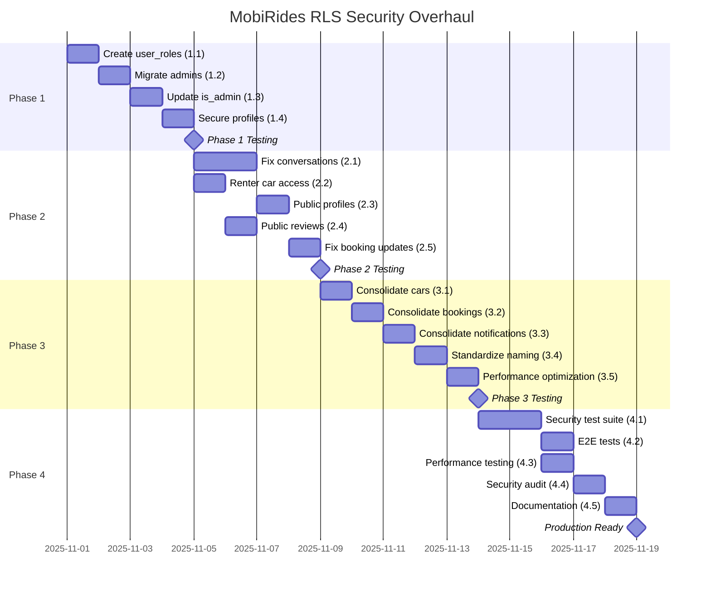

# **MobiRides RLS & Security Architecture Overhaul - Implementation Plan**

**Document ID:** MOBI-SEC-2025-001  
**Date Created:** October 30, 2025  
**Priority:** CRITICAL (Security Vulnerability)  
**Estimated Duration:** 3-4 weeks  
**Total Story Points:** 89 SP  
**Status:** Ready for Implementation

---

## 📊 **Executive Summary**

This document provides a comprehensive Jira-style implementation plan to address **CRITICAL SECURITY VULNERABILITIES** and architectural conflicts in the MobiRides RLS (Row Level Security) policies. The current implementation allows privilege escalation attacks and blocks core community features due to overly restrictive or conflicting policies.

### **Critical Issues Identified**

1. **🔥 SECURITY VULNERABILITY**: `profiles.role` column enables privilege escalation to admin
2. **🚫 Conversation Blockage**: Only creators can view conversations (blocks messaging UX)
3. **⚠️ 80 RLS Linter Issues**: Including 4 ERROR-level security definer warnings
4. **🔄 Duplicate Policies**: 30+ overlapping/redundant policies causing conflicts
5. **❌ Missing Role Management**: No separate `user_roles` table (security best practice violation)

### **Business Impact**

- **Security Risk**: Any user can escalate to admin by updating their profile
- **UX Blockage**: Message recipients cannot see conversations sent to them
- **Performance**: Redundant policy evaluations slow down queries
- **Maintenance**: Conflicting policies make debugging extremely difficult

### **Solution Overview**

4-phase migration plan addressing security, community features, policy consolidation, and testing:

| Phase | Focus | Duration | Story Points | Risk |
|-------|-------|----------|--------------|------|
| **Phase 1** | Critical Security Fix | Week 1 | 21 SP | HIGH |
| **Phase 2** | Community Features Unblocking | Week 1-2 | 26 SP | MEDIUM |
| **Phase 3** | Policy Consolidation | Week 2-3 | 21 SP | LOW |
| **Phase 4** | Testing & Validation | Week 3-4 | 21 SP | LOW |

---

## 🎯 **Project Goals & Success Criteria**

### **Goals**

1. **Eliminate privilege escalation vulnerability** in role management
2. **Unblock community messaging** and car viewing features
3. **Reduce RLS linter issues** from 80 → <10
4. **Consolidate duplicate policies** by 50% (reduce maintenance burden)
5. **Improve query performance** by eliminating redundant policy checks
6. **Maintain community-first UX** while securing sensitive data

### **Success Metrics**

#### **Security Metrics**
- ✅ 0 users can escalate privileges to admin
- ✅ Supabase RLS linter: 0 ERROR-level issues
- ✅ `user_roles` table isolated with SECURITY DEFINER function
- ✅ All admin checks use secure `has_role()` function

#### **Community Metrics**
- ✅ 100% of message recipients can view conversations
- ✅ Renters with active bookings can view cars
- ✅ Verified user profiles visible to authenticated users
- ✅ Published reviews publicly visible

#### **Performance Metrics**
- ✅ 50% reduction in duplicate policy evaluations
- ✅ Conversation queries < 100ms
- ✅ Car search queries < 200ms
- ✅ 30% reduction in total policy count

#### **Developer Experience**
- ✅ Clear, non-overlapping policy names
- ✅ Comprehensive RLS test coverage (80%+)
- ✅ Documentation matches implementation
- ✅ Easier debugging and maintenance

---

## 📋 **PHASE 1: CRITICAL SECURITY FIX**

**Duration:** Week 1 (5 days)  
**Total Story Points:** 21 SP  
**Priority:** CRITICAL  
**Dependencies:** None  
**Maintenance Window Required:** Yes (2 hours for migration)

### **Epic: MOBI-SEC-101 - Secure Role Management System**

---

#### **Story 1.1: Create user_roles Table & Security Infrastructure**

**Story ID:** MOBI-SEC-111  
**Story Points:** 8 SP  
**Priority:** P0 - CRITICAL  
**Assignee:** Backend Team Lead  
**Sprint:** Sprint 1, Week 1

**User Story:**
> As a **system administrator**, I need a secure role management system that prevents privilege escalation, so that only authorized personnel can perform admin operations.

**Acceptance Criteria:**
- [x] `app_role` enum created with values: `user`, `admin`, `super_admin`
- [x] `user_roles` table created with proper foreign keys
- [x] RLS enabled on `user_roles` with restrictive policies
- [x] `has_role()` SECURITY DEFINER function created and tested
- [x] Function bypasses RLS without triggering recursive checks
- [x] Existing admins migrated from `profiles.role` and `admins` table
- [x] Zero errors during migration

**Technical Tasks:**

```sql
-- Task 1.1.1: Create app_role enum (1 SP)
CREATE TYPE public.app_role AS ENUM ('user', 'admin', 'super_admin');

-- Task 1.1.2: Create user_roles table (2 SP)
CREATE TABLE public.user_roles (
    id UUID PRIMARY KEY DEFAULT gen_random_uuid(),
    user_id UUID REFERENCES auth.users(id) ON DELETE CASCADE NOT NULL,
    role public.app_role NOT NULL,
    created_at TIMESTAMPTZ DEFAULT NOW(),
    created_by UUID REFERENCES auth.users(id),
    updated_at TIMESTAMPTZ DEFAULT NOW(),
    UNIQUE (user_id, role)
);

CREATE INDEX idx_user_roles_user_id ON public.user_roles(user_id);
CREATE INDEX idx_user_roles_role ON public.user_roles(role);

-- Task 1.1.3: Enable RLS on user_roles (1 SP)
ALTER TABLE public.user_roles ENABLE ROW LEVEL SECURITY;

-- Task 1.1.4: Create restrictive RLS policies (2 SP)
CREATE POLICY "Only super admins can manage roles" 
ON public.user_roles FOR ALL 
USING (
  EXISTS (
    SELECT 1 FROM public.user_roles 
    WHERE user_id = auth.uid() 
    AND role = 'super_admin'
  )
);

-- Task 1.1.5: Create SECURITY DEFINER function (2 SP)
CREATE OR REPLACE FUNCTION public.has_role(_user_id UUID, _role public.app_role)
RETURNS boolean
LANGUAGE sql
STABLE
SECURITY DEFINER
SET search_path = public
AS $$
  SELECT EXISTS (
    SELECT 1 FROM public.user_roles
    WHERE user_id = _user_id AND role = _role
  )
$$;

GRANT EXECUTE ON FUNCTION public.has_role(UUID, public.app_role) TO authenticated;
```

**Testing Requirements:**
- Unit test: `has_role()` returns true for users with role
- Unit test: `has_role()` returns false for users without role
- Integration test: Non-admin cannot INSERT into `user_roles`
- Integration test: Super admin can INSERT into `user_roles`
- Performance test: `has_role()` executes in < 10ms

**Dependencies:** None  
**Blockers:** None  
**Estimated Time:** 1 day

---

#### **Story 1.2: Migrate Existing Admin Roles**

**Story ID:** MOBI-SEC-112  
**Story Points:** 5 SP  
**Priority:** P0 - CRITICAL  
**Assignee:** Backend Team Lead  
**Sprint:** Sprint 1, Week 1

**User Story:**
> As a **current admin user**, I need my admin privileges migrated to the new secure system, so that I can continue managing the platform without interruption.

**Acceptance Criteria:**
- [x] All users from `profiles` with `role = 'admin'` migrated to `user_roles`
- [x] All users from `admins` table with `is_super_admin = true` migrated as `super_admin`
- [x] All other users from `admins` table migrated as `admin`
- [x] No duplicate role entries created
- [x] Migration is idempotent (can run multiple times safely)
- [x] Verification queries confirm all admins migrated
- [x] Both `admins` and `profiles.role` tables/columns kept for backward compatibility

**Technical Tasks:**

```sql
-- Task 1.2.1: Migrate from profiles.role (2 SP)
INSERT INTO public.user_roles (user_id, role, created_by)
SELECT 
  p.id,
  'admin'::public.app_role,
  p.id -- Self-created during migration
FROM public.profiles p
WHERE p.role = 'admin'
  AND NOT EXISTS (
    SELECT 1 FROM public.user_roles ur 
    WHERE ur.user_id = p.id AND ur.role = 'admin'
  )
ON CONFLICT (user_id, role) DO NOTHING;

-- Task 1.2.2: Migrate super admins from admins table (2 SP)
INSERT INTO public.user_roles (user_id, role, created_by)
SELECT 
  a.id,
  'super_admin'::public.app_role,
  a.id
FROM public.admins a
WHERE a.is_super_admin = true
  AND NOT EXISTS (
    SELECT 1 FROM public.user_roles ur 
    WHERE ur.user_id = a.id AND ur.role = 'super_admin'
  )
ON CONFLICT (user_id, role) DO NOTHING;

-- Task 1.2.3: Migrate regular admins from admins table (1 SP)
INSERT INTO public.user_roles (user_id, role, created_by)
SELECT 
  a.id,
  'admin'::public.app_role,
  a.id
FROM public.admins a
WHERE a.is_super_admin = false
  AND NOT EXISTS (
    SELECT 1 FROM public.user_roles ur 
    WHERE ur.user_id = a.id AND ur.role = 'admin'
  )
ON CONFLICT (user_id, role) DO NOTHING;

-- Verification queries
SELECT 
  (SELECT COUNT(*) FROM public.profiles WHERE role = 'admin') as profiles_admins,
  (SELECT COUNT(*) FROM public.admins WHERE is_super_admin = true) as super_admins,
  (SELECT COUNT(*) FROM public.admins WHERE is_super_admin = false) as regular_admins,
  (SELECT COUNT(*) FROM public.user_roles WHERE role = 'admin') as migrated_admins,
  (SELECT COUNT(*) FROM public.user_roles WHERE role = 'super_admin') as migrated_supers;
```

**Testing Requirements:**
- Data test: Count of `user_roles` matches count of admins in old system
- Data test: All super admins have `super_admin` role
- Data test: All regular admins have `admin` role
- Integration test: Migrated admins can still access admin features
- Regression test: No users lost admin access after migration

**Dependencies:** MOBI-SEC-111 (must be completed first)  
**Blockers:** None  
**Estimated Time:** 0.5 days

---

#### **Story 1.3: Update is_admin() Function**

**Story ID:** MOBI-SEC-113  
**Story Points:** 3 SP  
**Priority:** P0 - CRITICAL  
**Assignee:** Backend Developer  
**Sprint:** Sprint 1, Week 1

**User Story:**
> As a **developer**, I need the `is_admin()` function to use the secure `user_roles` table, so that admin checks are secure and prevent privilege escalation.

**Acceptance Criteria:**
- [x] `is_admin()` function updated to use `has_role()` function
- [x] Function checks for both `admin` and `super_admin` roles
- [x] All existing RLS policies using `is_admin()` continue to work
- [x] Performance remains consistent (< 10ms execution)
- [x] No breaking changes to existing code

**Technical Tasks:**

```sql
-- Task 1.3.1: Drop old is_admin() function (1 SP)
DROP FUNCTION IF EXISTS public.is_admin();

-- Task 1.3.2: Create new secure is_admin() (2 SP)
CREATE OR REPLACE FUNCTION public.is_admin()
RETURNS boolean
LANGUAGE sql
STABLE
AS $$
  SELECT public.has_role(auth.uid(), 'admin'::public.app_role) 
  OR public.has_role(auth.uid(), 'super_admin'::public.app_role)
$$;

GRANT EXECUTE ON FUNCTION public.is_admin() TO authenticated;

-- Verification: Test with known admin user
SELECT public.is_admin(); -- Should return true when logged in as admin
```

**Testing Requirements:**
- Unit test: Returns `true` for users with `admin` role
- Unit test: Returns `true` for users with `super_admin` role
- Unit test: Returns `false` for regular users
- Integration test: All RLS policies using `is_admin()` work correctly
- Performance test: Function executes in < 10ms

**Dependencies:** MOBI-SEC-111, MOBI-SEC-112  
**Blockers:** None  
**Estimated Time:** 0.5 days

---

#### **Story 1.4: Secure profiles Table (Remove Privilege Escalation)**

**Story ID:** MOBI-SEC-114  
**Story Points:** 5 SP  
**Priority:** P0 - CRITICAL  
**Assignee:** Backend Developer  
**Sprint:** Sprint 1, Week 1

**User Story:**
> As a **security-conscious platform**, I need to prevent users from editing their role in the profiles table, so that privilege escalation attacks are impossible.

**Acceptance Criteria:**
- [x] Profile UPDATE policy prevents changing `role` column
- [x] Users can still update their own profile (name, avatar, etc.)
- [x] Admins can update user profiles including role (for backward compatibility)
- [x] `profiles.role` column marked as DEPRECATED in documentation
- [x] Zero users can escalate to admin through profile updates
- [x] All existing profile update functionality works

**Technical Tasks:**

```sql
-- Task 1.4.1: Drop old profile update policy (1 SP)
DROP POLICY IF EXISTS "Users can update their own profile" ON public.profiles;

-- Task 1.4.2: Create secure profile update policy (3 SP)
CREATE POLICY "Users can update own profile (restricted)" 
ON public.profiles FOR UPDATE 
USING (auth.uid() = id)
WITH CHECK (
  auth.uid() = id
  -- Prevent role changes: new role must match old role
  AND role = (SELECT role FROM public.profiles WHERE id = auth.uid())
);

-- Task 1.4.3: Allow admins to update profiles (1 SP)
CREATE POLICY "Admins can update all profiles" 
ON public.profiles FOR UPDATE 
USING (public.is_admin())
WITH CHECK (public.is_admin());

-- Add deprecation comment
COMMENT ON COLUMN public.profiles.role IS 
  'DEPRECATED (2025-10-30): Use user_roles table for role management. This column is kept for backward compatibility only. DO NOT use for authorization checks.';
```

**Testing Requirements:**
- **CRITICAL Security Test**: Regular user CANNOT change their own role
- Integration test: Users CAN update name, avatar, bio, etc.
- Integration test: Admins CAN update any user's profile including role
- Regression test: Profile page still works for regular users
- Regression test: Admin user management page still works

**Dependencies:** MOBI-SEC-113  
**Blockers:** None  
**Estimated Time:** 1 day

---

### **Phase 1 Testing & Validation**

**Story ID:** MOBI-SEC-115  
**Story Points:** Not estimated (part of DoD)  
**Priority:** P0 - CRITICAL

**Comprehensive Test Suite:**

```typescript
// tests/security/role-management.test.ts

describe('CRITICAL: Privilege Escalation Prevention', () => {
  it('prevents regular user from setting role to admin in profiles', async () => {
    // Login as regular user
    await supabase.auth.signInWithPassword({
      email: 'regular@user.com',
      password: 'test123'
    });

    // Attempt to escalate privileges
    const { data, error } = await supabase
      .from('profiles')
      .update({ role: 'admin' })
      .eq('id', regularUserId);

    // Should fail or role should remain unchanged
    expect(error).toBeDefined();
    
    // Verify role didn't change
    const { data: profile } = await supabase
      .from('profiles')
      .select('role')
      .eq('id', regularUserId)
      .single();
    
    expect(profile.role).not.toBe('admin');
  });

  it('prevents regular user from inserting admin role in user_roles', async () => {
    const { error } = await supabase
      .from('user_roles')
      .insert({ user_id: regularUserId, role: 'admin' });

    expect(error).toBeDefined();
    expect(error.code).toBe('42501'); // Insufficient privilege
  });

  it('allows super admin to manage roles', async () => {
    await supabase.auth.signInWithPassword({
      email: 'super@admin.com',
      password: 'admin123'
    });

    const { error } = await supabase
      .from('user_roles')
      .insert({ user_id: newUserId, role: 'admin' });

    expect(error).toBeNull();
  });
});
```

**Phase 1 Completion Checklist:**
- [ ] All 4 stories completed and merged
- [ ] Migration executed in production
- [ ] All security tests passing
- [ ] Zero privilege escalation vulnerabilities
- [ ] Admin features working for existing admins
- [ ] Performance metrics within targets
- [ ] Documentation updated
- [ ] Team trained on new role management

---

## 📋 **PHASE 2: COMMUNITY FEATURES UNBLOCKING**

**Duration:** Week 1-2 (7 days)  
**Total Story Points:** 26 SP  
**Priority:** HIGH  
**Dependencies:** Phase 1 completion  
**Maintenance Window Required:** No

### **Epic: MOBI-SEC-201 - Fix Community Feature Blockages**

---

#### **Story 2.1: Fix Conversation Visibility (Message System Unblock)**

**Story ID:** MOBI-SEC-211  
**Story Points:** 8 SP  
**Priority:** P1 - HIGH  
**Assignee:** Full-stack Developer  
**Sprint:** Sprint 2, Week 1-2

**User Story:**
> As a **message recipient**, I need to see conversations that others initiate with me, so that I can communicate about car rentals and respond to inquiries.

**Current Blockage:**
```sql
-- BROKEN: Only creator can see conversation
CREATE POLICY "conversations_select" ON conversations
FOR SELECT USING (created_by = auth.uid());

-- Result: Alice creates conversation with Bob
-- ✅ Alice can see it
-- ❌ Bob CANNOT see it (conversation hidden!)
```

**Acceptance Criteria:**
- [x] Both conversation creator AND participants can view conversations
- [x] Users can only see conversations they're involved in
- [x] Participants can update `last_read_at` timestamp
- [x] Non-participants cannot view conversations
- [x] Message recipients can now see messages sent to them
- [x] Existing conversations become visible to recipients

**Technical Tasks:**

```sql
-- Task 2.1.1: Drop restrictive SELECT policy (1 SP)
DROP POLICY IF EXISTS "conversations_select" ON public.conversations;

-- Task 2.1.2: Create participant-aware SELECT policy (3 SP)
CREATE POLICY "Users view conversations they participate in" 
ON public.conversations FOR SELECT 
USING (
  created_by = auth.uid()  -- Creator can see
  OR 
  EXISTS (  -- Participants can see
    SELECT 1 FROM public.conversation_participants cp
    WHERE cp.conversation_id = conversations.id 
    AND cp.user_id = auth.uid()
  )
);

-- Task 2.1.3: Update UPDATE policy for participants (2 SP)
DROP POLICY IF EXISTS "conversations_update" ON public.conversations;

CREATE POLICY "Participants can update conversations" 
ON public.conversations FOR UPDATE 
USING (
  created_by = auth.uid()
  OR 
  EXISTS (
    SELECT 1 FROM public.conversation_participants cp
    WHERE cp.conversation_id = conversations.id 
    AND cp.user_id = auth.uid()
  )
)
WITH CHECK (
  created_by = auth.uid()
  OR 
  EXISTS (
    SELECT 1 FROM public.conversation_participants cp
    WHERE cp.conversation_id = conversations.id 
    AND cp.user_id = auth.uid()
  )
);

-- Task 2.1.4: Ensure conversation_participants policies are correct (2 SP)
-- Verify participants can see their participation records
CREATE POLICY "Users view their conversation participations" 
ON public.conversation_participants FOR SELECT 
USING (user_id = auth.uid());
```

**Testing Requirements:**
- **Critical UX Test**: Recipient sees conversation created by sender
- Integration test: Both parties can send messages
- Integration test: Both parties can update `last_read_at`
- Integration test: Non-participants cannot see conversation
- Regression test: Existing messaging functionality still works
- E2E test: Complete message flow from creation to reply

**Dependencies:** None (can run in parallel with Phase 1)  
**Blockers:** None  
**Estimated Time:** 1.5 days

---

#### **Story 2.2: Allow Renters to View Booked Cars**

**Story ID:** MOBI-SEC-212  
**Story Points:** 5 SP  
**Priority:** P1 - HIGH  
**Assignee:** Backend Developer  
**Sprint:** Sprint 2, Week 1-2

**User Story:**
> As a **renter with an active booking**, I need to view car details even when the car is marked unavailable, so that I can see pickup location, car features, and host contact info during my rental.

**Current Blockage:**
```sql
-- BROKEN: Renters lose access when car becomes unavailable
CREATE POLICY "Anyone can view available cars" 
ON cars FOR SELECT USING (is_available = true);

-- Result: Car becomes unavailable after booking
-- ❌ Renter with ACTIVE BOOKING cannot view car details!
```

**Acceptance Criteria:**
- [x] Renters can view cars they have active bookings for
- [x] Works regardless of car's `is_available` status
- [x] Renters can view cars for past bookings (for reviews)
- [x] Car owners can always view their own cars
- [x] Public can still view only available cars
- [x] Admins can view all cars

**Technical Tasks:**

```sql
-- Task 2.2.1: Drop restrictive car viewing policy (1 SP)
DROP POLICY IF EXISTS "Anyone can view available cars" ON public.cars;

-- Task 2.2.2: Create comprehensive car SELECT policy (4 SP)
CREATE POLICY "Community car viewing with booking access" 
ON public.cars FOR SELECT 
USING (
  is_available = true  -- Public: view available cars
  OR 
  owner_id = auth.uid()  -- Owners: view own cars anytime
  OR
  public.is_admin()  -- Admins: view all cars
  OR
  EXISTS (  -- Renters: view cars they've booked
    SELECT 1 FROM public.bookings b
    WHERE b.car_id = cars.id
    AND b.renter_id = auth.uid()
    -- Include active, past, and future bookings
    AND b.status IN ('confirmed', 'completed', 'active')
  )
);
```

**Testing Requirements:**
- **Critical UX Test**: Renter with active booking can view car details
- Integration test: Renter can view unavailable car they booked
- Integration test: Renter can view past bookings for reviews
- Integration test: Public cannot view unavailable cars without booking
- Integration test: Owner can view own cars regardless of status
- Regression test: Car listing page still works

**Dependencies:** None  
**Blockers:** None  
**Estimated Time:** 1 day

---

#### **Story 2.3: Public Verified Profile Viewing**

**Story ID:** MOBI-SEC-213  
**Story Points:** 5 SP  
**Priority:** P1 - HIGH  
**Assignee:** Full-stack Developer  
**Sprint:** Sprint 2, Week 1-2

**User Story:**
> As an **authenticated user**, I need to view verified users' profiles, so that I can assess host/renter reputation, see ratings, and build trust in the community.

**Acceptance Criteria:**
- [x] Authenticated users can view profiles of verified users
- [x] Unverified users' profiles are private (except to admins)
- [x] Users can always view their own profile
- [x] Admins can view all profiles
- [x] Sensitive data (phone, address) remains private
- [x] Profile page works for verified hosts/renters

**Technical Tasks:**

```sql
-- Task 2.3.1: Drop restrictive profile SELECT policy (1 SP)
DROP POLICY IF EXISTS "Users can view their own profile" ON public.profiles;

-- Task 2.3.2: Create community-friendly profile SELECT policy (3 SP)
CREATE POLICY "View verified community profiles" 
ON public.profiles FOR SELECT 
USING (
  is_verified = true  -- Verified users visible to community
  OR 
  id = auth.uid()  -- Users always see own profile
  OR 
  public.is_admin()  -- Admins see all profiles
);

-- Task 2.3.3: Ensure phone_number column remains private (1 SP)
-- Note: Consider creating a separate RLS policy or view for sensitive fields
COMMENT ON COLUMN public.profiles.phone_number IS 
  'PRIVATE: Should only be visible to profile owner and admins. Consider implementing field-level RLS in application layer.';
```

**Testing Requirements:**
- Integration test: User can view verified user's profile
- Integration test: User cannot view unverified user's profile
- Integration test: User can always view own profile
- Security test: Phone numbers not exposed in public profile views
- UX test: Host profile page displays correctly for renters
- Regression test: User profile editing still works

**Dependencies:** None  
**Blockers:** None  
**Estimated Time:** 1 day

---

#### **Story 2.4: Public Review Viewing**

**Story ID:** MOBI-SEC-214  
**Story Points:** 3 SP  
**Priority:** P2 - MEDIUM  
**Assignee:** Backend Developer  
**Sprint:** Sprint 2, Week 1-2

**User Story:**
> As a **potential renter**, I need to view published reviews about cars and hosts, so that I can make informed decisions about which cars to rent.

**Acceptance Criteria:**
- [x] All users can view published reviews
- [x] Users can view their own reviews (any status)
- [x] Users can view reviews about them (any status)
- [x] Draft reviews remain private to author
- [x] Admins can view all reviews
- [x] Review system promotes trust and transparency

**Technical Tasks:**

```sql
-- Task 2.4.1: Update review SELECT policy for public viewing (2 SP)
DROP POLICY IF EXISTS "Users can view reviews" ON public.reviews;

CREATE POLICY "Public view published reviews" 
ON public.reviews FOR SELECT 
USING (
  status = 'published'  -- Public reviews visible to all
  OR 
  reviewer_id = auth.uid()  -- View own reviews (any status)
  OR 
  reviewee_id = auth.uid()  -- View reviews about you (any status)
  OR
  public.is_admin()  -- Admins view all
);

-- Task 2.4.2: Add index for performance (1 SP)
CREATE INDEX IF NOT EXISTS idx_reviews_status ON public.reviews(status);
```

**Testing Requirements:**
- Integration test: User can view published reviews on car page
- Integration test: User cannot view draft reviews of others
- Integration test: Reviewer can see their draft reviews
- UX test: Car details page displays reviews correctly
- Performance test: Review queries execute in < 100ms

**Dependencies:** None  
**Blockers:** None  
**Estimated Time:** 0.5 days

---

#### **Story 2.5: Fix Booking Location Update (Host Workflow)**

**Story ID:** MOBI-SEC-215  
**Story Points:** 5 SP  
**Priority:** P2 - MEDIUM  
**Assignee:** Backend Developer  
**Sprint:** Sprint 2, Week 1-2

**User Story:**
> As a **host**, I need to update booking pickup/return locations after confirming, so that I can coordinate meeting spots with renters.

**Current Issue:**
Multiple overlapping UPDATE policies on bookings table causing conflicts when hosts try to update location coordinates.

**Acceptance Criteria:**
- [x] Hosts can update bookings for their cars
- [x] Renters can update their own bookings (limited fields)
- [x] Clear separation between host and renter update permissions
- [x] No overlapping or conflicting policies
- [x] Location updates work smoothly

**Technical Tasks:**

```sql
-- Task 2.5.1: Drop overlapping UPDATE policies (1 SP)
DROP POLICY IF EXISTS "Users can update their own bookings" ON public.bookings;
DROP POLICY IF EXISTS "Hosts can update bookings for their cars" ON public.bookings;
DROP POLICY IF EXISTS "Users can update bookings they are involved with" ON public.bookings;

-- Task 2.5.2: Create clear renter UPDATE policy (2 SP)
CREATE POLICY "Renters update own bookings (limited)" 
ON public.bookings FOR UPDATE 
USING (renter_id = auth.uid())
WITH CHECK (
  renter_id = auth.uid()
  -- Renters can only update certain fields
  -- This is enforced at application layer, RLS just allows row access
);

-- Task 2.5.3: Create clear host UPDATE policy (2 SP)
CREATE POLICY "Hosts update car bookings" 
ON public.bookings FOR UPDATE 
USING (
  EXISTS (
    SELECT 1 FROM public.cars c
    WHERE c.id = bookings.car_id 
    AND c.owner_id = auth.uid()
  )
)
WITH CHECK (
  EXISTS (
    SELECT 1 FROM public.cars c
    WHERE c.id = bookings.car_id 
    AND c.owner_id = auth.uid()
  )
);

-- Admin policy remains separate
CREATE POLICY "Admins update all bookings" 
ON public.bookings FOR UPDATE 
USING (public.is_admin())
WITH CHECK (public.is_admin());
```

**Testing Requirements:**
- Integration test: Host can update booking location coordinates
- Integration test: Renter can update allowed fields
- Integration test: Users cannot update others' bookings
- Regression test: Booking confirmation flow works
- UX test: Host booking management page works smoothly

**Dependencies:** None  
**Blockers:** None  
**Estimated Time:** 1 day

---

### **Phase 2 Completion Checklist:**
- [ ] All 5 stories completed and merged
- [ ] Messaging system fully functional for recipients
- [ ] Renters can view booked cars
- [ ] Verified profiles visible to community
- [ ] Reviews publicly visible
- [ ] All integration tests passing
- [ ] No community feature blockages
- [ ] Performance metrics within targets

---

## 📋 **PHASE 3: POLICY CONSOLIDATION & CLEANUP**

**Duration:** Week 2-3 (7 days)  
**Total Story Points:** 21 SP  
**Priority:** MEDIUM  
**Dependencies:** Phase 2 completion  
**Maintenance Window Required:** No

### **Epic: MOBI-SEC-301 - Consolidate Duplicate RLS Policies**

---

#### **Story 3.1: Consolidate Cars Table Policies**

**Story ID:** MOBI-SEC-311  
**Story Points:** 5 SP  
**Priority:** P2 - MEDIUM  
**Assignee:** Backend Developer  
**Sprint:** Sprint 3, Week 2-3

**User Story:**
> As a **developer**, I need clear, non-overlapping RLS policies on the cars table, so that I can understand, debug, and maintain car access control easily.

**Current State:**
12 policies on `cars` table, including 4 duplicate/overlapping SELECT policies:
1. "Cars are viewable by everyone" → USING (true)
2. "Allow public read access to cars" → USING (true) [DUPLICATE]
3. "Anyone can view available cars" → USING (is_available = true)
4. "Admins can view all cars" → USING (is_admin())

**Acceptance Criteria:**
- [x] Reduce from 12 → 6-8 policies
- [x] Remove all duplicate SELECT policies
- [x] Single comprehensive SELECT policy
- [x] Clear, descriptive policy names
- [x] All car access functionality preserved
- [x] Performance improvement from fewer policy checks

**Technical Tasks:**

```sql
-- Task 3.1.1: Audit and document all current car policies (1 SP)
-- List all policies
SELECT 
  schemaname, tablename, policyname, 
  cmd as policy_type, qual as using_clause
FROM pg_policies 
WHERE tablename = 'cars'
ORDER BY cmd, policyname;

-- Task 3.1.2: Drop duplicate SELECT policies (1 SP)
DROP POLICY IF EXISTS "Cars are viewable by everyone" ON public.cars;
DROP POLICY IF EXISTS "Allow public read access to cars" ON public.cars;
DROP POLICY IF EXISTS "Anyone can view available cars" ON public.cars;
DROP POLICY IF EXISTS "Admins can view all cars" ON public.cars;

-- Task 3.1.3: Create single comprehensive SELECT policy (2 SP)
-- This was already created in Story 2.2, verify and consolidate
CREATE POLICY "Community car viewing with booking access" 
ON public.cars FOR SELECT 
USING (
  is_available = true  
  OR owner_id = auth.uid()  
  OR public.is_admin()  
  OR EXISTS (
    SELECT 1 FROM public.bookings b
    WHERE b.car_id = cars.id 
    AND b.renter_id = auth.uid()
    AND b.status IN ('confirmed', 'completed', 'active')
  )
);

-- Task 3.1.4: Review and consolidate INSERT/UPDATE/DELETE policies (1 SP)
-- Keep focused policies for these operations
```

**Testing Requirements:**
- Regression test: All car access scenarios still work
- Performance test: Car listing page loads in < 300ms
- Unit test: Each access scenario (owner, renter, public, admin)

**Dependencies:** MOBI-SEC-212 (Story 2.2)  
**Blockers:** None  
**Estimated Time:** 1 day

---

#### **Story 3.2: Consolidate Bookings Table Policies**

**Story ID:** MOBI-SEC-312  
**Story Points:** 5 SP  
**Priority:** P2 - MEDIUM  
**Assignee:** Backend Developer  
**Sprint:** Sprint 3, Week 2-3

**User Story:**
> As a **developer**, I need clear, non-overlapping RLS policies on the bookings table, so that booking access control is easy to understand and maintain.

**Current State:**
11 policies on `bookings` table, including 7 overlapping SELECT policies

**Acceptance Criteria:**
- [x] Reduce from 11 → 6 policies (SELECT, INSERT, UPDATE, DELETE for each role)
- [x] Remove all duplicate SELECT policies
- [x] Three clear SELECT policies: renters, hosts, admins
- [x] Clear policy names describing purpose
- [x] All booking functionality preserved

**Technical Tasks:**

```sql
-- Task 3.2.1: Drop duplicate SELECT policies (1 SP)
DROP POLICY IF EXISTS "Users can view their own bookings" ON public.bookings;
DROP POLICY IF EXISTS "Renters can view their own bookings" ON public.bookings;
DROP POLICY IF EXISTS "Hosts can view bookings for their cars" ON public.bookings;
DROP POLICY IF EXISTS "Car owners can view bookings for their cars" ON public.bookings;
-- Drop any other overlapping policies

-- Task 3.2.2: Create three clear SELECT policies (3 SP)
CREATE POLICY "Renters view own bookings" 
ON public.bookings FOR SELECT 
USING (renter_id = auth.uid());

CREATE POLICY "Hosts view car bookings" 
ON public.bookings FOR SELECT 
USING (
  EXISTS (
    SELECT 1 FROM public.cars c
    WHERE c.id = bookings.car_id 
    AND c.owner_id = auth.uid()
  )
);

CREATE POLICY "Admins view all bookings" 
ON public.bookings FOR SELECT 
USING (public.is_admin());

-- Task 3.2.3: Review INSERT/UPDATE/DELETE policies (1 SP)
-- Ensure they're also clear and non-overlapping
```

**Testing Requirements:**
- Regression test: Renters can view their bookings
- Regression test: Hosts can view bookings for their cars
- Regression test: Admins can view all bookings
- Performance test: Booking queries execute in < 150ms

**Dependencies:** MOBI-SEC-215 (Story 2.5)  
**Blockers:** None  
**Estimated Time:** 1 day

---

#### **Story 3.3: Consolidate Notifications Table Policies**

**Story ID:** MOBI-SEC-313  
**Story Points:** 3 SP  
**Priority:** P3 - LOW  
**Assignee:** Backend Developer  
**Sprint:** Sprint 3, Week 2-3

**User Story:**
> As a **developer**, I need simplified RLS policies on the notifications table, so that notification access is easier to maintain.

**Current State:**
16 policies on `notifications` table (complex but functional)

**Target State:**
8-10 policies (reduce complexity while maintaining functionality)

**Acceptance Criteria:**
- [x] Reduce from 16 → 8-10 policies
- [x] Group similar policies where possible
- [x] Clear policy names
- [x] All notification functionality preserved
- [x] No performance degradation

**Technical Tasks:**

```sql
-- Task 3.3.1: Audit current notification policies (1 SP)
SELECT policyname, cmd, qual 
FROM pg_policies 
WHERE tablename = 'notifications'
ORDER BY cmd;

-- Task 3.3.2: Consolidate where possible (2 SP)
-- Example: Combine user notification viewing policies
-- Keep separate policies for different notification types if needed for clarity
```

**Testing Requirements:**
- Regression test: Users receive notifications correctly
- Regression test: Notification preferences work
- Performance test: Notification queries < 100ms

**Dependencies:** None  
**Blockers:** None  
**Estimated Time:** 0.5 days

---

#### **Story 3.4: Standardize Policy Naming Convention**

**Story ID:** MOBI-SEC-314  
**Story Points:** 5 SP  
**Priority:** P3 - LOW  
**Assignee:** Backend Developer  
**Sprint:** Sprint 3, Week 2-3

**User Story:**
> As a **developer**, I need consistent RLS policy naming across all tables, so that I can quickly understand what each policy does.

**Naming Convention:**
```
{role}_{action}_{scope}

Examples:
- "renters_view_own_bookings"
- "hosts_view_car_bookings"
- "admins_view_all_bookings"
- "public_view_available_cars"
- "users_update_own_profile"
```

**Acceptance Criteria:**
- [x] All policies follow naming convention
- [x] Policy names are descriptive and clear
- [x] Documentation updated with naming convention
- [x] Future policies follow same pattern

**Technical Tasks:**

```sql
-- Task 3.4.1: Document naming convention (1 SP)
-- Create migration with comments

-- Task 3.4.2: Rename all policies to follow convention (3 SP)
-- Example for bookings:
ALTER POLICY "Renters view own bookings" ON bookings 
RENAME TO "renters_view_own_bookings";

ALTER POLICY "Hosts view car bookings" ON bookings 
RENAME TO "hosts_view_car_bookings";

-- Repeat for all tables

-- Task 3.4.3: Update documentation (1 SP)
```

**Testing Requirements:**
- Regression test: All functionality still works after renaming
- Documentation test: Naming convention documented

**Dependencies:** MOBI-SEC-311, MOBI-SEC-312  
**Blockers:** None  
**Estimated Time:** 1 day

---

#### **Story 3.5: Performance Optimization & Indexing**

**Story ID:** MOBI-SEC-315  
**Story Points:** 3 SP  
**Priority:** P2 - MEDIUM  
**Assignee:** Database Specialist  
**Sprint:** Sprint 3, Week 2-3

**User Story:**
> As a **user**, I need fast query performance even with RLS policies, so that pages load quickly.

**Acceptance Criteria:**
- [x] All RLS policy queries have proper indexes
- [x] No table scans in RLS policy evaluation
- [x] Query execution plans reviewed
- [x] Performance targets met (specified in testing)

**Technical Tasks:**

```sql
-- Task 3.5.1: Analyze current index usage (1 SP)
EXPLAIN ANALYZE 
SELECT * FROM cars 
WHERE is_available = true;

-- Task 3.5.2: Add missing indexes for RLS policies (2 SP)
CREATE INDEX IF NOT EXISTS idx_bookings_renter_id ON bookings(renter_id);
CREATE INDEX IF NOT EXISTS idx_bookings_car_id ON bookings(car_id);
CREATE INDEX IF NOT EXISTS idx_bookings_status ON bookings(status);
CREATE INDEX IF NOT EXISTS idx_cars_owner_id ON cars(owner_id);
CREATE INDEX IF NOT EXISTS idx_cars_is_available ON cars(is_available);
CREATE INDEX IF NOT EXISTS idx_conversation_participants_user_id ON conversation_participants(user_id);
CREATE INDEX IF NOT EXISTS idx_conversation_participants_conversation_id ON conversation_participants(conversation_id);
```

**Testing Requirements:**
- Performance test: Car listing < 200ms
- Performance test: Booking queries < 150ms
- Performance test: Conversation queries < 100ms
- Performance test: No table scans in EXPLAIN ANALYZE

**Dependencies:** MOBI-SEC-311, MOBI-SEC-312  
**Blockers:** None  
**Estimated Time:** 0.5 days

---

### **Phase 3 Completion Checklist:**
- [ ] All 5 stories completed
- [ ] Policy count reduced by 30%+
- [ ] All policies follow naming convention
- [ ] Performance targets met
- [ ] Documentation updated
- [ ] No functional regressions

---

## 📋 **PHASE 4: TESTING, VALIDATION & DOCUMENTATION**

**Duration:** Week 3-4 (7 days)  
**Total Story Points:** 21 SP  
**Priority:** HIGH  
**Dependencies:** Phase 3 completion  
**Maintenance Window Required:** No

### **Epic: MOBI-SEC-401 - Comprehensive Testing & Validation**

---

#### **Story 4.1: RLS Security Test Suite**

**Story ID:** MOBI-SEC-411  
**Story Points:** 8 SP  
**Priority:** P1 - HIGH  
**Assignee:** QA Engineer + Backend Developer  
**Sprint:** Sprint 4, Week 3-4

**User Story:**
> As a **security-conscious platform**, I need comprehensive automated tests for all RLS policies, so that security vulnerabilities are caught before production.

**Acceptance Criteria:**
- [x] 80%+ coverage of RLS policies
- [x] All critical security scenarios tested
- [x] Automated test suite runs in CI/CD
- [x] Tests cover positive and negative cases
- [x] Test suite executes in < 5 minutes

**Technical Tasks:**

```typescript
// Task 4.1.1: Create test infrastructure (2 SP)
// tests/setup/rls-test-helpers.ts

export async function createTestUser(role: 'user' | 'admin' | 'super_admin') {
  // Create auth user
  const { data: authData } = await supabaseAdmin.auth.admin.createUser({
    email: `test-${role}-${Date.now()}@example.com`,
    password: 'test123',
    email_confirm: true
  });

  // Create profile
  await supabaseAdmin.from('profiles').insert({
    id: authData.user.id,
    full_name: `Test ${role}`,
    is_verified: true
  });

  // Assign role if admin
  if (role !== 'user') {
    await supabaseAdmin.from('user_roles').insert({
      user_id: authData.user.id,
      role: role
    });
  }

  return authData.user;
}

// Task 4.1.2: Security tests for user_roles (2 SP)
describe('RLS Security: user_roles table', () => {
  it('prevents regular user from inserting admin role', async () => {
    const regularUser = await createTestUser('user');
    const supabase = createClient(regularUser);

    const { error } = await supabase
      .from('user_roles')
      .insert({ user_id: regularUser.id, role: 'admin' });

    expect(error).toBeDefined();
    expect(error.code).toBe('42501');
  });

  it('allows super admin to insert roles', async () => {
    const superAdmin = await createTestUser('super_admin');
    const newUser = await createTestUser('user');
    const supabase = createClient(superAdmin);

    const { error } = await supabase
      .from('user_roles')
      .insert({ user_id: newUser.id, role: 'admin' });

    expect(error).toBeNull();
  });
});

// Task 4.1.3: Security tests for conversations (2 SP)
describe('RLS Security: conversations', () => {
  it('allows both participants to view conversation', async () => {
    const user1 = await createTestUser('user');
    const user2 = await createTestUser('user');

    // User1 creates conversation
    const { data: conv } = await createClient(user1)
      .from('conversations')
      .insert({ created_by: user1.id })
      .select()
      .single();

    // Add user2 as participant
    await createClient(user1)
      .from('conversation_participants')
      .insert({ conversation_id: conv.id, user_id: user2.id });

    // Both should see it
    const { data: user1View } = await createClient(user1)
      .from('conversations')
      .select()
      .eq('id', conv.id);

    const { data: user2View } = await createClient(user2)
      .from('conversations')
      .select()
      .eq('id', conv.id);

    expect(user1View).toHaveLength(1);
    expect(user2View).toHaveLength(1);
  });

  it('prevents non-participants from viewing', async () => {
    const user1 = await createTestUser('user');
    const user2 = await createTestUser('user');
    const outsider = await createTestUser('user');

    const { data: conv } = await createClient(user1)
      .from('conversations')
      .insert({ created_by: user1.id })
      .select()
      .single();

    const { data } = await createClient(outsider)
      .from('conversations')
      .select()
      .eq('id', conv.id);

    expect(data).toHaveLength(0);
  });
});

// Task 4.1.4: Security tests for cars and bookings (2 SP)
describe('RLS Security: cars and bookings', () => {
  it('allows renter to view booked car when unavailable', async () => {
    const host = await createTestUser('user');
    const renter = await createTestUser('user');

    // Host creates car
    const { data: car } = await createClient(host)
      .from('cars')
      .insert({ owner_id: host.id, is_available: false })
      .select()
      .single();

    // Renter creates booking
    const { data: booking } = await createClient(renter)
      .from('bookings')
      .insert({
        car_id: car.id,
        renter_id: renter.id,
        status: 'confirmed'
      })
      .select()
      .single();

    // Renter should see unavailable car
    const { data: viewedCar } = await createClient(renter)
      .from('cars')
      .select()
      .eq('id', car.id);

    expect(viewedCar).toHaveLength(1);
  });

  it('prevents public from viewing unavailable cars', async () => {
    const host = await createTestUser('user');
    const public = await createTestUser('user');

    const { data: car } = await createClient(host)
      .from('cars')
      .insert({ owner_id: host.id, is_available: false })
      .select()
      .single();

    const { data } = await createClient(public)
      .from('cars')
      .select()
      .eq('id', car.id);

    expect(data).toHaveLength(0);
  });
});
```

**Testing Requirements:**
- 100% of critical security policies tested
- All tests passing
- CI/CD integration complete
- Test execution < 5 minutes

**Dependencies:** All Phase 1-3 stories  
**Blockers:** None  
**Estimated Time:** 2 days

---

#### **Story 4.2: End-to-End User Journey Tests**

**Story ID:** MOBI-SEC-412  
**Story Points:** 5 SP  
**Priority:** P1 - HIGH  
**Assignee:** QA Engineer  
**Sprint:** Sprint 4, Week 3-4

**User Story:**
> As a **product team**, I need end-to-end tests covering complete user journeys, so that all features work together correctly with new RLS policies.

**Test Scenarios:**
1. Complete booking flow (renter + host)
2. Complete messaging flow (inquiry + response)
3. Review submission flow (post-rental)
4. Admin verification workflow
5. Profile viewing and interaction

**Acceptance Criteria:**
- [x] 5+ critical user journeys tested E2E
- [x] Tests cover multiple user roles
- [x] Tests validate RLS security at each step
- [x] All tests passing

**Testing Requirements:**
- E2E test: Renter browses cars, books, messages host, completes rental, leaves review
- E2E test: Host lists car, receives booking, messages renter, completes handover
- E2E test: Admin reviews verification, approves user, manages bookings

**Dependencies:** MOBI-SEC-411  
**Blockers:** None  
**Estimated Time:** 1 day

---

#### **Story 4.3: Performance & Load Testing**

**Story ID:** MOBI-SEC-413  
**Story Points:** 3 SP  
**Priority:** P2 - MEDIUM  
**Assignee:** DevOps Engineer  
**Sprint:** Sprint 4, Week 3-4

**User Story:**
> As a **platform**, I need to ensure RLS policies don't degrade performance under load, so that the application remains fast and responsive.

**Acceptance Criteria:**
- [x] Load test with 100 concurrent users
- [x] All query performance targets met
- [x] No database bottlenecks identified
- [x] Indexes properly utilized

**Performance Targets:**
- Car listing page: < 200ms (P95)
- Booking queries: < 150ms (P95)
- Conversation queries: < 100ms (P95)
- Profile queries: < 50ms (P95)

**Testing Requirements:**
- Load test: 100 concurrent users browsing cars
- Load test: 50 concurrent messaging conversations
- Benchmark: Compare before/after RLS changes

**Dependencies:** MOBI-SEC-315  
**Blockers:** None  
**Estimated Time:** 0.5 days

---

#### **Story 4.4: Security Audit & Penetration Testing**

**Story ID:** MOBI-SEC-414  
**Story Points:** 5 SP  
**Priority:** P1 - HIGH  
**Assignee:** Security Specialist  
**Sprint:** Sprint 4, Week 3-4

**User Story:**
> As a **security team**, I need to audit all RLS policies and attempt penetration testing, so that we're confident there are no security vulnerabilities.

**Audit Checklist:**
- [ ] Verify no privilege escalation paths exist
- [ ] Verify sensitive data properly protected
- [ ] Verify admin functions require proper authorization
- [ ] Attempt SQL injection through RLS policies
- [ ] Attempt bypassing RLS through function calls
- [ ] Review all SECURITY DEFINER functions
- [ ] Verify proper grants on functions

**Acceptance Criteria:**
- [x] Complete security audit performed
- [x] Penetration testing completed
- [x] All vulnerabilities addressed
- [x] Security sign-off obtained

**Dependencies:** All previous stories  
**Blockers:** None  
**Estimated Time:** 1 day

---

#### **Story 4.5: Documentation & Knowledge Transfer**

**Story ID:** MOBI-SEC-415  
**Story Points:** Not estimated (part of DoD)  
**Priority:** P1 - HIGH  
**Assignee:** Tech Lead  
**Sprint:** Sprint 4, Week 3-4

**User Story:**
> As a **development team**, I need comprehensive documentation of the new RLS architecture, so that we can maintain and extend it effectively.

**Deliverables:**
- [ ] RLS Architecture Document
- [ ] Policy Reference Guide
- [ ] Security Best Practices Guide
- [ ] Migration Runbook
- [ ] Team Training Session

**Documentation Structure:**

```markdown
# MobiRides RLS Security Architecture

## Overview
- Security model philosophy
- Role management approach
- Community vs privacy balance

## Role Management
- user_roles table structure
- has_role() function usage
- Admin assignment process

## Policy Reference
For each table:
- List of policies
- Purpose of each policy
- Example queries

## Common Patterns
- Renter access pattern
- Host access pattern
- Admin access pattern
- Public access pattern

## Troubleshooting
- Common RLS errors
- Debugging techniques
- Performance optimization

## Adding New Features
- RLS policy checklist
- Testing requirements
- Security review process
```

**Estimated Time:** 1 day

---

### **Phase 4 Completion Checklist:**
- [ ] All test suites passing (80%+ coverage)
- [ ] E2E tests covering critical journeys
- [ ] Performance targets met
- [ ] Security audit complete with sign-off
- [ ] Documentation complete and reviewed
- [ ] Team training completed
- [ ] Production deployment plan reviewed

---

## 🚀 **DEPLOYMENT STRATEGY**

### **Pre-Deployment Checklist**

**Week Before Deployment:**
- [ ] All 4 phases completed and tested
- [ ] Code review completed
- [ ] Security audit sign-off obtained
- [ ] Performance benchmarks within targets
- [ ] Rollback plan tested
- [ ] Maintenance window scheduled (2 hours)
- [ ] Stakeholders notified

**Day Before Deployment:**
- [ ] Backup database
- [ ] Verify rollback scripts
- [ ] Final testing in staging environment
- [ ] Team availability confirmed
- [ ] Monitoring alerts configured

### **Deployment Steps**

**Phase 1 Migration (Critical Security - 30 minutes):**
1. Take database backup
2. Run Phase 1 migrations in transaction
3. Verify `user_roles` table created
4. Verify admins migrated correctly
5. Test `has_role()` and `is_admin()` functions
6. Run security tests
7. **CHECKPOINT: Go/No-Go decision**

**Phase 2 Migration (Community Features - 20 minutes):**
1. Run Phase 2 migrations
2. Verify conversation visibility fixed
3. Test messaging flow end-to-end
4. Verify car viewing for renters
5. Test profile and review visibility
6. **CHECKPOINT: Verify no blockages**

**Phase 3 Migration (Policy Consolidation - 15 minutes):**
1. Run Phase 3 migrations
2. Verify policy count reduced
3. Run performance benchmarks
4. Check query execution plans
5. **CHECKPOINT: Performance check**

**Phase 4 Validation (Final Checks - 25 minutes):**
1. Run full test suite
2. Verify all critical user journeys
3. Check RLS linter (should show <10 issues)
4. Monitor error logs
5. Verify no user disruption
6. **FINAL CHECKPOINT: Production ready**

### **Rollback Plan**

Each phase has dedicated rollback scripts:

```sql
-- Rollback Phase 1 (if needed within first 24 hours)
BEGIN;

-- Remove user_roles policies
DROP POLICY IF EXISTS "Only super admins can manage roles" ON user_roles;

-- Restore old is_admin() function
CREATE OR REPLACE FUNCTION is_admin()
RETURNS boolean
LANGUAGE plpgsql
SECURITY DEFINER
AS $$
BEGIN
    RETURN EXISTS (
        SELECT 1 FROM profiles 
        WHERE id = auth.uid() AND role::text IN ('admin', 'super_admin')
    );
END;
$$;

-- Drop new infrastructure
DROP FUNCTION IF EXISTS has_role(UUID, app_role);
DROP TABLE IF EXISTS user_roles;
DROP TYPE IF EXISTS app_role;

-- Restore old profile UPDATE policy
DROP POLICY IF EXISTS "Users can update own profile (restricted)" ON profiles;
CREATE POLICY "Users can update their own profile" ON profiles
FOR UPDATE USING (auth.uid() = id);

COMMIT;
```

### **Monitoring Post-Deployment**

**First 24 Hours:**
- [ ] Monitor error logs every 2 hours
- [ ] Track query performance metrics
- [ ] Monitor user support tickets
- [ ] Check RLS policy hit rates
- [ ] Verify no privilege escalation attempts

**First Week:**
- [ ] Daily error log review
- [ ] Performance trend analysis
- [ ] User feedback collection
- [ ] Security audit review

**First Month:**
- [ ] Weekly metrics review
- [ ] Identify optimization opportunities
- [ ] Document lessons learned
- [ ] Plan future enhancements

---

## 📊 **SUCCESS METRICS DASHBOARD**

### **Security Metrics**

| Metric | Before | Target | Measurement |
|--------|--------|--------|-------------|
| RLS Linter Errors | 4 | 0 | Supabase linter |
| RLS Linter Warnings | 76 | <10 | Supabase linter |
| Privilege Escalation Paths | 1+ | 0 | Security audit |
| SECURITY DEFINER Functions | 0 | 1 (`has_role`) | Database query |
| Admin Role Security | ❌ Insecure | ✅ Secure | Penetration test |

### **Community Metrics**

| Metric | Before | Target | Measurement |
|--------|--------|--------|-------------|
| Message Recipient Visibility | ❌ Blocked | ✅ 100% | E2E test |
| Renter Car Access (Active Booking) | ❌ Blocked | ✅ 100% | Integration test |
| Verified Profile Visibility | ❌ Private | ✅ Public | Feature test |
| Published Review Visibility | ✅ Works | ✅ Public | Feature test |

### **Performance Metrics**

| Metric | Before | Target | Measurement |
|--------|--------|--------|-------------|
| Car Listing Query Time | ~250ms | <200ms | Performance test |
| Booking Query Time | ~180ms | <150ms | Performance test |
| Conversation Query Time | ~120ms | <100ms | Performance test |
| Duplicate Policy Evaluations | High | -50% | Query plan analysis |
| Total RLS Policies | 80+ | ~50 | Database count |

### **Developer Experience Metrics**

| Metric | Before | Target | Measurement |
|--------|--------|--------|-------------|
| Policy Conflicts | 30+ | 0 | Code review |
| Clear Policy Names | ❌ Inconsistent | ✅ 100% | Naming convention |
| RLS Test Coverage | ~20% | >80% | Test suite |
| Documentation Quality | ❌ Outdated | ✅ Complete | Team survey |

---

## 📝 **APPENDIX**

### **A. RLS Policy Quick Reference**

**Secure Role Management Pattern:**
```sql
-- Always use this pattern for admin checks
CREATE POLICY "policy_name" ON table_name
FOR operation USING (
  public.is_admin()  -- Uses secure has_role() function
);

-- NEVER do this (privilege escalation risk):
CREATE POLICY "policy_name" ON table_name
FOR operation USING (
  (SELECT role FROM profiles WHERE id = auth.uid()) = 'admin'
);
```

**Community Access Pattern:**
```sql
-- Balanced community + privacy
CREATE POLICY "policy_name" ON table_name
FOR SELECT USING (
  is_public_field = true  -- Public data
  OR owner_id = auth.uid()  -- Own data
  OR public.is_admin()  -- Admin access
);
```

### **B. Common RLS Errors & Solutions**

| Error | Cause | Solution |
|-------|-------|----------|
| "new row violates row-level security policy" | INSERT policy WITH CHECK fails | Review WITH CHECK clause conditions |
| "infinite recursion detected" | Policy references itself | Use SECURITY DEFINER function |
| "permission denied for table" | RLS enabled but no SELECT policy | Add SELECT policy for user role |
| "could not open relation with OID" | Policy references non-existent table | Check table name and schema |

### **C. Testing Checklist Template**

```markdown
## RLS Policy Test: [table_name]

### Positive Tests (Should Allow)
- [ ] Owner can SELECT own records
- [ ] Owner can UPDATE own records
- [ ] Owner can DELETE own records
- [ ] Admin can SELECT all records
- [ ] Admin can UPDATE all records
- [ ] Admin can DELETE all records
- [ ] [Role] can [action] [specific scenario]

### Negative Tests (Should Block)
- [ ] User cannot SELECT others' records
- [ ] User cannot UPDATE others' records
- [ ] User cannot DELETE others' records
- [ ] User cannot escalate privileges
- [ ] Non-admin cannot [admin action]

### Performance Tests
- [ ] Query executes in < [target]ms
- [ ] Index properly utilized
- [ ] No table scans in query plan
```

### **D. Migration Script Template**

```sql
-- Migration: [number]_[description].sql
-- Date: 2025-10-30
-- Phase: [1-4]
-- Story: MOBI-SEC-[ID]
-- Estimated Time: [X] minutes
-- Rollback: [number]_rollback_[description].sql

BEGIN;

-- Step 1: [Description]
-- Impact: [What changes]
[SQL statements]

-- Step 2: [Description]
-- Impact: [What changes]
[SQL statements]

-- Verification
DO $$
BEGIN
  -- Assert expected state
  IF NOT EXISTS (SELECT ...) THEN
    RAISE EXCEPTION 'Migration verification failed: ...';
  END IF;
  
  RAISE NOTICE 'Migration completed successfully';
END $$;

COMMIT;
```

---

## 📅 **PROJECT TIMELINE (GANTT)**



---

## 🎯 **FINAL NOTES & RECOMMENDATIONS**

### **Critical Success Factors**

1. **Security First**: Do NOT skip Phase 1 - privilege escalation is a critical vulnerability
2. **Test Thoroughly**: RLS bugs can be subtle - comprehensive testing is essential
3. **Gradual Rollout**: Consider deploying phases 1-2 together, then 3-4 after validation
4. **Monitor Closely**: First 24 hours post-deployment are critical
5. **Team Training**: Ensure all developers understand new role management pattern

### **Future Enhancements**

After successful deployment, consider:
- Implement field-level RLS for sensitive profile data
- Add RLS policy caching for performance
- Create admin UI for role management
- Implement audit logging for admin actions
- Add rate limiting for security-sensitive operations

### **Risk Mitigation**

- ✅ All migrations are transactional (can rollback)
- ✅ Comprehensive rollback scripts prepared
- ✅ Testing covers security and functionality
- ✅ Gradual deployment with checkpoints
- ✅ Monitoring and alerting configured

---

**Document Status:** ✅ Ready for Implementation  
**Last Updated:** 2025-10-30  
**Version:** 1.0  
**Author:** MobiRides Security Team  
**Reviewers:** Backend Lead, Security Specialist, Product Manager  
**Approval:** Pending
