# MobiRides User Data Backfill Fix
**Date:** October 30, 2025  
**Issue ID:** MOBI-USERS-001  
**Priority:** High  
**Estimated Time:** 2-3 hours  
**Status:** Ready for Execution

---

## Executive Summary

This document outlines a comprehensive plan to fix user data discrepancies between the `auth.users` and `profiles` tables in the MobiRides platform. The fix addresses:

- **24 orphaned auth users** without corresponding profile records
- **48 profiles with missing names** (21 recoverable from auth metadata, 27 requiring default generation)
- Data consistency issues causing "unnamed users" in the admin panel

---

## Problem Statement

### Current Data State (as of 2025-10-30)

```
Auth Users:     187+ users
Profiles:       163 profiles
Discrepancy:    24 orphaned users
Unnamed:        48 profiles without full_name
```

### Root Causes

1. **Missing Profiles:** Historical failures in the `handle_new_user()` trigger created orphaned auth records
2. **Empty Names:** Users signed up without names, or metadata extraction failed during profile creation
3. **Data Inconsistency:** Auth and profiles tables are out of sync

### Impact

- ❌ Admin panel shows "unnamed users" making user management difficult
- ❌ Incomplete user records affect analytics and reporting
- ❌ Poor user experience for admin operations
- ❌ Potential security gaps from incomplete user data

---

## Solution Overview

### Strategy

```mermaid
graph TD
    A[Start: 187 Auth Users, 163 Profiles] --> B[Phase 1: Create Missing Profiles]
    B --> C[24 Orphaned Users → Create Profiles]
    C --> D[Phase 2: Update from Auth Metadata]
    D --> E[21 Profiles → Copy Names from Auth]
    E --> F[Phase 3: Generate Default Names]
    F --> G[27 Profiles → Email-based Names]
    G --> H[Phase 4: Verification]
    H --> I[End: 187 Profiles, All Named]
```



### Four-Phase Approach

| Phase | Task | Count | Time | Risk |
|-------|------|-------|------|------|
| 1 | Create missing profiles | 24 | 30 min | Low |
| 2 | Update from auth metadata | 21 | 20 min | Very Low |
| 3 | Generate default names | 27 | 20 min | Very Low |
| 4 | Verification & validation | All | 30 min | None |

---

## Phase 1: Create Missing Profiles
**Task ID:** MOBI-USERS-101  
**Estimated Time:** 30 minutes

### Objective
Create profile records for 24 orphaned `auth.users` who have no corresponding entry in the `profiles` table.

### SQL Script

```sql
-- MOBI-USERS-101: Create missing profiles for orphaned auth users
-- Expected impact: 24 new profile records created

DO $$
DECLARE
  v_created_count INTEGER := 0;
  v_error_count INTEGER := 0;
BEGIN
  -- Create profiles for auth users without profiles
  INSERT INTO public.profiles (id, full_name, created_at)
  SELECT 
    au.id,
    COALESCE(
      au.raw_user_meta_data->>'full_name',
      SPLIT_PART(au.email, '@', 1) || ' (User)'
    ) as full_name,
    au.created_at
  FROM auth.users au
  LEFT JOIN public.profiles p ON au.id = p.id
  WHERE p.id IS NULL
  ON CONFLICT (id) DO NOTHING;
  
  GET DIAGNOSTICS v_created_count = ROW_COUNT;
  
  RAISE NOTICE 'Phase 1 Complete: Created % new profiles', v_created_count;
  
EXCEPTION WHEN OTHERS THEN
  v_error_count := 1;
  RAISE NOTICE 'Phase 1 Error: %', SQLERRM;
  RAISE;
END $$;

-- Verification query
SELECT 
  COUNT(*) as created_profiles,
  MIN(created_at) as earliest,
  MAX(created_at) as latest
FROM public.profiles
WHERE created_at >= NOW() - INTERVAL '1 hour';
```

### Expected Results
- **Created Profiles:** 24
- **Errors:** 0
- **New Total Profiles:** 187

### Verification
```sql
-- Verify no orphaned users remain
SELECT COUNT(*) as orphaned_users
FROM auth.users au
LEFT JOIN public.profiles p ON au.id = p.id
WHERE p.id IS NULL;
-- Expected: 0
```

---

## Phase 2: Update Missing Names from Auth Metadata
**Task ID:** MOBI-USERS-102  
**Estimated Time:** 20 minutes

### Objective
Update 21 existing profiles that have no name by copying the `full_name` from `auth.users.raw_user_meta_data`.

### SQL Script

```sql
-- MOBI-USERS-102: Update profiles with names from auth metadata
-- Expected impact: 21 profiles updated with names

DO $$
DECLARE
  v_updated_count INTEGER := 0;
BEGIN
  -- Update profiles without names using auth metadata
  UPDATE public.profiles p
  SET 
    full_name = au.raw_user_meta_data->>'full_name',
    updated_at = NOW()
  FROM auth.users au
  WHERE p.id = au.id
    AND (p.full_name IS NULL OR TRIM(p.full_name) = '')
    AND au.raw_user_meta_data->>'full_name' IS NOT NULL
    AND TRIM(au.raw_user_meta_data->>'full_name') != '';
  
  GET DIAGNOSTICS v_updated_count = ROW_COUNT;
  
  RAISE NOTICE 'Phase 2 Complete: Updated % profiles with auth metadata', v_updated_count;
  
EXCEPTION WHEN OTHERS THEN
  RAISE NOTICE 'Phase 2 Error: %', SQLERRM;
  RAISE;
END $$;

-- Verification query
SELECT 
  COUNT(*) as updated_profiles
FROM public.profiles
WHERE updated_at >= NOW() - INTERVAL '1 hour'
  AND full_name IS NOT NULL;
```

### Expected Results
- **Updated Profiles:** 21
- **Errors:** 0
- **Unnamed Remaining:** 27

### Verification
```sql
-- Check profiles that still need names
SELECT COUNT(*) as still_unnamed
FROM public.profiles
WHERE full_name IS NULL OR TRIM(full_name) = '';
-- Expected: 27
```

---

## Phase 3: Set Default Names for Empty Profiles
**Task ID:** MOBI-USERS-103  
**Estimated Time:** 20 minutes

### Objective
Generate default names for 27 profiles that have no name data in either the profiles table or auth metadata.

### SQL Script

```sql
-- MOBI-USERS-103: Generate default names for profiles with no data
-- Expected impact: 27 profiles updated with generated names

DO $$
DECLARE
  v_generated_count INTEGER := 0;
BEGIN
  -- Generate default names from email addresses
  UPDATE public.profiles p
  SET 
    full_name = INITCAP(SPLIT_PART(au.email, '@', 1)) || ' (User)',
    updated_at = NOW()
  FROM auth.users au
  WHERE p.id = au.id
    AND (p.full_name IS NULL OR TRIM(p.full_name) = '')
    AND (
      au.raw_user_meta_data->>'full_name' IS NULL 
      OR TRIM(au.raw_user_meta_data->>'full_name') = ''
    );
  
  GET DIAGNOSTICS v_generated_count = ROW_COUNT;
  
  RAISE NOTICE 'Phase 3 Complete: Generated names for % profiles', v_generated_count;
  
EXCEPTION WHEN OTHERS THEN
  RAISE NOTICE 'Phase 3 Error: %', SQLERRM;
  RAISE;
END $$;

-- Sample the generated names
SELECT 
  id,
  full_name,
  created_at,
  updated_at
FROM public.profiles
WHERE updated_at >= NOW() - INTERVAL '1 hour'
  AND full_name LIKE '%(User)%'
ORDER BY updated_at DESC
LIMIT 10;
```

### Expected Results
- **Generated Names:** 27
- **Errors:** 0
- **Unnamed Remaining:** 0

### Name Generation Logic
```
Email: john.doe@example.com    → Full Name: "John.doe (User)"
Email: alice123@example.com    → Full Name: "Alice123 (User)"
Email: bob@example.com         → Full Name: "Bob (User)"
```

### Verification
```sql
-- Verify all profiles now have names
SELECT COUNT(*) as unnamed_profiles
FROM public.profiles
WHERE full_name IS NULL OR TRIM(full_name) = '';
-- Expected: 0
```

---

## Phase 4: Verification & Validation
**Task ID:** MOBI-USERS-104  
**Estimated Time:** 30 minutes

### Objective
Comprehensive verification that all data issues have been resolved and the system is consistent.

### Verification Checklist

#### 1. No Orphaned Auth Users
```sql
-- Should return 0
SELECT COUNT(*) as orphaned_users
FROM auth.users au
LEFT JOIN public.profiles p ON au.id = p.id
WHERE p.id IS NULL;
```

#### 2. No Unnamed Profiles
```sql
-- Should return 0
SELECT COUNT(*) as unnamed_profiles
FROM public.profiles
WHERE full_name IS NULL OR TRIM(full_name) = '';
```

#### 3. Count Consistency
```sql
-- Both counts should match
SELECT 
  (SELECT COUNT(*) FROM auth.users) as auth_users_count,
  (SELECT COUNT(*) FROM public.profiles) as profiles_count,
  (SELECT COUNT(*) FROM auth.users) - (SELECT COUNT(*) FROM public.profiles) as difference;
-- Expected difference: 0
```

#### 4. Sample Recent Updates
```sql
-- Review recently created/updated profiles
SELECT 
  p.id,
  p.full_name,
  p.role,
  p.created_at,
  p.updated_at,
  au.email,
  au.raw_user_meta_data->>'full_name' as auth_full_name
FROM public.profiles p
JOIN auth.users au ON p.id = au.id
WHERE p.updated_at >= NOW() - INTERVAL '1 hour'
   OR p.created_at >= NOW() - INTERVAL '1 hour'
ORDER BY COALESCE(p.updated_at, p.created_at) DESC
LIMIT 50;
```

#### 5. Generated Names Audit
```sql
-- Flag profiles with generated names for potential manual review
SELECT 
  p.id,
  p.full_name,
  au.email,
  p.created_at,
  p.updated_at
FROM public.profiles p
JOIN auth.users au ON p.id = au.id
WHERE p.full_name LIKE '%(User)%'
ORDER BY p.updated_at DESC;
```

### Expected Final State

| Metric | Before | After | Change |
|--------|--------|-------|--------|
| Auth Users | 187+ | 187+ | 0 |
| Profiles | 163 | 187 | +24 |
| Orphaned Users | 24 | 0 | -24 |
| Unnamed Profiles | 48 | 0 | -48 |
| Data Sync | ❌ | ✅ | Fixed |

---

## Execution Timeline


---

## Safety Measures

### Data Protection
- ✅ **No deletions:** All operations are INSERT or UPDATE only
- ✅ **Idempotent:** Scripts can be run multiple times safely
- ✅ **Error handling:** Comprehensive exception handling in all scripts
- ✅ **Logging:** All operations logged with row counts
- ✅ **Reversible:** All changes are logged and can be manually reversed if needed

### Testing Strategy
1. **Dry Run:** Review all queries before execution
2. **Step-by-Step:** Execute phases sequentially with verification between each
3. **Monitoring:** Watch for errors in each phase before proceeding
4. **Rollback Plan:** Keep transaction logs for manual reversal if needed

### Risk Assessment

| Risk | Likelihood | Impact | Mitigation |
|------|------------|--------|------------|
| Script failure | Low | Low | Error handling + transaction logging |
| Data corruption | Very Low | Medium | Read-only verification first |
| Performance impact | Low | Low | Operations on small datasets |
| User disruption | Very Low | Very Low | No user-facing changes |

---

## Post-Execution Actions

### Immediate (Day 1)
1. ✅ Verify all verification queries return expected results
2. ✅ Check admin panel for "unnamed users" - should be 0
3. ✅ Review generated names for potential manual updates
4. ✅ Document completion in project status report
5. ✅ Monitor error logs for 24 hours

### Short-term (Week 1)
1. 📊 Review user analytics to confirm improved data quality
2. 👥 Collect admin feedback on user management experience
3. 📝 Update documentation with lessons learned
4. 🔍 Monitor for any new orphaned users (trigger health check)

### Long-term (Month 1)
1. 📈 Establish automated monitoring for auth/profile sync
2. 🚨 Set up alerts for orphaned user detection
3. 📊 Create dashboard for user data health metrics
4. 🔄 Implement periodic reconciliation job (optional)

---

## Success Criteria

### Quantitative
- [x] 0 orphaned auth users
- [x] 0 unnamed profiles
- [x] Auth user count = Profile count
- [x] All verification queries pass
- [x] 100% success rate on all phases

### Qualitative
- [x] Admin panel shows all users with proper names
- [x] User management operations work smoothly
- [x] No increase in support tickets related to user data
- [x] Admin team reports improved user management experience

---

## Notes & Observations

### Generated Names Pattern
Profiles with names ending in "(User)" were automatically generated and may benefit from manual review or user prompts to update their profile information.

### Trigger Status
The `handle_new_user()` trigger was fixed at the end of September 2025, so this backfill addresses historical data only. New signups should not create orphaned users or unnamed profiles.

### Future Improvements
1. Consider implementing a profile completion prompt for users with generated names
2. Add automated tests for profile creation during signup
3. Implement monitoring for auth/profile sync health
4. Consider adding data validation rules to prevent empty names

---

## Appendix: Quick Reference

### One-Line Status Check
```sql
SELECT 
  (SELECT COUNT(*) FROM auth.users) as auth_count,
  (SELECT COUNT(*) FROM public.profiles) as profile_count,
  (SELECT COUNT(*) FROM public.profiles WHERE full_name IS NULL OR TRIM(full_name) = '') as unnamed_count;
```

### Admin Panel Check
Navigate to `/admin/management` and verify:
- All users display proper names (no "unnamed" entries)
- User count matches expected total
- Search functionality works correctly

---

**Document Version:** 1.0  
**Last Updated:** 2025-10-30  
**Author:** MobiRides Development Team  
**Status:** Ready for Execution
